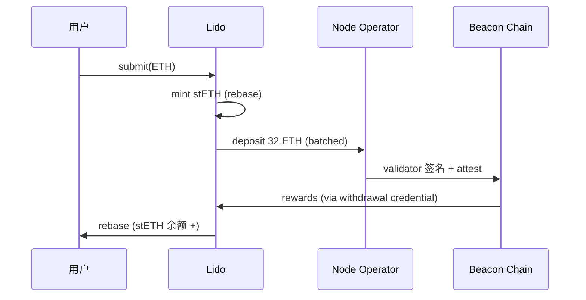

# Liquid Staking：Lido stETH、Rocket Pool rETH、Jito SOL 与 LST 生态

> **TL;DR**：Liquid Staking（LST）把"以太坊 PoS 质押"与"资本流动性"解耦——用户把 ETH 存入协议，协议代为运行验证者，换回可交易的凭证代币（stETH、rETH、cbETH、Jito SOL）。LST 既领取信标链奖励，也能在 DeFi 中作为抵押、借贷、LP。本文拆解 Lido 的 rebasing 模型、Rocket Pool 的 Minipool/RPL 抵押、Jito 在 Solana 的 MEV Tip 收益，以及 LST 生态（wstETH 的 ERC20 非 rebase 版、Frax frxETH、Swell、Stader）的架构取舍。

## 1. 背景与动机

2020-12 以太坊信标链（Beacon Chain）启动，质押需 32 ETH 且质押后不可提取（直到 Shapella，2023-04）。这带来三个问题：
1. **门槛**：32 ETH 对散户过高。
2. **流动性锁定**：质押期间 ETH 无法流通。
3. **运行复杂性**：自己运行 validator 需要 7/24 在线与操作经验。

Liquid Staking 的解法：协议吸收任意数量 ETH 合并成若干 32 ETH，委托给 Node Operator 运行；用户获得一个 ERC-20 代币作为"活期存款凭证"，代币价格随质押奖励增长（或以 rebase 方式直接增加余额）。不同协议差异在：
- **去中心化程度**：Lido 早期只有 30+ 运营者，Rocket Pool 允许任何人运行 Minipool；
- **抵押要求**：Rocket Pool 节点运营者要存 RPL 作 slashing 保险，Lido 使用 DVT + insurance pool；
- **代币模型**：rebase（stETH）vs 非 rebase（rETH, wstETH）；
- **MEV 处理**：Jito 捕获 MEV tips 反哺 JitoSOL；Lido 通过 MEV-Boost + `MEV-Boost relay allowlist` 处理。

## 2. 核心原理

### 2.1 以太坊 PoS 奖励公式（简化）

单个验证者每 epoch 奖励：

```
reward = base_reward * (participation + attestation + head + sync_committee - inactivity_penalty)
base_reward ∝ EFFECTIVE_BALANCE / sqrt(total_staked)
```

总质押量越高，单验证者收益越低（sqrt 稀释）。当前 ETH 质押 ~30M，年化 staker APR ≈ 3—4%；叠加 MEV 后 ~4—5%。

### 2.2 Lido stETH：Rebase 模型

Lido 核心 `Lido.sol`（`lidofinance/lido-dao`）是 stETH 代币合约。它维护：

- `_getTotalPooledEther()`：所有资产 = buffer（待质押的 ETH）+ rewards + depositedValidators * 32 ETH + reported rewards。
- `_sharesOf(account)`：用户持有的 "shares"；`balanceOf = shares * totalPooledEther / totalShares`。

每日 Oracle（通过 `AccountingOracle`）提交信标链余额快照，Lido 重新计算 `totalPooledEther`，从而 rebase 所有用户余额：用户一觉醒来 stETH 数量变多，价格保持 1:1 ETH 近锚。

`wstETH`（Wrapped stETH）是 non-rebase 版，`wstETH` 数量不变，价格随时间上升；DeFi 集成更友好，因为很多协议不支持 rebasing token（Uniswap V2/V3 会把 rebase 增量"没收"给 LP）。

### 2.3 Rocket Pool rETH：Minipool 模型

Rocket Pool 的质押单位是 **Minipool**（16 或 8 ETH 来自节点运营者 + 16 或 24 ETH 来自池子）。节点运营者必须抵押 ≥10% Minipool 价值的 RPL 作为"Slashing 保险"，若被罚款 RPL 先于运营者的 ETH 部分被烧毁。rETH 价格随质押奖励上升（非 rebase）：

```
rETHPrice = totalEthBacking / totalRETH
```

### 2.4 Jito SOL：Solana LST + MEV Tips

Solana 质押通过 `Stake Program` 委托给 Validator，周期是 epoch ≈ 2 天。**Jito** 做两件事：
1. 运行 `jito-solana` 客户端（Solana Validator 的修改版），支持接收 Searcher 的 MEV Tip；
2. 发行 JitoSOL（SPL Token），自动把用户 SOL 委托给高回报 validator，并将 MEV tips 与 inflation reward 合并进 JitoSOL。

JitoSOL 价格同样是"上升"型（非 rebase）。Jito 捕获 MEV 带来额外 1–2% APY。

### 2.5 子机制拆解

1. **Oracle**：Lido V2 `AccountingOracle` 结构，多成员多签（9/11）+ 滑动时间窗确认；Rocket Pool `OracleDAO`；Jito 的 StakePool 程序读取链上 staking history 无需外部 Oracle。
2. **Withdrawal 队列**：Shapella 后用户可赎回 stETH → ETH（部分赎回有 1–7 天队列）；Lido 用 `WithdrawalQueue.sol` NFT 记录请求。
3. **DVT（Distributed Validator Technology）**：Lido 通过 Obol/SSV 引入 DVT，把一个 validator 签名密钥分给多个节点，容错 + 去中心化。
4. **Governance**：Lido DAO (Aragon)；Rocket Pool 双层（pDAO + oDAO）；Jito DAO（JTO 代币）。
5. **Fee**：Lido 10%（5% 给运营者、5% DAO）；Rocket Pool 5%–20%（node operator commission）；Jito 4%。
6. **集成与生态**：Lido 通过 Aave/Maker/Spark 作为抵押；Rocket Pool rETH 在 Balancer/Curve 深度；JitoSOL 在 Marinade/Kamino/Drift 作抵押。

### 2.6 关键参数

| 协议 | 参数 | 值 |
| --- | --- | --- |
| Lido | 协议费 | 10% |
| Lido | Oracle 窗 | 每天 |
| Lido | Max 节点运营者 | ~30（Curated） + DVT |
| Lido | withdrawal 队列 | 0—7 天 |
| Rocket Pool | 最低节点 ETH | 8 或 16 |
| Rocket Pool | RPL 最低抵押 | 10% (borrow 模式) 或 150% (stake 模式) |
| Rocket Pool | 佣金 | 5%—20% |
| Jito | 协议费 | 4% |
| Jito | Epoch | ~2 天 |

### 2.7 边界条件

- **Mass slashing**：若某节点运营者的验证者批量被 slash，Lido 用 `Cover fund` + DAO vote 赔付。
- **Rebase 集成问题**：rebasing stETH 在某些合约中会"丢失"增量，因此主流用 wstETH。
- **Oracle 延迟**：Oracle 如果延迟 1+ 天更新，TVL 数据失真；协议有 `maxDelta` 限制以阻止巨幅单次 rebase。
- **Sanctions/Censorship**：MEV-Boost relay 可能审查交易；Lido 推行 `relay allowlist` 政策。

### 2.8 图示



```
Lido Stack
+-------------+    +----------------+    +------------+
| stETH token |<-->| StakingRouter  |<-->| Modules:   |
+-------------+    +----------------+    | Curated,   |
      ^                                  | CSM,       |
      |                                  | SimpleDVT  |
      |                                  +------------+
      |  Oracle (AccountingOracle)
      v
  WithdrawalQueue + WithdrawalVault
```

## 3. 架构剖析

### 3.1 Lido 分层

1. **Token Layer**：`Lido.sol` (stETH), `WstETH.sol`。
2. **Staking Router**：V2 引入的分发器，支持多个 Module（Curated、Community Staking Module、Simple DVT）。
3. **Modules**：每个 module 是一套节点运营者组合；可独立设置 fee/cap。
4. **Withdrawal**：`WithdrawalQueue.sol`（NFT）+ `WithdrawalVault.sol`（接收 BC 退款）。
5. **Oracle**：`AccountingOracle`, `ValidatorsExitBusOracle`。
6. **Governance**：Aragon DAO，LDO 投票 + 各模块独立治理。

### 3.2 Rocket Pool 分层

1. **RocketTokenRETH**：rETH 合约。
2. **Minipool** (`RocketMinipool*.sol`)：节点运营者 + 池子资金组合。
3. **Deposit Pool**：用户存入 ETH 的暂存处。
4. **Node Manager**：管理节点运营者注册、RPL 抵押。
5. **Oracle DAO**：处理 beacon chain 数据。
6. **Protocol DAO**：治理参数。

### 3.3 核心模块表

| 模块 | Lido | Rocket Pool | Jito |
| --- | --- | --- | --- |
| LST Token | stETH/wstETH | rETH | JitoSOL |
| 质押入口 | `Lido.submit()` | `RocketDepositPool.deposit()` | `stake_pool` CPI |
| Node Ops | Curated + CSM + DVT | Permissionless Minipool | Validator 中 Top 分红 |
| Oracle | AccountingOracle | OracleDAO | Solana Stake History |
| Governance | Aragon + LDO | pDAO + oDAO | JTO DAO |
| 保险 | Cover fund / insurance | RPL bond | — (MEV buffer) |

### 3.4 数据流：Lido stETH 铸造

1. 用户 `submit()` 发送 1 ETH；`_getTotalPooledEther` 更新，铸 `shares` 给用户。
2. Lido 等 buffer 累计 32 ETH，StakingRouter 调 `depositBufferedEther` → DepositSecurityModule 校验 → 调用官方 `DepositContract.deposit`。
3. 信标链 epoch 到期后验证者开始 attest，奖励进入 WithdrawalCredential（0x01）对应的 Vault。
4. AccountingOracle 每日提交 balance，Lido.`handleOracleReport` 更新 `bufferedEther`、`depositedValidators`、`beaconBalance`，rebase stETH。

### 3.5 客户端 / 实现

- **Lido**：Solidity；主要仓库 `lidofinance/lido-dao`, `core`, `csm`；前端 stake.lido.fi。
- **Rocket Pool**：Solidity；官方客户端 `smartnode`（Go），可一键启动 Minipool。
- **Jito**：Rust（fork of solana-labs/solana）；StakePool 程序部署在 Solana 主网。

### 3.6 对外接口

- **Lido**：EVM ABI + `ERC2612 permit` + `LidoOracleCommittee` 报表。
- **Rocket Pool**：REST (Grafana dashboards) + RPC。
- **Jito**：Solana RPC + Jito Block Engine 的 gRPC。

## 4. 关键代码 / 实现细节

### 4.1 Lido rebase 核心（`Lido.sol:580` 近似）

```solidity
// lidofinance/lido-dao/contracts/0.4.24/Lido.sol (节选)
function _handleOracleReport(uint256 _beaconValidators, uint256 _beaconBalance,
                             uint256 _withdrawalVaultBalance, uint256 _elRewardsVaultBalance,
                             uint256 _sharesRequestedToBurn, uint256[] _withdrawalFinalizationBatches,
                             uint256 _simulatedShareRate) internal {
    _checkAccountingOracleReport(...);                 // 校验 oracle 权限/时间
    uint256 preClValidators = DEPOSITED_VALIDATORS_POSITION.getStorageUint256();
    uint256 preClBalance    = CL_BALANCE_POSITION.getStorageUint256();
    uint256 postTotalPooledEther = BUFFERED_ETHER + _beaconBalance
        + _withdrawalVaultBalance + _elRewardsVaultBalance;
    uint256 rewardBase   = _beaconBalance > preClBalance ? _beaconBalance - preClBalance : 0;
    uint256 sharesToMintAsFees = _calcShareFee(rewardBase, postTotalPooledEther);
    _mintShares(TREASURY, sharesToMintAsFees);        // 协议费以 shares 形式铸
    TOTAL_POOLED_ETHER_POSITION.setStorageUint256(postTotalPooledEther);
}
```

### 4.2 Rocket Pool Minipool 状态机（`RocketMinipoolBase.sol`）

```solidity
// rocket-pool/rocketpool/contracts/contract/minipool/RocketMinipoolBase.sol:240 (节选)
function distributeBalance(bool _rewardsOnly) external onlyInitialised {
    require(status == MinipoolStatus.Staking, "!staking");
    uint256 balance = address(this).balance;
    uint256 nodeAmount = calculateNodeShare(balance);   // 按 NO 出资比例 + 佣金
    uint256 userAmount = balance - nodeAmount;
    (bool ok1,) = nodeAddress.call{value: nodeAmount}("");
    require(ok1, "send failed");
    rocketTokenRETH.depositExcess{value: userAmount}();  // 用户部分回 rETH 池
}
```

### 4.3 Jito StakePool 关键 Instruction

```rust
// jito-labs/stake-pool-program/src/processor.rs (节选)
pub fn process_update_stake_pool_balance(accounts: &[AccountInfo]) -> ProgramResult {
    let sp = StakePool::deserialize(sp_info.data.borrow().as_ref())?;
    let total_lamports = compute_total_lamports(&sp, &validator_list)?;
    sp.total_lamports = total_lamports;
    sp.serialize(&mut sp_info.data.borrow_mut().as_mut_slice())?;
    Ok(())
}
```

## 5. 演进与版本对比

| 版本 | 时间 | 变化 |
| --- | --- | --- |
| Lido V1 | 2020-12 | Curated 30 家节点，rebase stETH |
| Shapella | 2023-04 | ETH staking 可提取 |
| Lido V2 | 2023-05 | StakingRouter + WithdrawalQueue |
| Lido CSM / Simple DVT | 2024 | 去中心化运营者 |
| Rocket Pool v1.0 | 2021-11 | 16 ETH Minipool |
| Rocket Pool Atlas | 2023 | 8 ETH Minipool, LEB8 |
| Rocket Pool Saturn | 2024 | megapool、RPL 治理改革 |
| Jito SOL | 2022-11 | Solana MEV + LST |
| Jito V2 | 2024 | Restaking & delegation programs |

## 6. 实战示例

### 6.1 Lido：ethers 质押

```ts
const lido = new ethers.Contract(LIDO, ABI, signer);
await lido.submit(ethers.ZeroAddress, { value: ethers.parseEther("1") });
const bal = await lido.balanceOf(me);
console.log("stETH", ethers.formatEther(bal));   // ≈1.000，随 rebase 增长
```

### 6.2 Rocket Pool 质押

```ts
const dep = new ethers.Contract(DEPOSIT_POOL, ABI, signer);
await dep.deposit({ value: ethers.parseEther("1") });
// 得到 rETH，价格 >1 ETH
```

### 6.3 Jito SOL（Solana）

```bash
solana-keygen new -o ~/.config/solana/id.json
spl-stake-pool deposit-sol Jito... 1 --pool-token-receiver <你的 ATA>
```

预期：收到等值 JitoSOL SPL Token，可在 Jupiter 交换或 Kamino 作为抵押。

## 7. 安全与已知攻击

- **Lido Oracle Sanity Checks**：2022 年曾担心 Oracle 串谋；引入 `SanityChecker` 限制 `sharesRate` 变化 ≤ 0.5%/天。
- **stETH/ETH 脱锚**：2022-06 Celsius 清算 + 3AC 事件，stETH 二级市场一度 0.94；因合约层面仍 1:1 兑现未损坏，市场回归。
- **Rocket Pool slashing**：Atlas 升级曾短暂引入 bug，导致奖励分配错误；及时热修复无损。
- **DVT 新风险**：Obol/SSV 分片签名需要阈值签名，若节点 > threshold 离线会漏签 attest；Lido SimpleDVT 模块严格 monitor。
- **中心化指控**：Lido ETH 总质押曾超 33%（双 1/3 临界），社区讨论自我限制；目前通过多模块 + 冷却策略缓解。
- **Jito MEV Ban**：2024-03 Jito 暂停 mempool API 以缓解 sandwich，改为按验证者 opt-in。

## 8. 与同类方案对比

| 维度 | Lido | Rocket Pool | Frax frxETH | Coinbase cbETH | Jito SOL |
| --- | --- | --- | --- | --- | --- |
| 链 | Ethereum | Ethereum | Ethereum | Ethereum | Solana |
| 代币模型 | rebase stETH + wstETH | 非 rebase | 双代币 frxETH+sfrxETH | 非 rebase | 非 rebase |
| 运营者 | Curated + CSM | Permissionless | Frax + MEV-boost | Coinbase 中心 | 分散 validator |
| 抵押保险 | DAO + Cover | RPL bond | 无 | Coinbase 信用 | 无专门 |
| 去中心化 | 中 | 高 | 中 | 低 | 中 |
| 特色 | 市场深度最好 | 去中心化 | 双代币 + Curve 生态 | 机构友好 | MEV 提升 APY |

## 9. 延伸阅读

- Lido Docs：https://docs.lido.fi/
- Lido 源码：https://github.com/lidofinance
- Rocket Pool Docs：https://docs.rocketpool.net/
- Rocket Pool 源码：https://github.com/rocket-pool/rocketpool
- Jito Docs：https://docs.jito.wtf/
- Ethereum.org staking：https://ethereum.org/en/staking/
- Danny Ryan《Validator Economics》博客
- a16z《LST Design Space》
- YouTube：Bankless "Liquid Staking Wars" 访谈
- 学习资源：learnblockchain.cn《stETH rebase 机制详解》

## 10. 术语表

| 术语 | 英文 | 释义 |
| --- | --- | --- |
| LST | Liquid Staking Token | 流动性质押代币 |
| Rebase | Rebase | 余额按比例同步变化 |
| Validator | Validator | 信标链验证者 |
| Slashing | Slashing | 因违规被罚 ETH |
| DVT | Distributed Validator Technology | 分布式验证器 |
| Minipool | Minipool | Rocket Pool 16/8 ETH 单元 |
| MEV-Boost | MEV-Boost | ETH 出块 MEV 拍卖中继 |
| Stake Pool Program | Stake Pool Program | Solana 的质押池程序 |
| WithdrawalCredential | 0x00/0x01 | 信标链提款凭证 |

---

*Last verified: 2026-04-22*
