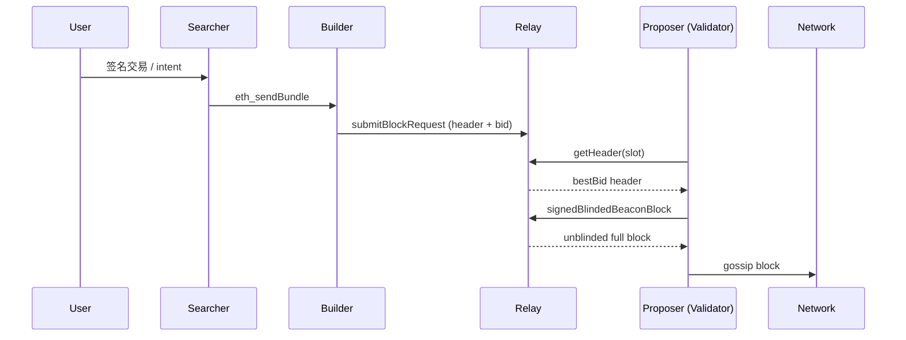

# MEV 与 Flashbots：最大可提取价值、MEV-Boost、PBS 与 OFA

> **TL;DR**：MEV（Maximal Extractable Value）指区块生产者通过任意排序、插入、审查交易所能提取的超出区块奖励与基础手续费的额外价值。最典型的三类提取策略是 DEX 三明治（sandwich）、清算（liquidation）和套利（arbitrage）。Flashbots 最初以一条私有交易中继链（flashbots-relay + MEV-geth）把搜索者（searcher）→ 矿工的竞价从公开 mempool 搬到了密封信道；The Merge 后这套体系演化为 MEV-Boost + Proposer-Builder Separation (PBS)，验证者只做区块 header 签名而把 body 构造外包给独立的 builder；2024–2026 年又进一步出现 Order Flow Auction（OFA，如 MEV-Share、MEV-Blocker、CoW Protocol）让用户侧获得 MEV 返佣。本篇系统梳理 MEV 分类、Flashbots 系统栈、PBS 状态机、OFA 经济学与已知的攻击向量。

## 1. 背景与动机

2020 年初，Paradigm 的 Dan Robinson 和 Georgios Konstantopoulos 发表《Ethereum is a Dark Forest》，描述了在以太坊公开 mempool 中，任何暴露交易意图都会被 generalized front-runner bot 立即复制 gas 竞价夺走利润的现象。同年，Phil Daian 等研究者在论文《Flash Boys 2.0》中首次把这种现象正式命名为 **Miner Extractable Value**（矿工可提取价值）。

MEV 出现的根本原因有三：
1. **区块生产者的排序独裁权**：矿工（PoW 时代）或提议者（PoS 时代）可以在区块内任意重排交易，不受协议层约束。
2. **公开 mempool 的意图泄露**：EOA 签名广播的交易在打包前所有节点可见，等价于把订单簿贴在所有做市商面前。
3. **DeFi 原子可组合性**：一笔交易可以同时跨多个 AMM、借贷协议，使利润可以在同一区块内被确定性地捕获。

早期 MEV 以 PGA（Priority Gas Auction）形式出现：bot 在 mempool 中观察到有套利机会的交易后，以递增 gas price 互相竞价，整个过程公开。PGA 导致：（a）大量失败交易浪费区块空间（2020 年 Uniswap 失败率一度 > 50%）；（b）网络拥堵 gas 飙升外溢给所有用户；（c）利润几乎全部被矿工通过 gas 拿走。Flashbots 团队（Stephane Gosselin / Phil Daian / Alex Obadia 等）在 2020 年 11 月发布 mev-geth，目的是把这场公开拍卖搬到链下密封信道：搜索者把「bundle」（有序交易序列 + 付款给 coinbase 的交易）直接发送到中继 relay，relay 转发到矿工，矿工按 bundle 利润排序。外部用户与矿工都不再被 gas war 绑架。

The Merge 之后，PoS 引入「提议者」（proposer，被 slot 随机选中的验证者）。为防止大型质押池通过集成化 builder 获取不公平优势并导致质押中心化，Vitalik 等人在 2021 年提出 **PBS（Proposer-Builder Separation）**：提议者只承诺（commit）对某个区块 header 的签名，而区块 body 由独立 builder 构造并通过中继送达。Flashbots 据此发布 MEV-Boost（boost.flashbots.net），作为 validator 可选的 side-car 进程；到 2026 年，MEV-Boost 已覆盖 Ethereum 约 90% 以上的区块。更进一步，OFA（Order Flow Auction）把拍卖目标从「搜索者→builder」扩展到「用户→搜索者」：用户提交意图（intent）而非裸交易，搜索者竞价抢单，返佣回用户或 UI。

## 2. 核心原理

### 2.1 形式化定义

令区块 $B$ 为交易序列 $(tx_1, tx_2, \dots, tx_n)$。定义 MEV 为

$$
\mathrm{MEV}(B) = \max_{\pi \in \Pi(T)} V(\pi) - V(\pi_{\mathrm{fair}})
$$

其中 $T$ 是当前可见的候选交易集合（含搜索者伪造的新交易），$\Pi(T)$ 是所有合法排序（含插入与省略）的集合，$V(\cdot)$ 是生产者从该排序中获得的总价值（手续费 + coinbase 转账 + 自持仓收益），$\pi_{\mathrm{fair}}$ 是 FCFS 或时间优先的「公平」基线。

严格来说 MEV 应命名为 **Maximum** EV（可达上界），而非 **Realized** EV（实际提取）。研究机构如 EigenPhi、Flashbots Explorer 追踪的数据多是后者。

相关定理（来自 Daian 等 2019）：在不考虑 re-org 的情况下，MEV 提取博弈是 **非合作完全信息博弈**，纳什均衡下搜索者间价差趋近于执行成本（gas + 滑点），大部分利润通过 `coinbase.transfer()` 或 priority tip 流向区块生产者。这意味着 MEV 本质上是矿工/验证者的「附加收益权」。

### 2.2 MEV 三大经典类型

1. **DEX 三明治（Sandwich）**：受害交易 $tx_V$ 是 large swap（slippage 容忍度较大），搜索者在同一区块内插入 $tx_A$（front-run，同方向推高价格）→ $tx_V$ → $tx_B$（back-run，反向出货）。利润 ≈ 受害者滑点 - gas - 池手续费。三明治对 AMM 尤其危险，因为 xy=k 曲线下 price impact 完全确定性可算。
2. **清算（Liquidation）**：Aave / Compound 等借贷协议在健康因子 (HF) < 1 时允许任意地址偿还部分债务并领取抵押品折价。搜索者监控预言机更新 + 头寸表，当喂价触发 HF 穿透时立刻发送清算交易，收益为 `liquidationBonus * debtRepaid`（Aave v3 约 5–10%）。清算是「良性 MEV」，因为它维系协议偿付能力。
3. **套利（Arbitrage）**：跨池（Uniswap v2 ↔ v3）、跨 DEX（Uniswap ↔ Curve ↔ Balancer）、跨资产（CEX-DEX，需要私有钱包敞口）价差。多跳原子套利（cyclic arbitrage）通过一次交易在多条 hop 上消除价差并在同 slot 内完成。搜索者用图搜索（Bellman-Ford 负环、Johnson 所有对最短路）实时寻优。

此外还有 JIT（Just-In-Time liquidity）、NFT Sniping、Oracle latency arbitrage、Long-tail cross-domain MEV 等子类。

### 2.3 Flashbots Bundle 数据结构

Flashbots RPC 定义 `eth_sendBundle`（JSON-RPC），核心字段：

- `txs: string[]`：RLP 编码的已签名交易数组，按顺序执行。
- `blockNumber`：目标区块（十六进制），relay 若错过此高度则丢弃。
- `minTimestamp / maxTimestamp`：可选时间窗。
- `revertingTxHashes`：允许 revert 的交易哈希白名单（默认 bundle 内任一交易 revert 则整个 bundle 作废，以防搜索者被「钓鱼失败」）。
- `replacementUuid`：同一 UUID 可被后续 bundle 覆盖替换。

Bundle 的关键不变式：**原子性**（整个序列要么全部进区块要么全部失败）+ **顺序性**（relay/builder 不会打乱顺序）+ **隐私性**（未进区块前不暴露到公共 mempool）。付款方式主要两种：(a) 交易 `gasPrice` 设为较高值，由 builder 通过 `GASUSED * effectiveGasPrice` 获得；(b) bundle 最后一笔交易用 `block.coinbase.call{value: ...}("")` 直接向 builder 转账（适合 constant-profit 的策略，避免 gas 波动）。

### 2.4 PBS / MEV-Boost 状态机

MEV-Boost 在 PoS 下引入四个角色：

- **Searcher**：产出 bundle，发给 builder。
- **Builder**：聚合 bundle + public mempool，构造整块，并付 validator 一笔 `payment tx` 到 fee recipient。
- **Relay**：审计 builder 出块的有效性与支付金额，把 header 签名请求送给 proposer。
- **Proposer**（validator）：仅对 header 签名（blind signature），承诺接收整块，然后 relay 发布完整 body。

时序（PBS happy path）：



关键不变式：proposer 在签名前并不知道 body 完整内容（只看到 header + bid value），因此无法「unbundle」搜索者的利润后再自建区块。Relay 的作用相当于**公证人 + 审计者**，保证 builder 付款满足承诺、区块有效。

### 2.5 关键参数与常量（以太坊主网，截至 2026-04）

| 参数 | 值 | 出处 / 可治理 |
| --- | --- | --- |
| slot 时长 | 12 s | Ethereum consensus spec，硬编码 |
| proposer boost | 40%（fork-choice tie-breaker 权重） | consensus spec 可升级 |
| relay timeout（getHeader） | 一般 950 ms | relay 运营商自设 |
| builder bid 频率 | ~每 250 ms 更新 | builder 自设 |
| MEV-Boost relay 数量（主网） | 8 个主流 + 多个区域 relay（Flashbots, bloXroute, Agnostic, Ultra Sound, Aestus, Eden, Manifold, BuilderNet）| relay 市场自由进入 |
| 私有 mempool 份额 | > 90% 的块至少包含一条 MEV-Boost bundle | Flashbots Explorer |

### 2.6 边界条件与失败模式

- **Relay 宕机或延迟**：validator 本地 builder fallback，改为公共 mempool 构造，可能损失 MEV 分成。2023 年曾发生 relay 在 deadline 前未返 body、导致 missed slot。
- **Builder 作恶 / equivocation**：若 builder 签不同内容的两个 header 给不同 relay，可能触发 slashing；Ultra Sound Relay 为此引入 optimistic relay + collateral 制度。
- **Censorship**：OFAC 制裁地址（如 Tornado Cash）在 Flashbots relay 上被过滤。为维持去信任特性出现 Agnostic / Ultra Sound 等 non-censoring relay。2022 年末 OFAC-compliant 区块比例一度 > 70%，到 2024 年因 non-censoring relay 壮大回落至 ~30%。
- **Proposer-Relay 合谋**：理论上 relay 运营者可与 proposer 合谋 unbundle。PBS 2.0 / ePBS（enshrined PBS）旨在通过协议内机制消除对 trust relay 的依赖。
- **跨域 MEV 与 re-org 风险**：跨 L2 / CEX 的 MEV 超过 proposer boost 阈值时可能激励 reorg；2023 年 Justin Drake 提出 MEV Burn / execution tickets 以削弱激励。

## 3. 架构剖析

### 3.1 分层视图

MEV 基础设施可自上而下分为 5 层：

1. **User Intent Layer**：钱包 / DApp 收集签名意图（swap、limit order、bridge）。OFA 协议在此层引入 intent 语义。
2. **Order Flow Layer**：RPC endpoint 决定交易是进入公共 mempool 还是私有信道（MEV-Blocker、MEV-Share、BlockNative、MetaMask 的 Smart Transactions）。
3. **Search Layer**：搜索者运行链上模拟（revm / go-ethereum tracer）、图搜索、策略执行，产出 bundle。
4. **Build Layer**：builder 合并 bundle + public mempool，跑区块模拟、排序优化（CFMM routing、burn 模拟），竞拍出价。
5. **Propose Layer**：proposer + relay，header 签名与区块 gossip。

### 3.2 核心模块清单

| 模块 | 职责 | 依赖 | 可替换性 |
| --- | --- | --- | --- |
| `mev-boost` (Go) | validator side-car，调度多 relay 竞价 | CL client（Lighthouse/Prysm/Teku/Nimbus/Lodestar）| 高，任何 validator 可换 |
| `flashbots-relay` | 审计区块、签名 header、发布 body | Builder submission API | 中，有 8+ 竞品 relay |
| `rbuilder` (Rust) | Flashbots 开源 builder | revm | 高，市场竞争激烈 |
| `builder-geth` (Go) | 老版本 builder，fork 自 geth | go-ethereum | 中，已被 rbuilder 主导 |
| `SUAVE`（Flashbots 新项目）| 去中心化 mempool + builder L1 | 自有 execution layer | 实验阶段 |
| `MEV-Share Node` | OFA 撮合节点 | relay + searcher | 高，任何团队可部署 |
| `MEV-Inspect`（Python） | 链上 MEV 统计 | archive node | 高，EigenPhi 等类似工具 |

### 3.3 端到端生命周期

以「用户通过 MetaMask 发起 Uniswap swap」为例：

1. **t=0**：用户在 UI 点击 confirm，MetaMask 用 private RPC（如 MEV-Blocker）广播交易（非公开 mempool）。
2. **t+50ms**：MEV-Blocker 把交易同时发给多个搜索者和公共 mempool 的搜索者 bot。
3. **t+100ms**：搜索者跑 back-run 策略（用户 swap 打破 pool 平衡后套利），产出 bundle = \[user tx, searcher tx\]。
4. **t+200ms**：bundle 发给多个 builder；builder 合并其它 bundle + mempool，每 250 ms 出一版候选 header。
5. **t+8s**：proposer 向所有连接 relay 调用 `getHeader`，选 bid 最高者签名。
6. **t+8.5s**：relay 发布 body，proposer gossip 出块。
7. **t+12s**：本 slot 结束，下一 slot 开始；若 bundle 未中标，searcher 可 retry 下一 slot 或提高 bid。
8. **t+13min**：6 个 epoch 后（约 64 slots）达成 finality，searcher 利润 + proposer 分成进入 fee recipient。

可观测性点：Flashbots Explorer（flashbots.net/explorer）、MEV-Explore v1、Dune `labels.ethereum.mev_boost` 表、EigenPhi。

### 3.4 客户端多样性 / 参考实现

- **MEV-Boost**：Go 实现，Flashbots 主导，覆盖全部 Ethereum CL clients；另有 Commit-Boost（2024，Lido+Flashbots 合作）试图扩展到预置承诺 preconfirmation 场景。
- **Builder 实现**：rbuilder（Rust）、builder-geth（Go）、reth builder（Rust）、bloXroute builder、Titan Builder（闭源商用）。头部三家 builder（beaverbuild、Titan、rsync）在 2025 年一度占 90%+ 市场份额，引发 builder 中心化担忧。
- **Relay 实现**：flashbots/mev-boost-relay（Go，开源），Ultra Sound Relay fork 了此代码；Aestus 独立实现（Go）。

风险：builder 高度中心化是目前 MEV 生态最大的系统性风险，若少数 builder 下架特定交易，可能变相实现网络层审查。

### 3.5 扩展 / 互操作接口

- **Bundle RPC**：`eth_sendBundle`、`eth_callBundle`（模拟）、`mev_simBundle`、`eth_sendMegabundle`（集成 back-run）。
- **Builder API**：`/eth/v1/builder/header/{slot}/{parent_hash}/{pubkey}`、`/eth/v1/builder/blinded_blocks`。
- **MEV-Share API**：`/hints` 订阅用户 intent 暗示（tx hash + 部分字段），搜索者订阅后可 back-run 并把 refund 发回用户。
- **SUAVE precompiles**：`ConfidentialStore`、`fetchBids`、`buildEthBlock`，提供 TEE 保护的私有计算。
- **跨链 MEV 协议**：LayerZero、Chainlink CCIP、Across Protocol 在 2025–2026 年均提出 cross-domain MEV 拍卖。

## 4. 关键代码 / 实现细节

MEV-Boost 主循环的关键逻辑位于 `flashbots/mev-boost/server/service.go`（tag `v1.8`）。下方片段简化自 `GetHeader` 处理函数：

```go
// flashbots/mev-boost/server/service.go:820 (v1.8, 2025-06)
func (m *BoostService) getHeader(slot uint64, parentHash, pubkey string) (*SignedBuilderBid, error) {
    // 1. 并行向所有 registered relay 请求 header
    var wg sync.WaitGroup
    result := &bidResp{}
    for _, relay := range m.relays {
        wg.Add(1)
        go func(r RelayEntry) {
            defer wg.Done()
            bid, err := r.GetHeader(slot, parentHash, pubkey)
            if err != nil || bid == nil {
                return
            }
            // 2. 基础校验：公钥、父哈希、slot 一致
            if !verifyBidSignature(bid, r.PublicKey) {
                return
            }
            // 3. 取最高出价（ETH 单位）
            result.Lock()
            if bid.Value().Cmp(result.bestBid.Value()) > 0 {
                result.bestBid = bid
                result.relay = r
            }
            result.Unlock()
        }(relay)
    }
    wg.Wait()

    if result.bestBid == nil {
        return nil, ErrNoBidsReceived // validator 会退回 local block build
    }
    return result.bestBid, nil
}
```

> 简化处：隐藏了 OFAC filter、min-bid 参数、relay 超时控制、bid 缓存。实际实现使用 context.WithTimeout(m.relayCheckTimeout) 强制 950 ms 返回。

Flashbots searcher 常用的「回退 coinbase 支付」模式（Solidity 合约层）：

```solidity
// SPDX-License-Identifier: MIT
// Searcher atomic arb contract (simplified)
pragma solidity ^0.8.24;

interface IUniV2 { function swap(uint,uint,address,bytes calldata) external; }

contract Arb {
    address immutable owner;
    constructor() { owner = msg.sender; }

    function execute(
        address poolA, address poolB,
        uint amountIn, uint minProfit
    ) external {
        require(msg.sender == owner, "not owner");
        uint balBefore = address(this).balance;
        // ... 执行多跳 swap，最终 WETH 解包为 ETH 回到本合约
        uint profit = address(this).balance - balBefore;
        require(profit >= minProfit, "unprofitable");
        // 把 80% 利润直接付给当前区块 coinbase（builder/validator）
        block.coinbase.transfer(profit * 80 / 100);
        // 其余归搜索者
        payable(owner).transfer(address(this).balance);
    }
}
```

关键安全点：`minProfit` 必须在调用前链下模拟确定，避免 bundle 被 builder「steal-and-unbundle」；80/20 是搜索者与 builder 的经验分成。

## 5. 演进与版本对比

| 阶段 | 时间 | 关键变化 | 对外部影响 |
| --- | --- | --- | --- |
| PGA 时代 | 2018–2020 | 搜索者在 mempool 公开 gas 竞价 | 失败交易爆炸、gas 外溢 |
| mev-geth / Flashbots v0 | 2020.11 | 私有 bundle relay + 矿工补丁 | 失败交易减少 > 90% |
| Flashbots Auction v1 | 2021 | 开源 `mev-inspect`、bundle API 稳定 | 学术界开始追踪 MEV |
| MEV-Boost（The Merge） | 2022.09 | PoS 下 PBS 实现 | ~90% 区块走 MEV-Boost |
| MEV-Share / OFA | 2023.Q2 | 用户可订阅 back-run refund | CoW/1inch/UniswapX 竞品 |
| SUAVE α | 2024 | TEE + 专用链的去中心化 builder | 实验阶段 |
| Commit-Boost + Preconfs | 2024–2025 | 基于抵押的预置承诺 | Based rollup / L2 L1 同步 |
| ePBS（enshrined PBS） | EIP-7732（Glamsterdam 升级候选）| 协议层去除 relay 信任 | 尚未上线主网 |

## 6. 实战示例

**目标**：在本地 Anvil fork 主网，向 Flashbots Protect RPC 发送一笔 Uniswap V3 swap，并观察是否被 back-run。

```bash
# 1. 启动 Anvil fork
anvil --fork-url $MAINNET_RPC --chain-id 1 --block-time 12

# 2. 配置 MEV-Share（Goerli/Holesky 示例，主网类似）
export FLASHBOTS_RPC=https://rpc.flashbots.net/fast
export MEV_SHARE_RPC=https://mev-share.flashbots.net

# 3. 使用 ethers.js 发送私有交易
cat <<'EOF' > send.js
import { Wallet, JsonRpcProvider, parseUnits } from "ethers";
const provider = new JsonRpcProvider(process.env.FLASHBOTS_RPC);
const wallet = new Wallet(process.env.PK, provider);
const tx = {
  to: "0xE592427A0AEce92De3Edee1F18E0157C05861564", // UniV3 Router
  data: "0x...",  // exactInputSingle(USDC -> WETH, 10_000e6)
  value: 0n,
  maxFeePerGas: parseUnits("30", "gwei"),
  maxPriorityFeePerGas: parseUnits("2", "gwei"),
  gasLimit: 350000n,
  chainId: 1,
};
const resp = await wallet.sendTransaction(tx);
console.log("tx hash:", resp.hash);
console.log("inspect at https://explore.flashbots.net/tx/" + resp.hash);
EOF
node send.js
```

**预期输出**：

1. 交易 30 秒内上链（不会进入公共 mempool，可用 mempool.guru 核对）。
2. Flashbots Explorer 显示此 tx 所在 bundle 的 back-runner 地址，若用户开启 MEV-Share 返佣，会在 `block_number + 1` 收到 ETH refund。

## 7. 安全与已知攻击

1. **Relay 审计漏洞（2023-04）**：Flashbots relay 曾出现一次 `low-carb crusader` 事件——proposer 与恶意 builder 合谋 unbundle 搜索者套利交易，盗取约 $25.3M。事后报告：https://writings.flashbots.net/mev-boost-relay-april-bug。后续引入 proposer 签名前的 body 完整性校验与 optimistic relay collateral 机制。
2. **三明治攻击对散户的长期侵蚀**：2024 年 EigenPhi 估算散户全年被三明治约 $300M；MEV-Share / CoW Solver 等方案通过订单批处理 + 密封拍卖大幅缓解。
3. **长尾 DApp 清算拥堵**：Aave v2 在 2023.03 USDC 脱锚期间出现 clog：大量清算 bundle 相互 revert，最终导致部分头寸未能及时清算留下坏账。缓解：Aave 引入 per-user isolation mode + 引入多预言机源。
4. **Builder 中心化审查**：2022.08 Tornado Cash 制裁后，OFAC-compliant builder 一度占 70%+。社区推动 Agnostic Relay、Ultra Sound Relay、Titan Builder 等非审查选项。
5. **Proposer Boost 攻击**：若 MEV 利润 > 40% proposer boost 阈值，恶意 proposer 有动机 reorg 前一个块。这一阈值也是为何 EIP-7716 / MEV Burn 提案被讨论的原因。
6. **Searcher 合约未授权提款**：多起 flash-loan callback 未做 `require(msg.sender == pool)` 导致搜索者合约被盗（典型：0xbad... 团队 2022 年损失 $1.4M）。

## 8. 与同类方案对比

| 维度 | Flashbots MEV-Boost | bloXroute | Eden Network | Aestus / Ultra Sound | SUAVE |
| --- | --- | --- | --- | --- | --- |
| 定位 | 主流 relay + builder | 速度优化 + max profit | 质押代币驱动的 relay（已式微）| Non-censoring relay | 去中心化 L1 builder 链 |
| 开源 | 是 | 部分 | 部分 | 是（fork Flashbots）| 是 |
| 审查中立 | 提供 MaxProfit 版本 | 是 | 是 | 是 | 是（TEE 保证）|
| 抗合谋 | Optimistic collateral | Optimistic | — | Optimistic | 协议层 |
| 2026 主网份额 | ~50% | ~15% | < 5% | ~20% | 测试阶段 |

其它替代路径：CoW Protocol（batch auction）、UniswapX（RFQ）、1inch Fusion（intent auction）、MEV-Blocker（Agnostic+CowSwap+Beaver 联合 RPC）。它们核心差异在于「拍卖单位」：MEV-Boost 拍整块，CoW 拍批次订单簿，UniswapX 拍单笔订单。

## 9. 延伸阅读

- **官方文档**：https://docs.flashbots.net/、https://boost.flashbots.net/、https://suave.flashbots.net/
- **核心论文**：
  - Daian et al., *Flash Boys 2.0: Frontrunning, Transaction Reordering, and Consensus Instability in DEXes* (2019, IEEE S&P 2020)
  - Qin, Zhou, Gervais, *Quantifying Blockchain Extractable Value* (2021)
- **权威博客**：Flashbots Writings、Paradigm Research（Dan Robinson 多篇）、Vitalik 《State of MEV 2023/2024》、Jon Charbonneau（Delphi/2077 Research）。
- **视频 / 会议**：SBC（Stanford Blockchain Conference）MEV 专场、MEV.wtf、Devcon MEV Track。
- **EIP / 规范**：EIP-1559（费用市场）、EIP-4844（blob，间接降低 DA MEV）、EIP-7732（ePBS，候选）、EIP-7716（MEV Burn，候选）。
- **数据源**：mevboost.pics、ultrasound.money/relays、Flashbots Explorer、EigenPhi、Dune `@hildobby/mev-boost`、Rated Network。

## 10. 术语表

| 术语 | 英文 | 释义 |
| --- | --- | --- |
| MEV | Maximal/Miner Extractable Value | 通过排序/插入/审查交易可提取的额外价值 |
| PBS | Proposer-Builder Separation | 提议者与构造者分离 |
| Relay | Relay | 受信任中继，审计区块并签发 header |
| Builder | Builder | 区块构造者，合并 bundle 与 mempool |
| Searcher | Searcher | MEV 策略执行者 |
| Bundle | Bundle | 原子有序的交易束 |
| Sandwich | Sandwich Attack | 三明治攻击 |
| OFA | Order Flow Auction | 订单流拍卖 |
| Preconf | Preconfirmation | 区块前承诺 |
| ePBS | Enshrined PBS | 协议内置 PBS |
| SUAVE | Single Unifying Auction for Value Expression | Flashbots 去中心化 builder L1 |
| JIT Liquidity | Just-In-Time Liquidity | 临时注入流动性捕获手续费 |
| MEV Burn | MEV Burn | 将 MEV 通过协议销毁，削弱激励 |

---

*Last verified: 2026-04-22*
