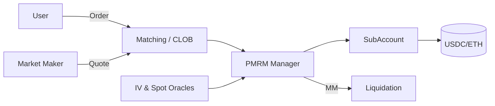

# 链上期权：Lyra V2 与 Ribbon/Aevo 的定价、做市与对冲

> **TL;DR**：链上期权协议的核心难题是 **定价**（Black-Scholes 的链上实现）、**流动性**（LP 做卖方、对冲风险敞口）和 **清算**（portfolio margin 与多头寸 IM/MM 计算）。Lyra（现更名 **Derive**）从 V1 AMM 定价进化到 V2 的"CLOB + 保证金账户 + RFQ"，并部署到 OP Stack 专用链（Lyra Chain）；Ribbon 的 DOV（DeFi Option Vaults）把期权卖方策略自动化，后来与 aevo.xyz 合并为 **Aevo**——一个 StarkEx 式专用链上的期权与 Perp 订单簿交易所。本文讲解 BSM 与其链上变体、Greeks 对冲、保证金体系，以及 Lyra / Aevo 两种架构选择。

## 1. 背景与动机

期权是衍生品中最复杂的品类：非线性回报、多个参数（strike, expiry, IV）、连续 Greeks（Δ, Γ, V, Θ, ρ）。早期链上期权（Hegic 2020）用池子 + 固定 IV 模型，LP 容易遭遇"跨式（straddle）亏损"。Lyra V1（2021）首次把 Black-Scholes 的 IV 作为 AMM 状态变量在链上可计算地实现，并用 Synthetix 的 sUSD 作为抵押做 delta 对冲。Ribbon 则从"Theta Gang"卖波动率角度出发，把每周做一次 covered call / cash-secured put 自动化成 Vault。

2023—2024 年两条线的现状：
- **Lyra → Derive**（2024 更名）：V2 引入独立 L2（Lyra Chain，基于 OP Stack），将期权、Perp、Spot 结算合一；保证金为 USDC/ETH，采用 portfolio margin；前端支持 RFQ（机构询价）与 CLOB（散户）并存。
- **Aevo**（Ribbon 团队）：聚焦"速度 + 订单簿"，用 StarkEx-like 架构把撮合放专用链，但以 Merkle rollup 到以太坊结算。DOV 仍保留，作为 Aevo Strategies。

### 动机

- **卖方流动性枯竭**：纯 AMM 需要 LP 卖所有希腊字母；引入 RFQ/CLOB 后做市商用 Greek 对冲更便捷。
- **保证金效率**：portfolio margin 可抵消多空 Greek，解放资金占用。
- **专用链**：主网 Gas 贵 + MEV，难以支持做市频繁撤单；L2/App-Chain 是必然选择。

## 2. 核心原理

### 2.1 Black-Scholes-Merton 与隐含波动率

欧式 Call 价格公式：

```
C(S, K, r, σ, T) = S·N(d1) − K·e^{-rT}·N(d2)
d1 = [ln(S/K) + (r + σ²/2)T] / (σ√T)
d2 = d1 − σ√T
```

其中 `σ` 是隐含波动率（IV）。链上实现的挑战：`N(x)`（标准正态 CDF）、`e^x`、`ln(x)` 都需要定点实现。Lyra 使用泰勒展开 + 查表，精度到 ~1e-6。Greeks：

```
Δ = N(d1)          (call)
Γ = φ(d1) / (S σ √T)
V (Vega) = S φ(d1) √T
Θ = ... (复杂)
```

`φ` 为标准正态 PDF。协议需要实时计算 Greeks 以更新保证金。

### 2.2 Lyra V1：AMM 定价

V1 核心：池子里 `listings[strike, expiry]` 有净头寸，协议维护 **baseIV**（市场整体 IV 面）与 **skewRatio**（每个 listing 的倾斜）。每笔交易前后对 IV 做增减：

```
newIV = oldIV + trade_size * skew_sensitivity
```

同时协议用 Synthetix sETH 做 delta 对冲——买家 Δ=0.5 的 call 时，协议买 0.5 sETH 抵消敞口，使 LP 只承担 Γ/V/Θ 风险。缺点：sETH 深度不够，Synthetix 费率高，极端行情时对冲滑点大。

### 2.3 Lyra V2 / Derive：PMRM + CLOB

V2（`v2-core` 仓库）引入 **Portfolio Margin Risk Model (PMRM)**：

- 每个账户 `subAccount` 持有多个 option/future/spot 头寸。
- **Initial Margin (IM)** = `max(PNL stress scenarios)`，在一组冲击情景（e.g., ±20% spot、±50% IV）下计算最坏情况。
- **Maintenance Margin (MM)** = IM × 0.7（近似）。
- 仓位独立存放在 `SubAccounts.sol`，资产存在 `Managers` 下（`StandardManager` 对现货 +PMRM 期权 manager）。

交易由 **Matching**（Off-chain CLOB）生成订单，再由 `Matching.sol` 通过 `OrderVerifier`（EIP-712 签名）批量结算，以减少 gas。RFQ 接口允许做市商回复机构询价。

### 2.4 Ribbon / Aevo DOV

DOV 典型流程（每周循环）：
1. 周四 UTC 10:00 把金库（USDC 或 ETH）抵押铸期权 token（例如下周五到期的 call）。
2. 通过 Paradigm 或 Airswap RFQ 拍卖给做市商（Galaxy, Orbit, GSR, QCP 等）。
3. 收到的期权费（premium）沉淀回 Vault 作为收益。
4. 到期：若虚值（OTM）则抵押全额返回；若实值（ITM）则 LP 承担亏损（Call: 少部分 ETH，Put: 少部分 USDC）。

Aevo 把 DOV 保留为 Strategies 板块，同时提供 Perp + Option CLOB（与 Deribit 风格接近）。Aevo 架构：Matching Engine 在自建 Rollup（proof 提交到 Ethereum），资金桥跨链。

### 2.5 子机制拆解

1. **Oracle**：Lyra V2 使用 Chainlink 现货 + 自研 IV oracle（由做市商报价 + 中位数）。Aevo 使用 Pyth + 内部聚合。
2. **清算**：Lyra V2 的 `LiquidationModule` 检测 `MM > equity`，将头寸拍给白名单清算人；若坏账由 `InsurancePool` 承担。
3. **抵押**：Lyra V2 支持 USDC、ETH、wstETH 等；ETH 作抵押时会折价 80%。
4. **Skew 与 Surface**：完整 IV surface（strike × expiry）由 Market Makers 持续更新；Derive Surface Oracle 以分钟级别刷新。
5. **Greeks Portfolio**：系统实时聚合 `ΣΔ, ΣΓ, ΣV` 用于风险控制；做市商可接入 API 查看。
6. **DOV 的风险**：LP 本质是短 gamma 策略，熊市看跌期权 Vault（put-selling）在下跌行情会亏本金。

### 2.6 参数

| 参数 | Lyra V2 / Derive | Aevo |
| --- | --- | --- |
| 合约到期 | 每日/每周/每月 | 每日/每周/每月/季度 |
| 抵押 | USDC/ETH/LST | USDC |
| 最小单位 | 0.1 option | 0.01 option |
| IM stress ΔS | ±20% | ±15% |
| IM stress Δσ | ±50% | ±40% |
| Maker/Taker fee | 0.01% / 0.03% | 0.03% / 0.05% |
| 清算罚金 | 5% | 3% |

### 2.7 边界条件

- **IV 极端冲击**：2020-03-12 ETH 日内 ±50% 时，若 IV stress 不足以覆盖，保险池可能被击穿。Derive 在 2024 增加 second-order stress。
- **Oracle 偏差**：`markIV` 偏离真实做市商报价会导致清算错误；Derive 用 TWAP 平滑。
- **链终止性**：Aevo 依赖 StarkEx-like 架构，罕见情况下 proof 提交延迟影响结算；桥回 L1 需 7 天挑战期。

### 2.8 图示



```
Aevo Stack:
[User/MM] -> [Aevo MatchingEngine L2] -> [Rollup Proof] -> [Ethereum L1]
DOV:  [Vault] --RFQ--> [Market Maker] --Premium--> Vault
```

## 3. 架构剖析

### 3.1 分层视图

1. **L2 / 专用链**：Derive 运行 OP Stack Superchain；Aevo 运行 StarkEx-fork。
2. **合约层**：SubAccounts、Managers、OptionAsset、PerpAsset、SpotAsset、Auction、Matching、Oracle。
3. **Off-chain Matcher**：撮合引擎，签名订单后批量上链。
4. **Market Maker 网关**：WebSocket API + RFQ endpoint。
5. **前端 + SDK**：app.derive.xyz, app.aevo.xyz；Python/TS SDK。

### 3.2 核心模块（Derive V2）

| 模块 | 代码位置 | 职责 |
| --- | --- | --- |
| SubAccounts | `v2-core/src/SubAccounts.sol` | 多头寸账本 |
| StandardManager | `v2-core/src/risk-managers/StandardManager.sol` | 现货 + Perp 保证金 |
| PMRM | `v2-core/src/risk-managers/PMRM.sol` | 期权 portfolio margin |
| Matching | `v2-core/src/periphery/Matching.sol` | 聚合订单签名撮合 |
| Liquidation | `v2-core/src/liquidation/DutchAuction.sol` | 荷兰式拍卖清算 |
| CashAsset | `v2-core/src/assets/CashAsset.sol` | USDC 包装 |
| OptionAsset | `v2-core/src/assets/OptionAsset.sol` | 期权代币（ERC-1155 式） |

### 3.3 数据流

1. 做市商 Off-chain 签订单；Matcher 汇总交易对成交单。
2. Matcher 调用 `Matching.orderMatching([...orders, ...fills])`，SubAccounts 转移头寸。
3. Manager 重新评估 IM；若低于阈值 `force_close` 或发送清算通知。
4. 到期时 `OptionAsset.settle()` 按 index price 结算，multicall 平仓。

### 3.4 客户端

- **Derive**：Solidity + TS SDK；支持 Paradigm Pro 的机构接入。
- **Aevo**：Solidity + TS/Python SDK；Block Trade API 走 RFQ。

### 3.5 对外接口

- **HTTP REST + WS**：订单、持仓、Greeks。
- **EIP-712 订单签名**：由 Matcher 提交上链。
- **Cross-chain Bridge**：Derive 使用 OP 原生桥 + LayerZero；Aevo 使用原生 StarkEx bridge + CCTP。

## 4. 关键代码 / 实现细节

### 4.1 Lyra V2 PMRM 压力测试（v2-core commit `a3fec`）

```solidity
// v2-core/src/risk-managers/PMRM.sol:420 (节选)
function _getMarginAndMarkToMarket(
    IPMRM.Portfolio memory portfolio,
    bool isInitial,
    IPMRM.Scenario[] memory scenarios
) internal view returns (int margin, int markToMarket) {
    int worstScenarioMtM = type(int).max;
    for (uint i; i < scenarios.length; ++i) {
        int mtm = _getScenarioMtM(portfolio, scenarios[i]);   // 情景下盈亏
        if (mtm < worstScenarioMtM) worstScenarioMtM = mtm;
    }
    margin = worstScenarioMtM;                                // IM = 最坏情景
    markToMarket = _getMTM(portfolio);                        // 当前组合 MTM
}
```

### 4.2 Black-Scholes 链上实现（Lyra `BlackScholes.sol:112`）

```solidity
function optionPrices(bsInput memory bs) public pure
    returns (uint callPrice, uint putPrice)
{
    (int d1, int d2) = _d1d2(bs.timeToExpirySec, bs.volatility,
                             bs.spotDecimal, bs.strikePriceDecimal, bs.rateDecimal);
    uint expRT = FixedPointMathLib.exp(-int(bs.rateDecimal) * int(bs.timeToExpirySec) / SECONDS_PER_YEAR);
    callPrice = bs.spotDecimal * _stdNormalCDF(d1) / 1e18
              - bs.strikePriceDecimal * expRT * _stdNormalCDF(d2) / 1e36;
    putPrice = callPrice - bs.spotDecimal + bs.strikePriceDecimal * expRT / 1e18;  // put-call parity
}
```

> 省略了 log / exp 的近似实现（Taylor + LUT 组合）。实际 `_stdNormalCDF` 使用 Abramowitz-Stegun 近似 7.1.26。

### 4.3 Ribbon DOV 铸造（老版 `RibbonThetaVault.sol:312`）

```solidity
function _rollToNextOption() internal {
    address newOption = otokenFactory.createOtoken(...);
    controller.mintOtoken(newOption, amount);
    // 通过 Airswap RFQ 拍卖
    airswap.swap(order);
}
```

## 5. 演进与版本对比

| 版本 | 时间 | 变化 |
| --- | --- | --- |
| Hegic V1 | 2020 | 固定 IV 池 |
| Opyn V1/V2 | 2020—2021 | otoken ERC-20 期权 |
| Lyra V1 | 2021-08 | AMM + skewIV + Synthetix 对冲 |
| Ribbon V2 | 2021 | Weekly DOV 自动滚仓 |
| Lyra Newport | 2022-12 | Arbitrum GMX-hedged 池 |
| Lyra V2 | 2023-12 | OP Stack chain + PMRM + CLOB |
| Aevo (ex-Ribbon) | 2023-06 | 专用链订单簿 |
| Derive 品牌 | 2024 | Lyra V2 更名 Derive，SuperChain |

## 6. 实战示例

Derive (Lyra V2) 下单：

```bash
pip install derive-client
export DERIVE_SECRET=0x...
```

```python
from derive_client.client import Client
c = Client(private_key=os.environ["DERIVE_SECRET"], env="prod")
# 查询 ETH-20260529-4000-C
inst = c.get_instrument("ETH-20260529-4000-C")
# 限价买 1 张 @ 130 USDC
order = c.submit_order(instrument=inst.name, side="buy", limit_px=130, amount=1,
                       order_type="limit", mmp=False)
print(order)
```

Aevo 下单类似，使用 `aevo-sdk-python`；RFQ 块交易：

```python
block = c.request_block_quote([leg("ETH-CALL-4000-20260529", 10),
                               leg("ETH-CALL-4500-20260529", -10)])
```

## 7. 安全与已知攻击

- **Lyra V1 Chainlink 事件**：2022-03 Chainlink 面向 sETH oracle 短暂异常，AMM 报价扭曲，社区暂停池子；后续引入 price band 与 circuit breaker。
- **Ribbon RFQ 价格偏差**：2022 某次 RFQ 成交低于公允价约 10%，社区批评定价透明度；随后公开所有 RFQ 结果。
- **Aevo 桥事件**：2023 初 testnet 阶段有过 bridge 摩擦，未造成主网损失。
- **PMRM 参数风险**：stress 参数若太小，极端行情保险池扛不住；Derive 公开参数治理。
- **重复报价套利（Lean-In）**：Quoter 被前置时会被套利；Derive 通过 `mmp`（Market Maker Protection）与最小报价时长缓解。

## 8. 与同类方案对比

| 维度 | Derive (Lyra V2) | Aevo | Deribit (CEX) | Opyn Squeeth |
| --- | --- | --- | --- | --- |
| 架构 | OP Stack L2 + CLOB | 专用 Rollup + CLOB | 中心化 | Uniswap V3 oSQTH 单 instrument |
| 品类 | Options + Perps + Spot | Options + Perps | Options + Futures + Perps | Squeeth (perpetual option-like) |
| 保证金 | Portfolio Margin | Portfolio Margin | Portfolio Margin | 简单 LTV |
| 定价 | CLOB + IV surface | CLOB + IV surface | CLOB | AMM |
| 卖方 | 做市商 + LP | 做市商 + DOV | 做市商 + DOV | LP |
| 代币 | LYRA (staking) | — / AEVO | — | OPYN |

## 9. 延伸阅读

- Derive Docs：https://docs.derive.xyz/
- Lyra V2 Paper：`v2-core/docs/LYRAv2_paper.pdf`
- Aevo Docs：https://docs.aevo.xyz/
- Paradigm "Everlasting Options"（Dave White 2021）
- Hegic / Opyn 历史博客
- 学习资源：learnblockchain.cn《链上期权定价实现》
- YouTube：Paradigm Research Day 2023 (Options)
- CFAsociety《Options Pricing Primer》PDF

## 10. 术语表

| 术语 | 英文 | 释义 |
| --- | --- | --- |
| BSM | Black-Scholes-Merton | 经典期权定价模型 |
| IV | Implied Volatility | 隐含波动率 |
| Greeks | Δ, Γ, V, Θ, ρ | 各阶敏感度 |
| DOV | DeFi Option Vault | 自动卖期权金库 |
| PMRM | Portfolio Margin Risk Model | 组合保证金模型 |
| RFQ | Request for Quote | 询价成交 |
| CLOB | Central Limit Order Book | 中央限价订单簿 |
| Squeeth | Squared Ether | Opyn 的永续 gamma 衍生品 |
| MMP | Market Maker Protection | 做市商保护机制 |

---

*Last verified: 2026-04-22*
