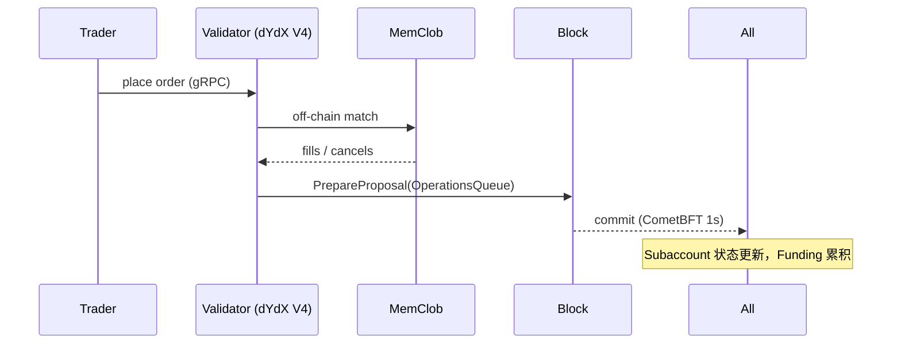

# 永续合约对比：dYdX V4 与 GMX V1/V2

> **TL;DR**：dYdX V4 与 GMX 代表链上永续合约（Perpetual Futures）的两条技术路线：**订单簿 + 应用链**（Cosmos SDK + CometBFT 专用链，高吞吐 off-chain 撮合 + on-chain 结算，链上订单簿）对决**AMM + LP 对手盘**（GMX V1 的 GLP 多资产指数池、V2 的 GM 每市场独立池）。前者像一个去中心化的 CEX，后者像一个"所有人都做市商"的 AMM。本文拆解它们的订单流、资金费率、清算、Oracle、LP 风险与 Token 经济学，并比较对手盘、交易成本、延迟、MEV 处境。

## 1. 背景与动机

Perp DEX 的目标是把 CEX 永续合约（无到期日、以资金费率锚定现货的合成期货）迁到链上。难题有三：**订单撮合延迟**（以太坊出块 12 秒无法满足 HFT）、**流动性**（CLOB 深度难以靠普通用户补齐）、**Oracle 攻击面**（标记价格一旦失真，清算与资金费率将被操纵）。

- **dYdX**：最早在 StarkEx（Layer 2 with STARK validity proof）部署 Perp；2023 年推出 **V4**，迁到基于 Cosmos SDK + CometBFT 的独立应用链（dYdX Chain），订单簿完全在链上，验证者内存撮合、每区块结算；目标是"CEX 性能 + DEX 透明"。
- **GMX**：诞生于 Arbitrum，完全不同路线——用户对手盘不是其他交易者，而是 **GLP**（V1 的多资产池）或 **GM**（V2 的单市场池）LP 池。交易者付费给 LP，LP 承担对手盘盈亏。结构更"AMM 化"，支持零滑点、无 funding rate（V1）/有 funding（V2）交易。

两者都成功吸引了大量用户，但它们的技术选择与风险特征截然不同。

## 2. 核心原理

### 2.1 形式化定义：Perp 的标的与资金费率

永续合约的持仓 PnL：

```
PnL = size * (markPrice - entryPrice)    (多头)
    = size * (entryPrice - markPrice)    (空头)
```

其中 `markPrice` 是平台给的"公平价"，通常 `mark = indexPrice ± premium`。`indexPrice` 来自多家 CEX 中位数（Binance/OKX/Coinbase 等），`premium` 反映链上订单簿相对指数的偏离。

**Funding Rate**（资金费率）是让 mark 趋近 index 的机制。多头付给空头（若 mark > index）或反之：

```
funding_i = clamp(premium_i / interest_rate_scalar, -cap, +cap)
payment  = position_size * markPrice * funding_i * dt
```

dYdX V4 每小时结算一次；GMX V2 每秒累计（借用 borrow fee + funding 两层）。

### 2.2 dYdX V4：App-Chain 订单簿

**核心数据结构**（`v4-chain/protocol/x/clob`）：

- `ClobPair`：市场（如 BTC-USD），有 `stepBaseQuantums`（最小 base 量）、`subticksPerTick`（tick 大小）。
- `Order`：`{subaccount, side, size, price, goodTilBlock, orderFlags}`。
- `Subaccount`：保证金账户，持仓 `perpetualPositions[]` + 资金 `assetPositions[]`；以 USDC 为唯一抵押。
- `PerpetualPosition`：`{perpetualId, quantums(+/-), fundingIndex, quoteBalance}`。

**撮合流程**：验证者节点在 mempool 阶段（`PrepareProposal`）执行 Off-Chain 订单簿匹配（使用内置 `MemClob`），但最终成交写入区块（`OperationsQueue`），以使全网对订单历史达成共识。区块时间 ~1 秒，每秒处理 ≥ 500 笔订单操作。

**共识**：CometBFT PoS；验证者由持 **DYDX** 的抵押决定（Protocol V4 将交易费 100% 分给质押者和验证者，无国库抽成，是其差异化卖点）。

### 2.3 GMX V1：GLP 多资产池

**GLP** 是一篮子资产（WETH/WBTC/USDC/USDT/DAI/LINK/UNI 等）的 LP Token，定价：

```
GLP_price = TVL_USD / GLP_supply
```

其中 TVL 包括 LP 提供的现货与交易者的浮盈（交易者赚钱等于 LP 亏）。交易者开多 ETH 等于"从 GLP 借 ETH"，GLP 的 ETH 头寸减少；交易者开空等于"从 GLP 借稳定币做空"。

- **零滑点报价**：markPrice 直接取 Chainlink + GMX Keeper 的 fast oracle 中位数，交易按此价格 1:1 成交。
- **Borrow Fee**（借用费）：交易者按 position_size 占池子剩余的比例每小时支付借用费，相当于对 GLP 的补偿。无 funding rate（V1 无多空对冲，因为 LP 始终是对手盘）。
- **开仓 / 平仓手续费**：0.1%（开）+ 0.1%（平），归 GLP。

### 2.4 GMX V2：GM 单市场池

V2 把 GLP 拆成 **GM Token**（每个市场一个 LP 池，如 ETH-USD Market）。每个 Market 有 `longToken`（长腿抵押，如 ETH）与 `shortToken`（短腿抵押，如 USDC）。池子只承担该市场的多空对冲，风险隔离。

V2 引入：
- **Funding Rate**（双向）：多头和空头持仓不均衡时，多的一方付费给少的一方。
- **Price Impact**：开仓/平仓若会加剧不平衡（如已多头爆满还继续开多）将支付 price impact 费；反方向成交则获得 rebate。
- **Backed Pool**：GM 两侧资产比例偏离时，有机器人通过 GMX rebates 把它拉回来。
- **Isolated Markets**：一个市场爆雷不影响另一市场。

### 2.5 子机制拆解

1. **Oracle**：dYdX V4 使用验证者投票喂价（每个区块各验证者提交价格，中位数入链），以太坊 V1 版本曾使用 Chainlink；GMX V1 使用 Chainlink + 自有 keeper `fastPrice`（签名价格）双重校验。
2. **清算**：dYdX 按维持保证金率触发，清算由验证者内置 `Liquidation Module` 接管头寸并以标记价吃掉；亏损部分先由 `InsuranceFund` 承担，再由 `AutoDeleveraging` 对利润最高的对手强制减仓。GMX V2 由 Keeper 通过 `liquidatePosition` 外部调用，LP（GM）直接吞下坏账。
3. **资金费率**：dYdX 标准 8h 费率（链上每秒累积）；GMX V2 引入 `funding_factor` + `funding_exponent_factor`，非线性加速，长期不平衡越多费率越高。
4. **Token 经济学**：DYDX 在 V4 是 staking + 治理代币，100% 交易费用分红；GMX 代币同样分红（30% of fees），esGMX 线性归属 1 年。
5. **MEV**：dYdX V4 因订单簿在链上公开，理论上可被验证者抢先撮合；社区通过 `validator.gentx` 白名单 + MEV 赏金项目 约束。GMX 因价格来自 oracle + Keeper，用户会面临"签名价格过期"（stale oracle）攻击，V2 加 `minBlockInterval` 与 `maxAge`。
6. **Isolated Margin / Cross Margin**：dYdX V4 支持 cross margin（一个 subaccount 多头寸共享保证金）与 isolated（独立子账户）；GMX V2 按 position 独立，支持多抵押。

### 2.6 关键参数

| 协议 | 参数 | 默认 |
| --- | --- | --- |
| dYdX V4 | 区块时间 | ~1 s |
| dYdX V4 | 最大杠杆 | 20× BTC/ETH, 10× 其他 |
| dYdX V4 | Maker/Taker fee | -0.011% / 0.05%（阶梯） |
| dYdX V4 | 维持保证金率 | 3% BTC, 5% 其他 |
| GMX V1 | 最大杠杆 | 50× |
| GMX V1 | Borrow rate cap | 0.01%/hr |
| GMX V2 | Price impact factor | 市场相关 (~1e-10) |
| GMX V2 | Funding exponent | 1.0–2.0 |
| GMX V2 | 开仓费 | 0.05%–0.07% |

### 2.7 边界条件

- **极端行情**：GMX V1 交易者批量爆赚 ETH，GLP 持有者会短线亏损（"交易者获胜假设 + 池子作为对手方"）；官方选择乐观假设——长期平均交易者亏损，因此 GLP 仍盈利。
- **Oracle 滞后**：GMX V2 已用多源价 + 去噪；但若 Chainlink 长时间不更新，keeper 价格成为单点。
- **验证者作恶**：dYdX V4 若 2/3+ 验证者共谋，可作恶订单撮合；social slashing + 代币质押保证金为主要约束。

### 2.8 图示



```
GMX V2 市场（ETH-USD Market）
+---------------------------+
|  longToken=WETH  shortToken=USDC
|       LP (GM token holders)
+-----------+---------------+
            |
+-----------v---------------+
|  Trader Long / Short      |
|  Oracle price = Chainlink + Keeper
+---------------------------+
```

## 3. 架构剖析

### 3.1 dYdX V4 分层

1. **CometBFT 共识层**：PoS，出块 ~1 s，验证者集 ~60。
2. **Cosmos SDK Base**：Auth、Bank、Staking 等标准模块。
3. **自定义模块**（`x/clob`, `x/perpetuals`, `x/subaccounts`, `x/prices`, `x/rewards`, `x/sending`, `x/delaymsg`）。
4. **Indexer**：链外 TimescaleDB，订阅 `EndBlockEvents` 维护订单簿、K 线、账户 API。
5. **前端 / FE SDK**：dydx.trade、IBC 桥（从 Noble 转 USDC）。

### 3.2 GMX V2 分层

1. **Solidity Core**：`DataStore`（中心化键值存储）、`Reader`（读接口）、`ExchangeRouter`（用户入口）、`OrderVault/DepositVault/WithdrawalVault`、`MarketStore`、`PositionStore`、`Oracle`、`FeeHandler`。
2. **Keeper 网络**：GMX 官方 + 第三方 Keeper 监听 `OrderCreated` 事件，调用 `executeOrder`，支付 gas，领取 execution fee。
3. **Front-end**：app.gmx.io + 聚合器（OKX Web3、1inch）。

### 3.3 核心模块对照

| 模块 | dYdX V4 | GMX V2 |
| --- | --- | --- |
| 订单簿 | `x/clob`（链上） | N/A（AMM） |
| 结算 | `x/subaccounts` | `PositionStore` |
| Oracle | `x/prices`（验证者投票） | Chainlink + FastPrice Keeper |
| 清算 | `x/clob Liquidation` | `PositionRouter + Keeper` |
| 保险池 | `x/clob InsuranceFund` | ADL + GM 吞损 |
| 治理 | `x/gov` (CometBFT) | GMX token vote on-chain |

### 3.4 端到端路径

- **dYdX 下单**：CLI/SDK → gRPC `/dydxprotocol.clob.MsgPlaceOrder` → Validator MemClob 匹配 → 区块写 `OperationsQueue` → Indexer 推送成交 WebSocket → 用户前端更新；全程 ~1–2 s。
- **GMX 开仓**：`ExchangeRouter.createIncreaseOrder` → `OrderVault` 锁 collateral → `OrderCreated` → Keeper `executeOrder` → 价格校验 + `PositionStore.updatePosition` → 释放 `executionFee`。

### 3.5 客户端多样性

- **dYdX V4**：核心节点实现 Go (cosmos-sdk)，只有 1 种客户端但验证者运行独立；前端、SDK 开源（TS、Python）。
- **GMX**：主合约 Solidity，单实现；Keeper 算法开源但需要运行成本。

## 4. 关键代码 / 实现细节

### 4.1 dYdX V4 撮合核心

`v4-chain/protocol/x/clob/keeper/orders.go` 中 `PlaceOrder` 精简版：

```go
// v4-chain/protocol/x/clob/keeper/orders.go:215 (节选)
func (k Keeper) PlaceShortTermOrder(ctx sdk.Context, msg *types.MsgPlaceOrder) error {
    order := msg.Order
    if err := k.ValidateOrder(ctx, order); err != nil { return err }

    // 内存订单簿匹配
    fills, cancels, err := k.MemClob.PlaceOrder(ctx, order)
    if err != nil { return err }

    // 记录到 OperationsQueue 供 EndBlocker 结算
    for _, f := range fills {
        k.AppendToOperationsQueue(ctx, types.NewFillOperation(f))
    }
    return nil
}
```

### 4.2 GMX V2 执行单

```solidity
// gmx-synthetics/contracts/exchange/OrderHandler.sol (节选)
function executeOrder(bytes32 key, OracleUtils.SetPricesParams calldata oracleParams)
    external onlyOrderKeeper
{
    Order.Props memory order = OrderStoreUtils.get(dataStore, key);
    Oracle.setPrices(oracleParams);                  // keeper 喂签名价
    if (order.orderType == OrderType.MarketIncrease) {
        IncreasePositionUtils.increasePosition(order);   // 调整 PositionStore
    }
    // ... 处理 fees, funding, price impact
    Oracle.clearAllPrices();
}
```

> 省略权限、回滚、事件发送等样板。实际 `increasePosition` 内部会计算：funding 增量 → price impact → 扣除 collateral fee → update position → emit。

## 5. 演进与版本对比

| 版本 | 时间 | 变化 |
| --- | --- | --- |
| dYdX V1 | 2019 | ETH 上链上 margin |
| dYdX V2 | 2020 | StarkEx L2 现货 Perp |
| dYdX V3 | 2021 | StarkEx with central engine |
| dYdX V4 | 2023-10 | Cosmos App-Chain，完全去中心化订单簿 |
| GMX V1 | 2021-09 | GLP 多资产池，零滑点 |
| GMX V2 | 2023-08 | GM 单市场、引入 funding & price impact |
| Hyperliquid | 2023 | HyperBFT 链上订单簿（详见对应文章） |

## 6. 实战示例

dYdX V4 via TS SDK：

```bash
npm i @dydxprotocol/v4-client-js
```

```ts
import { CompositeClient, LocalWallet, Network } from '@dydxprotocol/v4-client-js';
const w = await LocalWallet.fromMnemonic(process.env.MNEMONIC!, 'dydx');
const c = await CompositeClient.connect(Network.mainnet());
await c.placeOrder(w, 'BTC-USD', OrderType.MARKET, OrderSide.BUY, 0, 0.001, '');
```

GMX V2 via Ethers：

```ts
const router = new ethers.Contract(ROUTER, ABI, signer);
const params = { market: ETH_USD_MKT, initialCollateralToken: USDC,
                 collateralDeltaAmount: 500e6, sizeDeltaUsd: 2_500e30,
                 orderType: 2, isLong: true, executionFee: 5e14 };
await router.createOrder(params, { value: 5e14 });
```

预期：ExecutionFee 足够时 Keeper 在 1–2 个区块内执行；交易出现在 stats.gmx.io。

## 7. 安全与已知攻击

- **GMX 2022 AVAX 操纵**：Avalanche 上某攻击者用低深度 AVAX 现货拉升 Chainlink 索引，多空反复开平 GMX 套利 ~0.5M。此后 GMX 增加 `maxAveragePrice`、限制单笔 size。
- **dYdX V3 2023 事件**：YFI 价格操纵导致保险基金亏损约 $9M。V4 更加依赖自治验证者投票，降低单点风险，但也引入共谋风险。
- **Keeper 抓取缺失**：GMX Keeper 离线意味着订单无法执行、用户可能超时损失。用户可以手动 cancel。
- **Oracle 延迟**：GMX V2 引入 `latestTimestamp + maxAge`（通常 60s），过期拒绝执行。
- **ADL（Auto Deleveraging）**：当保险池耗尽，dYdX 对利润最高的对手方强制减仓以弥补坏账，用户需接受此风险。

## 8. 与同类方案对比

| 维度 | dYdX V4 | GMX V2 | Hyperliquid | Perpetual Protocol v2 |
| --- | --- | --- | --- | --- |
| 路线 | 订单簿 App-Chain | AMM + LP 池 | 订单簿 App-Chain | vAMM on Optimism |
| 延迟 | ~1 s | 15 s (keeper) | <1 s | L2 block |
| 对手方 | 其他交易者 | GM LP | 其他交易者 | vAMM + 做市商 |
| 最大杠杆 | 20× | 50× | 50× | 10× |
| MEV | 验证者可见 | Keeper 可见 | 验证者投票价 | L2 共享 mempool |
| 分红 | 100% 交易费 | 70% (LP) + 30% (token) | HYPE holders | USDC rewards |
| 代币功能 | Stake + Gov | 质押分红 | 待 TGE | 待优化 |

## 9. 延伸阅读

- dYdX V4 Docs：https://docs.dydx.exchange/
- dYdX V4 Source：https://github.com/dydxprotocol/v4-chain
- GMX Docs：https://docs.gmx.io/
- GMX V2 Paper：https://github.com/gmx-io/gmx-synthetics/blob/main/docs/
- Delphi Digital《Perp DEX Landscape》
- Paradigm 博客：Dave White "Everlasting Options"（Perp 原理源头）
- Messari 季度报告：Perp DEX Market Share
- 学习资源：learnblockchain.cn《dYdX V4 源码分析》系列

## 10. 术语表

| 术语 | 英文 | 释义 |
| --- | --- | --- |
| Perp | Perpetual Futures | 无到期永续合约 |
| Funding Rate | Funding Rate | 资金费率 |
| Mark Price | Mark Price | 标记价（清算用）|
| CLOB | Central Limit Order Book | 中央限价订单簿 |
| GLP | GMX Liquidity Provider | V1 多资产 LP 指数 |
| GM | GMX Market | V2 单市场 LP token |
| ADL | Auto Deleveraging | 自动减仓 |
| App-Chain | Application-specific Blockchain | 应用专用链 |
| MemClob | In-Memory CLOB | dYdX 验证者内存订单簿 |

---

*Last verified: 2026-04-22*
