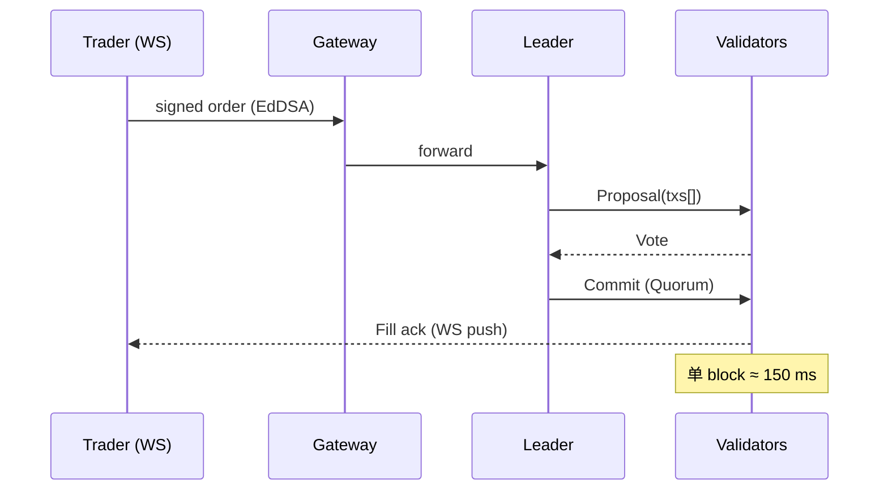

# Hyperliquid：HyperBFT 下的链上订单簿 Perp DEX

> **TL;DR**：Hyperliquid 是运行在自建 L1 (Hyperliquid L1) 上的去中心化永续合约交易所，核心创新是把完整的 **CLOB（中央限价订单簿）** 放在链上，并设计了一套优化的 BFT 共识算法 **HyperBFT**（HotStuff 家族变体），在 ≤0.2 秒的端到端延迟内完成订单撮合、结算与全网共识。用户体验接近 CEX，而订单历史、头寸、资金费率等全部可验证。2024 年上线 HYPE 代币与 HyperEVM，扩展到通用智能合约。本文拆解 HyperBFT 共识、订单簿账本、Vault 做市、HLP、HyperEVM 以及它与 dYdX V4、GMX 的差异。

## 1. 背景与动机

Hyperliquid 2022 年开始开发，核心团队出自量化交易背景。他们判断：**去中心化订单簿 Perp 的瓶颈不在 AMM 是否可用，而在共识本身的延迟**。以太坊 12 秒、Cosmos SDK 默认 5 秒的出块时间导致用户需要等待才能确认成交，无法支持量化 HFT。Hyperliquid 选择自写共识、自写撮合引擎、自写 API，以"全栈自研"换取亚秒级延迟。

早期（2023—2024）Hyperliquid 只跑一套"Perp L1"，后来（2024-02）引入 HyperEVM 作为 Layer 上的 EVM 执行环境，允许部署普通 Solidity 合约并与 L1 订单簿通过 `system contracts` 通信。2024-11 发布原生治理代币 HYPE 并空投。

动机总结：
- **延迟决定市场深度**：做市商愿意挂单的前提是能够快速撤单。亚秒级共识直接拉升流动性。
- **订单簿 = 公平性**：相比 AMM 的 oracle 价格，CLOB 按 price-time priority 结算，更符合传统交易员习惯。
- **自研通道**：避免依赖 CometBFT/IBC 以降低尾部延迟；但同时失去了 Cosmos 生态天然桥接。
- **"单链"极致**：Hyperliquid 不追求通用链，而追求金融场景最优；HyperEVM 只是补充应用层。

## 2. 核心原理

### 2.1 形式化定义：订单簿状态机

Hyperliquid L1 的核心状态是 **每个市场的订单簿** + **每个账户的 clearinghouse state**。把市场 `m` 抽象为：

```
Book_m = (bids: SortedSet<(price, time, oid, user, size)>,
         asks: SortedSet<(price, time, oid, user, size)>)
```

一次撮合状态转移 `T(ev)` 接受事件 `ev ∈ {Place, Cancel, Modify, OracleTick}`：

```
PlaceIoc(user, side=buy, px, sz):
  while sz>0 and !asks.empty() and asks.top().price <= px:
      q = min(sz, asks.top().size)
      Fill(user, asks.top().user, q, asks.top().price)
      sz -= q
      asks.pop_or_reduce()
  if sz>0 and order.postOnly==false: bids.insert(...)
```

每个区块 Proposer 把 `Operations[]` 序列上链；验证者对 **撮合结果的哈希** 达成共识，而不是重新从零撮合（减少冗余）。

### 2.2 HyperBFT 共识

**HyperBFT** 是 HotStuff (Libra BFT / Narwhal+Tusk 家族) 的优化变体：

- **Leader 轮换**：每个 view 一个 leader 负责打包 proposal；若超时未提交则切换（view change）。
- **三阶段 → 管道化**：与 HotStuff 一样用 `prepare → pre-commit → commit` 三轮消息；Hyperliquid 将这些阶段管道化（pipelined），可在 ≤200ms 内 commit 一个 block。
- **验证者集合**：~20 个验证者（经过治理审批），用 HYPE 质押；每秒上万个事件吞吐（每个事件是"订单/成交/撤单"原子操作）。
- **确定性终局**：2/3+ 投票即终局，不会回滚。
- **防 MEV**：Proposer 按"先序列化再提议"的方式暴露意图，但验证者在 commit 前可以验证订单簿一致性。HL 文档强调"不使用 priority gas auction"，显式禁止订单排序中的 bribery。

### 2.3 子机制拆解

1. **Clearinghouse**：每个账户的保证金、头寸、资金费率结算由 "clearinghouse state"（C 模块）维护。所有 PnL 按 `markPrice` 实时计算，资金费率每 1 小时结算一次。
2. **Oracle / Mark Price**：每 3 秒 validator 输入现货中位数（多家 CEX）给 `markPrice`；订单簿的 BBO（best bid/ask）用于 `premium = markPrice - mid`，从而稳定 funding rate。
3. **Vaults**：用户可创建 "Vault"，接受他人存款、由创建者管理策略交易；官方 **HLP (Hyperliquid Liquidity Provider)** 是一个自动做市 Vault，吸收用户做市存款、运行被动做市 + 清算执行 + 提供对手盘深度，类似 GMX 的 GLP + Citadel Execution Service。HLP 是平台背后深度的关键来源。
4. **清算引擎**：当维持保证金 < 阈值，清算由 HLP 直接吃单吞下（"Backstop Liquidator"）；保险基金承担坏账；极端情况下 ADL。
5. **HyperEVM (Layer 2 / side chain)**：2024-02 上线，基于 Reth 的 EVM 执行层，通过 "precompile system contracts" 与 L1 订单簿互通：EVM 合约可调用 `send order`、查询 `mark price`、读取持仓等。现已部署 Lending、Staking、NFT 等应用。
6. **HYPE 代币经济学**：TGE 2024-11，最大 10 亿，空投给历史用户；交易费 46% 分给 HLP，剩余部分注入 assistance fund（回购+销毁）。Staking 验证者分得 5%–8% APR。
7. **桥**：Hyperliquid 与 Arbitrum 有官方 bridge（用户存 USDC 进入 L1）。桥是官方多签签名桥，存取款经 finality 确认。

### 2.4 关键参数

| 参数 | 值 |
| --- | --- |
| 区块时间 | 0.07–0.2 s |
| 最终终局 | 2 个区块 |
| 验证者数量 | ~20 |
| 最大杠杆 | 20—50×（视市场） |
| Maker / Taker fee | -0.002% / 0.035% |
| Funding 频率 | 每小时 |
| HLP 回报率 | ~20—40% APR（历史） |
| 清算惩罚 | 维持保证金 × 1.5 |

### 2.5 边界条件与失败模式

- **验证者离线**：若 2/3 在线则继续；< 2/3 会停止出块（与 BFT 一致）。
- **桥攻击**：USDC 跨链桥是信任边界，Hyperliquid 聘请 Zellic、Halborn 审计。
- **HLP 爆亏**：若市场发生单边极端行情，HLP 作为最终对手方会出现回撤；过去记录最大单日亏损 ~2% TVL。
- **Oracle 操纵**：Validator 喂价若被收买会影响 markPrice，但 HL 的 markPrice 使用多源中位数 + 过滤异常值。

### 2.6 图示



```
+-------------------+      +---------------+
|  Trader SDK / WS  |<----> Hyperliquid L1 |
+-------------------+      |  CLOB state   |
                           |  Clearinghouse|
                           +------+--------+
                                  |
                        HyperEVM (Reth) ── system contracts
```

## 3. 架构剖析

### 3.1 分层视图

1. **共识层**：HyperBFT，Rust 实现；验证者运行 `hl-node`。
2. **应用层 (L1 Core)**：订单簿引擎（每市场独立 CLOB）、Clearinghouse、Oracle 模块、Funding 模块、Vault 模块、桥模块。
3. **HyperEVM 执行层**：Reth fork + Precompiles，包含 `CoreWriter`（L1 → EVM）、`SpotSend`、`LimitOrder` 等系统合约。
4. **API 网关**：HTTP (`/info`, `/exchange`) + WebSocket；内置 batch endpoints。
5. **Indexer / Explorer**：stats.hyperliquid.xyz 提供成交、持仓、funding 的历史查询。

### 3.2 核心模块清单

| 模块 | 实现 | 职责 | 可替换性 |
| --- | --- | --- | --- |
| HyperBFT 共识 | Rust (`hl-node/consensus`) | 2/3 投票提交区块 | 不可替换（核心）|
| MatchEngine | Rust | 订单撮合 | — |
| Clearinghouse | Rust | 保证金 / PnL / Funding | — |
| Oracle | Rust | 多源喂价、聚合 | 治理可改 |
| Bridge | Solidity (Arbitrum) + Rust relay | USDC 跨链 | 多签审批 |
| HyperEVM | Reth fork | 合约执行 | 可升级 |
| HLP Vault | L1 策略合约 | 做市+清算+对手盘 | 代码开源 |
| API Gateway | Rust `tonic` + Axum | HTTP/WS | 可扩副本 |

### 3.3 数据流：一次 Market Order

1. 交易员 SDK 以 EdDSA 签名订单，通过 WebSocket 送给就近 Gateway。
2. Gateway 转发到当前 Leader（轮换）；Leader 将订单放入下一个 block proposal。
3. HyperBFT 三阶段投票（prepare/pre-commit/commit），≤2 blocks 内终局。
4. MatchEngine 在 commit 时执行撮合；Clearinghouse 更新 margin / position；Funding 累积。
5. WebSocket 向交易员 push `Fill`；Indexer 同步写时序库。

### 3.4 参考实现

- **hl-node**（闭源核心，部分开源）：验证者运行二进制；普通用户使用 SDK 接入即可。
- **hyperliquid-python-sdk**：官方 Python 客户端，封装下单、查持仓、订阅 WS。
- **hyperliquid-rust-sdk**：Rust 版；同步更新。

### 3.5 对外接口

- **HTTP**：`POST /exchange`（下单、撤单、转账）、`POST /info`（查询）。
- **WebSocket**：`ws://api.hyperliquid.xyz/ws` 订阅 `trades`, `l2Book`, `userEvents`, `orderUpdates`。
- **HyperEVM RPC**：标准 JSON-RPC + 自定义 precompiles（如 `0x0000…0800` 读 markPrice）。

## 4. 关键代码 / 实现细节

官方核心为闭源，以下以 `hyperliquid-python-sdk` v0.10+（commit `c8d0f`）展示下单路径：

```python
# hyperliquid-python-sdk/hyperliquid/exchange.py:88 (节选)
def order(self, name: str, is_buy: bool, sz: float, limit_px: float,
          order_type: OrderType, reduce_only: bool = False, cloid: Optional[str] = None):
    order_request = {
        "asset": self._asset_id(name),
        "isBuy": is_buy,
        "sz": str(sz),
        "limitPx": str(limit_px),
        "orderType": order_type_to_action(order_type),
        "reduceOnly": reduce_only,
    }
    action = {"type": "order", "orders": [order_request], "grouping": "na"}
    signature = sign_l1_action(self.wallet, action, self.vault_address, nonce=time_ns())
    return self._post_action(action, signature)
```

HyperEVM 侧 CoreWriter 使用方式（Solidity）：

```solidity
// HyperEVM 示例合约：通过 precompile 0x3333 调用 L1 下单
interface ICoreWriter {
    function sendRawAction(bytes calldata action) external;
}

contract L1Trader {
    ICoreWriter constant CORE = ICoreWriter(0x3333333333333333333333333333333333333333);
    function openLong(uint32 asset, uint64 sz, uint64 px) external {
        bytes memory action = abi.encodePacked(uint8(1), asset, sz, px, uint8(1)); // 伪结构
        CORE.sendRawAction(action);
    }
}
```

> 注：HyperEVM precompile ABI 以官方文档 `precompiles.md` 为准，此处为示意。

## 5. 演进与版本对比

| 阶段 | 时间 | 变化 |
| --- | --- | --- |
| Alpha Closed Beta | 2023-06 | 内部测试 |
| Mainnet Perp | 2023-11 | 上线主网，初始验证者 4 个 |
| HLP Vault | 2024-01 | 用户可一键存入做市 |
| Spot Market | 2024-04 | 上线现货（USDC 本位） |
| HyperEVM | 2024-08 测试网；2024-11 主网 | 通用 EVM |
| HYPE TGE + 空投 | 2024-11-29 | 1B 总量 |
| 验证者扩展 | 2025 | ~20 验证者 |

## 6. 实战示例

```bash
pip install hyperliquid-python-sdk
export HL_SECRET_KEY=0x...
```

```python
from hyperliquid.exchange import Exchange
from hyperliquid.info import Info
from eth_account import Account
import os, time

acct = Account.from_key(os.environ["HL_SECRET_KEY"])
info = Info(base_url="https://api.hyperliquid.xyz", skip_ws=True)
ex = Exchange(acct, base_url="https://api.hyperliquid.xyz")

# 查询 BTC 最新价
px = info.all_mids()["BTC"]
print("BTC mark", px)

# 市价买 0.001 BTC（reduceOnly=false, 市价=超价挂单）
resp = ex.market_open("BTC", True, 0.001, None, 0.01)
print(resp)
```

预期：返回 `{"status":"ok","response":{"type":"order","data":{...}}}`，并在 app.hyperliquid.xyz 的账户页面看到新仓位。

## 7. 安全与已知攻击

- **2024-03 JELLY 代币事件**：一小币种 JELLY 被恶意拉盘致 HLP 开空位被反向清算，HLP 回撤 ~5%；团队手动下架该市场并赔付。引发社区关于"中心化介入"讨论，后推出 `market delisting governance`。
- **桥风险**：Arbitrum 侧桥曾在 2024-07 遇到签名服务短暂宕机，用户存取款延迟几小时，无资金损失。
- **Oracle 操纵**：markPrice 源头是链下 CEX，若 CEX 被操纵会传染；HL 通过多源 + 中位数 + max price band 限制。
- **验证者集中**：当前验证者 ~20 相对小，需信任运营者；社区讨论扩大到 50–100。
- **MEV/Front-running**：因共识内部排序，前置交易可能存在但非 Flashbots 式可赚；HL 在文档承诺不卖 order flow。

## 8. 与同类方案对比

| 维度 | Hyperliquid | dYdX V4 | GMX V2 | Binance Perp (CEX 对照) |
| --- | --- | --- | --- | --- |
| 路线 | App-Chain CLOB | App-Chain CLOB | AMM LP | CEX |
| 共识 | HyperBFT (~0.2s) | CometBFT (~1s) | Ethereum L2 | — |
| 对手方 | 其他交易者 + HLP | 其他交易者 | GM LP | 其他交易者 |
| 全栈自研 | 是 | 否 (Cosmos SDK) | Solidity | 自研 |
| 链上订单历史 | 是 | 是 | 部分（链上事件）| 否 |
| Gas / Fee | 无 gas | 无 gas | 有 execution fee | 手续费 |
| Token | HYPE | DYDX | GMX | BNB（间接） |

## 9. 延伸阅读

- 官方 Docs：https://hyperliquid.gitbook.io/hyperliquid-docs
- HyperBFT WP（社区摘录）：forum.hyperliquid.xyz
- HotStuff 原论文（Yin et al. 2018，PODC）
- Hyperliquid vs dYdX 对比博客（Messari 2024）
- HLP 策略拆解：Delphi Research
- YouTube：Bankless 与 Hyperliquid 创始人访谈
- 学习资源：B 站《Hyperliquid 架构解析》

## 10. 术语表

| 术语 | 英文 | 释义 |
| --- | --- | --- |
| HyperBFT | HyperBFT | HotStuff 变体，Hyperliquid 自研共识 |
| HLP | Hyperliquid Liquidity Provider | 官方自动做市 Vault |
| Clearinghouse | Clearinghouse | 账户保证金/PnL 结算模块 |
| Vault | Vault | 用户创建的托管策略账户 |
| HyperEVM | HyperEVM | Hyperliquid 上的 EVM 执行层 |
| CoreWriter | CoreWriter | EVM → L1 订单的 precompile |
| ADL | Auto Deleveraging | 自动减仓 |
| BBO | Best Bid/Offer | 最佳买卖价 |
| CLOB | Central Limit Order Book | 中央限价订单簿 |

---

*Last verified: 2026-04-22*
