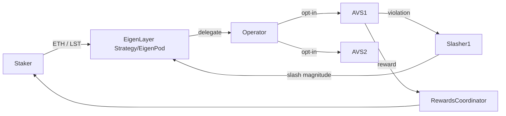

# Restaking 与 EigenLayer：AVS、Slashing、LRT 生态

> **TL;DR**：Restaking 让已经质押 ETH 的验证者把"信任"再次出售给其它应用（AVS, Actively Validated Services），换取额外收益；代价是：若 AVS 发现恶意行为，Restaker 会被 **Slash**。EigenLayer 是第一代 Restaking 协议，核心产品是 `StrategyManager` + `EigenPodManager` + `DelegationManager`。围绕 EigenLayer 出现 **LRT（Liquid Restaking Token）**：EtherFi eETH、Renzo ezETH、KelpDAO rsETH、Puffer pufETH 等；它们接受用户 ETH 或 LST 存款、自动配置到 EigenLayer 的 operator、把 restaking 收益以 LRT 余额增长或奖励形式回馈。2025 年进入真正的 slashing 模式（ELIP-002）。本文讲解 EigenLayer 架构、AVS 工作流、EigenDA 案例以及 LRT 的差异化。

## 1. 背景与动机

以太坊 PoS 把 ETH 质押转化为"全局安全预算"，但这份预算只保护以太坊共识本身。新兴基础设施（DA 层、MEV-Boost relay、预言机网络、协处理器、桥）都需要类似的"经济安全"。传统做法是发自己的 token，建自己的 PoS——启动慢、TVL 低、攻击成本有限。

EigenLayer（Sreeram Kannan 等人，2021 提出论文《EigenLayer: The Restaking Collective》）把"以太坊的安全"**租出去**：
1. 验证者把 withdrawal credential 指向 EigenPod；
2. EigenLayer 合约通过 merkle proof 验证 BeaconState（`BeaconStateRootOracle` + `beaconChainProofs`）得知 validator 余额；
3. 验证者把"受限余额"再委托给若干 AVS；
4. AVS 若检测到 validator 违反 AVS 规则，调用 Slasher 扣除一部分抵押。

收益 = ETH staking rewards + AVS 奖励。风险 = ETH slashing + AVS slashing。

**LRT** 则是在 EigenLayer 之上做聚合：用户存 ETH，一次性拿到类似 stETH 的 `ezETH/eETH/rsETH`，协议统一管理 validator + operator + AVS 组合。解决了普通用户对 AVS 不够了解、无法分配 operator 的难题。

## 2. 核心原理

### 2.1 形式化定义

令 `S` 为一个 staker 的 effective restake 余额（ETH 或 LST 折算），`O` 为其委托的 operator，`A = {a1, ..., an}` 是 `O` 选择服务的 AVS 集合。则：

```
Yield(S) = r_eth + Σ_i commission(a_i) * reward(a_i)
Risk(S)  = r_slash_eth + Σ_i slash(a_i)
```

约束：单次 slash 最多是 `S` 的 `max(slash_i)`（EIP：non-overlapping slashing windows），但长期复合 slash 有可能把 S 打到 0。Restaker 必须选择"**安全互补**"的 AVS 集合，避免 "**correlated slashing**"（一起被 slash）。

### 2.2 核心合约

`eigenlayer-contracts`（Solidity）主要包括：

- `DelegationManager`：staker 绑定到 operator。
- `StrategyManager`：管理 LST/ERC20 类抵押的 Strategy 合约（每种 LST 一个）。
- `EigenPod`/`EigenPodManager`：管理原生 ETH 质押（beacon chain credential `0x01`，指向 pod 地址）。
- `AVSDirectory`：AVS 注册 + operator opt-in。
- `Slasher` / `AllocationManager`（ELIP-002 引入）：slashing 与配额管理。
- `RewardsCoordinator`：AVS 分发奖励（含 claim merkle root）。

### 2.3 子机制

1. **原生 Restaking (EigenPod)**：
   - validator 用 `0x01` withdrawal credential 指向部署的 EigenPod 合约；
   - EigenPod `verifyWithdrawalCredentials` 用 `BeaconChainProofs` 校验；
   - `beaconBalanceGwei` 进入 `podOwner` 在 EigenPodManager 中的 "shares"。
2. **LST Restaking (Strategy)**：用户把 wstETH/rETH/cbETH deposit 到对应 Strategy，得到 shares。
3. **Delegation**：`DelegationManager.delegateTo(operator, signature)`；每个 staker 只能 delegate 给一个 operator（1:N 可通过多 EigenPod 实现）。
4. **AVS 注册**：AVS 合约 registers 到 `AVSDirectory`；operator 调用 `registerOperatorToAVS` opt-in，签 `OperatorAVSRegistrationDigestHash`。
5. **Allocation (ELIP-002)**：operator 对每个 AVS 分配独立 Magnitude（0—1e18 WAD 表示比例），一个 Magnitude 只对对应 AVS 生效，支持**非 overlapping slashing**。
6. **Slashing**：AVS Slasher 合约调用 `AllocationManager.slashOperator(opSet, wadsToSlash)`；按比例扣减该 AVS 上分配的 shares。
7. **Rewards**：AVS 向 `RewardsCoordinator` submitRoot，每 rewardInterval 公布 Merkle；staker 自行 claim。
8. **Withdrawal 延迟**：`min_withdrawal_delay_blocks`（EigenLayer 默认 50400 blocks ≈ 7 天），提现期间可被 AVS 找回并 slash。

### 2.4 LRT 设计差异

| 协议 | 代币 | 底层 | 特色 |
| --- | --- | --- | --- |
| EtherFi | eETH (rebase) / weETH | 原生 ETH（节点运营者由 DVT 运行） | 自营 operator + 最大 TVL |
| Renzo | ezETH (non-rebase) | ETH + LST 混合 | Cross-chain LRT (OFT) |
| KelpDAO | rsETH | ETH / stETH / ETHx | Pure LST restaker + Kelp Miles |
| Puffer | pufETH | ETH + Secure-Signer（防 slashing） | 反 slash、Preconfirmation |
| Swell | rswETH | ETH | Swell Chain rollup（配套） |
| Mellow | ERC-4626 LRT Vault | 用户自选 | LRT 构建平台 |

### 2.5 关键参数

| 参数 | 值 |
| --- | --- |
| 原生 EigenPod LEB | 32 ETH |
| withdrawal delay | 7 天 (50400 blocks) |
| AVS slashing window | AVS 自定义 |
| operator commission | 0—100% |
| rewards epoch | 通常 1 周 |
| 最大 AVS per operator | 无硬上限，但受 allocation 100% 限制 |

### 2.6 边界条件与失败模式

- **Correlated Slashing**：多个 AVS 对相同违规同时 slash，Restaker 损失叠加。缓解：AllocationManager 的 per-AVS magnitude。
- **AVS Slasher Bug**：AVS 的 Slasher 合约若有 bug，可能错误 slash 无辜 operator；EigenLayer 社区提出 "veto committee" 临时冻结。
- **Preconfirmation 加固**：Puffer 通过 `Secure-Signer + Guardians` 防止 operator 签 bad attestation，从源头降低 slash 风险。
- **LRT 代币 depeg**：2024-04 ezETH 在 Balancer 池因低流动性 + 解锁 depeg 到 0.70；短时恢复但引发社区讨论 LRT 二级流动性风险。

### 2.7 图示



```
LRT stack:
User ETH → LRT Vault (EtherFi/Renzo/Kelp) → EigenLayer Strategy
                    |
                    v
           Operator Set (DVT / In-house)
                    |
                    v
           AVSs (EigenDA, Eoracle, AltLayer, ...)
```

## 3. 架构剖析

### 3.1 分层视图

1. **Ethereum L1**：ETH/LST 作为本源信任。
2. **EigenLayer Core**：Strategy/Pod 合约、DelegationManager、AllocationManager、AVSDirectory、RewardsCoordinator。
3. **AVS 层**：EigenDA、AltLayer（MACH）、Eoracle、Lagrange、Witness Chain、Hyperlane 等。每个 AVS 都有自己的 Registry / Service Manager / Slasher。
4. **LRT 层**：EtherFi/Renzo/Kelp/Puffer；聚合多个 AVS 成一个 ERC20。
5. **DeFi 集成**：Pendle PT/YT、Aave 抵押、Curve/Balancer 池、跨链桥（LayerZero OFT）。

### 3.2 EigenLayer 核心模块

| 合约 | 仓库 | 职责 |
| --- | --- | --- |
| StrategyManager | `eigenlayer-contracts/src/contracts/core/StrategyManager.sol` | 管理 LST Strategy |
| DelegationManager | `core/DelegationManager.sol` | staker 委托 operator |
| EigenPodManager | `pods/EigenPodManager.sol` | 管理原生 ETH pod |
| AllocationManager | `core/AllocationManager.sol` | magnitude 分配 & slashing |
| AVSDirectory | `core/AVSDirectory.sol` | AVS 注册 |
| RewardsCoordinator | `core/RewardsCoordinator.sol` | AVS 奖励发放 |

### 3.3 AVS 典型组件

典型 AVS（如 EigenDA）包含：
- **ServiceManager**：管 operator set。
- **RegistryCoordinator**：管理 operator 注册、Quorum。
- **BLS Signature Aggregation**：BLS 签名聚合 library。
- **Slasher**（未来）：违规 slash 路径。
- **Off-chain Node**：operator 跑的节点软件（Go/Rust）。

### 3.4 数据流：Restaker → AVS

1. Staker 把 wstETH 存入 `StrategyBase(wstETH)` Strategy，收到 Strategy shares。
2. 调 `DelegationManager.delegateTo(op, sig)` 委托给 operator。
3. operator 在 `AVSDirectory` 注册到 AVS1；AllocationManager 标 magnitude 0.3。
4. AVS1 节点运行任务，提交 BLS 聚合签名到 AVS ServiceManager。
5. AVS 按表现计算奖励，向 RewardsCoordinator 提交 Merkle root；staker 可 claim。
6. 若发现违规，Slasher 调用 `AllocationManager.slashOperator(opSet, wads)`；staker shares 按 magnitude 比例扣减。
7. Staker 想退出：`DelegationManager.queueWithdrawal` → 7 天后 `completeQueuedWithdrawal`。

### 3.5 参考实现 / 客户端

- **eigenlayer-contracts**：Solidity。
- **eigenlayer-cli**（Go）：operator 自助注册、查询 operator 详细信息。
- **EigenDA node**（Go）。
- **LRT**：Solidity + 前端，各协议独立仓库。

## 4. 关键代码 / 实现细节

### 4.1 DelegationManager.delegateTo（`DelegationManager.sol:126`）

```solidity
// eigenlayer-contracts/src/contracts/core/DelegationManager.sol:126 (节选)
function delegateTo(
    address operator,
    SignatureWithExpiry memory approverSignatureAndExpiry,
    bytes32 approverSalt
) external {
    require(!isDelegated(msg.sender), "already delegated");
    require(isOperator(operator), "!operator");
    _delegate(msg.sender, operator, approverSignatureAndExpiry, approverSalt);
}

function _delegate(address staker, address op, ...) internal {
    delegatedTo[staker] = op;
    // 将 staker 所有 Strategy shares 计入 operatorShares[op][strategy]
    (IStrategy[] memory strategies, uint256[] memory shares) = getDelegatableShares(staker);
    for (uint i; i < strategies.length; i++) {
        _increaseOperatorShares(op, staker, strategies[i], shares[i]);
    }
    emit StakerDelegated(staker, op);
}
```

### 4.2 AllocationManager slashing（`AllocationManager.sol:420`）

```solidity
// eigenlayer-contracts/src/contracts/core/AllocationManager.sol:420 (节选)
function slashOperator(SlashingParams calldata params) external onlyAVS(params.operatorSet.avs) {
    require(params.wadsToSlash > 0 && params.wadsToSlash <= WAD, "invalid");
    OperatorSet memory opSet = params.operatorSet;
    // 对该 AVS 分配的 magnitude 按比例扣减
    for (uint i; i < params.strategies.length; i++) {
        uint256 magnitudeBefore = _magnitude(params.operator, params.strategies[i], opSet);
        uint256 slashed = magnitudeBefore.mulWadDown(params.wadsToSlash);
        _reduceMagnitude(params.operator, params.strategies[i], opSet, slashed);
        emit OperatorSlashed(params.operator, opSet, params.strategies[i], slashed);
    }
}
```

### 4.3 EigenPod withdrawal proof（简化）

```solidity
function verifyWithdrawalCredentials(
    uint64 oracleTimestamp,
    BeaconChainProofs.StateRootProof calldata stateRootProof,
    uint40[] calldata validatorIndices,
    bytes[] calldata validatorFieldsProofs,
    bytes32[][] calldata validatorFields
) external onlyEigenPodOwner {
    require(oracleTimestamp + EXPIRY > block.timestamp, "stale");
    BeaconChainProofs.verifyStateRootAgainstLatestBlockRoot(...);       // 验 state root
    for (uint i; i<validatorIndices.length; i++){
        BeaconChainProofs.verifyValidatorFields(stateRootProof.beaconStateRoot,
            validatorFields[i], validatorFieldsProofs[i], validatorIndices[i]);
        uint64 effBal = BeaconChainProofs.getEffectiveBalance(validatorFields[i]);
        _podOwnerShares += int256(uint256(effBal) * GWEI_TO_WEI);
    }
}
```

## 5. 演进与版本对比

| 版本 | 时间 | 变化 |
| --- | --- | --- |
| EigenLayer Phase 1 | 2023-06 | Stage 1：LST 存入但无 AVS、无 slashing |
| Phase 2 | 2024-04 | 主网上线 EigenDA；operator 注册 |
| Phase 3 (ELIP-001) | 2024-09 | Rewards v1 发放 |
| Phase 4 / Slashing (ELIP-002) | 2025 | AllocationManager + 非 overlapping slashing |
| EIGEN TGE | 2024-10 | intersubjective fork token |
| LRT 热潮 | 2024 | EtherFi / Renzo / Kelp TVL 破 10B |
| Restaking Layer 2 | 2025 | AltLayer MACH, Witness Chain, Espresso 等 AVS 生产化 |

## 6. 实战示例

### 6.1 向 EigenLayer 存入 stETH

```ts
// 使用 ethers v6
const sm = new ethers.Contract(STRATEGY_MANAGER, ABI, signer);
await stETH.approve(STRATEGY_MANAGER, amt);
await sm.depositIntoStrategy(STRATEGY_stETH, stETH.target, amt);
// 委托给某 operator（假设已 opt-in 到若干 AVS）
const dm = new ethers.Contract(DELEGATION_MANAGER, ABI, signer);
await dm.delegateTo(OPERATOR, { signature: "0x", expiry: 0 }, ethers.ZeroHash);
```

### 6.2 EtherFi 存入 eETH

```ts
const etherfi = new ethers.Contract(ETHER_FI_POOL, ABI, signer);
await etherfi.deposit({ value: ethers.parseEther("1") });
// eETH rebase，余额每日累增
```

### 6.3 Renzo ezETH on Arbitrum（跨链）

```ts
const portal = new ethers.Contract(RENZO_PORTAL_ARB, ABI, signer);
await portal.depositETH(destEid, { value: ethers.parseEther("1") });
// ezETH 通过 LayerZero OFT 发回主网或接收方
```

预期：账户收到 ~1 ezETH；可在 Pendle 继续拆分 PT/YT 获得积分杠杆。

## 7. 安全与已知攻击

- **2024-04 ezETH depeg**：Balancer 小池深度不足 + 大额解锁预期，ezETH 二级市场跌至 0.70，主要套利者爆仓。Renzo 增加跨 DEX 深度 + 延长解锁缓冲。
- **EigenLayer 审计范围**：Trail of Bits、Certora、Consensys Diligence 审计 EigenPod 与 DelegationManager；社区多次讨论 `verifyWithdrawalCredentials` 的证明大小与 gas 成本。
- **共谋 / 再质押反身性**：Vitalik 2023 撰文"Don't overload Ethereum consensus"，警告若 AVS 过多 slash 互相关联，可能威胁 ETH 共识。EigenLayer 用 **intersubjective slashing**（由 EIGEN token 持有者投票 fork）作为社会层保险。
- **LRT 积分风险**：很多 LRT 主要卖点是"积分"（points），实际价值取决于未来 AVS + LRT protocol token 空投；熊市会出现积分与 TVL 同步缩水。
- **运营者集中**：EtherFi/Renzo/Kelp 自己就是大 operator，若协议合约出 bug 可能连锁 slash；Puffer 通过 pre-slash 防御机制缓解。
- **桥风险**：ezETH 等跨链 LRT 在 OFT/Axelar 桥上流通，桥漏洞会影响 LRT。

## 8. 与同类方案对比

| 维度 | EigenLayer | Symbiotic | Karak | Babylon (BTC Restaking) | AVS (Cosmos ICS) |
| --- | --- | --- | --- | --- | --- |
| 底层资产 | ETH + LST | ETH + LST + 任意 ERC20 | ETH + LST + ERC20 | BTC | ATOM + LSM |
| 合约生态 | EVM 核心 | EVM（更灵活的 vaults） | EVM | BTC timestamping | Cosmos IBC |
| Slashing | ELIP-002 (2025) | 灵活 per-network | per-DSS | 通过 finality provider fork | Interchain Security |
| 最大 TVL | 最大 | 迅速追赶 | 中 | BTC 独立赛道 | ATOM 内部 |
| 特色 | 首创 + AVS 丰富 | 多资产、无许可 vault | Risk tiers / K-L-R | BTC 安全出口 | ATOM hub 扩展 |

## 9. 延伸阅读

- EigenLayer 白皮书：https://docs.eigenlayer.xyz/assets/files/EigenLayer_WhitePaper.pdf
- 合约仓库：https://github.com/Layr-Labs/eigenlayer-contracts
- ELIP-002（Slashing）：https://github.com/eigenfoundation/ELIPs
- EigenDA 规范：https://github.com/Layr-Labs/eigenda
- EtherFi 文档：https://docs.ether.fi/
- Renzo 文档：https://docs.renzoprotocol.com/
- KelpDAO 文档：https://docs.kelpdao.xyz/
- Puffer 文档：https://docs.puffer.fi/
- Vitalik《Don't overload Ethereum consensus》：https://vitalik.eth.limo/general/2023/05/21/dont_overload.html
- Sreeram Kannan 在 EDCON / Bankless 上的多次演讲
- 学习资源：learnblockchain.cn《EigenLayer 架构详解》、B 站相关中文视频

## 10. 术语表

| 术语 | 英文 | 释义 |
| --- | --- | --- |
| Restaking | Restaking | 把已质押 ETH 再抵押给其它服务 |
| AVS | Actively Validated Service | 由 restaker 保护的外部服务 |
| Operator | Operator | 代表 staker 运行 AVS 节点的主体 |
| EigenPod | EigenPod | 原生 ETH restaking 合约 |
| Strategy | Strategy | LST 类抵押的存款合约 |
| AllocationManager | AllocationManager | ELIP-002 的 magnitude/slashing 管理器 |
| Magnitude | Magnitude | 分配给某 AVS 的 staker 权重 (WAD) |
| LRT | Liquid Restaking Token | Restaking 衍生 LST |
| Intersubjective Slash | Intersubjective Slash | 通过 EIGEN fork 的主观违规惩罚 |
| ELIP | EigenLayer Improvement Proposal | EigenLayer 升级提案 |

---

*Last verified: 2026-04-22*
