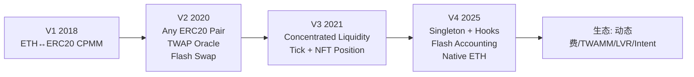
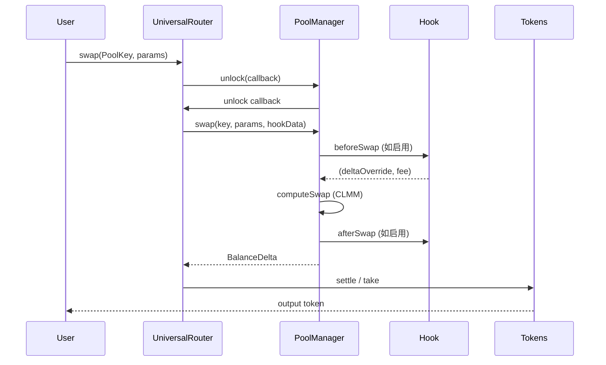

# Uniswap 演进（V1 → V2 → V3 → V4 + Hooks）

> **TL;DR**：Uniswap 是以恒定乘积做市商（Constant Product Market Maker, CPMM）为数学内核的链上 DEX 协议，由 Hayden Adams 受 Vitalik 2016 年 Reddit 帖启发、2018 年 11 月上线。**V1** 仅支持 ETH ↔ ERC20 单跳，建立 `x·y=k` 不变式与 LP Token 概念；**V2**（2020-05）引入任意 ERC20 双向池、价格 **累计 TWAP Oracle**、Flash Swap 与工厂-池分离的部署结构；**V3**（2021-05）是 DeFi 史上最重要的范式升级，以 **集中流动性（Concentrated Liquidity）** 和 **tick 网格** 重构 LP 头寸，实现 4000× 资本效率跃升；**V4**（2025-01 主网上线）通过 **Singleton PoolManager + Hooks + Flash Accounting + Native ETH** 让 AMM 成为通用插件框架——任何自定义逻辑（动态费、LVR 保护、Limit Order、TWAMM、LP 税）都可在 Hook 合约中注入。截至 2026-04，Uniswap 累计 swap 量 > 2.6T USD，V3/V4 双版本主导 Ethereum 与 L2 的现货流动性。

---

## 1. 背景与动机

2016 年 Vitalik 在 [On Path Independence](https://vitalik.ca/general/2017/06/22/marketmakers.html) 中总结了 Automated Market Maker 的雏形；Hayden Adams 据此在 Consensys/EF 资助下实现 Uniswap V1，2018-11-02 上线。当时链上交易有三类选择：

1. **链上订单簿**（EtherDelta、IDEX）——Gas 昂贵、撮合延迟、做市商维护成本高；
2. **链下订单簿 + 链上结算**（0x、dYdX v1）——仍需专业 MM，用户体验割裂；
3. **AMM**（Bancor 2017）——早期采用 Bonding Curve + 单资产储备代币（BNT），灵活性不足。

Uniswap 选择最简单的 `x·y=k`：任何用户可无许可创建 ETH/ERC20 池，按几何平均定价。简洁带来三个红利：**任何人都是 MM（被动做市）、任意资产即时获得流动性、抗审查**。从 V1 到 V4，演进主线是 *在保留无许可与不变式哲学的前提下，把资本效率、可扩展性、开发者可编程性推向极限*。

## 2. 核心原理

### 2.1 形式化定义

单个 Uniswap V2 池的状态为 `(x, y)`（两种代币储备量），**不变式 k = x · y**。给定输入 `Δx`（扣费后 `Δx' = Δx · 997/1000`），输出为：

```
Δy = y - k / (x + Δx') = y · Δx' / (x + Δx')
```

V3 将价格空间离散为 **tick**，`tick_i → sqrtPriceX96 = sqrt(1.0001^i) · 2^96`。单个 tick 内，流动性 L 不变，价格变动时 `x = L / sqrtP − L / sqrtP_b`、`y = L · (sqrtP − sqrtP_a)`，等价于在该区间内做 CPMM。一个 position `(i_l, i_u, L)` 相当于 LP 把资金"押注"在价格 `[p_a, p_b]` 区间内。

V4 保持 V3 数学内核，但将所有池集中于一个 **Singleton PoolManager** 合约，并允许 Hook 在 swap/modifyLiquidity 前后注入逻辑。状态转移函数从 `f(x, y, Δx) → (x', y', Δy)` 扩展为 `f(state, delta, hook) → state'`，Hook 可读写额外状态、收取/补贴。

### 2.2 关键数据结构

- **V2 Pair**：`reserve0 / reserve1` uint112 + `blockTimestampLast`，槽位压缩进单个 SSTORE。
- **V3 Pool**：`slot0`（`sqrtPriceX96`, `tick`, `observationIndex`, `feeProtocol`）、`Tick[]`（`liquidityGross`, `liquidityNet`, `feeGrowthOutside0/1`）、`Position[owner,tickLower,tickUpper]`（`liquidity`, `feeGrowthInside`）。
- **V4 PoolManager**：所有池状态键入 `bytes32 poolId = keccak256(PoolKey)`，PoolKey 为 `(currency0, currency1, fee, tickSpacing, hooks)`，支持 native ETH（零地址）。

密码学原语：无需 ZK，仅依赖 `keccak256` 计算 poolId / positionId；签名体系用 EIP-2612 permit 免除 approve。

### 2.3 子机制拆解

#### 2.3.1 定价：CPMM vs CLMM

- CPMM：LP 曲线 `y = k / x`，双曲线形，深度随距离衰减平缓；全价格区间覆盖，资本效率低（大部分资金闲置）。
- CLMM：将曲线切为 tick 网格，每个 tick 内保持 CPMM，但 LP 可选择把流动性集中于热点区间（如 USDC/USDT 的 `[0.999, 1.001]`），对稳定币池资本效率提升 ≥ 4000×。

#### 2.3.2 费率层级

- V2：固定 0.3%，全部归 LP。
- V3：3 档 `0.05% / 0.3% / 1%`（2022 起加 `0.01%` 用于 stable pair），协议费 0–25%。
- V4：Hooks 可实现 **Dynamic Fee**（如根据波动调整），或按 swap direction 收取不同费。

#### 2.3.3 Oracle（V2 TWAP / V3 Observations）

V2 累积 `price0CumulativeLast += (reserve1 / reserve0) · Δt`；读取 `(cumNow − cumT) / (tNow − tT)` 得到过去窗口内的 TWAP。V3 将累积分为 `tickCumulative` 与 `secondsPerLiquidityCumulativeX128`，并在 Pool 合约内维护环形缓冲 `observations[65535]`（`initialize(16)` 时可扩至 16 条，通过 `increaseObservationCardinalityNext` 扩容），支持外部按 `observe(secondsAgos)` 查询。V3 Oracle 是 MEV 抗操纵的业界基准：需连续多块反复推价才能偏移 TWAP。

#### 2.3.4 Flash Swap / Flash Accounting

- V2：`swap(amountOut)` 可以"先取后还"；闭环回调 `uniswapV2Call`，若未还齐则整笔 revert。
- V4：**Flash Accounting** 用瞬态存储（EIP-1153 TSTORE）记账 `BalanceDelta`，调用方最后统一结算，省去每步转账。

#### 2.3.5 Hooks（V4）

Hooks 是一类合约，在池生命周期 10 个切入点可注入：`beforeInitialize, afterInitialize, beforeAddLiquidity, afterAddLiquidity, beforeRemoveLiquidity, afterRemoveLiquidity, beforeSwap, afterSwap, beforeDonate, afterDonate`。Hook 地址的低 14 bit flag 编码了启用的切入点，以便 PoolManager 通过地址位运算直接判断是否 delegate。典型 Hook：动态费、TWAMM、Limit Order、LVR 拍卖、KYC、Volatility Fee、Oracle 改造。

### 2.4 参数与常量

| 参数 | V2 | V3 | V4 |
| --- | --- | --- | --- |
| 费率 | 0.3% 固定 | 0.01/0.05/0.3/1% | Hooks 可变 + 4 级默认 |
| Tick Spacing | N/A | 10/60/200 | PoolKey 自定义 |
| 协议费比例 | 0 (后期 1/6 开关) | 0–25% of LP fee | 0–25% of LP fee |
| LP Token | ERC20 | ERC721 NFT | ERC6909 claim token |
| 价格精度 | uint112 reserve | Q64.96 sqrtPrice | Q64.96 sqrtPrice |

### 2.5 边界条件与失败模式

- **价格超区间（V3）**：LP 的资金全部变为单边币，暂停赚费；若价格永不回归则相当于 100% IL。
- **MEV Sandwich**：Uniswap V2/V3 对公共 mempool 交易缺乏保护；UniswapX（2023）改用 signed order + off-chain filler 规避。
- **Oracle 操纵**：早期 V2 spot 价格被多项目误用（bZx、Harvest），V3 TWAP 与 Chainlink 混合成为标准。
- **Tick 计算溢出**：`|tick| ≤ 887272`（V3 允许最大 `sqrtPrice` 约 1.0001^887272 ≈ 5.6×10^38）。

### 2.6 Mermaid：Uniswap 演进主线



## 3. 架构剖析

### 3.1 分层视图

| 层 | V2 架构 | V3 架构 | V4 架构 |
| --- | --- | --- | --- |
| 工厂层 | `UniswapV2Factory` | `UniswapV3Factory` | 无（PoolManager 自内嵌） |
| 池层 | `UniswapV2Pair` 每池一合约 | `UniswapV3Pool` 每池一合约 | **Singleton `PoolManager`**，多池共存 |
| 头寸层 | LP = ERC20 Pair 代币 | `NonfungiblePositionManager` ERC721 | `ERC6909` claim + `PositionManager` periphery |
| 周边层 | `UniswapV2Router02` | `SwapRouter02`、`Quoter` | `UniversalRouter`、`V4Router` |
| 客户端 | Interface web / SDK | Interface、Subgraph、SDK | Interface、SDK、hooks registry |

### 3.2 核心模块清单

| 模块 | 职责 | 路径 | 依赖 | 可替换性 |
| --- | --- | --- | --- | --- |
| `UniswapV2Factory.sol` | 创建 Pair，记账 | `Uniswap/v2-core:contracts/UniswapV2Factory.sol` | Pair | 低 |
| `UniswapV2Pair.sol` | CPMM、Flash Swap、TWAP 累计 | `v2-core:contracts/UniswapV2Pair.sol` | ERC20 | 低 |
| `UniswapV3Pool.sol` | CLMM、tick 管理、Observations | `v3-core:contracts/UniswapV3Pool.sol` | `TickMath`, `SwapMath` | 低 |
| `NonfungiblePositionManager.sol` | 把 LP 头寸包装为 ERC721 | `v3-periphery:contracts/NonfungiblePositionManager.sol` | Pool | 中 |
| `PoolManager.sol` | V4 Singleton 内核 | `v4-core:src/PoolManager.sol` | Hooks, ERC6909 | 低 |
| `IHooks.sol` | Hook 接口规范 | `v4-core:src/interfaces/IHooks.sol` | - | 高（外部 Hook 自行实现） |
| `UniversalRouter` | 多协议路由 | `Uniswap/universal-router` | V2/V3/V4 Router | 中 |
| `UniswapX Reactor` | Intent 执行 | `Uniswap/UniswapX` | Fillers | 中 |

### 3.3 数据流：一次 V4 swap



关键指标：V4 swap Gas 较 V3 平均节省 **~40%**（无跨合约转账、无 periphery 冗余校验）。

### 3.4 实现多样性 / 参考实现

- **Solidity（官方）**：`v2-core`、`v3-core`、`v4-core`（MIT/BUSL-1.1，V3 BUSL 于 2023-04 转 GPL）。
- **Solana 仿品**：Orca Whirlpools（CLMM，Rust）。
- **Move**：Cetus（Sui）、Thala（Aptos）的 CLMM 实现。
- **L2 部署**：Arbitrum、Optimism、Base、zkSync、Polygon、Blast、Celo、BNB、Avalanche 等 30+ 链均部署。

### 3.5 扩展 / 互操作接口

- **SDK**：`@uniswap/v3-sdk`、`@uniswap/v4-sdk`（TS）；`uniswap-python` 第三方。
- **Subgraph**：The Graph 上 `uniswap-v2-subgraph` / `uniswap-v3` 提供历史 OHLC、LP 事件。
- **Quoter 接口**：`quoteExactInputSingle` 模拟 swap 路径。
- **Permit2**：统一授权签名，被大多数聚合器复用。
- **V4 Hooks Registry**：社区维护的 Hook 索引，便于发现与审计。

## 4. 关键代码 / 实现细节

V3 swap 核心循环（`Uniswap/v3-core` tag `v1.0.0`，`contracts/UniswapV3Pool.sol:596-700`，简化示意）：

```solidity
// while 循环沿 tick 方向推进，直到数量满足或流动性用尽
while (state.amountSpecifiedRemaining != 0 && state.sqrtPriceX96 != sqrtPriceLimitX96) {
    StepComputations memory step;
    step.sqrtPriceStartX96 = state.sqrtPriceX96;
    // 找到下一个已初始化的 tick
    (step.tickNext, step.initialized) = tickBitmap.nextInitializedTickWithinOneWord(
        state.tick, tickSpacing, zeroForOne);
    step.sqrtPriceNextX96 = TickMath.getSqrtRatioAtTick(step.tickNext);
    // 在当前 tick 区间内按 CPMM 推导成交量
    (state.sqrtPriceX96, step.amountIn, step.amountOut, step.feeAmount) = SwapMath.computeSwapStep(
        state.sqrtPriceX96,
        (zeroForOne ? step.sqrtPriceNextX96 < sqrtPriceLimitX96 : step.sqrtPriceNextX96 > sqrtPriceLimitX96)
            ? sqrtPriceLimitX96 : step.sqrtPriceNextX96,
        state.liquidity,
        state.amountSpecifiedRemaining,
        fee
    );
    // 跨 tick 时更新流动性 net
    if (state.sqrtPriceX96 == step.sqrtPriceNextX96 && step.initialized) {
        int128 liquidityNet = ticks.cross(step.tickNext, ...);
        state.liquidity = LiquidityMath.addDelta(state.liquidity, zeroForOne ? -liquidityNet : liquidityNet);
    }
}
```

V4 Hooks 接口（`Uniswap/v4-core`，`src/interfaces/IHooks.sol`）：

```solidity
interface IHooks {
    function beforeSwap(address sender, PoolKey calldata key, IPoolManager.SwapParams calldata params, bytes calldata hookData)
        external returns (bytes4, BeforeSwapDelta, uint24);
    function afterSwap(address sender, PoolKey calldata key, IPoolManager.SwapParams calldata params, BalanceDelta delta, bytes calldata hookData)
        external returns (bytes4, int128);
    // ... 8 个其他 hook
}
```

## 5. 演进与版本对比

| 版本 | 发布 | 核心改动 | 影响 |
| --- | --- | --- | --- |
| V1 | 2018-11 | ETH↔ERC20 CPMM | 证明 AMM 可用 |
| V2 | 2020-05 | 任意 ERC20 对、TWAP、Flash Swap | 主导 DeFi Summer |
| V3 | 2021-05 | Concentrated Liquidity + NFT 头寸 | 资本效率 ×4000，BUSL 许可 |
| V4 | 2025-01 | Singleton、Hooks、Flash Accounting、Native ETH | AMM 变插件框架 |
| UniswapX | 2023-07 | Intent + Dutch Auction + Filler | MEV 保护，跨链 |

## 6. 实战示例

使用 Foundry 部署 V4 Pool + 无 Hook swap（简化）：

```solidity
// forge script DeployPool.s.sol
PoolKey memory key = PoolKey({
    currency0: Currency.wrap(address(0)), // native ETH
    currency1: Currency.wrap(USDC),
    fee: 3000,
    tickSpacing: 60,
    hooks: IHooks(address(0))
});
poolManager.initialize(key, SQRT_RATIO_1_1, "");

// swap
IPoolManager.SwapParams memory params = IPoolManager.SwapParams({
    zeroForOne: true,
    amountSpecified: -1 ether,
    sqrtPriceLimitX96: MIN_SQRT_RATIO + 1
});
poolManager.unlock(abi.encode(key, params));
```

预期：`Initialize` event + `Swap` event + native ETH 转出、USDC 转入。

## 7. 安全与已知攻击

- **Uniswap V1 ERC777 重入**（2020-04，imBTC）：Lendf.Me 因 ERC777 hook + Uniswap V1 池被抽走 2500 万。此后官方弃用 V1。
- **V2 spot 价被滥用**：bZx、Harvest、Cheese Bank 等因直接读 `getReserves` 当前价格被套利。官方明确 Oracle 必须用 TWAP。
- **V3 JIT 流动性**：做市商在 swap 前后单块内提供/移除流动性抢夺手续费，被视为 MEV 一类；社区通过 Hook 的 LVR auction 缓解。
- **前端钓鱼**：2022-07 Interface Front-end DNS 攻击（事实未造成广泛损失）；提醒合约地址核验。
- **Hooks 风险（V4）**：恶意 Hook 可重入 PoolManager、前置后置 swap 抢夺资金，因此 V4 周边 Router 仅允许已审计 Hook。

## 8. 与同类方案对比

| 维度 | Uniswap V4 | Curve V2 | Balancer V3 | PancakeSwap V3 |
| --- | --- | --- | --- | --- |
| 核心数学 | CLMM | Cryptoswap (动态 peg) | Weighted + Boosted | CLMM |
| 扩展性 | Hooks 插件 | Pool Factory | Hooks + 定制池 | 分叉自 Uni V3 |
| 流动性效率 | ★★★★★（CLMM） | ★★★★（相关资产最优） | ★★★（多资产池） | ★★★★★ |
| 费率 | 动态 | 动态 | 动态 | 0.01/0.05/0.25/1% |
| 适用场景 | 通用 + 可编程 | 稳定币/相关资产 | 多资产 Index | 通用（BSC 生态） |

## 9. 延伸阅读

- [Uniswap V1 Whitepaper (Hayden Adams)](https://hackmd.io/@HaydenAdams/HJ9jLsfTz)
- [Uniswap V2 Whitepaper](https://uniswap.org/whitepaper.pdf)
- [Uniswap V3 Whitepaper](https://uniswap.org/whitepaper-v3.pdf)
- [Uniswap V4 Whitepaper](https://github.com/Uniswap/v4-core/blob/main/docs/whitepaper/whitepaper-v4.pdf)
- [Dan Robinson: Uniswap V3 Math](https://twitter.com/danrobinson/)
- Paradigm: *Uniswap V3 TWAP*、*LVR* 系列论文
- B 站：learnblockchain.cn Uniswap 系列

## 10. 术语表

| 术语 | 英文 | 释义 |
| --- | --- | --- |
| 恒定乘积做市 | CPMM | `x·y=k` 的 AMM 数学 |
| 集中流动性 | Concentrated Liquidity | LP 在指定价格区间供流 |
| Tick | Tick | V3 的离散价格刻度 `1.0001^i` |
| 无常损失 | Impermanent Loss | LP 相对持币的价值差 |
| Flash Swap | Flash Swap | 闭环借贷 + 偿还的原子调用 |
| Hook | Hook | V4 可插拔外部合约逻辑 |
| Singleton | Singleton | V4 所有池统一在单合约中 |
| Flash Accounting | Flash Accounting | V4 用瞬态存储累积 delta 后结算 |

---

*Last verified: 2026-04-22*
