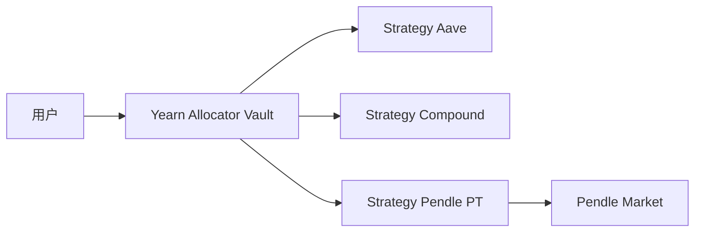

# Yield 协议：Yearn V3 与 Pendle

> **TL;DR**：Yield 协议把"存款赚被动收益"抽象成产品化的 Vault。Yearn V3 基于 ERC-4626 标准把 Vault 解耦为 **Allocator Vault + Strategies**，允许多策略并行、独立上架、异步上下限管理，形成"策略市场"。Pendle 则把生息资产（如 stETH、sUSDe、GLP）的本金与收益分离成 **PT (Principal Token)** 与 **YT (Yield Token)**，用 AMM 交易 PT 以锁定固定利率，或 leverage YT 做定向波动率/收益率投机。两者共同构成 DeFi 的收益基础设施：Yearn 聚合、Pendle 分离。

## 1. 背景与动机

2020 年 Yearn V1 解决了"用户不想手动追逐 APY"的需求：yCRV、yUSD、yETH 等 Vault 把存款自动移动到 Curve / Compound / Aave 中收益最高处；Yearn V2（2021）提出 **Strategy** 抽象并引入自动复投与管理费。V3（2024）是一次 fully modular 的重写：用 ERC-4626 作为标准接口；引入 **Allocator Vault**（分配器）与 **Tokenized Strategy**（策略本身就是 ERC-4626），并支持任何人无权限上架策略。

Pendle（2021 启动，2023 出圈）解决的是另一个问题：**生息资产的利率风险**。一个 wstETH 今天 3% APR，明天可能变 2%。若你想"锁定 3%"或"做多未来利率"，传统 DeFi 无工具。Pendle 通过"固定收益化"（fixed income-ify）把 wstETH 拆成 1 PT + 1 YT：

- PT = 到期 1:1 兑 1 wstETH 的本金凭证（类似零息债券）。
- YT = 到期前累计所有基础收益的权益（类似 FRN 浮动腿）。

PT 市场定价决定**隐含 APY**，YT 定价是基础利差的贴现。Pendle 的 AMM 专门为 PT 曲线设计（Time-dependent concentrated liquidity），在到期前自动"收敛到 1"。

## 2. 核心原理

### 2.1 ERC-4626 与 Yearn V3 Vault

**ERC-4626**（Tokenized Vault Standard）定义统一接口：

```
deposit(uint assets, address receiver) → shares
withdraw(uint assets, address receiver, address owner) → shares
convertToShares(assets) / convertToAssets(shares)
totalAssets()
```

Yearn V3 的 Vault 有两种：
1. **Tokenized Strategy（基类 `TokenizedStrategy`）**：一个 4626 Vault + 一段策略逻辑（`_deployFunds`, `_freeFunds`, `_harvestAndReport`）。
2. **Allocator Vault (Meta Vault)**：也是 4626，但 `totalAssets` 是各底层 Strategy shares 的总和；通过 `Debt Allocator` 在 Strategy 之间分配资金。

核心不变式：`pricePerShare = totalAssets / totalSupply`。每次 harvest 时：

```
profit = currentAssets - lastTotalDebt
if profit>0:
  pendingProfit += profit            // 以线性释放防止"夹汉堡"攻击
  profit_unlock_time = now + DELAY
else:
  totalDebt -= |loss|
```

Yearn V3 强制 `profit_unlocking`：新利润不立即计入 `totalAssets`，而是按时间线性解锁（默认 7 天），以避免三明治攻击（sandwich by entering before harvest）。

### 2.2 Pendle 的 SY / PT / YT 三件套

- **SY (Standardized Yield, ERC-5115)**：把任何生息资产统一包装成 ERC-5115 接口（`deposit(inputToken, amount)`、`redeem`、`exchangeRate`）。
- **PT (Principal Token)**：ERC-20，代表到期 1:1 赎回 `SY`。
- **YT (Yield Token)**：ERC-20，代表持有期间基础资产的累计收益。

拆分关系：`1 SY = 1 PT + 1 YT`（到期前），到期后 YT 失效，PT = 1 SY。

隐含固定利率：若 PT 当前价格为 `p_PT`（以 asset 本位），距离到期 `T`，则固定 APY：

```
fixedAPY = (1/p_PT)^(1/T) - 1
```

### 2.3 Pendle AMM v3

Pendle 为 PT/SY 交易对设计专用 AMM，基于 Notional Finance 的曲线思想并改进为 **Time-Weighted Concentrated Liquidity**：

```
effective_k = (baseInterestRate, scalarRoot, T_remaining)
```

AMM 让价格函数随时间衰减，使 PT 价格自然趋近 1（到期时 PT = SY）。LP 提供 SY + PT 对，承担**IV/利率风险**但不承担价格风险（PT 的不变锚）。

### 2.4 子机制拆解

1. **Yearn V3 Debt Allocator**：自动根据策略的实际 APY 重新分配 allocator vault 资金，目标最大化综合 APY；可治理调整"最大 debt ratio"。
2. **Tokenized Strategy 安全**：每个策略都必须实现 `report()`，并且由单独的 `keeper` 触发。Yearn 推出 `ySecurity` 审计流程。
3. **Pendle 激励流**：Pendle 鼓励项目方"贿赂"（bribe）vePENDLE 投票者，把 PENDLE 排放导向自己的池子，形成 "vePENDLE war"（类似 Curve war）。
4. **Pendle Boost & vePENDLE**：锁仓 PENDLE 获得 vePENDLE，用于 boost YT/LP 奖励与治理。
5. **Rollover / Auto-compound**：到期时 PT→SY，Pendle 可自动再投入下一个到期池。
6. **Points Farming**：2024 起大量 points projects（EtherFi, Ethena, Kelp）通过 Pendle YT 给用户"带杠杆的积分"——买 YT 等于放大未来积分收益。

### 2.5 关键参数

| 协议 | 参数 | 值 |
| --- | --- | --- |
| Yearn V3 | profit unlock delay | 默认 7 天 |
| Yearn V3 | performance fee | 10–20% |
| Yearn V3 | management fee | 0–2% |
| Yearn V3 | max debt per strategy | 治理设置 |
| Pendle | scalarRoot | 取决于市场（10–200） |
| Pendle | swap fee | 0.1–0.3% |
| Pendle | 最大期限 | 2 年 |
| Pendle | vePENDLE max lock | 2 年 |

### 2.6 边界条件

- **Strategy loss**：Yearn V3 允许 strategy 报告亏损，allocator 会扣减 debt；若亏损超过 max loss 会 revert。
- **Pendle 到期 spike**：到期前 PT/YT 交易深度下降，做市商需要监控。
- **SY 代币被黑**：如果 Pendle 集成的 stETH/cUSDC 被攻击，SY、PT、YT 都会按比例受损。

### 2.7 图示



```
SY (wstETH)
  | split
  v
 PT(到期前 <1) + YT(收益流)
     |                |
  Pendle AMM       Pendle YT 市场
```

## 3. 架构剖析

### 3.1 Yearn V3 分层

1. **Vault Contract** (`yearn-vaults-v3/contracts/VaultV3.vy`，Vyper)：账本、roles、accountant。
2. **Tokenized Strategy** (`tokenized-strategy/src/TokenizedStrategy.sol`)：通用 4626 基类。
3. **Specific Strategy**：继承 `BaseStrategy`，实现 `_deployFunds / _freeFunds / _harvestAndReport`。
4. **Accountant**：记录 performance/management fee，铸造 shares 给 treasury。
5. **Debt Allocator** + **Keepers**：周期性 `process_report`, `update_debt`.
6. **Governance**：roles: `ROLE_MANAGER`, `QUEUE_MANAGER`, `DEBT_MANAGER` 等；不同 role 有明确权限边界。

### 3.2 Pendle V2 分层

1. **SY Tokens**：每个底层资产一套 SY 合约（`PendleSyStETH`, `PendleSyGLP`, ...）。
2. **Market** (`pendle-core-v2/contracts/core/Market/MarketMathCore.sol`)：AMM 本体。
3. **YT/PT**：`PendleYieldToken.sol`, `PendlePrincipalToken.sol`。
4. **Router**：用户入口，zap-in/out。
5. **vePENDLE & Gauge**：投票权 + 激励分配。
6. **Chainlog**：链上参数中心。

### 3.3 模块表

| 模块 | 协议 | 路径 | 职责 |
| --- | --- | --- | --- |
| VaultV3 | Yearn | `vault-v3/VaultV3.vy` | 多策略账本 |
| TokenizedStrategy | Yearn | `tokenized-strategy/TokenizedStrategy.sol` | 策略基类 |
| DebtAllocator | Yearn | `debt-allocator/DebtAllocator.sol` | 资金分配 |
| Accountant | Yearn | `accountants/HealthCheckAccountant.sol` | 费用与健康检查 |
| Market | Pendle | `core-v2/core/Market/PendleMarket.sol` | AMM 撮合 |
| MarketMathCore | Pendle | `core-v2/core/Market/MarketMathCore.sol` | 数学核心 |
| Router | Pendle | `core-v2/router/PendleRouter.sol` | 复合入口 |
| YT/PT | Pendle | `core-v2/core/YieldContracts/*.sol` | 本金/收益代币 |
| vePENDLE | Pendle | `core-v2/LiquidityMining/VotingController.sol` | 治理 + Boost |

### 3.4 数据流

- **Yearn deposit**：用户 `vault.deposit(amount)` → allocator 按 targetRatio 分发到多个 Strategy → Strategy `_deployFunds` 把资金放入底层协议（如 Aave）→ `report()` 结算盈亏。
- **Pendle 拆分**：用户 `SY.deposit(wstETH)` → 得 SY → `YT.mintPY(SY)` → 得到 PT+YT → 在 Pendle Market 卖 PT（锁利率）或买更多 YT（做多 APY）。

### 3.5 客户端

- **Yearn**：Vyper + Solidity；YFI 治理；前端 yearn.fi + Bluepill。
- **Pendle**：Solidity；前端 pendle.finance；Python/TS SDK；LayerZero OFT 跨链。

## 4. 关键代码 / 实现细节

### 4.1 Yearn V3 VaultV3 convert（Vyper，commit v3.0.2）

```python
# yearn-vaults-v3/contracts/VaultV3.vy:312 (节选)
@view
@internal
def _convert_to_shares(assets: uint256, rounding: Rounding) -> uint256:
    total_supply: uint256 = self._total_supply()
    total_assets: uint256 = self._total_assets()
    if total_supply == 0:
        return assets
    numerator: uint256 = assets * total_supply
    shares: uint256 = numerator / total_assets
    if rounding == Rounding.ROUND_UP and numerator % total_assets != 0:
        shares += 1
    return shares
```

### 4.2 Pendle AMM 定价（MarketMathCore.sol）

```solidity
// pendle-core-v2/contracts/core/Market/MarketMathCore.sol:156 (节选)
function _calcTrade(
    MarketState memory market,
    int256 netPtToAccount         // 正=购买PT, 负=卖出PT
) internal pure returns (int256 netSyToAccount, int256 netSyFee) {
    int256 preFeeAmt;
    int256 rateScalar = _getRateScalar(market);
    int256 rateAnchor = _getRateAnchor(market.totalPt, market.lnImpliedRate, market.totalAsset,
                                       rateScalar, market.timeToExpiry);
    int256 p = _getExchangeRate(market.totalPt, market.totalAsset, rateScalar, rateAnchor,
                                netPtToAccount);
    preFeeAmt = netPtToAccount.divDown(p).neg();      // 兑换出的 SY
    int256 fee = _getFee(market, preFeeAmt);
    netSyToAccount = preFeeAmt - fee;
    netSyFee = fee;
}
```

> `rateAnchor` 随时间衰减把汇率向 1 收敛；`_getFee` 包含 scalar-fee + 锚定部分。

## 5. 演进与版本对比

| 版本 | 时间 | 变化 |
| --- | --- | --- |
| Yearn V1 | 2020-07 | iEarn 自动迁移 |
| Yearn V2 | 2021-02 | Strategy 抽象 |
| Yearn V3 | 2024-04 | ERC-4626、无权限策略、profit unlock |
| Pendle V1 | 2021-06 | AMM 曲线雏形 |
| Pendle V2 | 2023-04 | 新 AMM、vePENDLE、SY 标准 |
| Pendle Boros | 2024 | 点数 (points) 市场与 LRT 热潮 |
| Pendle Zircuit / cross-chain | 2024—2025 | LayerZero OFT，多链 PT/YT |

## 6. 实战示例

### 6.1 Yearn V3 存入 yvUSDC

```bash
# 使用 yearn-sdk-js
npm i @yfi/sdk ethers
```

```ts
import { Yearn } from '@yfi/sdk';
const y = new Yearn(1, provider);
const vaults = await y.vaults.get(["0xBe53A1...yvUSDC"]);
const tx = await y.vaults.deposit(vaults[0].address, "1000000000", signer.address, signer);
console.log("tx", tx.hash);
```

### 6.2 Pendle 固定利率

```ts
import { Router, Sdk } from '@pendle/sdk-v2';
const sdk = new Sdk({ provider, signer });
const market = await sdk.api.market("ETH_LRT_ETHERFI_26SEP2026");
// 用 1 eETH 买 PT，锁定固定 APY
const tx = await sdk.router.swapExactTokenForPt({
    market: market.address,
    tokenIn: eETH, amountIn: parseUnits("1", 18),
    slippage: 0.005,
});
await tx.wait();
```

预期：收到若干 PT-eETH（> 1，因为 PT < 1 eETH 折价），到期可 1:1 赎回。

## 7. 安全与已知攻击

- **Yearn V1 DAI Vault 2021-02 黑客**：闪电贷操纵 Curve 3pool 价格攻击 yvDAI，损失 ~$11M；Yearn 赔付并催生 V2 更严格 strategy 验收。
- **Yearn V3 策略隔离**：某策略亏损不会传染其它策略（独立 4626 Vault），但 Allocator vault 仍会同比例受损。
- **Pendle V1 审计发现**：2022 初由 Trail of Bits 发现 AMM 精度溢出，修复前未被利用。
- **vePENDLE bribery**：部分项目曾通过短期大额贿选吸 TVL，但在 epoch 结束后立刻提走，LP 受损；协议要求 bribe 分多 epoch 发放。
- **积分集成风险 (2024 LRT 热)**：Pendle YT 市场上有些 SY 对应资产（Ethena sUSDe、Ether.fi weETH）在出事时 PT 会折价，用户需理解基础风险。
- **跨链桥**：Pendle 采用 LayerZero OFT，若 LZ 被黑 PT/YT 会受影响。

## 8. 与同类方案对比

| 维度 | Yearn V3 | Pendle | Beefy | Sommelier | Element Finance |
| --- | --- | --- | --- | --- | --- |
| 核心抽象 | 聚合器 Vault + Strategy | PT/YT 分离 | 多链 Farm Vault | Sommelier SDK Strategies | Principal/Yield 分离（已停） |
| 关键卖点 | 去中心化策略市场 | 固定利率 + 收益投机 | 多链广度 | 链下 ML 策略 | Pendle 先驱 |
| 收益来源 | 底层协议 APY | 市场定价的利率差 | 底层协议 APY | 多策略 | 国债曲线 |
| 代币 | YFI | PENDLE / vePENDLE | BIFI | SOMM | 无 |
| 风险 | Strategy 选型风险 | 资产集中、到期流动性 | 多链桥风险 | 策略黑盒 | 流动性枯竭 |

## 9. 延伸阅读

- Yearn V3 Docs：https://docs.yearn.fi/
- Yearn V3 仓库：https://github.com/yearn/yearn-vaults-v3
- ERC-4626：https://eips.ethereum.org/EIPS/eip-4626
- Pendle Docs：https://docs.pendle.finance/
- Pendle V2 Paper：https://github.com/pendle-finance/pendle-core-v2/blob/main/docs/paper.pdf
- Notional Finance AMM 论文（Pendle AMM 灵感）
- Delphi Research《Pendle: Yield Becomes Tradable》
- 学习资源：learnblockchain.cn《Pendle 源码剖析》

## 10. 术语表

| 术语 | 英文 | 释义 |
| --- | --- | --- |
| Vault | Vault | 存款金库 |
| ERC-4626 | Tokenized Vault Standard | 通用 Vault 接口 |
| Strategy | Strategy | Yearn 策略模块 |
| Profit Unlock | Profit Unlock | 利润线性解锁 |
| SY | Standardized Yield (ERC-5115) | Pendle 生息资产包装 |
| PT | Principal Token | 到期 1:1 本金凭证 |
| YT | Yield Token | 到期前累计收益凭证 |
| vePENDLE | Vote-Escrowed PENDLE | Pendle 投票托管代币 |
| Bribery | Bribery | 对投票者的贿选 |
| DOV | DeFi Option Vault | 自动期权卖出金库 |

---

*Last verified: 2026-04-22*
