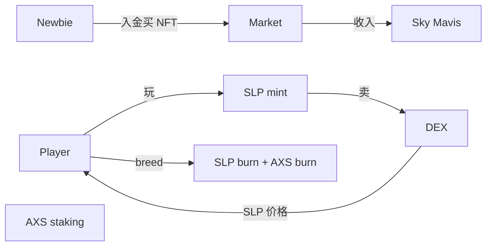

# 链游与元宇宙（GameFi & Metaverse）

> **TL;DR**：链游/元宇宙承诺把游戏资产产权还给玩家、用 token 驱动经济、建构开放互通的虚拟世界。2020-2022 经历 Axie Infinity "Play-to-Earn"、StepN "Move-to-Earn" 高峰到崩盘的完整周期，印证**内置死亡螺旋的 token 经济**难以为继。2023 后主流转向 "Play-and-Earn / Play-to-Own"：以游戏质量为先，token 作点缀；资产跨游戏互通仍未规模化；Metaverse 层面 Otherside（Yuga）、Sandbox、Decentraland TVL 大幅萎缩。本篇深度拆解链游的三层架构（资产 / 经济 / 可玩性）、token + NFT 的结合方式、2026 新一轮 Fully On-chain Game（MUD、Dojo on Starknet、Pirate Nation）的架构设计。

## 1. 背景与动机

传统游戏痛点：

- 资产锁在平台，停服归零。
- 玩家劳动（游戏内工作）收益归厂商。
- 账号被封无申诉。

链游试图解决：把道具/角色上链 → 可转卖 → 玩家拥有资产。

但早期链游（2021-2022）出现一个普遍症候：**游戏本身不好玩，靠 token 激励维持用户**。当新用户流入停止，token 价格崩溃 → 收益跌破成本 → 玩家流出 → 进一步跌价。这是"庞氏激励"的本质。

## 2. 核心原理

### 2.1 形式化：GameFi 经济的"收益-流入-流出"等式

令游戏代币总供应为 $S$，每日 mint 率 $m$（用来奖励玩家）、burn 率 $b$（消耗：抽卡、修复、进化）。

稳态条件：$b \ge m$，否则供应通胀 → 价格下跌。

现金流等式：

$$
\text{TokenPrice} \propto \frac{\text{新用户入金}}{ \text{老用户出金}} \cdot f(\text{gameplay value})
$$

Axie Infinity 2021 峰值 $AXS \approx \$164$，主要来自新用户买 NFT 入场；当 2022 新用户停止，$SLP 日 mint > burn 数十倍，token 一年跌 95%+。

### 2.2 三层架构：资产 / 经济 / 可玩性

```
┌─────────────────────────────────┐
│ Gameplay (客户端引擎)            │← Unity/Unreal/Web
├─────────────────────────────────┤
│ Economy (Token, NFT, Market)     │
├─────────────────────────────────┤
│ Asset (NFT: 角色、道具、土地)      │
├─────────────────────────────────┤
│ Chain (L1 / L2 / AppChain)       │
└─────────────────────────────────┘
```

### 2.3 子机制一：双/三 Token 设计

Axie Infinity 典型：
- **AXS**：治理 + staking 奖励（资本型）。
- **SLP**：游戏内产出、消耗（效用型）。
- **RON**：Ronin 侧链 gas。

三 token 目的：稀释通胀压力，让"日常打金"只砸 SLP 价格，不立即影响治理币。但当 SLP 持续通胀且 AXS 与 SLP 经济挂钩，用户仍先卖 AXS 避险。

### 2.4 子机制二：NFT 角色 / 土地

典型 Axie NFT：

```
Axie {
  id: uint256,
  genes: bytes32,     // 编码外观、属性
  bodyParts: 6 slots, // 部位
  experience, level,
  breedCount: u8,     // 繁殖次数 0-7
}
```

繁殖需消耗 SLP + AXS：AXS 是代际 burn（1 对父母生 1 只 → 消耗）。

Sandbox LAND：
- 166,464 块（2020 确定总供应）。
- 每块 96×96 voxel。
- LAND 拥有者决定该格内容（Experience 编辑器）。

### 2.5 子机制三：Scholarship / Guild 模式

YGG（Yield Guild Games）2021 模式：
- 公会购买昂贵 NFT（Axie starter team ~$1500 peak）。
- 出借给菲律宾/印尼玩家 "Scholar" 免费玩。
- 收入按 70/30 或 60/40 分成。

结果：2022 崩盘后大量 scholar 失业，TVL 缩水 > 90%。

### 2.6 子机制四：Fully On-chain Game（FOCG, 2023-）

反潮流：游戏逻辑 100% 上链（而非仅资产）。代表：

- **OPCraft（2022）**：Voxel 游戏，Lattice 出品，用 MUD 框架。
- **Primodium**（2024）：Starknet 上 4X 策略。
- **Pirate Nation**（Proof of Play）：L3（Arbitrum Orbit）MMORPG。
- **Dojo (Starknet)**：类 MUD 的 Cairo ECS 框架。

关键模式：ECS（Entity-Component-System）被映射到合约存储，client 订阅事件重建状态；任何人可基于同一状态写新 client/mod。

### 2.7 关键参数

| 项目 | 峰值月活 | 峰值 token 市值 | 2026 月活 |
| --- | --- | --- | --- |
| Axie Infinity | ~2.8M (2021-08) | $AXS $9.6B | ~200k |
| StepN | ~1M (2022-05) | $GMT $2B | ~100k |
| Illuvium | ~100k beta | $ILV $700M | 小规模 |
| Pixels (Ronin) | ~1.5M (2024) | $PIXEL $400M | ~300k |
| Decentraland | ~50k DAU | $MANA $6B | ~5-10k |
| Sandbox | ~40k DAU | $SAND $8B | ~8k |
| Otherside (Yuga) | — | 1 land floor ETH 落到 ~1.8 | — |

### 2.8 边界条件与失败模式

- **入金链断裂**：新用户停 → 代币通缩 → 旧用户出走。
- **机器人农场**：脚本 24/7 刷 SLP，压低价格。
- **桥攻击**：Axie Ronin Bridge 2022-04 被黑 $625M。
- **预言机 NFT price**：NFT 借贷依赖底价预言机，可被操纵。
- **版号 / 监管**：中国大陆、韩国、日本对 P2E 态度差异大。

### 2.9 图示：Axie 经济循环



## 3. 架构剖析

### 3.1 分层视图：Ronin + Axie 栈

```
┌───────────────────────────────────┐
│ Axie Client (Unity)               │
├───────────────────────────────────┤
│ REST API + Websocket              │
├───────────────────────────────────┤
│ Sky Mavis Game Server (链下)        │
├───────────────────────────────────┤
│ Ronin Bridge (L1 Ethereum ↔ Ronin)│
├───────────────────────────────────┤
│ Ronin Chain (EVM, PoSA)           │
│   ├ Axie ERC-721                  │
│   ├ SLP ERC-20                    │
│   └ AXS ERC-20                    │
└───────────────────────────────────┘
```

### 3.2 核心模块清单

| 模块 | 职责 | 典型 |
| --- | --- | --- |
| 客户端 | UI、实时对战 | Unity / Unreal |
| 游戏服务器 | 状态权威（战斗结算、反作弊） | 链下 |
| Bridge | 主网资产跨到游戏链 | Ronin / LayerZero |
| 游戏链 | 高 TPS、便宜 | Ronin / Immutable X / Beam |
| NFT 合约 | 资产 | ERC-721A / ERC-1155 |
| Token 合约 | 治理/效用 | ERC-20 + staking |
| Marketplace | 玩家二级交易 | 内置 + Mavis / OpenSea |
| Oracle | NFT 底价、random | Chainlink VRF |
| Bot Detection | 反女巫 | 链下 ML |

### 3.3 生命周期：一局 Axie 对战

1. 玩家 Unity client 登录（Sky Mavis 账户 + Ronin 钱包签名）。
2. Matchmaking → 服务器撮合。
3. 对战在链下进行（实时需要，不可上链）。
4. 游戏服务器签名结算 → 提交 tx 到 Ronin，SLP 铸给胜方。
5. 玩家可把 SLP/AXS bridge 到 Ethereum 卖出。

### 3.4 FOCG 的架构差异（Pirate Nation）

1. 玩家每个动作（移动、攻击、制作）都是一笔 tx。
2. L3 为玩家预付 gas（gas sponsored via Paymaster）。
3. 状态完全在合约 → 任何 indexer 都可读取。
4. Mod 社区直接写新合约调用核心。

### 3.5 主要玩家对比（2026）

| 项目 | 引擎 | 链 | 特征 |
| --- | --- | --- | --- |
| Axie Infinity | Unity | Ronin | 卡牌对战 |
| StepN | Unity | Solana | Move-to-Earn |
| Illuvium | Unreal 5 | Immutable X | AAA 尝试 |
| Pixels | Web | Ronin | Farm MMO |
| Parallel TCG | Unity | Ethereum L2 | 卡牌 |
| Pirate Nation | Web/Unity | Arbitrum L3 | FOCG |
| Decentraland | Web | Polygon+Ethereum | 社交 metaverse |
| Sandbox | Voxel | Polygon+Ethereum | 元宇宙 |
| Otherside | Unreal | ApeChain(L3) | Yuga 元宇宙 |

### 3.6 互操作接口

- **NFT Portal**：资产跨不同游戏（理论上，实际极少）。
- **Skill / Achievement SBT**：一个游戏的成就被另一个识别。
- **Metaverse 互通**：OMA3 协议（Sandbox/Decentraland 等签署）尚在讨论。

## 4. 关键代码：简化的 MUD-like ECS on Starknet（Dojo）

```cairo
// dojo-ecs/src/models.cairo (示意，基于 Dojo 框架)
#[derive(Model, Copy, Drop, Serde)]
struct Position {
    #[key]
    entity_id: u256,
    x: u32,
    y: u32,
}

#[derive(Model, Copy, Drop, Serde)]
struct Health {
    #[key]
    entity_id: u256,
    hp: u32,
}

#[system]
mod move_system {
    fn execute(ctx: Context, entity_id: u256, dx: u32, dy: u32) {
        let mut pos = get!(ctx.world, entity_id, Position);
        pos.x += dx;
        pos.y += dy;
        set!(ctx.world, (pos));
    }
}
```

Dojo 自动生成 indexer（Torii）， client 通过 GraphQL 订阅 state 变化。

## 5. 演进与版本对比

| 时期 | 主流模式 | 代表 | 结果 |
| --- | --- | --- | --- |
| 2018-2019 | 加密猫 / 养成 | CryptoKitties | 拥堵 Ethereum |
| 2020-2022 | Play-to-Earn | Axie / StepN | 崩盘 |
| 2022-2023 | Play-to-Own / AAA | Illuvium / Big Time | 缓慢开发 |
| 2023-2024 | Fully On-Chain Game | Pirate Nation / Primodium | 小众但热 |
| 2024-2026 | AI Agent + Game | Virtuals 等 | 实验中 |

## 6. 实战示例：连 Ronin 读取 Axie NFT

```ts
import { createPublicClient, http } from 'viem';
import { defineChain } from 'viem';

const ronin = defineChain({
  id: 2020,
  name: 'Ronin',
  nativeCurrency: { name: 'RON', symbol: 'RON', decimals: 18 },
  rpcUrls: { default: { http: ['https://api.roninchain.com/rpc'] } },
});

const client = createPublicClient({ chain: ronin, transport: http() });
const AXIE = '0x32950db2a7164aE833121501C797D79E7B79d74C';

const owner = await client.readContract({
  address: AXIE,
  abi: [{ name: 'ownerOf', type: 'function', stateMutability: 'view',
           inputs: [{ name: 'tokenId', type: 'uint256' }],
           outputs: [{ type: 'address' }] }],
  functionName: 'ownerOf',
  args: [1n],
});
console.log('Owner of Axie #1:', owner);
```

## 7. 安全与已知攻击

- **Ronin Bridge Hack (2022-03)**：$625M，Lazarus Group 获得 5/9 validator 签名密钥。Sky Mavis 暂停桥 1 周，后补偿用户。
- **Axie 智能合约无重大 exploit**，但 2022 经济设计导致 SLP 超发。
- **StepN 地图欺诈**：2022 Q2 大量玩家用 GPS spoofing 刷 GST，官方不断封号。
- **NFT Wash Trading**：LooksRare、Blur 上 Axie NFT 洗交易刷 token 奖励。
- **Bot Farm**：菲律宾大量脚本刷 SLP。

## 8. 与同类方案对比

| 维度 | Axie (P2E) | Pirate Nation (FOCG) | Decentraland (Metaverse) | 传统 F2P 游戏 |
| --- | --- | --- | --- | --- |
| 资产归属 | 玩家（NFT） | 玩家（NFT + 状态） | 玩家（LAND） | 厂商 |
| 链上程度 | 中（只资产） | 完全 | 部分 | 无 |
| 游戏质量 | 中等 | 简单 | 低 | 高 |
| 可玩性驱动 | token | 社区 + mod | UGC | 内容 |
| 风险 | 经济崩盘 | 规模小 | 荒芜 | 运营停服 |

## 9. 延伸阅读

- Axie 白皮书、官方 blog 复盘。
- StepN Doc、2022 经济回顾。
- Yuga Labs Otherside roadmap。
- MUD v2 docs (mud.dev)，Dojo book (book.dojoengine.org)。
- Naavik 的 Game3 newsletter（深度分析）。
- 中文：Game3 研究院、EthGames 中文。

## 10. 术语表

| 术语 | 英文 | 释义 |
| --- | --- | --- |
| GameFi | Gaming + Finance | 结合 DeFi 元素的链游 |
| P2E | Play-to-Earn | 边玩边赚 |
| P2O | Play-to-Own | 玩家拥有资产 |
| FOCG | Fully On-Chain Game | 全链上游戏 |
| ECS | Entity-Component-System | 游戏引擎范式 |
| Scholarship | — | 公会借 NFT 给玩家 |
| LAND | — | 元宇宙土地 NFT |

---

*Last verified: 2026-04-22*
