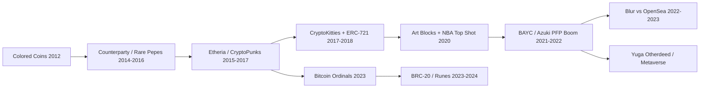

# NFT 发展史：从有色币到 CryptoPunks / CryptoKitties / BAYC，再到 Ordinals / Runes

> **TL;DR**：NFT（Non-Fungible Token，非同质化代币）把「唯一性 + 可证明所有权」上链，从 2012–2013 年 Bitcoin 上的 Colored Coins 与 Counterparty 起步，2017 年 CryptoPunks 与 CryptoKitties 在以太坊上把 ERC-721 标准推向主流，2021 年 BAYC 引发 PFP 狂潮并孕育 Yuga Labs 商业模型，2023 年 Casey Rodarmor 的 Ordinals 协议把 NFT 带回 Bitcoin 原生，随后 Runes 协议在 Bitcoin 减半区块推出同质化资产。本篇梳理 12 年来 NFT 在 **数据承载方式**、**所有权模型**、**市场结构** 三个维度的演进脉络，并对比 EVM/Ordinals/Move 生态下的技术差异。

## 1. 背景与动机

NFT 的概念根源是 **数字稀缺性（digital scarcity）**。在比特币之前，数字文件的无成本复制让「唯一副本」不可能存在。Bitcoin 提供了不可双花的账本，但它的原生资产是同质化的 satoshi。2012 年 Meni Rosenfeld 发表 *Overview of Colored Coins*，提出通过 UTXO 标记让某些 satoshi「有色」以承载外部资产（股票、所有权凭证）。2014 年 Counterparty 在 Bitcoin 上以 OP_RETURN 承载任意数据，催生 Rare Pepes（2016 年），这是 NFT 的早期文化原型。

直到以太坊智能合约的出现，NFT 才找到「天然的表达语言」：2015 年 Etheria（六边形地块地图）是最早的 ERC-NFT 实验；2017 年 6 月 Larva Labs 发布 CryptoPunks（10,000 个像素头像，合约不完全符合后来的 ERC-721）；同年 10 月 Dieter Shirley 提交 ERC-721 标准草案；11 月 Dapper Labs 的 CryptoKitties 上线，一度拥堵整个以太坊网络（gas 价格飙升 6×），成为 NFT 破圈的标志事件。

2020 年 DeFi Summer 之后，NFT 以两条路径扩散：(a) **PFP（Profile Picture）** 作为身份与社群门票，代表作 BAYC、Azuki、Doodles；(b) **生成艺术与加密原住民艺术品**，代表作 Art Blocks、Beeple 的《Everydays》（2021 年 3 月在佳士得以 $69M 成交）。2022 年熊市中 NFT 交易量暴跌 90%+，行业从「投机品」转向「实用性 + 知识产权」探索（Yuga 的 Otherdeed 元宇宙、Reddit Collectible Avatars 进入主流）。

2023 年 1 月，Casey Rodarmor 发布 **Ordinals** 协议，利用 Taproot 升级后的 Witness 空间，把任意文件「铭刻（inscribe）」到单个 satoshi 上，引入 **ordinal theory**（按挖矿顺序给每个 sat 编号）。这让 NFT 在不改变 Bitcoin 协议的前提下回归「最长账本」。随后 BRC-20（2023.03，Domo 发布）虽然技术粗糙却引发铭文热潮，单月费用一度占 Bitcoin 总手续费 60%。2024 年 4 月 Bitcoin 第四次减半区块中 Rodarmor 发布 **Runes**，以 UTXO 原生方式承载同质化资产，技术上更简洁、费用更低。

## 2. 核心原理

### 2.1 形式化定义

非同质化代币可以用一个四元组形式化：

$$
\mathrm{NFT} := (C, id, \mathrm{owner}(id), \mathrm{metadata}(id))
$$

其中 $C$ 是合约地址（或 Bitcoin Ordinals 下的 genesis sat），$id \in \mathbb{N}$ 是 token 标识符，$\mathrm{owner}(id): \mathbb{N} \to \mathrm{Address}$ 是所有权映射，$\mathrm{metadata}(id)$ 指向描述资产内容的数据（链上或链下 URI）。不变式：对任意两个 $id_1 \ne id_2$，其 `tokenURI` 可以重复但 `(C, id)` 元组必须全局唯一。

**同质化（Fungible） vs 非同质化（Non-Fungible）**：在 ERC-20 中，`balanceOf(owner)` 只返回数量；在 ERC-721 中，每个 tokenId 独立持有。ERC-1155 做中间形态：`balanceOf(owner, id)` 同时承载同质与非同质。

### 2.2 数据承载的三种方式

- **链上存储（Fully on-chain）**：SVG/ASCII 数据直接存在合约 storage，例：CryptoPunks（2021 年 Larva 发布 v2 合约把图像放入 storage）、Chain Runners、Nouns。优点是 100% 永续，缺点是每字节 20000 gas（SSTORE）。
- **IPFS / Arweave（去中心化存储）**：BAYC、Art Blocks 用 IPFS；Ethernity、Mirror 用 Arweave。靠内容寻址确保 tokenURI 稳定，但需要 pinning 服务或永久存储费。
- **中心化 URI**：早期许多项目直接指向 AWS S3 或项目 API，若项目方下线则 metadata 丢失，违反去中心化原则。

Ordinals 采取截然不同的思路：内容直接写入 Bitcoin witness 数据，成为区块的一部分，随着整个 Bitcoin 账本永存（前提：节点保留 witness 数据）。缺点是膨胀 UTXO 集与节点存储成本（2024 年争议焦点）。

### 2.3 子机制拆解

1. **所有权模型**：EVM 下 NFT 由合约维护 `_owners` 映射；Solana 下 NFT 是一个 supply=1 的 SPL token + Metaplex metadata PDA；Bitcoin Ordinals 下所有权 = 持有包含该 sat 的 UTXO；Move（Sui/Aptos）下 NFT 是一个带 `key` 能力的对象，直接存在所有者账户。
2. **转移语义**：ERC-721 通过 `transferFrom` 修改映射；Sui Object 通过所有者签名的 Move transaction 转移对象；Ordinals 通过标准 Bitcoin transaction 把 sat 发到新地址（前提：UTXO 不被 RBF 替换拆分）。
3. **Metadata 协议**：ERC-721 要求 `tokenURI(uint256)` 返回 JSON 描述（name/description/image/attributes）；OpenSea metadata standard 扩展 attributes/traits；Ordinals 的 metadata 直接是 inscribed file（image/json/html）。
4. **版税（Royalty）**：ERC-2981 提供 `royaltyInfo(tokenId, salePrice)` 标准，但未强制市场执行。详见 `royalty-and-standards.md`。
5. **铸造曲线**：免费 mint / 白名单折扣 / 荷兰拍（Art Blocks）/ ERC-721A 批量 mint（Azuki 推出，省 gas）。
6. **衍生品**：Fractional（碎片化）、NFTfi（借贷）、NFT Perps（LooksRare 尝试）、索引协议（NFTX）——详见 `nftfi.md`。

### 2.4 关键时间线参数

| 里程碑 | 时间 | 链 / 协议 | 数量 / 规模 |
| --- | --- | --- | --- |
| Colored Coins 论文 | 2012-12 | Bitcoin | 概念原型 |
| Counterparty / Rare Pepes | 2014–2016 | Bitcoin | 千余系列 |
| Etheria | 2015-10 | Ethereum | 457 块 hex tiles |
| CryptoPunks | 2017-06-22 | Ethereum | 10,000 头像 |
| ERC-721 final | 2018-01-24 | Ethereum | 标准 |
| CryptoKitties | 2017-11-28 | Ethereum | 拥堵事件 |
| NBA Top Shot | 2020-10 | Flow | $700M 累计销售 |
| Beeple at Christie's | 2021-03-11 | Ethereum | $69.3M 成交 |
| BAYC mint | 2021-04-30 | Ethereum | 10,000，原价 0.08 ETH |
| OpenSea 月交易峰值 | 2022-01 | 多链 | $5B 月 vol |
| Luna Crash → 熊市 | 2022-05 | — | NFT vol -90% |
| Blur 上线 + BLUR 空投 | 2022-10 / 2023-02 | Ethereum | 夺走 OpenSea > 70% vol |
| Ordinals 首次 inscription | 2023-01-21 | Bitcoin | block 767430 |
| BRC-20 发布 | 2023-03-08 | Bitcoin | 4 月后费用爆炸 |
| Runes 发布 | 2024-04-20 | Bitcoin | 减半区块 840000 |

### 2.5 边界条件与失败模式

- **跨市场版税绕过**：Blur 默认 0.5% 版税、允许 0 版税交易，创作者 Royalty 收入在 2022–2023 年暴跌 80%+。
- **Metadata 失效**：Hashmasks 曾因 Google Cloud 付费问题导致图片短暂 404，暴露中心化 URI 风险。
- **合约 Reentrancy / 假铸造**：Akutar、Pixelmon 等项目因合约逻辑错误锁死 ETH 或铸错图像。
- **Wash Trading**：LooksRare 上线初期的交易挖矿机制导致 > 95% 交易量为自刷。
- **Ordinals 节点压力**：inscription 无 size 限制（除 Bitcoin 4 MB witness 上限），导致 UTXO 集膨胀与 archival node 压力。

### 2.6 演进图



## 3. 架构剖析

### 3.1 分层视图：NFT 技术栈

1. **L0 共识层**：Bitcoin / Ethereum / Solana / Aptos / Sui，负责账本不可变性。
2. **L1 资产层**：ERC-721 / ERC-1155 / SPL-Metaplex / Sui Object / Ordinals。
3. **L2 存储层**：IPFS（Pinata/Filebase/NFT.Storage）、Arweave（Bundlr）、S3、on-chain SSTORE2。
4. **L3 交易层**：Seaport（OpenSea）、Blur Marketplace、Magic Eden Protocol、Tensor。
5. **L4 聚合 / 衍生层**：Reservoir、Gem、NFTfi、Sudoswap、Fractional、NFTX。
6. **L5 应用层**：PFP 社群、游戏、票务、身份（Soulbound）、RWA 凭证。

### 3.2 核心模块清单（EVM 生态）

| 模块 | 职责 | 依赖 | 可替换性 |
| --- | --- | --- | --- |
| ERC-721 合约 | tokenId 所有权管理 | Solidity, OpenZeppelin | 可定制 |
| ERC-721A（Azuki） | 批量 mint 省 gas | OZ fork | 高 |
| ERC-1155 | 多资产类型的合约 | Enjin 提出 | 与 721 并存 |
| ERC-2981 | 版税接口 | — | 标记性 |
| Seaport | 订单撮合协议 | 0x fork + 创新 | 中等 |
| 0x Protocol | 通用订单 | — | 中等 |
| Reservoir SDK | 跨市场聚合 | 多市场 API | 低（事实标准）|
| IPFS Pin | Metadata 永续存储 | libp2p | 可换 Arweave |

### 3.3 数据流 / 生命周期

以「一个 BAYC 从铸造到二次转售」为例：

1. **Mint**：用户调用 BAYC 合约 `mintApe(6)`，付 0.48 ETH，`_mint` 把 tokenId[n..n+5] 的 owner 设为用户。
2. **Metadata 读取**：`tokenURI(1234)` 返回 `ipfs://QmBayc/1234`，IPFS 返回 JSON {image: "ipfs://...", attributes: [{trait: "Fur", value: "Golden Brown"}]}。
3. **交易挂单**：用户在 OpenSea 签署 Seaport 订单（EIP-712 离线签名），包含 zone（授权方）、offer、consideration（含版税和平台费）。
4. **成交**：买家调用 `fulfillOrder`，Seaport 验证签名 + 转移 NFT + 分配 ETH。OpenSea 2.5% 平台费 + Yuga 2.5% 版税分配。
5. **链上索引**：The Graph subgraph 监听 `Transfer` 事件更新所有权索引；Reservoir API 聚合跨平台状态。
6. **显示**：钱包（Rainbow/MetaMask/Phantom）通过 Alchemy/Moralis NFT API 读取并渲染。

### 3.4 客户端多样性 / 参考实现

- **智能合约参考实现**：OpenZeppelin Contracts `ERC721` / `ERC721A`；Solmate `ERC721`；Thirdweb Drop。
- **市场协议**：Seaport（opensea/seaport）、Blur（闭源但可通过合约 ABI 调用）、Tensor（Solana）、Magic Eden。
- **Ordinals 客户端**：ord（Rust，Rodarmor 官方）、Unisat Wallet（Go/TS 扩展）、Xverse、Leather。
- **索引**：Reservoir、OpenSea API、Alchemy NFT API、Simplehash、Tensor API（Solana）、Magic Eden API。

### 3.5 扩展 / 互操作接口

- **ERC-4907**：Rental 接口（可租赁 NFT）。
- **ERC-5192**：Soulbound（不可转移）。
- **ERC-6551**：Token Bound Account（让 NFT 拥有子钱包）。
- **CCIP-Read（ERC-3668）+ ENS**：跨链 NFT 名称解析。
- **Ordinals 递归 inscription**：通过 `/content/<id>` 引用已有 inscription，实现片段复用。

## 4. 关键代码 / 实现细节

OpenZeppelin ERC-721 核心 `_transfer` 逻辑（`openzeppelin-contracts@5.0.0`，`contracts/token/ERC721/ERC721.sol:264`）：

```solidity
// contracts/token/ERC721/ERC721.sol:264 (OZ v5.0.0)
function _transfer(address from, address to, uint256 tokenId) internal {
    if (to == address(0)) revert ERC721InvalidReceiver(address(0));
    address previousOwner = _update(to, tokenId, address(0));
    if (previousOwner == address(0)) revert ERC721NonexistentToken(tokenId);
    else if (previousOwner != from) revert ERC721IncorrectOwner(from, tokenId, previousOwner);
}

// contracts/token/ERC721/ERC721.sol:230
function _update(address to, uint256 tokenId, address auth) internal virtual returns (address) {
    address from = _ownerOf(tokenId);
    if (auth != address(0)) _checkAuthorized(from, auth, tokenId);
    if (from != address(0)) {
        _approve(address(0), tokenId, address(0), false);
        unchecked { _balances[from] -= 1; }
    }
    if (to != address(0)) {
        unchecked { _balances[to] += 1; }
    }
    _owners[tokenId] = to;
    emit Transfer(from, to, tokenId);
    return from;
}
```

Azuki 的 ERC-721A 优化通过「lazy ownership」——铸造时只写头 tokenId，查询时向前扫描，使得批量 mint 的 gas 成本从 O(n) 降为 O(1)，但 `ownerOf` 查询从 O(1) 上升到 O(k)（k = 连续 mint 段长）：

```solidity
// ERC721A v4.2.3, contracts/ERC721A.sol:_ownershipOf (简化)
function _ownershipOf(uint256 tokenId) internal view returns (TokenOwnership memory) {
    uint256 curr = tokenId;
    unchecked {
        if (curr < _currentIndex) {
            TokenOwnership memory ownership = _packedOwnerships[curr];
            while (ownership.addr == address(0)) {
                curr--;
                ownership = _packedOwnerships[curr];
            }
            return ownership;
        }
    }
    revert OwnerQueryForNonexistentToken();
}
```

## 5. 演进与版本对比

| 阶段 | 年份 | 代表项目 | 关键创新 |
| --- | --- | --- | --- |
| 原型期 | 2012–2016 | Colored Coins, Counterparty, Rare Pepes | 利用 Bitcoin 承载有色资产 |
| 标准化 | 2017–2018 | CryptoPunks, CryptoKitties, ERC-721 | 智能合约原生 NFT |
| 扩展期 | 2019–2020 | Gods Unchained, NBA Top Shot, Art Blocks, Async | 游戏化、生成艺术、Flow 链专用 |
| PFP Boom | 2021 | BAYC, Azuki, Doodles, Moonbirds | 社群、IP、空投飞轮 |
| 衍生品 | 2021–2022 | Sudoswap, NFTfi, Fractional | AMM 化、借贷、碎片化 |
| 市场战 | 2022–2023 | Blur, LooksRare, X2Y2 | 交易挖矿 + 版税博弈 |
| Bitcoin 原生复兴 | 2023–2024 | Ordinals, BRC-20, Runes | Witness 承载 + UTXO 原生 |
| 实用化 / 碎片化 | 2024–2026 | ERC-6551 TBA, Ticketing, RWA cert | NFT 作为账户/凭证/RWA 包装 |

## 6. 实战示例

使用 Foundry 部署一个极简 ERC-721 并铸造、转移：

```bash
forge init my-nft && cd my-nft
forge install OpenZeppelin/openzeppelin-contracts
```

```solidity
// src/MyNFT.sol
pragma solidity ^0.8.24;
import "@openzeppelin/contracts/token/ERC721/ERC721.sol";
import "@openzeppelin/contracts/access/Ownable.sol";

contract MyNFT is ERC721, Ownable {
    uint256 public nextId;
    string private _base;
    constructor(string memory base) ERC721("My NFT", "MNFT") Ownable(msg.sender) { _base = base; }
    function _baseURI() internal view override returns (string memory) { return _base; }
    function mint(address to) external onlyOwner { _mint(to, ++nextId); }
}
```

```bash
# 部署到 Anvil
anvil &
forge create src/MyNFT.sol:MyNFT --constructor-args "ipfs://Qm.../" \
  --private-key $PK --rpc-url http://localhost:8545
# 铸造 tokenId=1 给 Alice
cast send $NFT "mint(address)" $ALICE --private-key $PK
# 查询所有者
cast call $NFT "ownerOf(uint256)" 1
```

预期输出：`0x...Alice`（32 字节 padded）。

## 7. 安全与已知攻击

1. **BAYC 社交工程盗窃（2022-04）**：Instagram 被黑客控制发布假 mint 链接，导致 4 个 BAYC + 其它 NFT 被盗，约 $3M。教训：社交账户加强 2FA，不要连接未知 DApp。
2. **OpenSea Bug（2022-01）**：旧挂单未取消，导致 BAYC 被以旧低价挂单成交；根因：用户 transfer 到新钱包但未取消挂单，OpenSea 共享订单簿。
3. **LooksRare Wash Trading**：交易挖矿造成刷量，> 95% 虚假交易，后期项目方调整奖励分配。
4. **Akutar Mint bug（2022-04）**：合约逻辑错误锁定 $34M ETH，无法提取，Akutar 团队公开致歉。
5. **Ordinals Inscription 前后无序问题**：早期 ord 客户端 bug 导致部分 inscription 归属计算错误；Rodarmor 发布 hot-fix。
6. **BRC-20 索引分叉**：BRC-20 完全依赖链下索引器，不同 indexer 解释规则不同时曾出现「同一地址余额不同」的争议。

## 8. 与同类方案对比

| 维度 | ERC-721 / 1155 (EVM) | Metaplex (Solana) | Sui Object | Bitcoin Ordinals | Ton NFT |
| --- | --- | --- | --- | --- | --- |
| 所有权承载 | 合约映射 | PDA + SPL token supply=1 | 对象直接挂账户 | UTXO 中 sat | NFT Item 合约 |
| Metadata 位置 | tokenURI（链下常见）| Metaplex PDA JSON | 对象字段 | inscribed content（链上） | 合约数据 |
| 铸造成本 | 中（~50k gas）| 低 | 低 | 中–高（随文件大小）| 低 |
| 版税执行 | 市场协议 + ERC-2981 | Metaplex enforce（曾强制，后软化）| 协议可实施 | 市场自律 | 市场自律 |
| 碎片化 | Fractional / NFTX | 无主流 | 未流行 | RSIC / Runes 尝试 | — |
| 跨链桥 | Multichain/Wormhole | Wormhole | Wormhole | 难（无原生合约）| TON Bridge |

## 9. 延伸阅读

- **官方标准**：EIP-721、EIP-1155、EIP-2981、EIP-4907、EIP-5192、EIP-6551、EIP-7572 (contract URI)。
- **Ordinals / Runes**：https://docs.ordinals.com/、https://rodarmor.com/blog/
- **核心博客**：a16z 《State of Crypto》NFT 章节、Punk6529 Threads、Messari NFT 季报、The Block NFT Desk。
- **书 / 长文**：Chris Dixon *Read Write Own*（2024）、Jesse Walden 《Into the Ether: NFTs》。
- **数据源**：CryptoSlam、NFTGo、Nansen NFT、Dune（`@hildobby/nft-trades`）。

## 10. 术语表

| 术语 | 英文 | 释义 |
| --- | --- | --- |
| NFT | Non-Fungible Token | 非同质化代币 |
| PFP | Profile Picture NFT | 作为头像使用的 NFT |
| 铸造 | Mint | 初次创建 token |
| 版税 | Royalty | 二级市场销售分成 |
| 白名单 | Allowlist / Whitelist | 预售名单 |
| 地板价 | Floor Price | 市场最低挂单价 |
| Wash Trade | Wash Trading | 自刷交易 |
| 铭文 | Inscription | Ordinals 中写入 sat 的数据 |
| 符文 | Rune | Bitcoin UTXO 原生同质化资产 |
| TBA | Token Bound Account | ERC-6551 NFT 绑定账户 |
| Soulbound | Soulbound Token | 不可转移 NFT |
| 碎片化 | Fractionalization | 将一个 NFT 拆成多个 FT 份额 |

---

*Last verified: 2026-04-22*
