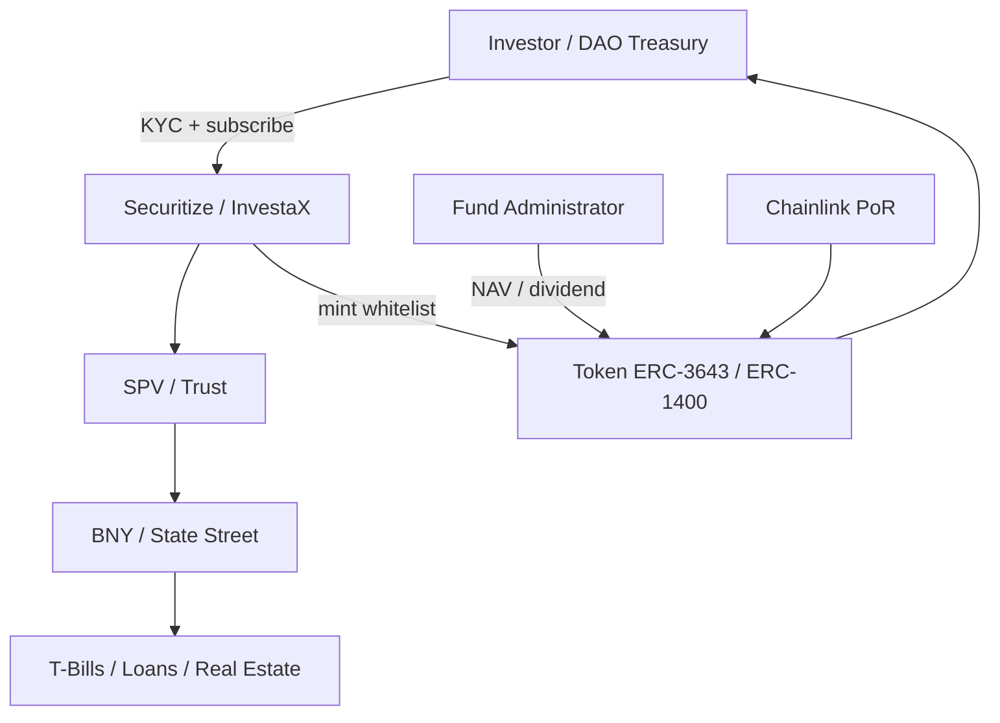

# RWA 全景（Real World Assets Tokenization Landscape）

> **TL;DR**：Real World Assets (RWA) 指将链下金融资产（国债、股票、房产、私募信贷、商品、艺术品、碳信用）映射为链上代币的集合。2023–2026 是机构化加速期：BlackRock BUIDL（T-Bills）突破 30 亿美元、Franklin FOBXX、Ondo USDY/OUSG 合计数十亿；Centrifuge/Maple/Goldfinch 提供私募信贷；房产领域以 RealT、Homebase、Blocksquare 探索。链上 RWA 总规模 2026 Q1 约 150–180 亿美元（不含稳定币）。核心挑战：**法律可执行性**（SPV/信托/证券注册）、**监管分化**（RegD/RegS/MiCA/HK STO）、**Oracle/储备证明**、**KYC 白名单合规转账**（ERC-3643、ERC-1400）。主要买方是加密原生基金、DAO 国库、稳定币协议国库。

## 1. 背景与动机

2017 年 STO（Security Token Offering）喧嚣后一度沉寂，因缺乏合规框架与机构流动性。2022–23 年高利率环境下，加密市场美元闲置资本（约数千亿美元稳定币）寻求链上收益——代币化 T-Bills 应运而生，年化 4–5% 无需传统银行账户即可获得，对 DAO 国库、稳定币协议（Maker、Frax、Sky）极具吸引力。BlackRock CEO Larry Fink 2024-01 公开表示"所有金融资产最终都会代币化"。传统金融侧，代币化解决：(1) 24/7 结算（T+0 vs 传统 T+2）；(2) 分数化（小额投资进入私募市场）；(3) 透明与可编程（利息自动分发、抵押自动重复使用）；(4) 跨境无缝（避开代理行网络）。

RWA 光谱（2026 Q1 链上规模估算，不含稳定币）：
| 类别 | 规模 | 主流项目 |
| --- | --- | --- |
| 代币化国债 / MMF | ~$7B | BUIDL, BENJI/FOBXX, OUSG, USDY, USTB, Superstate |
| 私募信贷 | ~$5B | Centrifuge, Maple, Goldfinch, Figure |
| 房地产 | ~$0.3B | RealT, Homebase, Blocksquare, Lofty |
| 商品（金/银） | ~$1.5B | PAXG, XAUT, Kinesis |
| 股票 | ~$0.2B | Backed, Swarm, Dinari |
| 碳信用 | ~$0.2B | Toucan, KlimaDAO, Flowcarbon |
| 艺术/收藏品 | ~$0.1B | Masterworks-like |

## 2. 核心原理

### 2.1 形式化定义：链下资产—链上代币的映射

设链下资产 $A$（法律实体下的金融资产），发行人 $I$ 创建合规包装载体 $S$（SPV/Trust/BDC/UCITS）。代币 $T_A$ 与资产满足：
$$\text{BeneficialOwnership}(A) \Leftrightarrow \text{Token}(T_A)$$
要求：
1. **法律等效性**：代币持有即构成对 $A$ 的受益权（直接或间接）。
2. **可赎回性**：在许可名单内的持有者可以用 $T_A$ 赎回 $A$（或其现金等价物）。
3. **合规转让**：转账需满足证券法约束（Reg D 144A/S，MiCA ART，HK STO）。
4. **储备可验证**：链下托管方与链上合约数据可对账（PoR）。

从会计角度，持有 $T_A$ 在链上相当于持有 $A$ 的证券化凭证，传统证券法继续适用。

### 2.2 关键数据结构：合规代币标准

1. **ERC-20 + 扩展（允许名单）**：最简单，发行方通过 `transferAllowed(from, to)` 白名单逻辑控制。
2. **ERC-1400**：由 Polymath 提出的组合标准，含 partitioned token（按类别/解锁期划分 tranche）。
3. **ERC-3643 (T-REX)**：由 Tokeny 推动，包含 `IdentityRegistry`、`Compliance`、`TrustedIssuersRegistry`，链上 ClaimTopics（KYC、投资者类型、地区）组合转账规则。
4. **Solana Token-2022 Transfer Hook**：在 SPL 转账时调用自定义 hook 合约执行合规逻辑。
5. **Polygon ID / zkKYC**：将 KYC 状态作为 ZK 证明附带，不泄露身份但证明合规。

### 2.3 子机制拆解

1. **发行（Primary Issuance）**：投资者通过 Securitize / InvestaX / ADDX 等发行平台 KYC，认购后 SPV 向其钱包 mint 代币。
2. **储备与估值（Custody & NAV）**：独立托管行（BNY Mellon、Anchorage、State Street）持有底层；administrator（State Street、Apex）日度计算 NAV。
3. **转让（Secondary Transfer）**：白名单账户间 P2P；或在 ATS（Alternative Trading System，如 tZERO、INX）、合规 DEX 撮合。
4. **收益分配（Distribution）**：利息/股息自动按余额快照分发（可用 Merkle Drop 或 Rebase）。
5. **赎回（Redemption）**：按 T+1 / T+5 规则，发行方销毁代币，从托管出售底层返还现金（USDC/USD）。
6. **法律执行（Enforcement）**：如发生欺诈或持有人违规，发行人可通过法院指令或链上 `forceTransfer` 回收。
7. **Oracle / PoR**：Chainlink PoR、Provable、第三方审计 API 定期报告储备。

### 2.4 参数与常量

| 参数 | 常见取值 |
| --- | --- |
| 最低投资额 | $5K（RegD 506c）到 $1M（机构） |
| 锁仓期 | 0–12 月（依 RegD、RegS） |
| KYC 有效期 | 12–24 月需复核 |
| NAV 更新频率 | 每日（T+1） |
| 赎回 SLA | T+1 ~ T+5 |
| 合规托管资本 | ≥ $100M（NY Trust） |

### 2.5 边界条件与失败模式

- **法律失效**：若 SPV 结构被法院穿透、受托人违约，代币持有人面临传统追索路径，链上权利空转。
- **白名单冲突**：DeFi 组合性受阻（例：白名单 RWA 放入 Aave 池需池也合规）；解决方案：合规池（Aave GHO v3 RWA Market、Centrifuge Tinlake）。
- **Oracle/NAV 延迟**：部分 RWA 交易在美东 4pm 后关单，链上定价滞后。
- **利率逆转**：高利率退潮（美联储降息）压低代币化国债吸引力，资金回流 USDC/USDT。
- **监管割裂**：美国 RegD/S、EU MiCA ART、香港 SFC 1 号牌照、新加坡 CMS 各有其规，跨境流通受阻。
- **二级流动性**：多数 RWA 代币流动性浅，依赖发行方做市；清算期 bid-ask 可达 0.5–2%。

### 2.6 图示



```
RWA 价值栈
Legal Layer  : SPV / Trust / BDC / SPC
Custody      : BNY / State Street / Anchorage
Administration: Apex / State Street Digital
Token Std    : ERC-3643 / ERC-1400 / T-2022
Settlement   : Ethereum / Polygon / Avalanche / Base
Distribution : Securitize / ADDX / Ondo / Superstate
```

## 3. 架构剖析

### 3.1 分层视图

1. **Legal & Regulatory**：证券律所、发行备案（Form D/F）、信托/SPV 结构。
2. **Custody**：合格托管人（Qualified Custodian, Rule 206(4)-2）。
3. **Administration / Transfer Agent**：NAV 计算、账簿维护。
4. **Platform**：发行门户 + KYC + 钱包绑定（Securitize、InvestaX、Propine、Libre）。
5. **Tokenization Smart Contract**：合规转账、暂停、强制转移、分红。
6. **Oracle & Data**：价格、NAV、储备证明。
7. **Secondary Market**：ATS、DEX（合规池）、跨境 RFQ 网络。

### 3.2 核心模块清单

| 模块 | 职责 | 依赖 | 可替换性 |
| --- | --- | --- | --- |
| IdentityRegistry (ERC-3643) | 链上 KYC 身份 | CA/Sumsub | 中 |
| Compliance (ERC-3643) | 转账规则 | ModuleSet | 高 |
| TokenContract | ERC-20+扩展 | Identity/Compliance | 低 |
| Transfer Agent | 账簿和解 | 合规服务商 | 中 |
| Custody Adapter | 链下资产映射 | 托管 API | 中 |
| NAV Oracle | NAV push | Administrator | 中 |
| Dividend Distributor | 分红 | Merkle/Rebase | 高 |
| Redemption Portal | 赎回 | 发行方后台 | 中 |

### 3.3 数据流：一笔 BUIDL 分红

1. BlackRock USD Institutional Digital Liquidity Fund（BUIDL）底层每日累积 T-Bills 收益。
2. Securitize（Transfer Agent）计算 NAV，累积份额。
3. 月末将应付收益换算为 USDC，调用 `distribute(merkleRoot)`。
4. 投资者通过 Claim 合约 `claim(proof)` 领取 USDC；或自动 airdrop。
5. 链上 event `DividendPaid` 供会计系统对账。
6. 赎回时：投资者提交 `redeem(amount)` → Securitize 从托管出售等额 T-Bills → USDC 回到投资者钱包。

### 3.4 客户端 / 参考实现

- **ERC-3643 T-REX**：https://github.com/TokenySolutions/T-REX
- **ERC-1400**：https://github.com/SecurityTokenStandard/EIP-Spec
- **Securitize DS Protocol**：https://github.com/securitize-io
- **Provenance Blockchain Figure**：特定于 US RegD。

### 3.5 扩展接口

- Chainlink CCIP + PoR：RWA 跨链与储备证明。
- Swift Tokenized Asset Trial（BNY/BNP/Citi 2024）。
- DTCC Smart NAV：NAV 数据上链。
- ISO 20022：与银行电文对接。

## 4. 关键代码 / 实现细节

ERC-3643 `Token.sol`（https://github.com/TokenySolutions/T-REX `contracts/token/Token.sol` 约 200 行）核心转账：

```solidity
function transfer(address _to, uint256 _amount) public override whenNotPaused returns (bool) {
    require(!frozen[_to] && !frozen[msg.sender], "wallet frozen");
    require(_amount <= balanceOf(msg.sender) - frozenTokens[msg.sender], "frozen amount");
    // 身份 + 合规检查
    require(tokenIdentityRegistry.isVerified(_to), "identity not verified");
    require(tokenCompliance.canTransfer(msg.sender, _to, _amount), "compliance failed");
    _transfer(msg.sender, _to, _amount);
    tokenCompliance.transferred(msg.sender, _to, _amount);
    return true;
}
```

Chainlink PoR 示例：

```solidity
AggregatorV3Interface por = AggregatorV3Interface(PoR_Feed);
(, int256 reserves, , ,) = por.latestRoundData();
require(uint256(reserves) * 1e12 >= totalSupply(), "reserve deficit");
```

## 5. 演进与版本对比

| 阶段 | 时间 | 代表 |
| --- | --- | --- |
| STO 1.0 | 2017–19 | Polymath, Harbor |
| DeFi RWA 实验 | 2020–22 | Centrifuge Tinlake, Maker RWA Vault |
| 代币化国债起飞 | 2023 | Ondo OUSG, Franklin FOBXX |
| 机构入场 | 2024 | BlackRock BUIDL |
| 多链扩展 | 2025 | Aptos/Sui/Avalanche Spruce |
| RWA 组合性 | 2026 | Morpho/Pendle sTreasury |

## 6. 实战示例

查询 BUIDL 链上 totalSupply：

```bash
cast call 0x7712c34205737192402172409a8F7ccef8aA2AEc \
  "totalSupply()(uint256)" --rpc-url https://eth.llamarpc.com
```

申购 OUSG（Ondo，需 KYC）：
1. 在 ondo.finance KYC 并绑定钱包。
2. 转入 ≥ $5K USDC。
3. Ondo 链上 mint OUSG。
4. 每月收到 USDY/分红。

## 7. 安全与已知攻击

- **Maker 的 RWA Vault 受托人（2023）**：Monetalis 审计争议，议会延迟决议。
- **USDR 崩盘（2023-10）**：Tangible 房产 RWA，因流动性池挤兑跌到 $0.5。
- **Goldfinch Stratos 借款违约（2023-01）**：链下借款人违约，LP 亏损 ~$20M。
- **Centrifuge Tinlake DROP 亏损（多起）**：私募信贷 Pool 违约。
- **真实性/合规欺诈（2022 Harbor 事件）**：伪造 KYC。

## 8. 与同类方案对比

| 维度 | 链上 RWA | 传统证券 | 稳定币 |
| --- | --- | --- | --- |
| 结算 | T+0 | T+2 | T+0 |
| 24/7 | 是 | 否 | 是 |
| 最小单位 | 可分数 | 1 股 | 0.000001 |
| KYC | 依产品 | 券商 | 依发行方 |
| 分红 | 自动 | 券商中转 | 无 |
| 可组合 DeFi | 有限（合规池） | 无 | 高 |

## 9. 延伸阅读

- BCG × ADDX "Relevance of on-chain asset tokenization" 2023
- BlackRock Whitepaper "Tokenized Assets" 2024
- CITI "Money, Tokens and Games" 2024
- rwa.xyz Dashboard
- Boston Fed "Project Hamilton"
- DTCC Smart NAV 白皮书

## 10. 术语表

| 术语 | 英文 | 释义 |
| --- | --- | --- |
| SPV | Special Purpose Vehicle | 特殊目的实体 |
| BDC | Business Development Company | 美私募信贷载体 |
| UCITS | — | EU 可转让证券集合投资 |
| STO | Security Token Offering | 证券代币发行 |
| NAV | Net Asset Value | 单位净值 |
| PoR | Proof of Reserve | 储备证明 |
| ATS | Alternative Trading System | 美国另类交易系统 |
| Reg D / S | — | 美国豁免注册条款 |

---

*Last verified: 2026-04-22*
