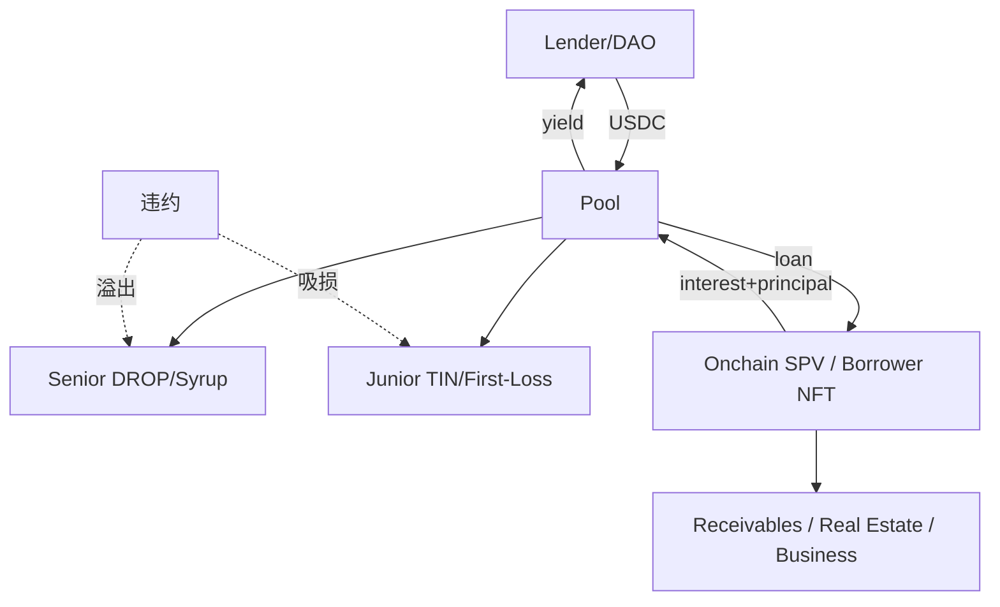

# 链上私募信贷（Centrifuge / Maple / Goldfinch）

> **TL;DR**：私募信贷（Private Credit）是未上市企业与资产担保贷款的 RWA 重要分支，2026 Q1 链上规模约 45–60 亿美元。Centrifuge（2017 创立，基于 Substrate + Centrifuge Chain + Ethereum Pool）以供应链金融、应收账款、房贷池起家，为 MakerDAO 注入大量 RWA 抵押；Maple Finance 面向加密机构借贷（Blockchain-native underwriting），2022 FTX 危机后重生为 Maple 2.0，Syrup (sUSDC) 是其旗舰零售入口；Goldfinch 面向新兴市场借贷（肯尼亚、东南亚），2023 Warbler Labs 引入 Prime 机构产品。共同机制：Pool Delegate（承销人） + Senior/Junior Tranche（风险分层） + 链下法律文件 + 链上账簿。风险：违约率高于国债 RWA（Goldfinch 历史违约 ~10%），流动性差（赎回排队）。

## 1. 背景与动机

全球私募信贷市场规模约 1.7 万亿美元（Preqin 2025），主要服务无法从公开市场融资的中小企业（SMB）、房产开发商、应收账款融资。传统私募信贷由 BDC（Business Development Company）、对冲基金主导，最低门槛 $100K–$1M，流动性差（3–7 年锁定）。上链带来三大优势：(1) **效率提升**：文件上链，清算与分红自动化；(2) **透明**：投资者可实时查看 Pool 状况、借款人履约；(3) **流动性改善**：次级市场或 Tranche 可转让。Centrifuge 2017 年由 Maex Ament 等创立，早期与 MakerDAO 合作 RWA 金库（RWA-003 New Silver、RWA-004 Harbor Trade）；Maple 2021 上线以服务 Alameda/Orthogonal/Maven11 等加密 native 机构为主，因 FTX/3AC 连锁违约 (~$36M Orthogonal 违约) 险遭清算，后重启为 Maple 2.0；Goldfinch 2021 年由 Coinbase 前员工 Mike Sall 创立，专注新兴市场借贷。

## 2. 核心原理

### 2.1 形式化定义：Pool、Tranche、违约分配

设 Pool P 吸收 LP 资金 $L$，发放贷款 $L \to B_1, B_2, \dots, B_n$（借款人）；本金与利息回流给 LP。Tranche 机制下：
- Senior Tranche 份额 $L_S$，优先获付且利率较低 $r_S$。
- Junior/Mezzanine Tranche $L_J$，吸收最先损失但收益较高 $r_J$。

违约分配：若借款人违约总额 $D$，
$$\text{Junior Loss} = \min(D, L_J), \quad \text{Senior Loss} = \max(0, D - L_J)$$
即 Junior 第一位吸损。

Centrifuge DROP（Senior）/ TIN（Junior）即此结构。Maple 2.0 简化为单 Tranche Pool + First-Loss Capital（Pool Delegate 自投）。

### 2.2 关键数据结构

**Centrifuge Pool**（Substrate chain + EVM Pool）：
- `LoanNFT`：每笔贷款铸造一个 NFT，含 principal、interest rate、maturity、collateral metadata（IPFS 指针指向发票/应收账款文件）。
- `Tranche`：DROP（Senior）、TIN（Junior）ERC-20 份额。
- `EpochExecutor`：每日 epoch 结算申赎。
- `NAV`：由 NFT 未偿本金 + 利息累积 - 减值计算。

**Maple 2.0 Pool**：
- `PoolManager`：策略与风险参数。
- `LoanManager`：逐笔贷款追踪。
- `WithdrawalManager`：30 天排队赎回。
- `LiquidityCap`：Pool 吸收上限。
- Syrup（USDC Pool）：零售用户入口，sUSDC ERC-4626。

**Goldfinch**：
- `SeniorPool`：合并 Pool，自动分散到各借款人池。
- `BorrowerPool` (TranchedPool)：具体借款人池，Senior/Junior。
- `Backer`：Junior LP，FIDU token。
- `Auditor`：社区验证借款人合规。
- `GFI`：治理代币。

### 2.3 子机制拆解

1. **借款人尽调（Underwriting）**：传统金融流程移植到链下，Pool Delegate（Maple）/Asset Originator（Centrifuge）/Auditor（Goldfinch）负责。
2. **KYC + 投资者准入**：多数 Pool 仅限合格投资者（RegD/Reg S），Maple Syrup（2024）对 KYC 零售开放。
3. **NAV 计算**：链下 Administrator（如 Adrastea、Apex）报送至链上预言机。
4. **违约处理**：Maple 2.0 引入"Impairment"：Pool Delegate 可标记贷款减值；Centrifuge 通过 `writeoff` 机制按时长分阶段减值（30/60/90 天）。
5. **法律文件**：借款协议、担保文件托管于 IPFS/Arweave，hash 上链；通常配合离岸 SPV 控制实际抵押品。
6. **Secondary Liquidity**：Centrifuge DROP 可在 Uniswap/Curve 池中交易（2023-24 Block Analitica 维稳池）；Maple 新增 Syrup ERC-4626 二级市场。
7. **收益分配**：利息按区块（Maple 以秒级 accrual）或 epoch（Centrifuge）累积到 LP。

### 2.4 参数与常量

| 参数 | Centrifuge | Maple | Goldfinch |
| --- | --- | --- | --- |
| LP 最低 | 无（KYB） | Syrup 无 / Pool 10K | Backer $1 |
| APY | 4–15%（各 Pool） | 5.5–13%（Syrup 12%） | 8–15% |
| Tranche 结构 | DROP/TIN | 单 + First-Loss | Senior/Junior |
| 赎回 SLA | Epoch（T+1 day） | 30 天队列 | 14 天 |
| 违约率历史 | ~1–2%（含减值） | 2.5% (2022 峰值 11%) | ~10% |
| TVL (Q1 2026) | ~$800M | ~$2.5B (Syrup 主导) | ~$120M |

### 2.5 边界条件与失败模式

- **借款人违约（链下）**：Orthogonal Trading 2022 FTX 亏损后向 Maple 借款池虚报财务，违约 $36M。
- **Pool Delegate 失职**：Centrifuge BlockTower 2023 部分 Pool 被指尽调不足。
- **链下法律追索成本高**：跨境借款违约时，Pool Delegate 诉诸当地法院，耗时 6–18 月，回收率低。
- **流动性挤兑**：Goldfinch Senior Pool 2023 Stratos 违约后出现赎回排队，FIDU 场外折价 20%。
- **治理代币贬值**：GFI、MPL 曾大幅下跌，影响 First-Loss capital 的覆盖比。
- **审计与 KYC 成本**：Pool 运营成本（审计、法律、合规）比链上借贷高，小池难以维持。
- **KYT/合规冲突**：部分 DeFi 集成（如 Morpho）需合规池隔离。

### 2.6 图示



```
Centrifuge 架构
 Ethereum (Tinlake/Liquidity)
   ↕ Wormhole + Centrifuge Connectors
 Centrifuge Chain (Substrate)
   ↕
 Asset Originator (链下实体) - Loan NFT - IPFS Docs
```

## 3. 架构剖析

### 3.1 分层视图

1. **Asset Originator / Pool Delegate Layer**：链下金融专业机构，负责尽调与催收。
2. **SPV / Legal Structure**：通常开曼/BVI/DE SPV 持有底层资产。
3. **On-chain Pool Contracts**：Ethereum EVM 为主，Centrifuge 另有 Substrate chain。
4. **Liquidity & Tranche**：Senior/Junior ERC-20。
5. **Yield Distribution**：epoch/per-block accrual。
6. **Governance / Incentive**：CFG/MPL/GFI 代币。
7. **DeFi Integration**：Morpho、Pendle、Spark、Flux Finance。

### 3.2 核心模块清单

| 模块 | 职责 | 依赖 | 可替换性 |
| --- | --- | --- | --- |
| Pool Contract | 资金进出 | Tranche | 低 |
| Tranche Token (DROP/TIN, MPL-USDC) | 风险分层 | Pool | 中 |
| LoanNFT / LoanManager | 贷款追踪 | Oracle/Admin | 中 |
| Withdrawal Manager | 赎回排队 | Pool | 中 |
| NAV Oracle | 价值更新 | Admin | 中 |
| Impairment Logic | 减值 | Pool Delegate | 中 |
| Governance | 参数/升级 | CFG/MPL/GFI | 高 |
| Legal SPV | 链下载体 | 律所 | 低 |

### 3.3 数据流：Centrifuge New Silver 房贷池

1. New Silver（Asset Originator）在链下发放美国 fix-and-flip 房贷。
2. 每笔贷款 mint LoanNFT（IPFS 文件哈希）。
3. NFT 作为抵押进入 Centrifuge Pool → 换取 DAI/USDC。
4. DAI 流向 MakerDAO RWA Vault 或 Tinlake LP。
5. 借款人还款 → Pool 回款 → Senior DROP 先优先分配 → Junior TIN 吸收剩余。
6. 若借款人违约，New Silver 启动法律执行程序并在 Pool 内触发 writeoff（30/60/90 天阶段）。

### 3.4 客户端 / 参考实现

- **Centrifuge**：https://github.com/centrifuge/centrifuge-chain（Substrate）, https://github.com/centrifuge/tinlake（Solidity v1）, https://github.com/centrifuge/liquidity-pools（v2）
- **Maple v2**：https://github.com/maple-labs/maple-core-v2
- **Goldfinch**：https://github.com/goldfinch-eng/mono
- **Backed Credit SPV**：Swiss DLT Law 基础，Backed bSLIP / bSLQD。

### 3.5 扩展接口

- ERC-4626 sUSDC (Syrup)
- Pendle PT-syrupUSDC：固定收益分拆
- Morpho Blue：isolated market 集成
- Chainlink PoR for NAV
- CCIP / LayerZero 跨链

## 4. 关键代码 / 实现细节

Maple Pool v2 核心（`maple-core-v2/contracts/Pool.sol`，约 150–220 行）：

```solidity
function deposit(uint256 assets, address receiver) external override nonReentrant returns (uint256 shares) {
    require(!IMapleGlobals(globals()).protocolPaused(), "P:DEPOSIT:PROTOCOL_PAUSED");
    require(_totalAssets() + assets <= _liquidityCap(), "P:DEPOSIT:LIQUIDITY_CAP_EXCEEDED");
    shares = previewDeposit(assets);
    _mint(receiver, shares);
    SafeERC20.safeTransferFrom(IERC20(asset), msg.sender, address(this), assets);
    emit Deposit(msg.sender, receiver, assets, shares);
}
```

Withdrawal Queue：

```solidity
function requestRedeem(uint256 shares, address owner) external returns (uint256 escrowShares) {
    escrowShares = IPoolManager(manager).requestRedeem(shares, owner, msg.sender);
    // 30 天后 partial fill
}
```

Centrifuge Tinlake Assessor（`tinlake/src/lender/assessor.sol` 约 100–180 行）：

```solidity
function calcSeniorTokenPrice(uint seniorAsset_, uint nav_, uint reserve_) public view returns(uint) {
    if (totalBalance == 0) return ONE;
    return rdiv(calcSeniorAssetValue(seniorDebt_, seniorBalance_, reserve_, nav_), seniorToken.totalSupply());
}
```

Goldfinch SeniorPool：

```solidity
function invest(ITranchedPool pool) external {
    uint256 investmentAmount = strategy.invest(pool);
    require(investmentAmount > 0, "SP: no investment");
    usdc.approve(address(pool), investmentAmount);
    pool.deposit(uint256(ITranchedPool.Tranche.Senior), investmentAmount);
}
```

## 5. 演进与版本对比

| 时间 | 事件 |
| --- | --- |
| 2017 | Centrifuge 成立 |
| 2020 | Tinlake v1 主网 |
| 2021-05 | Maple 主网 |
| 2021-07 | Goldfinch 主网 |
| 2022-Q4 | Orthogonal / Alameda / Celsius 连锁违约 |
| 2023 | Maple 2.0 重构 |
| 2024 | Syrup 零售产品，Centrifuge Liquidity Pools v2 |
| 2025 | Centrifuge 在 Base 推出 deRWA Pools |

## 6. 实战示例

Syrup USDC 存款：

```bash
cast send $SYRUP_POOL "deposit(uint256,address)" 10000e6 $RECIPIENT \
  --rpc-url https://eth.llamarpc.com --private-key $PK
```

查询 Centrifuge Pool NAV：

```graphql
{
  pool(id: "0x...") {
    totalReserve
    netAssetValue
    tranches { seniorApy juniorApy }
  }
}
```

## 7. 安全与已知攻击

- **Orthogonal Trading 违约（2022-12）**：Maple 最大冲击，$36M 违约，Pool Delegate 失职。
- **Celsius / Babel / Alameda**：Maple 2021–22 多起机构违约。
- **Stratos Capital 违约（2023-01）**：Goldfinch Senior Pool $20M 未履约，FIDU 折价。
- **Centrifuge Harbor Trade（2024）**：部分应收账款池延迟还款。
- **Pool Delegate 串谋风险**：理论上 Delegate 与 Borrower 合谋虚报。
- **Warbler Labs Prime Default（2024 Q3）**：新兴市场 fintech 违约 $8M。

## 8. 与同类方案对比

| 维度 | Centrifuge | Maple | Goldfinch |
| --- | --- | --- | --- |
| 定位 | 应收/房贷 | 机构信贷 / 零售 Syrup | 新兴市场 |
| TVL | ~$800M | ~$2.5B | ~$120M |
| Tranche | DROP/TIN | 单 + FirstLoss | Senior/Junior |
| 合规 | EU + 多辖区 SPV | US + Cayman | US + 多国 |
| 违约历史 | 小 | 中 | 较大 |
| DeFi 集成 | Sky、Morpho | Morpho、Pendle、Sky | Morpho |

## 9. 延伸阅读

- Centrifuge Whitepaper
- Maple 2.0 Blog 系列
- Goldfinch Litepaper
- rwa.xyz/private-credit
- Preqin "Private Credit Global Overview 2025"
- a16z "On-chain Private Credit"
- Gauntlet "Risk Assessment of On-chain Credit"

## 10. 术语表

| 术语 | 英文 | 释义 |
| --- | --- | --- |
| Tranche | — | 风险分层 |
| Pool Delegate | — | Maple 池管理人 |
| Asset Originator | — | Centrifuge 资产发起人 |
| DROP/TIN | — | Senior/Junior token |
| Syrup | — | Maple 零售收益产品 |
| Writeoff | — | 分阶段减值 |
| First-Loss Capital | — | 承销人自投以吸损 |
| SPV | Special Purpose Vehicle | 特殊目的实体 |

---

*Last verified: 2026-04-22*
