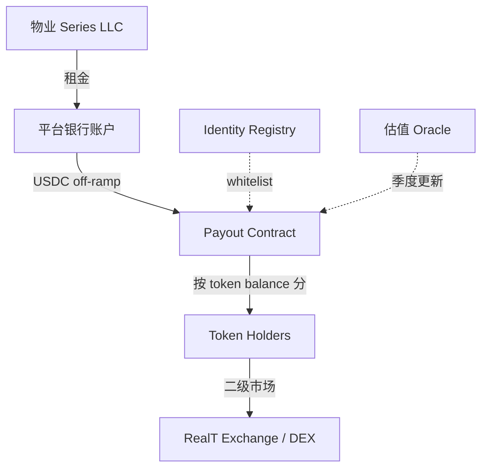

# 房产代币化（Tokenized Real Estate）

> **TL;DR**：房产代币化把单套物业的所有权或收益权拆分为链上代币（常见 ERC-20 / ERC-3643 / ERC-1400），降低投资门槛、提高流动性。当前主流模式分三类：**整栋资产 SPV + Token（RealT / Lofty AI）**、**房产产权 NFT 登记（Propy）**、**REIT-on-chain + 分红通道（Blocksquare / Harbor）**。2026 年全球 Tokenized Real Estate 规模约 $3-4B（含不动产基金份额），占 RWA 总量约 20%，但受证券法、产权登记、跨境税等多重阻力，流动性远不及预期。本篇拆解法律结构、智能合约设计、分红与清算逻辑、以及已失败案例。

## 1. 背景与动机

房产是全球最大资产类别（约 $380T），但流动性极差：中位数持有周期 5-7 年，每次交易摩擦成本 5-10%。代币化承诺三点：

1. **分割拥有权**：一套 $500K 公寓拆成 5000 份 $100 token，散户可参与。
2. **可组合性**：token 可抵押借贷（房产 → DeFi）、二级市场交易。
3. **自动分红**：租金收入按代币持有比例链上分配。

但这三个承诺迄今大多落空：产权登记仍在各国线下进行；流动性依赖中心化发行方；收益率扣除税费后并不比 REITs 有吸引力。代币化的**真正价值**在 2024 后明确为两个方向：

- **SPV share 上链**：把"持有物业的公司股权"上链，降低合规和股东管理成本（而非直接上链产权）。
- **分数化 + 合规发行**：将传统 Reg D / Reg S 证券上链，用 ERC-3643 做 whitelist + transfer restriction。

## 2. 核心原理

### 2.1 形式化：代币化的法律-技术映射

定义 $P$ 为一套房产，$V(P)$ 为其市值，$Y(P)$ 为年净租金收益。代币化协议把 $P$ 映射到链上 token：

$$
\text{TokenSupply} = N, \quad \text{TokenValue}_i = \frac{V(P)}{N}, \quad \text{Dividend}_i = \frac{Y(P) \cdot (1-\text{fee})}{N}
$$

关键是**代币持有 ≠ 法律意义上持有房产**，而是"对某 SPV 的受益权/股东权利"。Token 只是 SPV 股权的数字化凭证。

### 2.2 三种结构模式

**模式 A — SPV 持有 + Token 映射股权**（RealT）：

```
LLC(Delaware Series) 持有物业产权 → 发行 A 类 member interest
  ↳ 智能合约 ERC-20 mint 对应数量 token
  ↳ 持有 token = 持有 Series LLC 会员权益
  ↳ 租金 → LLC 账户 → USDC → 合约按比例发
```

**模式 B — NFT 作为产权登记**（Propy）：

```
NFT(tokenId = deed hash) → 绑定 BTC/ETH 地址
  ↳ 在 Vermont/Wyoming 等合作州，NFT 有法律效力（blockchain-deed recording）
  ↳ 出售物业 = transfer NFT + 线下过户
```

**模式 C — REIT 代币化 + 分红池**（Blocksquare）：

```
Property Token(PROPS) 代表对整个 Blocksquare 平台资产池份额
  ↳ BSPT(Property-specific) 代表单套物业
  ↳ 平台收租后通过智能合约按 BSPT 持仓分红
```

### 2.3 子机制一：白名单与转让限制（ERC-3643 / ERC-1404）

由于法规要求（Reg D 144A 买家须为合格投资者；欧盟 MiFID II 要求 KYC），token 必须嵌入转让限制：

- **Identity Registry**：链上 KYC 记录（hash + 国家 + 认证时间）。
- **Compliance Rules**：禁止转给未 KYC 地址、禁止跨 jurisdictions（如 US → Non-US Reg S）、单笔额度。
- **Force Transfer**：法院传票可强制转移代币至接管人。

### 2.4 子机制二：链上分红

最常见两种：

1. **Pull Model**：合约持有 USDC 分红池，每个 token 对应一个"已提取"计数器，用户主动 claim。
2. **Push Model**：每期（每月）合约 snapshot 余额，按比例 airdrop USDC。Push 简单但 gas 高，适合 L2。

RealT 在 Gnosis Chain 上用每日 push（gas 接近 0）。

### 2.5 子机制三：链上估值与清算

- **估值**：链下评估报告（appraisal）+ 每季度更新 oracle price。
- **清算**：当物业出售或 SPV 解散，token 按比例兑换为 USDC。需要多签批准 + 投票（Snapshot）。

### 2.6 关键参数（典型值）

| 参数 | 典型 | 说明 |
| --- | --- | --- |
| 单套物业拆分 token 数 | 1k–50k | 常取物业价值 / $100 |
| Token 标准 | ERC-20 / ERC-3643 / ERC-1404 | US 合规优选 3643 |
| 分红频率 | 每日 / 每周 | 链 gas 决定 |
| 平台费 | 2–5% AUM | RealT 约 2.5% |
| 最小购买额 | $50–$500 | Reg D 限制 |
| 年化净租金 | 6–12%（美国中西部房产） | 扣税前 |

### 2.7 边界条件与失败模式

- **产权诉讼**：若物业被查封/抵押优先权在 token 之前，token 持有人可能归零。
- **SPV 管理方违约**：SPV 管理人挪用租金，链上合约无力追回。
- **跨境税**：美国 LLC 向非美国 token 持有人支付分红，需扣 30% 预提税（或 treaty 降低）。
- **KYC 供应商失效**：Chainalysis/Sumsub 服务中断，用户无法 KYC/转账。
- **二级市场流动性枯竭**：RealT 大部分 token 日交易量 < $500。

### 2.8 图示：Tokenized Real Estate 数据流



## 3. 架构剖析

### 3.1 分层视图（以 RealT 为参考）

```
┌──────────────────────────────────┐
│ UI (realt.co dashboard)          │
├──────────────────────────────────┤
│ KYC / AML (Sumsub / Jumio)       │
├──────────────────────────────────┤
│ Off-chain Registrar (SPV docs)   │
├──────────────────────────────────┤
│ Custodian (USDC / Fiat / Fed)    │
├──────────────────────────────────┤
│ Smart Contract (ERC-3643 + Payout) │
│ on Gnosis Chain / Ethereum       │
├──────────────────────────────────┤
│ Secondary Market (RealT Exchange) │
└──────────────────────────────────┘
```

### 3.2 核心模块清单

| 模块 | 职责 | 依赖 | 可替换性 |
| --- | --- | --- | --- |
| Token Contract (ERC-3643) | 表示 SPV 股权 | Identity Registry | 可替换 ERC-1400/1404 |
| Identity Registry | 维护 KYC 列表 | KYC Provider | 高 |
| Compliance Module | 转账规则 | Registry + Jurisdiction rules | 高 |
| Payout Engine | 分红计算与发放 | USDC + Oracle | 中 |
| Voting / Governance | 重大决策（卖出、融资） | Snapshot / Tally | 高 |
| Exchange | 二级市场 | Uniswap V3 / 专属 CLOB | 中 |
| Valuation Oracle | 链下估值 | Chainlink Functions / 手动签 | 中 |

### 3.3 生命周期：从发行到二级交易

1. 发行方选定物业、成立 Delaware Series LLC（Series 1 对应该物业）。
2. 评估师出报告；律师起 PPM（Private Placement Memorandum）；SEC Reg D 备案。
3. 部署 ERC-3643 合约，设 max supply = V(P) / 100。
4. 合格投资者 KYC → 被加入 Identity Registry。
5. 投资者付 USDC 购买 token，合约 mint 转给用户。
6. 平台收租 → USDC → 每日/每月发放到持有人地址。
7. 持有人可在 RealT Exchange 挂单，或去 Uniswap（若 token 不走 whitelist 限制转入 LP，部分实现不行）。
8. 退出：平台找买家收购整栋 → SPV 解散 → USDC 赎回 → 合约 burn token。

### 3.4 主要玩家与数据（2026）

| 平台 | 主力物业 | 上链数量 | TVL |
| --- | --- | --- | --- |
| RealT | 美国底特律/克利夫兰单户住宅 | ~500 | ~$150M |
| Lofty AI | 美国租赁物业 | ~200 | ~$30M |
| Propy | 全球，偏商业 | NFT 产权（非证券） | — |
| Blocksquare | 欧洲商业地产 | ~50 | ~$100M |
| Harbor / TokenSoft | 早期项目，已整合 | — | — |
| Tangible | Pearl 稳定币抵押英国住宅 | ~500 | ~$100M |

### 3.5 互操作接口

- **KYC**：Sumsub、Jumio、Polygon ID（ZK KYC）。
- **Oracle**：Chainlink Functions、Pyth（固收指数）。
- **Bridge**：需特殊 bridge 支持 transfer restriction（不能简单 wrap）。

## 4. 关键代码：ERC-3643 最小实现片段

```solidity
// tokenized-real-estate/contracts/Token.sol (示意, 引自 ERC-3643 reference)
pragma solidity ^0.8.20;

import "@onchain-id/solidity/contracts/interface/IIdentity.sol";

interface IIdentityRegistry {
    function isVerified(address _userAddress) external view returns (bool);
    function investorCountry(address _userAddress) external view returns (uint16);
}

contract RealEstateToken is ERC20 {
    IIdentityRegistry public registry;
    mapping(uint16 => bool) public allowedCountries;
    uint256 public maxBalance = 500_000e18; // Reg D 合规

    modifier canTransfer(address from, address to, uint256 amount) {
        require(registry.isVerified(to), "KYC required");
        require(allowedCountries[registry.investorCountry(to)], "Country blocked");
        require(balanceOf(to) + amount <= maxBalance, "Max balance exceeded");
        _;
    }

    function _update(address from, address to, uint256 value) internal override canTransfer(from, to, value) {
        super._update(from, to, value);
    }

    // 法院强制转移（法律要求）
    function forcedTransfer(address from, address to, uint256 amount) external onlyAgent {
        _transfer(from, to, amount);
    }
}
```

## 5. 演进与版本对比

| 时期 | 主流模式 | 代表 | 问题 |
| --- | --- | --- | --- |
| 2017-2019 | STO（Security Token Offering）热潮 | Harbor、Polymath | 法规模糊、流动性差 |
| 2020-2022 | 机构化早期 | Red Swan、tZero | 机构采纳缓慢 |
| 2023-2024 | SPV-token 模型成熟 | RealT、Lofty | 流动性仍差 |
| 2025-2026 | RWA 叙事联动 | Ondo + 房产 | 尚未规模化 |

## 6. 实战示例：用 Foundry 测试 RealT 风格合约

```solidity
// test/RealEstate.t.sol
function testPayout() public {
    registry.register(alice, 840); // US
    registry.register(bob, 826);   // UK（假设被允许）
    token.mint(alice, 5000e18);
    token.mint(bob, 5000e18);
    usdc.mint(address(payout), 1000e6);
    payout.snapshot(); // 记录余额
    payout.distribute();
    assertEq(usdc.balanceOf(alice), 500e6);
    assertEq(usdc.balanceOf(bob), 500e6);
}
```

## 7. 安全与已知攻击

- **Aspen Digital（2022）**：某 STO 平台 SPV 文件不完整，token 持有人追索无果。
- **RealT Gnosis Chain 前端 DNS 劫持（2023-02）**：攻击者改 RPC 指向 phishing 合约，个别用户损失 ~$50K。
- **Tangible TNGBL 脱钩（2023-10）**：稳定币 USDR（Tangible 发行）因准备金房产流动性不足脱锚到 $0.5，后项目重启。
- **SEC enforcement actions**：Opyn、ShapeShift 等因未注册证券被罚；间接警示 tokenized RE 须严格合规。

## 8. 与同类方案对比

| 维度 | RealT（SPV） | Propy（NFT 产权） | 传统 REITs | Crowdfunding（Fundrise） |
| --- | --- | --- | --- | --- |
| 最小投资 | ~$50 | 单套 | $10 | $10 |
| 流动性 | 弱 | 无 | 极强（ETF） | 弱 |
| 收益率 | 6-10% | 0（仅捕获升值） | 4-6% | 6-9% |
| 合规 | Reg D | 因州而异 | SEC 监管 | Reg A+ |
| 透明度 | 链上 | 链上 | 年报 | 年报 |
| 准入 | KYC | KYC | 开放 | KYC |

## 9. 延伸阅读

- McKinsey 2022: "Tokenization: A digital asset déjà vu"。
- PwC 2024: "Tokenization of Real-World Assets"。
- RealT blog（realtoken-community）。
- Tangible & Real USD 白皮书。
- 中文：HashKey Capital《RWA 系列研报》。

## 10. 术语表

| 术语 | 英文 | 释义 |
| --- | --- | --- |
| SPV | Special Purpose Vehicle | 特殊目的载体，持有物业的单一用途公司 |
| PPM | Private Placement Memorandum | 私募备忘录 |
| Reg D | Regulation D | SEC 私募豁免 |
| Reg S | Regulation S | SEC 境外发行豁免 |
| STO | Security Token Offering | 证券型代币发行 |
| ERC-3643 | — | T-REX 标准，合规 token |
| REIT | Real Estate Investment Trust | 房地产投资信托 |

---

*Last verified: 2026-04-22*
