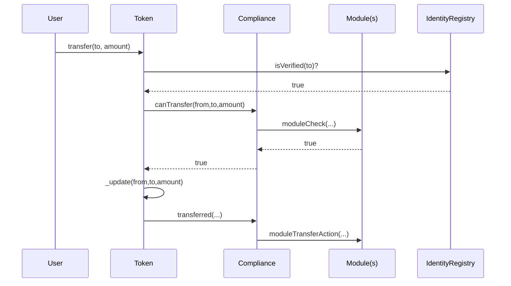

# RWA 合约设计（RWA Contract Design）

> **TL;DR**：把现实资产搬到链上，合约层必须解决三件事：**(1) 身份与合规（KYC/AML、合格投资者认证）；(2) 转让限制（白名单、跨境限制、单笔额度）；(3) 权益记账（分红、利息、股东投票、赎回）**。行业事实标准是 ERC-3643（T-REX，Tokeny 提出，欧盟 ESMA Guidance 采纳）+ ONCHAINID 身份框架；历史上 ERC-1400 / ERC-1404 仍在部分协议使用。本篇拆解三层合约的模块化设计、关键函数签名、Compliance Module 的组合模式、与 Force Transfer / Freeze / Recovery 的合规工具。

## 1. 背景与动机

普通 ERC-20 不适合 RWA，因为：

- **任意地址可转账**：合规要求只能转给已 KYC 地址。
- **不可撤销**：证券交易撤销（corporate action、errata）无法执行。
- **缺身份层**：没法证明"这个地址对应一个法国投资者且是 professional"。
- **分红需额外合约**：没法 native 支持权益计算。

2017 ERC-1400（R.Pombo 等）提出"安全代币"族；2018 ERC-1404（TokenSoft）引入 `detectTransferRestriction` 统一 ABI；2021 ERC-3643（Tokeny T-REX）发布，结合 ONCHAINID（Self-Sovereign Identity），成为当前 RWA 合规事实标准（Goldman、Archax、Backed 均采用）。

## 2. 核心原理

### 2.1 形式化：RWA Token 转账验证函数

定义资产 Token 合约状态为 $S = (Supply, Holders, Frozen, Registry, Rules)$。一笔 transfer $(from, to, amount)$ 有效条件：

$$
\forall r \in Rules: r(from, to, amount, S) = \text{true} \land \neg Frozen(from) \land \neg Frozen(to)
$$

其中每个 $r$ 是一个独立 Compliance Module（Max balance、Country restriction、Holding period、Max investors per jurisdiction 等）。这种**Rule 组合（Composition）**是 ERC-3643 与 ERC-1400 的核心差异。

### 2.2 ERC-3643（T-REX）架构

```
┌──────────────────────────────────┐
│ Token (ERC-3643, extends ERC20)  │
│   - transfer: calls Compliance   │
│   - forcedTransfer (agent only)  │
│   - mint / burn (agent only)     │
│   - freeze / unfreeze            │
├──────────────────────────────────┤
│ Identity Registry                │
│   - registerIdentity(addr, id, country) │
│   - isVerified(addr) → bool      │
├──────────────────────────────────┤
│ Modular Compliance               │
│   - addModule / removeModule     │
│   - canTransfer(from, to, amount)│
├──────────────────────────────────┤
│ Trusted Issuers Registry         │
│   - claim issuers trust list     │
├──────────────────────────────────┤
│ ONCHAINID (ERC-734 + ERC-735)    │
│   - claim-based identity         │
└──────────────────────────────────┘
```

### 2.3 子机制一：身份注册（Identity Registry）

每个合规持有人有**一个 ONCHAINID 合约实例**（ERC-734 密钥管理 + ERC-735 Claim 存储）。Registry 通过 `userAddress → identityContract + country` 的映射验证身份：

```solidity
function isVerified(address user) external view returns (bool) {
    IIdentity id = identities[user];
    if (address(id) == address(0)) return false;
    // 遍历 trusted issuers 的 claim topic（如 KYC_APPROVED, QUALIFIED_INVESTOR）
    for (uint i; i < topics.length; i++) {
        bytes32[] memory claimIds = id.getClaimIdsByTopic(topics[i]);
        if (claimIds.length == 0) return false;
        // 还要验签名 issuer 在 trusted list 里
    }
    return true;
}
```

### 2.4 子机制二：Compliance 模块组合

合约 Compliance（单数）管理一组 Module：

```solidity
contract ModularCompliance {
    address[] public modules;

    function canTransfer(address from, address to, uint256 amount) external view returns (bool) {
        for (uint i; i < modules.length; i++) {
            if (!IModule(modules[i]).moduleCheck(from, to, amount, address(token))) return false;
        }
        return true;
    }

    function transferred(address from, address to, uint256 amount) external onlyToken {
        for (uint i; i < modules.length; i++) {
            IModule(modules[i]).moduleTransferAction(from, to, amount);
        }
    }
}
```

**常见模块**：

- **MaxBalanceModule**：单地址持仓 ≤ N。
- **CountryRestrictModule**：仅允许 ISO country 白名单。
- **MaxInvestorsModule**：单 jurisdiction 股东不超过 N 人（Reg D 506(b) ≤ 35 非合格、506(c) 无限但需合格）。
- **HoldingPeriodModule**：Lock-up 期（典型 1 年 Reg D restricted）。
- **TransferFeeModule**：收取每笔 fee（基金管理费）。
- **TimeTransferModule**：仅在工作日交易。
- **SupplyLimitModule**：总发行限制。

### 2.5 子机制三：权益记账（Dividend / Coupon / Vote）

RWA 分为四类权益：

| 类型 | 资产例 | 记账方式 |
| --- | --- | --- |
| 分红（Dividend） | 股票、REIT | 按 balance 比例分 USDC |
| 息票（Coupon） | 债券、T-Bill | 固定期间、固定利率 |
| 增值（Appreciation） | 房产 token | 资产升值反映在 price |
| 投票（Vote） | DAO / 股东表决 | Snapshot off-chain 或 on-chain |

典型分红合约（Pull 模式）：

```solidity
contract DividendPayout {
    uint256 public accumulatedPerShare; // scaled 1e18
    mapping(address => uint256) public userDebt;

    function deposit(uint256 amount) external {
        usdc.transferFrom(msg.sender, address(this), amount);
        accumulatedPerShare += (amount * 1e18) / token.totalSupply();
    }

    function claim() external {
        uint256 pending = (token.balanceOf(msg.sender) * accumulatedPerShare) / 1e18 - userDebt[msg.sender];
        userDebt[msg.sender] += pending;
        usdc.transfer(msg.sender, pending);
    }

    // 每次 token transfer 前需更新双方 userDebt
}
```

### 2.6 子机制四：法律工具（Force Transfer / Freeze / Recovery）

RWA 必须支持法律强制动作：

- **forcedTransfer(from, to, amount)**：法院判决、遗产继承。
- **freeze(address, amount)**：资产冻结（SDN list、调查）。
- **setAddressFrozen(address, bool)**：整地址冻结。
- **batchTransfer / batchMint**：机构批量。
- **recover(lostAddr, newAddr, onchainId)**：用户丢失私钥，agent 验证身份后恢复到新地址。

### 2.7 关键参数

| 参数 | 典型 | 说明 |
| --- | --- | --- |
| Agent 权限 | Multisig / DAO | 避免单点 |
| Claim topics | KYC=1, AML=2, QUALIFIED_INV=3 | 业务定义 |
| 冻结超时 | 无（手动解冻） | — |
| Upgradability | Transparent Proxy (OZ) | 大部分 RWA |
| Chain | Ethereum / Polygon / Avalanche | 机构偏好 EVM |

### 2.8 边界条件与失败模式

- **Claim 过期未刷新**：KYC claim 有效期 1 年，过期后持有人无法转账（用户体验差）。需要 before-expiry 提醒或 auto-refresh 流程。
- **Registry 单点**：若 owner 丢失，所有转账冻结。→ multisig / role-based。
- **Module 顺序依赖**：某些 module（如 MaxBalance）依赖 token state，需保证调用顺序。
- **Gas 爆炸**：Compliance 遍历大量 module 导致 transfer gas 超 300k → 限制 module 数。
- **前端-合约不同步**：Dapp 未检查 `canTransfer` 预检，用户 tx 失败后困惑。

### 2.9 图示：RWA 合约调用



## 3. 架构剖析

### 3.1 分层视图

```
┌────────────────────────────┐
│ dApp / Issuer Portal       │
├────────────────────────────┤
│ KYC Provider (Sumsub等)     │
├────────────────────────────┤
│ ONCHAINID (per investor)   │
├────────────────────────────┤
│ Identity Registry          │
├────────────────────────────┤
│ Compliance + Modules       │
├────────────────────────────┤
│ Token (ERC-3643)           │
├────────────────────────────┤
│ Distribution / Exchange    │
└────────────────────────────┘
```

### 3.2 核心模块清单

| 模块 | 职责 | 依赖 | 可替换性 |
| --- | --- | --- | --- |
| Token | ERC-20 + 合规 hook | Compliance | 低 |
| Compliance | Rule 组合器 | Modules | 中 |
| Module | 单一规则 | Registry/Token | 高 |
| IdentityRegistry | 地址 → 身份映射 | ONCHAINID | 中 |
| ONCHAINID | 用户身份合约 | ClaimIssuer | 中 |
| TrustedIssuers | 信任 KYC 机构 | — | 中 |
| Agent (Multisig) | 运营操作 | — | 中 |
| Upgrader | 代理合约升级 | OZ TransparentProxy | 高 |

### 3.3 生命周期：投资者入场到退出

1. 投资者注册 KYC → Sumsub 通过 → ClaimIssuer 签 Claim 到投资者的 ONCHAINID。
2. Agent 在 IdentityRegistry 登记 `address → onchainID + country`。
3. 投资者用 USDC 订购 token → Agent `mint(user, amount)`。
4. 持有期间：Compliance `transferred` 钩子触发 `transfer fee` module / `holding period` module 更新。
5. 分红日：Issuer 存 USDC 到 Dividend 合约 → 更新 `accPerShare`。
6. 投资者 claim USDC 或再投。
7. 退出：投资者卖给另一合格投资者（二级市场）或回购。
8. 终止：SPV 清算，合约 burn 所有 token，按比例 payout。

### 3.4 客户端多样性与实现

- **T-REX**（Tokeny 开源）：GitHub `TokenySolutions/T-REX`，Solidity 0.8.x。
- **Securitize DS Protocol**：私有实现。
- **Polymath ST20**（废弃）、**Harbor R-Token**（2018，已被收购）。
- **MANTRA Chain RWA**（Cosmos）：用 SDK module，非 EVM。

### 3.5 互操作接口

- **Bridge**：需要 compliant bridge，把 whitelist 状态同步到目标链（XChain Compliance）。
- **DEX**：AMM 无法直接挂 compliant token（LP 是匿名合约）→ 需 permissioned pool（Clipper、Sigma Prime）或 RFQ。
- **Oracle**：分红价、NAV → Chainlink Proof of Reserve。

## 4. 关键代码：Compliance 合约骨架（T-REX 风格）

```solidity
// T-REX/contracts/compliance/modular/ModularCompliance.sol (~v4.1, 简化)
pragma solidity ^0.8.17;

interface IComplianceModule {
    function moduleCheck(address _from, address _to, uint256 _value, address _compliance) external view returns (bool);
    function moduleTransferAction(address _from, address _to, uint256 _value) external;
    function moduleMintAction(address _to, uint256 _value) external;
    function moduleBurnAction(address _from, uint256 _value) external;
}

contract ModularCompliance is Ownable {
    address public token;
    address[] public modules;

    modifier onlyToken() { require(msg.sender == token, "only token"); _; }

    function bindToken(address _token) external onlyOwner { token = _token; }

    function addModule(address m) external onlyOwner {
        require(modules.length < 25, "too many");
        modules.push(m);
    }

    function canTransfer(address from, address to, uint256 amount) external view returns (bool) {
        uint256 len = modules.length;
        for (uint256 i; i < len; i++) {
            if (!IComplianceModule(modules[i]).moduleCheck(from, to, amount, address(this))) return false;
        }
        return true;
    }

    function transferred(address from, address to, uint256 amount) external onlyToken {
        uint256 len = modules.length;
        for (uint256 i; i < len; i++) {
            IComplianceModule(modules[i]).moduleTransferAction(from, to, amount);
        }
    }
}
```

## 5. 演进与版本对比

| 标准 | 发布 | 特点 | 代表项目 |
| --- | --- | --- | --- |
| ERC-1404 | 2018 | 简单 `detectTransferRestriction` 接口 | TokenSoft / Harbor |
| ERC-1400 | 2018 | Partitioned token + document + controller | Polymath ST20 |
| ERC-3643 (T-REX) | 2021 | Modular compliance + ONCHAINID | Tokeny（欧洲主流） |
| ERC-7518 (Enterprise Token) | 2024 讨论 | 模块化升级 | 讨论中 |

ERC-3643 获得最多机构采用：Archax、InvestaX、Backed、Citi Token Services PoC 均基于此。

## 6. 实战示例：部署 T-REX token（简化版）

```bash
git clone https://github.com/TokenySolutions/T-REX && cd T-REX
pnpm i && pnpm hardhat compile
# hardhat.config.ts 配 RPC
pnpm hardhat deploy --network sepolia
```

然后在 script 中：

```ts
// scripts/deploy.ts (示意)
const identityRegistry = await ethers.deployContract('IdentityRegistry', [...]);
const compliance = await ethers.deployContract('ModularCompliance');
const token = await ethers.deployContract('Token', ['RealT Detroit 1234', 'RTD', 18, identityRegistry.target, compliance.target]);
await compliance.bindToken(token.target);
const maxBalanceModule = await ethers.deployContract('MaxBalanceModule');
await compliance.addModule(maxBalanceModule.target);
```

## 7. 安全与已知攻击

- **Polymath ST20 (2019)**：早期 controller 权限过大，社区批评。后续 ERC-3643 用 multisig + Agent role 缓解。
- **Compliance Module Re-entry**：某 module 在 transfer 过程中调用 token，形成 re-entry。T-REX 在 4.x 加 non-reentrant。
- **Identity Registry Front-running**：Agent 注册 identity 的 tx 被抢跑，攻击者伪装成预定用户（需签名验证身份绑定）。
- **Proxy Storage Collision**：升级时新实现变量顺序变动导致 registry 被清空（2022 某小项目损失）。

## 8. 与同类方案对比

| 维度 | ERC-3643 | ERC-1400 | ERC-1404 | ERC-20（无合规） |
| --- | --- | --- | --- | --- |
| 身份层 | ONCHAINID | controller | 无 | 无 |
| Rule 组合 | Modular Compliance | Partitions | `detectRestriction` 单点 | — |
| Force Transfer | 是 | 是 | 否 | 否 |
| 生态 | Tokeny / Backed / Archax | Polymath / Factom | TokenSoft | Uniswap/DeFi |
| 复杂度 | 中 | 高 | 低 | 极低 |
| 合规就绪 | 欧盟、部分美国 | 定制 | 低配 | 无 |

## 9. 延伸阅读

- ERC-3643 spec：https://eips.ethereum.org/EIPS/eip-3643
- Tokeny T-REX 白皮书
- ERC-1400 原 draft（Fabian Vogelsteller 等）
- InvestaX、Archax 合规白皮书
- 中文：金色财经《RWA 合规代币标准剖析》

## 10. 术语表

| 术语 | 英文 | 释义 |
| --- | --- | --- |
| T-REX | Token for Regulated EXchanges | Tokeny 的 RWA 标准 |
| ONCHAINID | — | 基于 ERC-734/735 的去中心化身份 |
| Claim | Claim | 身份声明（如 KYC verified） |
| Compliance Module | — | 合规规则插件 |
| Agent | Agent | 合约运营者（multisig） |
| Force Transfer | — | 强制转账（法律授权） |
| Freeze | — | 资产冻结 |

---

*Last verified: 2026-04-22*
