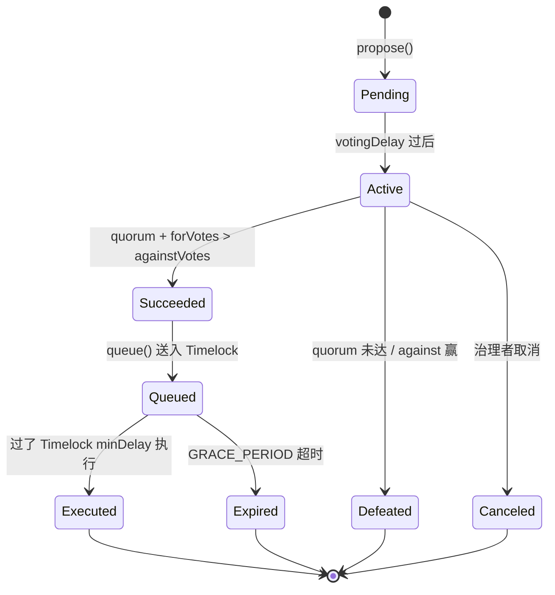

# DAO 治理：Tally / Snapshot / Aragon、Token Voting、Delegation 与 Governor 合约

> **TL;DR**：DAO（Decentralized Autonomous Organization）通过智能合约承载集体决策与资金。最主流的链上治理栈是 OpenZeppelin `Governor` + `ERC20Votes`（源自 Compound Bravo），搭配 Timelock 延迟执行；前端层 Tally 提供提案与投票 UI，链下 Snapshot 通过签名投票降低 gas 但不自动执行。Aragon 则提供更接近「链上法人」的插件化治理框架（OSx）。本篇讲清 Governor 状态机、投票权快照与 Checkpoint、delegation 模型、Snapshot 的 off-chain 投票机制、Timelock 的角色分离，以及代表性事件：Compound $56M 提案误操作、Uniswap Fee Switch 讨论、Arbitrum 空投后的 AIP-1 治理危机。

## 1. 背景与动机

DAO 概念起源于 2013 年 Daniel Larimer 的 DAC（Decentralized Autonomous Corporation）；2016 年以太坊上的 The DAO 因递归重入漏洞被盗 ~$60M ETH，导致 ETH/ETC 硬分叉，是 Web3 治理史的至暗时刻。此后 DAO 停滞数年，直到 2020 年 Compound 发布 Governor Alpha（后升级为 Bravo），把链上治理模式标准化：治理代币 COMP → delegate → 提案 → 投票 → Timelock → 执行。Uniswap、Aave、MakerDAO、ENS 等项目纷纷采用这一模型。

链上治理有三大硬核约束：(a) gas 成本；(b) 投票率低（普通 holder 不参与）；(c) 长提案周期慢。Snapshot（2020，Balancer 团队发起）因此提出「off-chain voting」：用户用钱包签署 EIP-712 消息，投票结果存在 IPFS 和中心化 hub，无需 gas；但需要链下信任并要依靠 multisig 手动执行。大量 DAO 混合使用：先 Snapshot 讨论 / 温度测量 → 链上 Governor 正式提案 → Timelock 执行。

Aragon 2017 年起另辟蹊径，提供完整的 DAO 操作系统（OSx）：把治理拆成「插件 + DAO kernel」，支持多签、token voting、dispute resolution（Aragon Court），被 Decentraland、API3、Lido 部分使用。2023 年 Aragon 核心团队对内争议后部分项目流失，但 OSx v1.3（2024）仍在使用。Tally.xyz（2021）则把自己定位为「DAO 入口门户」：index 所有 Compound-style DAO 的提案、投票、delegate ranking。

## 2. 核心原理

### 2.1 Governor 状态机

OpenZeppelin `Governor` 的提案生命周期（8 个 state）：



形式化：一个提案 $P = (targets, values, calldatas, description)$，哈希 $h = \mathrm{keccak256}(P)$ 作为 ID（自 OZ v4.3 起；早期 Compound 用递增整数）。状态转移由区块号驱动，`votingDelay`（proposal 生效前的等待）、`votingPeriod`（开放投票区块数）、`quorum(blockNumber)`（通过所需最低投票权）为关键参数。

### 2.2 投票权快照与 Checkpoint

链上治理的核心数据结构是 `ERC20Votes.checkpoints[account]`：一组 `(uint32 fromBlock, uint224 votes)`，记录每次余额/delegation 变化时的投票权。查询 `getPastVotes(account, blockNumber)` 通过二分搜索返回指定区块的投票权，保证提案中途转账无法影响结果（防 vote-buying 的简单版本）。

不变式：
1. 任一 account 的 checkpoints 按 block 递增。
2. 投票权 = delegatee 收到的 delegation 总和。
3. 同一 token balance 只能委托给一个地址（单委托）。

### 2.3 Delegation 模型

Compound-style DAO 要求用户先 `delegate(address)`（可以 delegate 给自己）才能投票。这一设计的经济学在于：大部分 holder 不活跃，delegation 让专业投票者（delegate）汇聚投票权；同时避免「被动投票权」让恶意 flash loan 借一瞬间代币就能投票（因为需要在 proposal snapshot 之前已委托）。

Delegation 变体：
- **单委托（one-to-one）**：Compound / UNI / AAVE 采用。
- **Quadratic voting**：投票成本按投票数平方增长，用于削弱鲸鱼（Gitcoin、snapshot 插件）。
- **Conviction Voting**：投票权随时间积累，适合长期资金分配（1Hive）。
- **Optimistic / Veto**：默认通过，社区可否决（Optimism Citizens' House）。
- **Futarchy**：基于预测市场的治理（Gnosis 实验）。

### 2.4 Snapshot 链下投票

Snapshot 的签名投票流程：
1. Space 管理员在 snapshot.org 注册 ENS 域名（如 `uniswap.eth`），配置 strategies（投票权计算规则，如 `erc20-votes` + `delegation`）。
2. 提案人提交 title/body/choices，选择区块高度作为 snapshot（所有地址投票权 freeze 在该高度）。
3. 用户通过钱包签署 EIP-712 类型消息（vote），投票存 IPFS + Snapshot Hub。
4. 结束时脚本汇总，结果存 IPFS；链下 multisig 或 Safe 模块执行。

Snapshot 的 Safe 插件（safesnap）可以半自动化：Realitio oracle 读取 snapshot 结果，注入 Gnosis Safe Zodiac module，若无人挑战则自动执行。

### 2.5 关键参数（以 Compound Bravo 为例，其它 Governor 类似）

| 参数 | Compound | Uniswap | Arbitrum | Optimism |
| --- | --- | --- | --- | --- |
| 提案门槛 | 25K COMP | 0.25% UNI | 5M ARB | N/A（Citizens）|
| Quorum | 400K COMP (4%) | 4% UNI | 3% ARB | — |
| Voting Delay | 2 blocks | 7200 blocks (~1 day) | 3 days | — |
| Voting Period | 3 days | 7 days | 14 days | — |
| Timelock Delay | 2 days | 2 days | 3 days | — |
| Grace Period | 14 days | 14 days | 21 days | — |

### 2.6 边界条件与失败模式

- **低投票率**：大多数 DAO 投票率 < 20%，少数 delegate 决定命运。
- **Flash loan 攻击**：借来大量 token 投票，防御：snapshot 提前、delegation 时延。2022 年 Beanstalk Farms 被 flash-loan 治理攻击，损失 ~$182M。
- **提案描述 vs 实际 calldata 不符**：Tally 前端有 simulation / Seatbelt 工具预审；实际曾出现 Compound Proposal 117 奖励误发 $56M。
- **Timelock 被攻占**：若 Timelock admin 不是 Governor，可能被单签名私钥控制。2022 年 Tornado Cash 治理被收购事件：攻击者买下大部分投票权，提案转移所有 TORN。
- **Cancel / Veto 过度集中**：某些 DAO 给 Guardian 或 Security Council 无条件否决权，等同中心化。

## 3. 架构剖析

### 3.1 分层视图

1. **代币层**：ERC20Votes / ERC721Votes，提供快照与 delegation。
2. **治理合约层**：Governor + 扩展模块（Settings / Timelock / Votes / CountingSimple / Quorum）。
3. **时延层**：TimelockController，持有资金与特权账户角色。
4. **执行层**：通过 Timelock 调用目标合约（Treasury / Proxy admin / Params）。
5. **前端层**：Tally / Snapshot / 自建 DAO Portal。
6. **社交层**：论坛（Commonwealth、Discourse）+ Discord + 签署讨论。

### 3.2 核心模块清单

| 模块 | 职责 | 依赖 | 可替换性 |
| --- | --- | --- | --- |
| ERC20Votes | 投票权 Checkpoint | OZ contracts | 高（Votes / VotesComp）|
| Governor | 提案与状态机 | Votes, Timelock | 中 |
| GovernorCountingSimple | for/against/abstain 计数 | — | 可换 Fractional |
| GovernorVotesQuorumFraction | 动态 quorum | Votes | 可换 |
| TimelockController | 延迟执行 | — | 高 |
| Tally GraphQL Indexer | 展示层 | The Graph | 可替换 |
| Snapshot Strategies | 链下投票权计算 | 各 token 合约 | 高 |
| Aragon OSx DAO | 插件化内核 | Plugin Repo | 替换成本高 |

### 3.3 数据流 / 生命周期

以 Uniswap 提案「fee switch on UNI/ETH 0.3%」为例：

1. **讨论 & 温度**：Uniswap 论坛提议 → Snapshot `uniswap.eth` 温度测量，> 80% 支持。
2. **链上提案**：有人在 Tally 前端生成 `propose(targets, values, calldatas, description)`，调用 `GovernorBravoDelegate`；需要至少 2.5M UNI delegation。
3. **等待 voting delay**：7200 区块（~1 天）后进入 Active，用户 `castVote` 或 `castVoteBySig` 投票。
4. **Quorum 校验**：7 天投票期结束，for/against 差值 + quorum 判断是否 Succeeded。
5. **Queue**：提案人或任何地址调用 `queue(proposalId)`，送入 Timelock，2 日 ETA。
6. **Execute**：Timelock 到期后 `execute(proposalId)`，目标合约（UniswapV3Factory.setFeeProtocol）被调用。
7. **生效**：Pool fee collector 开始累计 protocol fees。

### 3.4 客户端多样性 / 参考实现

- **OpenZeppelin Governor**（Solidity）：最通用，Uniswap / ENS / Compound v3 / Arbitrum / Optimism / Aave 等都用。
- **Compound Governor Bravo**：Compound 自研，Uniswap V2 治理的原版。
- **Aragon OSx**：Plugin-based，支持 TokenVoting / Multisig / AddressList / Admin plugins。
- **DAOhaus / Moloch v3**：面向 Grants DAO，简洁的 Ragequit 机制。
- **Tally**：主流 Governor UI。
- **Snapshot**：链下投票 hub，开源 snapshot-labs/snapshot。

### 3.5 扩展 / 互操作接口

- **EIP-6372 Clock**：Governor 支持以时间戳而非区块号计时。
- **EIP-5805 Votes**：投票权 delegation 标准化接口。
- **GovernorFractionalVoting**：允许单地址拆分投票（Nouns DAO 使用）。
- **Propdates**：ENS 提案进度透明化。
- **Zodiac Modules**：Gnosis Safe 插件执行 Snapshot 结果 / Realitio oracle。
- **Cross-chain Governance**：Hop/LayerZero 跨链同步投票结果（例：Aave on Arbitrum）。

## 4. 关键代码 / 实现细节

ERC20Votes Checkpoint 写入逻辑（`openzeppelin-contracts@5.0.0`，`contracts/token/ERC20/extensions/ERC20Votes.sol:~140`）：

```solidity
// openzeppelin-contracts/contracts/token/ERC20/extensions/ERC20Votes.sol:113
function _moveVotingPower(address src, address dst, uint256 amount) private {
    if (src != dst && amount > 0) {
        if (src != address(0)) {
            (uint256 oldWeight, uint256 newWeight) = _writeCheckpoint(_checkpoints[src], _subtract, amount);
            emit DelegateVotesChanged(src, oldWeight, newWeight);
        }
        if (dst != address(0)) {
            (uint256 oldWeight, uint256 newWeight) = _writeCheckpoint(_checkpoints[dst], _add, amount);
            emit DelegateVotesChanged(dst, oldWeight, newWeight);
        }
    }
}

function getPastVotes(address account, uint256 blockNumber) public view returns (uint256) {
    require(blockNumber < clock(), "ERC20Votes: future lookup");
    return _checkpointsLookup(_checkpoints[account], blockNumber);
}
```

Governor `castVote` 核心（`GovernorCountingSimple.sol`）：

```solidity
function _countVote(uint256 proposalId, address account, uint8 support, uint256 weight, bytes memory)
    internal virtual override
{
    ProposalVote storage proposalVote = _proposalVotes[proposalId];
    require(!proposalVote.hasVoted[account], "GovernorVotingSimple: vote already cast");
    proposalVote.hasVoted[account] = true;

    if (support == uint8(VoteType.Against)) proposalVote.againstVotes += weight;
    else if (support == uint8(VoteType.For)) proposalVote.forVotes += weight;
    else if (support == uint8(VoteType.Abstain)) proposalVote.abstainVotes += weight;
    else revert("GovernorVotingSimple: invalid value for enum VoteType");
}
```

TimelockController `schedule` 与 `execute`（`TimelockController.sol:241`）：

```solidity
function schedule(address target, uint256 value, bytes calldata data, bytes32 predecessor, bytes32 salt, uint256 delay)
    external onlyRoleOrOpenRole(PROPOSER_ROLE)
{
    bytes32 id = hashOperation(target, value, data, predecessor, salt);
    _schedule(id, delay);
    emit CallScheduled(id, 0, target, value, data, predecessor, delay);
}

function execute(address target, uint256 value, bytes calldata payload, bytes32 predecessor, bytes32 salt)
    external payable onlyRoleOrOpenRole(EXECUTOR_ROLE)
{
    bytes32 id = hashOperation(target, value, payload, predecessor, salt);
    _beforeCall(id, predecessor);
    (bool success, ) = target.call{value: value}(payload);
    require(success, "TimelockController: underlying transaction reverted");
    _afterCall(id);
}
```

## 5. 演进与版本对比

| 阶段 | 时间 | 代表 | 变化 |
| --- | --- | --- | --- |
| The DAO | 2016 | slock.it | 首个大规模 DAO，重入漏洞 |
| Governor Alpha | 2020-03 | Compound | 链上投票 + Timelock |
| Snapshot | 2020-08 | Balancer | 链下签名投票 |
| Governor Bravo | 2021 | Compound | 支持 proposal edit 与 quorum fraction |
| OZ Governor | 2021-10 | OpenZeppelin | 模块化重写 |
| Aragon OSx | 2023 | Aragon | 插件化 DAO 框架 |
| Arbitrum DAO | 2023-03 | Offchain Labs | AIP-1 乌龙引发治理重构 |
| Optimism Citizens' | 2023 | OP | 双院制（Token House + Citizens House）|
| EIP-6372 / 5805 | 2023 | — | Clock & Votes 标准化 |
| Nouns Fork 机制 | 2023 | Nouns DAO | 可拆分 DAO 逃逸 |

## 6. 实战示例

用 Foundry 部署最小 Governor：

```solidity
// src/Gov.sol
pragma solidity ^0.8.24;
import "@openzeppelin/contracts/governance/Governor.sol";
import "@openzeppelin/contracts/governance/extensions/GovernorSettings.sol";
import "@openzeppelin/contracts/governance/extensions/GovernorCountingSimple.sol";
import "@openzeppelin/contracts/governance/extensions/GovernorVotes.sol";
import "@openzeppelin/contracts/governance/extensions/GovernorVotesQuorumFraction.sol";
import "@openzeppelin/contracts/governance/extensions/GovernorTimelockControl.sol";

contract MyGov is Governor, GovernorSettings, GovernorCountingSimple,
    GovernorVotes, GovernorVotesQuorumFraction, GovernorTimelockControl
{
    constructor(IVotes token, TimelockController tl)
        Governor("MyGov")
        GovernorSettings(1 /*voting delay blocks*/, 45818 /*~1 week*/, 0)
        GovernorVotes(token)
        GovernorVotesQuorumFraction(4) // 4%
        GovernorTimelockControl(tl) {}
    // ... 必需的 override ...
}
```

```bash
# 部署 token / timelock / gov，delegate
cast send $TOKEN "delegate(address)" $ME --private-key $PK
# 发起提案：转账 1 ETH 从 treasury 给 Alice
CALLDATA=$(cast calldata "transfer(address,uint256)" $ALICE 1000000000000000000)
cast send $GOV "propose(address[],uint256[],bytes[],string)" \
  "[$TOKEN]" "[0]" "[$CALLDATA]" "Send 1 ETH to Alice" --private-key $PK
# 等 voting delay → 投票 → queue → execute
```

预期：事件 `ProposalCreated` → `VoteCast` → `ProposalQueued` → `ProposalExecuted`，Alice 收到 1 ETH。

## 7. 安全与已知攻击

1. **The DAO Reentrancy（2016）**：递归调用耗尽 DAO，催生 ETH/ETC 硬分叉。
2. **Compound Proposal 117（2021-09）**：COMP distribution bug 导致超发约 280K COMP（~$90M），修复提案分两阶段。
3. **Beanstalk Flash Loan Governance（2022-04）**：攻击者借 flash loan 买 stalk 投票，通过恶意提案转走 $182M。根因：Beanstalk 无 snapshot + 无 timelock delay。
4. **Tornado Cash 治理收购（2023-05）**：攻击者用隐藏的 emergency stop 代码伪装成常规 proposal 通过，获得管理员权限，最终归还。教训：Proposal simulation 与代码审查不足。
5. **Arbitrum AIP-1（2023-03）**：空投后基金会「已将 7.5 亿 ARB 转移到自己地址」被社区发现，触发治理危机。教训：治理协议启动前基金会 unilateral 动作引发信任失衡。
6. **Uniswap Fee Switch 多次搁浅（2022–2024）**：虽然温度测量通过，但法税与 a16z 双头否决反复让提案停摆，成为链上治理博弈经典。
7. **Sushi head chef 权力集中**：主厨私钥一度掌控 SUSHI migration，引爆治理改革呼声。

## 8. 与同类方案对比

| 维度 | Compound/Uniswap Governor | Snapshot + Safe | Aragon OSx | Moloch / DAOhaus | Optimism Citizens |
| --- | --- | --- | --- | --- | --- |
| 投票位置 | 链上 | 链下签名 | 链上（可插件）| 链上 | 链上（非 token）|
| 执行机制 | Timelock 自动 | multisig 手动 | 插件 | 直接 | 双院制 |
| 适用规模 | 大型协议 | 任意 | 大/中型 | Grants DAO | 公共品资助 |
| Gas 成本 | 高 | 极低 | 中 | 低 | 中 |
| 抗 flash loan | 快照+delegation | 依靠 snapshot 区块 | 插件 | Ragequit 机制 | 非 token，免疫 |
| 代表用户 | Uniswap / AAVE / ARB | Balancer / SafeDAO | Lido / API3 | MetaCartel | Optimism |

## 9. 延伸阅读

- **官方文档**：docs.openzeppelin.com/contracts/5.x/governance、docs.tally.xyz、docs.snapshot.org、docs.aragon.org。
- **博客 / 文章**：Vitalik 《On Collusion》、《DAOs are not corporations》、a16z *Lightspeed Democracy*、Paradigm *What DAOs could borrow from Constitutions*。
- **论文**：Feichtinger et al. *The Hidden Shortcomings of (D)AOs* (2023)。
- **视频**：Devcon DAO Track、Schelling Point 会议。
- **数据**：deepdao.io、Tally Explore、boardroom.io、Dune `@gm365/governance`。

## 10. 术语表

| 术语 | 英文 | 释义 |
| --- | --- | --- |
| DAO | Decentralized Autonomous Organization | 去中心化自治组织 |
| Governor | Governor Contract | 治理合约标准 |
| Timelock | Timelock Controller | 延迟执行器 |
| Delegation | Vote Delegation | 投票权委托 |
| Quorum | Quorum | 法定投票数 |
| Checkpoint | Vote Checkpoint | 投票权快照点 |
| Snapshot | Off-chain Voting | 链下签名投票 |
| Proposal Threshold | Proposal Threshold | 提案所需最低投票权 |
| Grace Period | Grace Period | Timelock 过期前的窗口 |
| Veto | Guardian Veto | 监护人否决权 |
| Multisig | Multisig | 多签钱包 |
| Quadratic Voting | QV | 二次方投票 |
| Conviction Voting | Conviction Voting | 信念投票（积累制） |

---

*Last verified: 2026-04-22*
