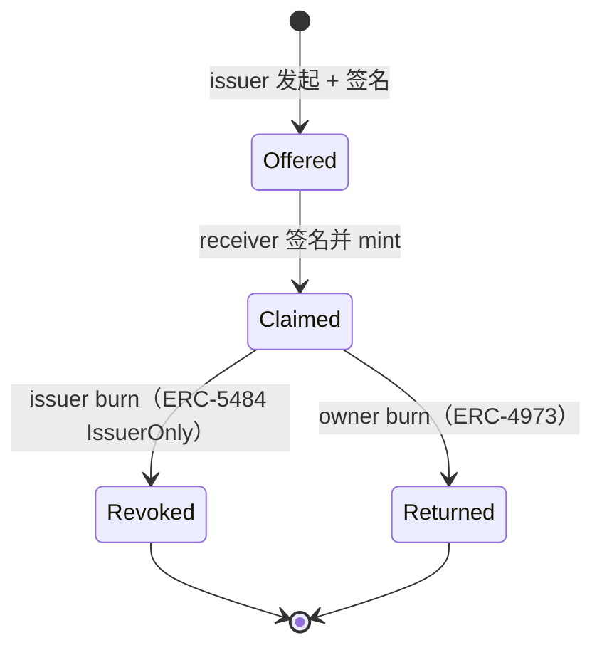

# SBT 灵魂绑定代币（Soulbound Token）

> **TL;DR**：SBT（Soulbound Token）由 Vitalik Buterin、Glen Weyl、Puja Ohlhaver 在 2022-05 论文《Decentralized Society: Finding Web3's Soul》中正式提出，是一类**不可转让**的 NFT，代表与某个"Soul"（即账户/身份）绑定的凭证（学历、雇佣、社区成员、出勤、信用分等）。落地标准为 ERC-5114（持有后不可变）、ERC-5484（可烧不可转）、ERC-4973（Account-bound）、以及 Verax Attestation、EAS（Ethereum Attestation Service）。实际应用里，Gitcoin Passport、Binance Account Bound Token、Galxe OAT 都是 SBT 变种。本篇梳理论文原意、主流实现差异、可验证凭证（VC）与 SBT 的关系、以及身份与抗女巫的真实 UX。

## 1. 背景与动机

2022 年前，Web3 身份层几乎全靠"有多少钱"衡量。没有：学历、雇佣、社区贡献、KYC 状态 —— 因此 DAO 投票、空投筛选高度受女巫攻击。

Vitalik 等人提出的 SBT 愿景：把这些"非金融属性"变成**不可转让的链上凭证**，从而：

- **抗女巫**：空投或 DAO 投票只分给持有特定 SBT 的"Soul"。
- **信用借贷**：用 SBT（还款记录、稳定收入）代替超额抵押。
- **去中心化社会（DeSoc）**：Soul 互相给 SBT，形成可验证的社会关系图谱。

2022 论文后一年内 EIP 提出、Binance BAB、Optimism Citizen House、Gitcoin Passport 相继上线。但 2023-2025 SBT "炒作与实际落地"的反差引发批评：多数"SBT" 仍是可转让 NFT 换个名字；真正的可验证凭证正由 EAS/Verax 等 Attestation 基础设施主导。

## 2. 核心原理

### 2.1 形式化定义：Soul / Token / Attestation

论文给出的三元：

- **Soul (S)**：一个账户（可多账户拼接），代表一个实体（人、机构、合约）。
- **Token (T)**：一份 SBT，由 issuer $I$ 颁发给 $S$，含 metadata $m$，不可转移。
- **Attestation**：某个 Soul 对另一个 Soul 发出的断言。SBT 是一种"物化的" attestation。

形式化地，SBT 不变式：

$$
\text{transfer}(S_1, S_2, T) \to \text{revert}, \quad \forall\, S_1 \neq \emptyset, S_2 \neq \emptyset
$$

只有 `mint` 与可选的 `burn` / `recover` 是合法状态转移。

### 2.2 三个对立的 EIP 标准

**ERC-5114（Badge）** — Gabriel Shapiro 提出：
- 部署时 mint，之后**完全不可修改、不可 burn、不可 transfer**。
- metadata 只读。典型场景："我参与了 ETHGlobal 2023 Hackathon"。

**ERC-5484（Consensual SBT）** — 提出三种 BurnAuth：`{IssuerOnly, OwnerOnly, Both, Neither}`。允许 issuer 或 owner 销毁。

**ERC-4973（Account-bound Token, ABT）** — Tim Daubenschütz：持有者可 `burn`（退还），issuer 不能强取。同意接受 token 需双方签名（EIP-712 typed data），避免"空投垃圾"。

**EIP-5192（Minimal Soulbound NFT）**：最简单扩展 ERC-721，加 `function locked(tokenId) view returns bool`，和 `Locked(uint256 tokenId)` event。Drop-in 替换，已被 OpenSea 尊重（锁定 NFT 不可挂单）。

### 2.3 子机制一：不可转移的实现

实现上有三种方式：

1. **Override `_update` / `_transfer`**：在转账入口 revert。
2. **setApprovalForAll 禁用**：攻击者无法 approve，但自身签名仍可转。
3. **EIP-5192 locked 标志**：前端/市场尊重，但合约仍允许。

实际代码：

```solidity
// SBT.sol
function _update(address to, uint256 tokenId, address auth) internal override returns (address) {
    address from = _ownerOf(tokenId);
    require(from == address(0) || to == address(0), "SBT: non-transferable"); // 仅 mint 和 burn 通过
    return super._update(to, tokenId, auth);
}
```

### 2.4 子机制二：同意接收（Consensual Mint）

"ABT" 做法：issuer 与 receiver 都签 EIP-712 typed data，receiver 提交交易：

```solidity
struct Agreement { address issuer; address receiver; bytes32 metaURIHash; uint256 nonce; }
function take(Agreement calldata a, bytes calldata sigIssuer) external {
    require(msg.sender == a.receiver, "only receiver");
    bytes32 digest = _hashTypedData(a);
    require(ECDSA.recover(digest, sigIssuer) == a.issuer, "bad sig");
    _safeMint(a.receiver, nextId++);
}
```

好处：**不能空投骚扰**，必须 receiver 主动 claim。缺点：两步 UX。

### 2.5 子机制三：可验证凭证（VC）与 Attestation 融合

2024 后，业界趋向把"链下 VC（W3C Verifiable Credential）+ 链上 Attestation"结合：

- Issuer 用 EIP-712 / BBS+ 签发 VC。
- 用户在 EAS / Verax 上把 VC 的 hash 作为 attestation 存链。
- 其他合约 `resolve(attestationUID)` 读取。
- 优势：隐私（VC 本身可在链下或 ZK 证明）、成本（大多 attestation 不上链，仅 hash）。

EAS schema 例子：

```
KYC_SCHEMA: bytes32 kycLevel, uint64 expiresAt, string country
```

### 2.6 子机制四：私密 SBT（ZK-SBT）

直接公开 SBT 暴露用户行为。解法：

- **Privacy Pools（Vitalik 2023）**：zk proof 证明"我持有某类 SBT 但不暴露具体 id"。
- **Sismo Data Vaults**（已关闭）、**Holonym**、**Clique**：发行 ZK-friendly 凭证。
- **Semaphore** + Group membership：持有 SBT = 进入某个 Merkle group。

### 2.7 关键参数与使用数据（2026）

| 项目 | 数量级 | 备注 |
| --- | --- | --- |
| Gitcoin Passport 持有人 | ~1.5M | 反女巫基础设施 |
| Binance BAB | ~2M | KYC 凭证 |
| Galxe OAT | ~50M | 多数不严格 SBT（可转） |
| EAS Attestation 数 | ~60M | 链上 attestation |
| Optimism AttestationStation | ~10M | Citizenship 相关 |

### 2.8 边界条件与失败模式

- **丢失私钥** = Soul 消失：Vitalik 原论文建议 "community recovery"（guardian 社群多签恢复），但大多项目只支持 mint 新 SBT。
- **Issuer 作恶**：发布假凭证。需 issuer 可追溯声誉。
- **UX 复杂**：用户要同时签 VC + mint SBT。
- **隐私泄露**：公开 SBT = 链上档案，尤其在 KYC 合规场景。
- **Silo**：不同 issuer 各自 SBT 格式不互通。EAS schema registry 缓解。

### 2.9 图示：SBT 生命周期



## 3. 架构剖析

### 3.1 分层视图：现代 SBT 栈（EAS-based）

```
┌─────────────────────────────────┐
│ dApp (Gitcoin Passport, Optimism)│
├─────────────────────────────────┤
│ SDK (eas-sdk, verax-sdk)         │
├─────────────────────────────────┤
│ Schema Registry                  │
├─────────────────────────────────┤
│ Attestation Contract (EAS/Verax) │
├─────────────────────────────────┤
│ Resolver Contracts (Hook)        │
├─────────────────────────────────┤
│ (可选) SBT-as-ERC-721 with Lock  │
└─────────────────────────────────┘
```

### 3.2 核心模块清单

| 模块 | 职责 | 代表 | 可替换 |
| --- | --- | --- | --- |
| Identity Aggregator | 组合多源 attestation 得分 | Gitcoin Passport | 高 |
| Attestation Protocol | 链上 attestation | EAS / Verax | 中 |
| Schema Registry | 统一 schema | EAS Schema | 中 |
| Issuer | 发凭证 | University / Binance / Gitcoin | 高 |
| Wallet UX | 管理 SBT | Rainbow / Rabby / Passport | 高 |
| Resolver | 验证回调 | EAS Resolver | 中 |
| ZK Layer | 隐私证明 | Semaphore / Holonym | 高 |

### 3.3 生命周期：Gitcoin Passport Stamps

1. 用户连接钱包 → 访问 passport.gitcoin.co。
2. 选择 verification（Twitter、GitHub、BrightID、Proof of Humanity、ENS 等 30+）。
3. 每个 Stamp 由相应 issuer 签发 VC（DID-based）。
4. Passport 算法汇总 Stamp → score（unique humanity probability）。
5. Stamp 存 Ceramic（IPFS-like）或上链 EAS。
6. Grants Round / dApp 按 `score > threshold` 筛选女巫。
7. 用户可选择上链：`GitcoinPassportResolver` 生成 attestation。

### 3.4 客户端与实现

- **EAS**：multichain（Ethereum、Optimism、Base、Arbitrum、Polygon、Scroll 等），开源合约。
- **Verax**：Consensys 主导，Linea 生态原生。
- **Sign Protocol**（原 EthSign）：跨链 attestation。

### 3.5 接口

- **EAS.attest / multiAttest**：核心写入。
- **getAttestation(uid)**：读。
- **Indexer**：EAS 有自带 GraphQL endpoint。

## 4. 关键代码：最小 SBT（EIP-5192 风格）

```solidity
// contracts/SimpleSBT.sol
pragma solidity ^0.8.20;

import "@openzeppelin/contracts/token/ERC721/ERC721.sol";

interface IERC5192 {
    event Locked(uint256 tokenId);
    event Unlocked(uint256 tokenId);
    function locked(uint256 tokenId) external view returns (bool);
}

contract SimpleSBT is ERC721, IERC5192 {
    address public issuer;
    uint256 private _next;
    mapping(uint256 => bool) private _locked;

    constructor() ERC721("OrgBadge", "OB") { issuer = msg.sender; }

    function issue(address to, string calldata) external returns (uint256 id) {
        require(msg.sender == issuer, "only issuer");
        id = ++_next;
        _safeMint(to, id);
        _locked[id] = true;
        emit Locked(id);
    }

    function revoke(uint256 id) external {
        require(msg.sender == issuer, "only issuer");
        _burn(id);
    }

    function locked(uint256 id) external view returns (bool) {
        ownerOf(id); // revert if not exist
        return _locked[id];
    }

    function _update(address to, uint256 tokenId, address auth) internal override returns (address) {
        address from = _ownerOf(tokenId);
        require(from == address(0) || to == address(0), "SBT");
        return super._update(to, tokenId, auth);
    }
}
```

## 5. 演进与版本对比

| 时间 | 事件 |
| --- | --- |
| 2022-05 | Vitalik et al. DeSoc 论文 |
| 2022-07 | EIP-4973 ABT 提案 |
| 2022-09 | Binance 发 BAB（KYC 账户绑定） |
| 2022-10 | Phi、POAP 改版 SBT 化 |
| 2023-02 | EAS v1 mainnet |
| 2023-Q2 | Gitcoin Passport v2 上 EAS |
| 2024 | Verax mainnet（Linea） |
| 2024-Q4 | Sign Protocol multi-chain attestation |
| 2025 | ZK-SBT（Holonym、Clique 成熟） |

## 6. 实战示例：Foundry 部署并 mint SBT

```bash
forge init sbt && cd sbt
# 把 SimpleSBT.sol 放 src/
forge test
forge create src/SimpleSBT.sol:SimpleSBT --rpc-url $RPC --private-key $PK
cast send $ADDR "issue(address,string)" $ALICE "ipfs://Qm..." --private-key $PK
cast call $ADDR "balanceOf(address)(uint256)" $ALICE
```

## 7. 安全与已知攻击

- **"Spam SBT"**：任何人可 mint 垃圾 SBT 到他人地址（非 Consensual 设计）。解法：EIP-4973 双签。
- **Issuer 私钥泄露 (2024 Galxe)**：攻击者给自己发放 OAT，空投获利。issuer 应用 multisig。
- **Gitcoin Passport 女巫（2023）**：Sybil 通过大规模 BrightID / ENS 伪造小额通过筛选。每轮改算法。
- **隐私泄露**：Binance BAB 公开后，用户地址直接关联 KYC 身份，社工攻击面增大。
- **Phishing**：伪造 issuer 发 fake SBT，引诱用户签 approve（攻击 ERC-721 部分实现）。

## 8. 与同类方案对比

| 维度 | SBT | POAP | Verifiable Credential (W3C) | NFT |
| --- | --- | --- | --- | --- |
| 可转 | 否 | 可（弱反对） | N/A（链下） | 是 |
| 链上 | 是 | 是 | 可选 | 是 |
| 标准 | ERC-5192/5484/4973 | 自定 | W3C VC DM | ERC-721 |
| 隐私 | 低（公开） | 低 | 高（ZK） | 低 |
| 采用 | 中 | 大 | 大 | 大 |
| 签名 | 单方 mint | 单方 mint | 双方签 | 单方 mint |

## 9. 延伸阅读

- Weyl, Ohlhaver, Buterin 2022: "Decentralized Society: Finding Web3's Soul"。
- EIP-5114、EIP-5484、EIP-4973、EIP-5192。
- EAS docs：https://docs.attest.sh
- Verax docs：verax.gitbook.io
- Gitcoin Passport 开源库。
- 中文：白泽研究院《SBT 与数字身份》。

## 10. 术语表

| 术语 | 英文 | 释义 |
| --- | --- | --- |
| SBT | Soulbound Token | 不可转让的凭证代币 |
| Soul | Soul | 代表实体的账户/身份 |
| Attestation | Attestation | 链上断言，EAS 核心 |
| VC | Verifiable Credential | W3C 可验证凭证 |
| DeSoc | Decentralized Society | 去中心化社会 |
| DID | Decentralized Identifier | W3C 去中心化身份 |
| POAP | Proof of Attendance Protocol | 出勤证明 NFT |

---

*Last verified: 2026-04-22*
