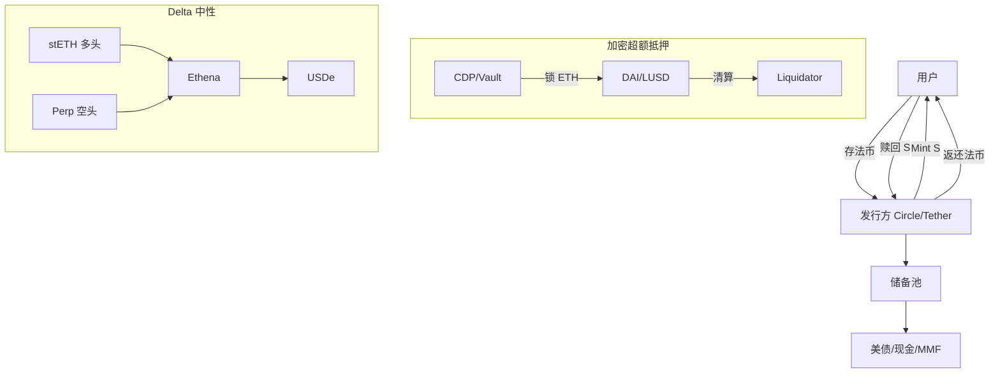

# 稳定币全景（Stablecoins Landscape）

> **TL;DR**：稳定币是锚定目标资产（通常为 USD）的加密代币，是 Web3 流动性底座与支付轨道。按抵押形态分为法币储备（USDT/USDC/PYUSD）、加密超额抵押（DAI/LUSD/crvUSD）、算法或半算法（UST/FRAX 早期）、Delta 中性合成（Ethena USDe）四大家族。截至 2026 年 Q1，总市值约 2200–2400 亿美元，USDT + USDC 合计占比 ≈ 85%。MiCA（欧盟）、香港《稳定币条例》、美国 GENIUS Act 正在重塑发行侧规则；储备透明度、赎回权、跨链统一、制裁合规是核心议题。

## 1. 背景与动机

加密原生资产（BTC/ETH）在日内波动可达 5–10%，无法承担计价、记账与跨境结算功能。2014 年 Realcoin（后改名 Tether）首次提出 "1 USD = 1 USDT" 的中心化法币抵押模型，解决了交易所之间的计价基准问题；2017 年 MakerDAO 以 ETH 超额抵押铸造 DAI，开启去中心化稳定币；2020 年 Terra 用"铸销套利"算稳 UST 冲到 187 亿美元市值，2022 年 5 月崩盘归零。2023 年 USDC 因硅谷银行事件（Circle 持有 33 亿美元存款）短暂脱锚至 $0.87，暴露了"法币储备 ≠ 无风险"。2024–2026 年，RWA 化的代币化国债（BUIDL、OUSG、USDY）与 Delta 中性合成稳定币（USDe）重塑格局。

稳定币服务四类需求：(1) **交易计价与避险**：CEX/DEX 必备计价单位；(2) **跨境支付与汇款**：Tron USDT 在拉美/东南亚/非洲成为美元替代；(3) **DeFi 抵押与流动性**：Aave/Morpho/Curve 的核心资产；(4) **链上储蓄**：sUSDe/sDAI/USDY 将现实世界收益上链。

## 2. 核心原理

### 2.1 形式化定义：锚定机制与铸赎方程

设稳定币 S 的目标价格 $P^* = 1 \text{ USD}$，实际市价为 $P_t$。发行协议通过 **铸造/赎回接口** 提供套利路径：若 $P_t > P^*$，套利者向协议存入 $c$ 单位抵押品（法币、加密资产、合成头寸），铸造 $m(c)$ 单位 S 并在市场抛售获利；若 $P_t < P^*$，套利者以市价买入 S 并向协议赎回抵押品。平衡条件为：

$$\lim_{t \to \infty} P_t = P^* \iff \text{Redemption guarantee + Atomic arbitrage}$$

不同类别的差别在于 $m(\cdot)$ 函数：
- **法币抵押**：$m(c) = c$（1:1 存款铸造），赎回依赖发行方诚信与法律可执行性。
- **加密超额抵押**：$m(c) = \frac{c \cdot P_c}{\text{CR}}$，CR > 1（如 DAI 最低 145%）。
- **算法**：无外部抵押，$m(\cdot)$ 依赖内生治理代币的市场价值（反身性致命弱点）。
- **Delta 中性**：$m(c) = c \cdot P_c$，但协议同时在永续合约开等额空头，使净风险敞口 ≈ 0。

### 2.2 关键数据结构：储备证明（Proof of Reserves）

法币稳定币的核心数据结构是 **储备披露报告（Attestation Report）**，典型字段：
- `total_supply`：链上流通量（可通过 `totalSupply()` 直接验证）。
- `reserves.cash`：活期存款（多银行分散）。
- `reserves.treasury_bills`：美国国债（剩余期限 < 3 月为主）。
- `reserves.repo`：逆回购协议（隔夜 + 定期）。
- `reserves.mmf`：货币市场基金份额。
- `reserves.secured_loans`：担保贷款（USDT 历史上存在，USDC 不持有）。
- `reserves.other`：BTC/ETH/金/商业票据等。

每月由审计/证明机构（BDO、Grant Thornton、Deloitte）出具 ISAE 3000 证明。关键不变式：`sum(reserves) ≥ total_supply`，且应优先配置流动性分层（HQLA Level 1）。

### 2.3 子机制拆解

1. **Mint/Redeem API**：USDC/USDT 通过 Circle Mint、Tether Treasury 接口，仅服务 KYC 机构；散户通过二级市场（CEX/DEX）获取。
2. **链上合约与黑名单**：USDC/USDT 合约内置 `blacklist(address)` 函数，可由发行方冻结地址（截至 2026 Q1，USDT 累计冻结超 20 亿美元）。
3. **PSM（Peg Stability Module）**：DAI 通过 USDC→DAI 的 1:1 兑换模块抑制偏离，代价是 DAI 储备中 USDC 比例一度高达 60%。
4. **Delta 中性引擎**：Ethena 将 stETH 作为抵押，同时在 Binance/Bybit/OKX 开等额 ETH 永续空头，组合 delta ≈ 0，收益 = ETH staking yield + funding rate。
5. **跨链桥接**：CCTP（Circle Cross-Chain Transfer Protocol，burn-and-mint）将 USDC 原生跨链，避免 lock-and-mint 桥被黑事件；USDT 则通过第三方桥（LayerZero、Stargate）实现。
6. **收益分配层（sToken）**：sDAI（DSR 8%）、sUSDe（staking + funding）、sUSDS（Sky Savings Rate）通过 ERC-4626 封装，把协议收入分配给持有者。

### 2.4 参数与常量（2026 Q1 典型值）

| 稳定币 | 抵押率 CR | 稳定费 / 收益率 | 赎回费 | 最小赎回额 |
| --- | --- | --- | --- | --- |
| USDT | ≈ 100% (reserve) | 0（T+1 电汇） | 0.1% | $100K |
| USDC | ≈ 100% | 0 | 0 | $100 (Circle Mint) |
| DAI（Sky） | 145–175% | SSR 6–12% | 0（PSM） | 无 |
| USDe | ≈ 100% | sUSDe 10–30% | 0 | 无 |
| FRAX v3 | 100%（全抵押后） | sFRAX ≈ IORB | 0 | 无 |

### 2.5 边界条件与失败模式

- **挤兑（Bank Run）**：若市场信心崩塌，赎回请求集中释放，而储备含非流动性资产（商业票据、长期国债），即使"足额储备"也会脱锚（Tether 2018、2022 多次测试）。
- **桥接失败**：跨链锁仓桥被攻击（Wormhole、Ronin），导致"假 USDC"涌入其他链。
- **发行方制裁/监管冻结**：Tornado Cash 制裁后，Circle 冻结相关地址，引发审查抵抗讨论。
- **抵押品死亡螺旋**：算稳 UST、ESD 的反身性导致治理代币与稳定币互相拖累。
- **Oracle 操纵**：超额抵押稳定币依赖 Chainlink 价格，极端行情下喂价延迟会导致清算失灵（DAI 312 黑天鹅）。
- **Funding Rate 翻负**：Delta 中性模型在熊市 funding 长期为负时，保险基金消耗加速。

### 2.6 图示



```
稳定币分类矩阵
               ┌─ 中心化信任 ──────────── 去中心化 ──┐
法币/实物抵押:   USDT, USDC, PYUSD │ BUIDL, USDY │  —
加密超额抵押:    —                  │ DAI(旧)     │ LUSD, crvUSD, sUSDS
算法/弹性:       —                  │ FRAX v1/v2  │ AMPL, UST†
合成 Delta 中性: —                  │ USDe        │ —
```

## 3. 架构剖析

### 3.1 分层视图

1. **Issuance Layer（发行层）**：Circle/Tether/Paxos 等中心化实体，或 Maker/Liquity/Ethena 等协议合约。负责 Mint/Redeem 与储备管理。
2. **Settlement Layer（结算层）**：Ethereum L1、Tron、Solana、Base、Arbitrum 等链，执行转账、授权、黑名单调用。
3. **Liquidity Layer（流动性层）**：Uniswap/Curve/PancakeSwap 做市池、CEX 订单簿、聚合器 1inch/Odos，提供二级市场价格发现。
4. **Application Layer（应用层）**：Aave/Morpho 借贷、Pendle 利率交易、支付渠道（PayPal/Circle Mint/Bridge.xyz）。
5. **Compliance Layer（合规层）**：KYC/AML、Travel Rule、OFAC 制裁筛查、MiCA/GENIUS Act 监管接口。

### 3.2 核心模块清单

| 模块 | 职责 | 依赖 | 可替换性 |
| --- | --- | --- | --- |
| ERC-20 Token Contract | 转账、授权、黑名单 | EVM | 低（已被市场固化） |
| Mint/Redeem Gateway | 法币↔链上兑换 | 银行通道、KYC | 中（多发行方竞争） |
| Reserve Custodian | 储备资产托管 | BNY Mellon、Cantor | 中 |
| Attestation Engine | 月度储备证明 | 审计机构 | 中 |
| Cross-chain Bridge/CCTP | 跨链转移 | Messenger、Attestation Service | 低（需发行方支持） |
| Peg Stability Module (PSM) | 价格锚定辅助 | 其他稳定币池 | 高 |
| Liquidation Engine | 抵押品清算 | Oracle、Keeper | 高 |
| Governance DAO | 参数治理 | Gov Token | 高 |

### 3.3 数据流：一笔 USDC 跨链 + DeFi 闲置生息

1. 用户在 Coinbase 用 USD 买入 100K USDC → Circle 链上铸造到 Base 地址（~10 秒，gas ≈ 0.02 USDC）。
2. 用户通过 CCTP 将 USDC 从 Base 转到 Arbitrum：Base 端 `burn`，Circle Attestation Service 签名，Arbitrum 端 `mint`（~15 分钟，Hard Finality 等待）。
3. 用户在 Arbitrum 上 Aave 存款：`supply(USDC, 100K)` → mint aUSDC，开始获得借贷利息。
4. 月末：Circle 发布 Attestation，审计机构证明储备 ≥ supply。
5. 可观测点：Chainalysis/Nansen 追踪地址流向；OFX/Etherscan 查看合约事件；Circle Transparency Dashboard 显示实时储备。

### 3.4 客户端 / 参考实现

- **发行方合约**：USDC FiatTokenV2_2（Circle）、TetherToken（Tether，0xdac17f...）。
- **PSM**：MakerDAO `dss-psm` Solidity 仓库。
- **CCTP**：Circle `evm-cctp-contracts` GitHub 仓库。
- **Ethena**：`ethena-labs/ethena-contracts`，包含 Minting.sol、StakingRewardsDistributor.sol。

### 3.5 扩展 / 互操作接口

- EIP-3009（Transfer With Authorization）：USDC v2 支持无 gas 授权。
- EIP-2612（Permit）：签名授权，免单独 approve。
- CCTP v2：支持 Fast Transfer（软终局性）与 Hooks。
- ERC-4626：sUSDe/sDAI/sUSDS 标准收益代币接口。

## 4. 关键代码 / 实现细节

USDC V2.2 核心转账逻辑（`centre-tokens/contracts/v2/FiatTokenV2_2.sol`，commit `v2.2.0`，约第 120–180 行）：

```solidity
// FiatTokenV2_2.sol - 带黑名单检查的转账
function transfer(address to, uint256 value)
    external override whenNotPaused
    notBlacklisted(msg.sender)
    notBlacklisted(to)
    returns (bool)
{
    _transfer(msg.sender, to, value);
    return true;
}

// 合规冻结：仅 blacklister 角色可调用
function blacklist(address _account) external onlyBlacklister {
    _blacklist(_account);
    emit Blacklisted(_account);
}
```

注释：`whenNotPaused` 允许 Circle 在紧急情况下冻结全局；`notBlacklisted` 是合规必需，也是审查抵抗派批评的焦点。

## 5. 演进与版本对比

| 阶段 | 时间 | 关键事件 | 影响 |
| --- | --- | --- | --- |
| 1.0 集中化发行 | 2014–2018 | Tether 主导 | 信任全部外包 |
| 2.0 加密抵押 | 2017–2020 | DAI、sUSD | 去中心化曙光 |
| 3.0 算稳泡沫 | 2020–2022 | UST、ESD | 反身性破灭 |
| 4.0 合规化 | 2022–2024 | USDC 上市、MiCA | 机构入场 |
| 5.0 RWA + 合成 | 2024–2026 | BUIDL、USDe、USDS | 收益内化 |

## 6. 实战示例

查询 USDC 实时总流通：

```bash
# 使用 cast (foundry)
cast call 0xA0b86991c6218b36c1d19D4a2e9Eb0cE3606eB48 "totalSupply()(uint256)" \
  --rpc-url https://eth.llamarpc.com
# 返回：以 6 位小数精度的 uint256，除以 1e6 即为美元流通量
```

跨链 USDC 迁移：使用 Circle CCTP V2，通过 `depositForBurn(amount, destDomain, mintRecipient, burnToken)` 发起。

## 7. 安全与已知攻击

- **UST/LUNA 崩盘（2022-05）**：Anchor 20% 补贴失衡 + 大额赎回触发死亡螺旋，500 亿美元蒸发。
- **USDC 脱锚（2023-03）**：硅谷银行倒闭，Circle 33 亿美元存款被冻，短暂跌至 $0.87。
- **Tether 商业票据争议**：2021 年 CFTC 罚 4100 万美元，要求改变披露。
- **Multichain 桥事件（2023-07）**：导致 Fantom/Kava USDC/USDT 大面积脱锚。
- **BUSD 停发（2023-02）**：SEC 认定 Paxos 违规，BUSD 进入赎回模式。

## 8. 与同类方案对比

| 维度 | USDT | USDC | DAI/USDS | USDe | BUIDL |
| --- | --- | --- | --- | --- | --- |
| 发行方 | Tether | Circle | Sky DAO | Ethena | BlackRock/Securitize |
| 储备 | 国债+现金+BTC | 国债+现金 | 加密+RWA | stETH+空头 | 美债 |
| 可冻结 | 是 | 是 | 否（原生 DAI） | 否 | 是（白名单） |
| 收益 | 无 | 无 | SSR | sUSDe 10–30% | 内置 4–5% |
| 审计 | BDO | Deloitte | 链上可验证 | 多 CEX 对账 | PwC |

## 9. 延伸阅读

- Tether Transparency: https://tether.to/en/transparency
- Circle USDC Reserves: https://www.circle.com/en/transparency
- BIS "The crypto ecosystem" 2023 报告
- a16z "How to think about stablecoins"
- Vitalik "What do I think about crypto payments"
- learnblockchain.cn 稳定币专栏
- EIP-3009 / EIP-2612 / ERC-4626

## 10. 术语表

| 术语 | 英文 | 释义 |
| --- | --- | --- |
| 脱锚 | Depeg | 市价偏离目标超过容忍范围 |
| 储备证明 | PoR / Attestation | 审计机构对储备资产出具的证明 |
| 超额抵押 | Over-collateralization | 抵押品价值 > 债务价值 |
| Delta 中性 | Delta-neutral | 组合对标的价格变动不敏感 |
| PSM | Peg Stability Module | 稳定币互换维稳模块 |
| CCTP | Cross-Chain Transfer Protocol | Circle 官方跨链销毁—铸造协议 |

---

*Last verified: 2026-04-22*
