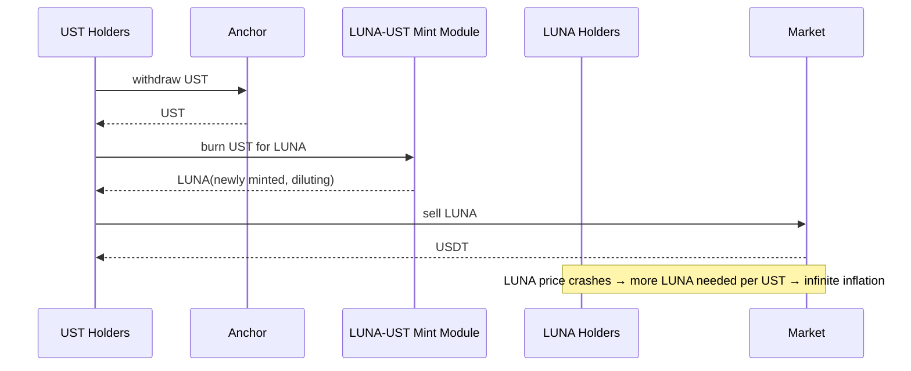

# 算法稳定币发展史（Basis / BasisCash / UST-LUNA 崩盘复盘）

> **TL;DR**：算法稳定币（Algorithmic Stablecoin）尝试在无外部抵押或部分抵押条件下，通过智能合约自动化的铸销机制维持锚定。2018 年 Basis（Basecoin）因 SEC 监管风险退款解散；2020 年 DeFi Summer 催生 ESD、Basis Cash、Empty Set Dollar 等"纯算稳"，普遍在数月内破灭；2020–2022 年 Terra UST 用"LUNA-UST 铸销套利 + Anchor 20% 补贴"撑起 187 亿美元市值，2022-05-07 至 05-12 一周内脱锚归零，600 亿美元蒸发，引发 Three Arrows、Celsius、Voyager 连锁清算。失败共性：反身性死亡螺旋、内生抵押品价值与稳定币需求正相关。本篇系统复盘设计、崩盘过程、法律后果、以及"算法"概念在 Frax、Ampleforth、crvUSD LLAMMA 中的演化遗产。

## 1. 背景与动机

算法稳定币概念可追溯至 Robert Sams 2014 *"A Note on Cryptocurrency Stabilisation: Seigniorage Shares"*：通过"股份"（吸收波动）与"代币"（稳定价值）分离，让系统自我调节。2017 年 Nader Al-Naji 创立 Basis，募资 1.33 亿美元（a16z、Bain Capital、GV 参与），采用 **Basecoin + BaseShare + BaseBond** 三代币模型；因 SEC 认定 BaseBond 构成未注册证券被迫 2018-12 退款解散。2020 DeFi Summer 期间"公平启动"浪潮复兴类似设计（ESD、DSD、Frax v1、Basis Cash），但真实收益缺失 + 反身性导致短期破灭。Terra（Do Kwon）借鉴了"双代币设计"但绑定 Anchor Protocol 20% 存款补贴，用户心理上认为 UST 比银行存款还安全，2022 年崩盘后重创整个行业信任。动机本质是"摆脱对法币/抵押品的依赖"，但每次实践都暴露了"信心即抵押品"的悖论。

## 2. 核心原理

### 2.1 形式化定义：铸销套利与反身性

典型"双代币铸销"算稳的核心方程：设稳定币 S（目标 $1）、治理/股份代币 T（价格 $P_T$）。铸销规则：
$$\text{mint 1 S}: \text{用户销毁 } \frac{\$1}{P_T} \text{ 枚 T}$$
$$\text{burn 1 S}: \text{用户取得 } \frac{\$1}{P_T} \text{ 枚新铸 T}$$

当 $P_S > 1$ 时：套利者用 T 换 S 并市场抛售 → S 供给增加 → $P_S \to 1$，同时 T 被销毁减供给 → $P_T$ 上涨。
当 $P_S < 1$ 时：套利者从市场买 S 并用 T 赎回 → S 减少，但 T 被增发稀释 → $P_T$ 下跌。

**反身性问题**：若市场对 T 失去信心，$P_T \to 0$，每销毁 1 S 需要 "$1/P_T \to \infty$" 枚 T，等于无限稀释 T 供给 → 死亡螺旋（Death Spiral）。

### 2.2 关键数据结构：Terra LUNA-UST 模块

Terra Cosmos SDK 中 Market Module 的核心状态：
- `terra_pool`：LUNA 池
- `basePool`：SDR/UST 等稳定币池
- `DailyLunaDeltaCap`：每日 LUNA 增发 / 销毁上限（2022 崩盘前约 2.93M LUNA/天）
- `MinSpread`：Tobin tax（~0.5%）
- 预言机：验证者投票产生的 LUNA/UST/USD 价格中位数

Anchor Protocol 的关键参数：
- `deposit_rate`：20% APY（补贴来源 = 借款利息 + Yield Reserve + Luna Foundation Guard）
- `borrow_rate`：~12–18%
- 抵押品：bLUNA、bETH

### 2.3 子机制拆解：算稳家谱

1. **Basis（Basecoin）2017–18**：Basecoin + BaseShare + BaseBond。扩张期铸 Basecoin 分 Share 持有人；收缩期出售 Bond（贴现）吸收 Basecoin，到期按顺序还 $1。SEC 风险终结。
2. **ESD / DSD / Basis Cash（2020）**：周期化"Epoch"铸销，Bond 持有人只有在 TWAP 恢复 peg 后可赎。所有项目一度 $3–5 后归 0。
3. **Ampleforth（2019）** AMPL：纯 Rebase，所有持有人余额按 TWAP 偏离自动伸缩；结果是价格跟踪失败，变成投机代币。
4. **Frax v1 (2020-12)**：Fractional，CR 起始 100% 逐步下降，但一直保留部分 USDC 抵押，是唯一穿越熊市且尚存的半算稳。2023 回归 100% 抵押。
5. **Terra UST (2020–22)**：LUNA↔UST 双代币 + Anchor 20% 诱因 + LFG BTC 储备。
6. **USDD（2022-05）**：Tron 版 UST，由 TRX 质押 + 加密储备支撑，曾短暂脱锚到 $0.93。
7. **crvUSD LLAMMA（2023）**：严格意义上是超额抵押，但 LLAMMA（Lending-Liquidating AMM）实现"连续清算"，可视为算稳思路在清算层的延续。
8. **AMPL/RAI 再锚定**：RAI（Reflexer）以 ETH 超额抵押但目标价浮动，用控制论 PI 控制器调整；被 Vitalik 引用为"理想的 meta stable"。

### 2.4 参数与常量（Terra 崩盘前）

| 参数 | 2022-05-07 前 |
| --- | --- |
| UST 市值 | $18.7B |
| LUNA 市值 | $30B+ |
| Anchor 存款 APR | 19.5% |
| Anchor TVL | $14B |
| LFG BTC 储备 | 80,394 BTC (~$3.5B) |
| 每日 LUNA-UST 最大铸销 | ~$293M |

### 2.5 边界条件与失败模式：UST 崩盘时序

1. **2022-05-07 22:00 UTC**：Curve 4pool 准备迁移前，大额 UST（~$85M）抛售打破池平衡。
2. **05-08**：UST 跌至 $0.985，做市商开始挤兑，LUNA 从 $80 跌至 $60。
3. **05-09**：LFG 开始抛售 BTC 储备（共 80,394 BTC）稳定市场未果。
4. **05-10**：Anchor 赎回量暴涨至 $10B，UST 跌破 $0.6。Terra 协议允许 $293M/日 LUNA-UST 铸销触发通胀地狱。
5. **05-12**：LUNA 从 $80 跌至 $0.000001，增发超 7 万亿枚。UST 跌至 $0.1。
6. **05-13**：Terra 链被暂停以应对状态爆炸。
7. **05-27**：Do Kwon 推出 Terra 2.0（LUNA），UST 更名 USTC。

崩盘因素：
- **反身性**：LUNA 下跌 → 铸销套利者获得贬值的 LUNA，加速抛售。
- **Anchor 不可持续**：补贴来源枯竭，Yield Reserve 多次追加仍撑不住。
- **做市商撤离**：Curve 4pool 迁移窗口被攻击利用。
- **治理反应迟缓**：每日铸销上限低，无法及时消化 UST。
- **BTC 储备非对冲**：LFG 抛 BTC 反而加剧市场恐慌。

### 2.6 图示



```
UST-LUNA 死亡螺旋
UST < $1 ──► 套利 burn UST ──► 印 LUNA
   ▲                             │
   │                             ▼
(恢复 peg?)              LUNA 抛压 → 价格跌
   │                             │
   └─── 更多人 burn UST ◄─────────┘
```

## 3. 架构剖析

### 3.1 分层视图（Terra）

1. **Terra L1**：Cosmos SDK + Tendermint BFT，~100 validator。
2. **Market Module**：LUNA ↔ Stable 铸销。
3. **Oracle Module**：验证者投票喂价。
4. **Anchor Protocol**：CosmWasm 合约，核心利率产品。
5. **Mirror/Pylon 等 dApp**：合成股票等。
6. **Wormhole Bridge**：UST 到 Ethereum/Solana 桥。
7. **LFG Reserve**：链下 BTC 存于 Gemini + Binance。

### 3.2 核心模块清单

| 模块 | 职责 | 可替换 |
| --- | --- | --- |
| Market Module (Go) | 铸销 | 低 |
| Oracle | 价格 | 低 |
| Anchor money market | 存贷 | 中 |
| Astroport / TerraSwap | AMM | 中 |
| Prism / Mirror | 合成资产 | 高 |
| LFG Treasury | BTC 储备 | 中 |

### 3.3 数据流：一笔 UST mint 与崩盘时分叉

正常：用户发送 `MsgSwap { Amount: 1 LUNA, AskDenom: uusd }` → Market Module 按 TWAP 计算 UST 数量，扣 Tobin tax 后 mint UST。

崩盘：同一消息在 LUNA 极速贬值下 mint 巨量 UST（或反向 burn UST mint 巨量 LUNA），市场无法吸收，Tendermint Mempool 堵塞，链被暂停。

### 3.4 客户端 / 参考实现

- Terra Classic repo: github.com/classic-terra/core（Cosmos SDK Go）
- Anchor Protocol: github.com/Anchor-Protocol
- Basis Cash: github.com/Basis-Cash
- ESD: github.com/emptysetsquad

### 3.5 扩展接口

- IBC（Terra Classic 保留）
- Wormhole bridge（已关闭 UST 流通）

## 4. 关键代码 / 实现细节

Terra Market Module `x/market/keeper/swap.go`（commit c53 约第 60 行）：

```go
// ComputeSwap 计算市价
func (k Keeper) ComputeSwap(ctx sdk.Context, offerCoin sdk.Coin, askDenom string) (retDecCoin sdk.DecCoin, spread sdk.Dec, err error) {
    if offerCoin.Denom == askDenom {
        return sdk.DecCoin{}, sdk.ZeroDec(), sdkerrors.Wrap(types.ErrRecursiveSwap, askDenom)
    }
    offerRate, err := k.oracleKeeper.GetLunaExchangeRate(ctx, offerCoin.Denom)
    askRate, err := k.oracleKeeper.GetLunaExchangeRate(ctx, askDenom)
    retAmount := offerCoin.Amount.ToDec().Mul(askRate).Quo(offerRate)
    // 计算 Tobin tax / spread
    ...
}
```

Basis Cash `Boardroom.sol`（epoch allocation）：

```solidity
function allocateSeigniorage(uint256 amount) external onlyOperator {
    require(amount > 0, "zero");
    IERC20(cash).safeTransferFrom(msg.sender, address(this), amount);
    _totalContributions = _totalContributions.add(amount);
    // 分给 BAS 质押者
}
```

## 5. 演进与版本对比

| 阶段 | 代表 | 结果 |
| --- | --- | --- |
| 1.0 学术 | Seigniorage Shares (Sams 2014) | 仅论文 |
| 2.0 Basecoin | Basis 2017 | SEC 终结 |
| 3.0 DeFi Summer | ESD/DSD/Basis Cash | 几月崩 |
| 4.0 双代币巅峰 | UST-LUNA | 崩盘 |
| 5.0 半算稳 | Frax v1/v2 | 2023 转全抵押 |
| 6.0 控制论 | RAI | 小众存活 |
| 7.0 合成 | USDe (Ethena) | Delta 中性（非纯算稳） |

## 6. 实战示例

查询 Terra Classic 仍存在的 USTC/LUNC 铸销（非推荐）：

```bash
terrad tx market swap "1000000uusd" "uluna" --from $KEY --chain-id columbus-5
```

Basis Cash（Ethereum）Bond 购买：

```solidity
IBoardroom(boardroom).buyBonds(1000e18, premiumRate);
```

## 7. 安全与已知攻击

- **Basis 退款（2018）**：SEC 认定 Bond 为证券，$133M 返还 LP。
- **ESD 反身性崩溃（2021-Q1）**：从 $2 归 $0.01。
- **Iron Finance 断崖（2021-06）**：Mark Cuban 代言项目因反身性 24h 内崩盘。
- **Terra 崩盘（2022-05）**：$60B+ 市值蒸发，3AC/Celsius/Voyager/BlockFi 连锁破产。
- **Do Kwon 案（2024）**：在黑山被捕，2025 引渡美国，SEC 指控证券欺诈。

## 8. 与同类方案对比

| 维度 | UST（崩） | Basis Cash（崩） | FRAX | RAI |
| --- | --- | --- | --- | --- |
| 抵押 | 0（纯算） | 0 | 部分→100% | 超额抵押 ETH |
| 锚定 | $1 | $1 | $1 | Redemption Price 浮动 |
| 结果 | 归零 | 归零 | 存活 | 小众存活 |
| 教训 | 反身性致命 | 短期投机 | 必须有真实抵押 | PI 控制稳定 |

## 9. 延伸阅读

- Nathan Sexer "Understanding Algorithmic Stablecoins"
- rekt.news/luna-rekt
- Messari "The Fall of Terra" 深度报告
- Haseeb Qureshi "Stablecoins: designing a price-stable cryptocurrency"
- Sam Kazemian Bankless "What Went Wrong With Algo Stables"
- IMF WP/23/198 "Instruments to Fight Volatility"

## 10. 术语表

| 术语 | 英文 | 释义 |
| --- | --- | --- |
| 反身性 | Reflexivity | 价格下跌导致基本面弱化的自强化循环 |
| 死亡螺旋 | Death Spiral | 反身性极端形式 |
| Seigniorage | 铸币税 | 铸币的利润 |
| Rebase | — | 按规则调整所有持有人余额 |
| Bond | — | 贴现债券吸收通缩 |
| LFG | Luna Foundation Guard | Terra 储备机构 |
| TWAP | Time-Weighted Avg Price | 时间加权均价 |

---

*Last verified: 2026-04-22*
