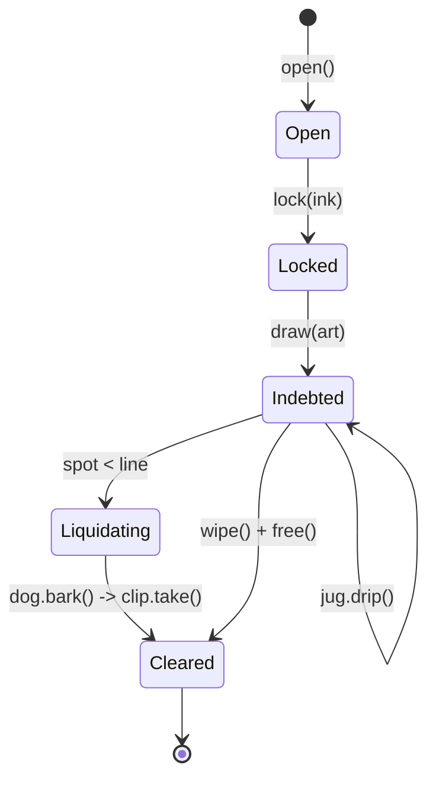

# DAI / MakerDAO → USDS / Sky：加密抵押与 Endgame

> **TL;DR**：MakerDAO 于 2017 年推出 DAI，是第一个生产级去中心化超额抵押稳定币，至 2026 Q1 DAI + USDS 合计流通约 85 亿美元。2024 年 Rune Christensen 主导的 Endgame 计划将协议改名 Sky、原生稳定币升级为 USDS（1:1 可升级迁移），治理代币 MKR 升级为 SKY（1:24000）。核心机制：CDP/Vault 用户超额抵押（ETH、wstETH、WBTC、RWA 等）铸造 DAI/USDS，偿还时支付稳定费销毁；PSM 以 1:1 兑换 USDC 维稳（2023 年前曾占储备 60%）；DSR/SSR 为持有者派息。2022 年后引入 RWA 模块（国债 CB Bridge、Monetalis Clydesdale）使 Maker 成为全球最大链上国债持有人之一。

## 1. 背景与动机

2014 年丹麦程序员 Rune Christensen 发起 Maker 项目，愿景是"基于以太坊的稳定资产，不依赖银行与托管人"。2017-12 上线单抵押 DAI（SAI，仅 ETH 抵押）；2019-11 升级为多抵押 DAI（MCD），引入 Vault、Collateral Adapter 等模块化设计。2020-03 "黑色星期四"（ETH 单日下跌 50%）暴露清算系统延迟问题，部分 Vault 被 0 DAI 出价拍走，协议亏损 540 万 DAI，催生 Liquidations 2.0 与稳定费模型改革。2020 之后逐步引入 PSM（USDC-DAI 互换）、RWA Vault（房屋贷款 6S、国债 Monetalis、私募信贷 BlockTower）。2022 年 Rune 提出 "Endgame Plan"：拆分为多个 SubDAO（NewGovToken + NewStable），最终 2024-09 协议 rebrand 为 Sky，发行 USDS + SKY 作为主代币，保留 DAI 作为兼容层。

动机在于：(1) 加密原生用户需要一个不可冻结、不依赖银行的美元稳定币；(2) 协议通过收息（Stability Fee + RWA 利息）实现可持续收入；(3) 跨大类抵押品分散风险，既纳入 ETH/wstETH 这类原生加密资产，也纳入短期美债实现稳定"底部收益"。

## 2. 核心原理

### 2.1 形式化定义：CDP 状态转移

对每个 Vault $v$，设抵押品价值 $C_v = q_v \cdot P^{\text{oracle}}_c$（数量 × 预言机价）、债务 $D_v$（含累计稳定费）、清算比率 $L_c$（抵押类型参数，如 ETH-A 为 145%）。Vault 处于安全态需满足：
$$\frac{C_v}{D_v} \ge L_c$$
若违反，Vault 进入拍卖。债务方程：
$$D_v(t+\Delta) = D_v(t) \cdot (1 + r_c)^{\Delta}$$
其中 $r_c$ 为该抵押类型的瞬时稳定费率（Stability Fee）。全局不变式：
$$\sum_v D_v + \text{PSM Debt} + \text{RWA Debt} = \text{DAI}^{\text{circulating}} + \text{Surplus Buffer}$$

### 2.2 关键数据结构（dss 核心合约）

1. **Vat（核心账本）**：`mapping(bytes32 => mapping(address => Urn)) urns`；`Urn { ink, art }`（抵押数量、规范化债务）、`Ilk { Art, rate, spot, line, dust }`（全局债务、累积利率、安全价、债务上限、尘埃下限）。
2. **Spotter**：读取 OSM（Oracle Security Module）价格，计算 `spot = price / liquidation ratio`。
3. **OSM**：带 1 小时延迟的价格聚合器，防止闪电喂价操纵。
4. **Jug**：累积 Stability Fee 至 `rate`；`drip()` 周期性调用。
5. **Dog（清算）**：触发拍卖；`bark()` 启动 Clipper（荷兰式降价拍卖）。
6. **Clipper**：Liquidations 2.0 实现，价格按时间递减（`abaci`），捕手（keepers）任意时间 `take()`。
7. **Flapper/Flopper**：Surplus 拍卖 MKR / Deficit 拍卖 MKR 铸新。
8. **DSR/SSR（Savings Rate）**：`Pot` 合约，用户存 DAI/USDS 按 `chi` 累积收益。
9. **PSM**：`dss-psm`，1:1 USDC-DAI 互换，费率可治理。

### 2.3 子机制拆解

1. **抵押类型治理**：每个 ilk 有独立参数（清算比率、稳定费、Debt Ceiling、拍卖参数），MKR 持有人投票。
2. **RWA Vault**：如 `MIP65 Monetalis Clydesdale` 将 DAI 借给 SPV 购买 T-Bills；上链通过 `GUSDC` / `DROP` token 作为抵押代表。
3. **PSM Gate**：USDC、USDP、GUSD 的 PSM 提供"即时流动性"，但牺牲部分去中心化。
4. **Savings（DSR→SSR）**：协议收入 → Surplus Buffer → Pot 派息，2023 年一度高达 8% DSR，成为储蓄基准。
5. **Emergency Shutdown（ES）**：持有 ≥ 50K MKR 可触发全局结算，所有 Vault 按 OSM 价格清算，DAI 持有者按比例赎回抵押品。
6. **SubDAO（Endgame）**：Spark（借贷）、SparkLend、Star SubDAOs（按地理划分）各自发行 SubToken，最终目标是"Endgame"实现完全去中心化。
7. **Sky Token Rewards (STR)**：USDS 用户可选择接受 SKY 代币奖励。

### 2.4 参数与常量（2026 Q1）

| 参数 | 值 | 可治理 |
| --- | --- | --- |
| ETH-A 清算比率 | 145% | 是 |
| ETH-A 稳定费 | 8.25% | 是 |
| wstETH-A 清算比率 | 155% | 是 |
| DAI 全局上限 (Line) | $10B | 是 |
| SSR | 7.25% | 是 |
| MKR 紧急结算阈值 | 50K | 是 |
| Dust | 7,500 DAI | 是 |
| Surplus Buffer | 50M DAI | 是 |

### 2.5 边界条件与失败模式

- **Oracle 滞后（OSM 1h）**：极端行情下价格滞后导致拍卖不足以覆盖债务（312 黑天鹅）。
- **USDC 依赖**：2023 SVB 期间 PSM 中 USDC 脱锚直接拖累 DAI 到 $0.89。
- **RWA 法律风险**：Monetalis/Clydesdale 等离岸 SPV 依赖受托人合规；若 SEC 认定证券或受托人违约，协议需走法律程序追索。
- **清算拍卖失败**：极端拥堵下 Keeper 无法及时 `take()`，协议亏损进入 Sin 账户。
- **治理攻击**：MKR 集中度高（a16z 等机构持仓），曾多次引发治理捕获担忧。
- **Endgame 迁移失败**：DAI→USDS 1:1 `MkrSkyConverter`，若治理分裂出现"DAI 保守派 vs USDS 新派"将造成流动性碎片化。

### 2.6 图示



```
MakerDAO 资本流动
 用户 --(抵押 ETH/wstETH/RWA)-->  Vault --(mint DAI)-->  用户
 用户 --(deposit DAI)--> DSR/Pot --(SSR yield)--> 用户
 PSM USDC <--> DAI  (1:1)
 Surplus Buffer --> Flapper (auction MKR buyback)
```

## 3. 架构剖析

### 3.1 分层视图

1. **Governance Layer**：MKR/SKY 持有者投票 + Executive Vote（时延 GSM Pause Delay）。
2. **Core Accounting (dss)**：Vat、Spotter、Jug、Dog、Clipper、Vow、Flopper、Flapper。
3. **Collateral Adapters**：GemJoin/DaiJoin，各 ilk 独立 Adapter。
4. **Oracle Layer**：OSM + Median（多源中位数聚合）。
5. **RWA Bridge**：离岸 SPV + 链上 Centrifuge/Tinlake/GUSDC 表示。
6. **Application / Peripherals**：Spark Protocol（借贷）、DeFi Saver、Instadapp。

### 3.2 核心模块清单

| 模块 | 职责 | 依赖 | 可替换性 |
| --- | --- | --- | --- |
| Vat | 核心双账簿（抵押/债务） | — | 低 |
| Jug | Stability Fee 累积 | Vat | 低 |
| Dog/Clipper | 拍卖 | Vat、OSM | 中 |
| Spotter | 安全价 | OSM | 中 |
| PSM | 稳定币互换 | USDC | 中 |
| Pot | DSR/SSR | Vat | 中 |
| Flap/Flop | Surplus/Deficit 拍卖 | MKR | 中 |
| ESM | 紧急关停 | MKR | 低 |
| RWA Engine | Monetalis/BlockTower 等 | 离岸 SPV | 中 |

### 3.3 数据流：一笔 wstETH Vault 全生命周期

1. 用户把 10 wstETH（~$35K）存入 Maker UI → 调用 `GemJoin_WSTETH.join()`。
2. 打开 Vault：`ProxyActions.openLockGemAndDraw(wstETH-A, 10e18, 20000e18)` → Vat.urns 记录 `ink=10e18, art≈19900e18`（考虑 rate）。
3. 每小时 `Jug.drip(wstETH-A)` 累积利率。
4. 10 天后 ETH 急跌，`OSM.peek()` 返回 $1900，Spotter 更新 `spot`；Vat 判断 unsafe。
5. `Dog.bark(wstETH-A, urn, kpr)` → Clipper 启动，价格按 `abaci` 递减。
6. Keeper 检测到有利润的 tab，`Clipper.take()` 以 DAI 买入 wstETH。
7. 多余抵押返还用户，损失从 Vow 系统消化（Surplus → Sin → Flop MKR 增发）。

### 3.4 客户端 / 参考实现

- **dss (Core)**：https://github.com/makerdao/dss，Solidity 0.5+。
- **sky-protocol**：https://github.com/sky-ecosystem/sky，升级合约。
- **spark-protocol**：https://github.com/marsfoundation/spark，Aave v3 fork 用于 Maker 资产。
- **dss-cron / dss-charter**：清算/PSM 专用工具。

### 3.5 扩展接口

- ERC-4626 sDAI / sUSDS：存款凭证生息。
- CCIP / Wormhole DAI：官方 canonical DAI 跨链策略（2024 后 Sky 启用 Sky Token Rewards 跨链模块）。
- Proxy / Dss-Cdp-Manager：第三方钱包友好的 CDP 操作代理。

## 4. 关键代码 / 实现细节

核心账本 `Vat.sol`（https://github.com/makerdao/dss `src/vat.sol`，约第 120–200 行）：

```solidity
// Vat.sol :: frob() -- 改变 Vault 抵押/债务
function frob(bytes32 i, address u, address v, address w, int dink, int dart) external {
    Urn memory urn = urns[i][u];
    Ilk memory ilk = ilks[i];
    // 抵押/债务更新
    urn.ink = add(urn.ink, dink);
    urn.art = add(urn.art, dart);
    ilk.Art = add(ilk.Art, dart);
    // 规范化债务 tab = art * rate
    int dtab = mul(ilk.rate, dart);
    uint tab  = mul(ilk.rate, urn.art);
    // 安全检查
    require(either(dart <= 0, both(mul(ilk.Art, ilk.rate) <= ilk.line, debt <= Line)), "Vat/ceiling-exceeded");
    require(either(both(dart <= 0, dink >= 0), tab <= mul(urn.ink, ilk.spot)), "Vat/not-safe");
    urns[i][u] = urn; ilks[i] = ilk;
}
```

Clipper 拍卖核心（`dss-clipper/src/clip.sol`，约第 200 行）：

```solidity
function take(uint256 id, uint256 amt, uint256 max, address who, bytes calldata data) external {
    (uint256 price, uint256 lot, uint256 tab) = status(id);
    require(max >= price, "Clipper/too-expensive");
    uint256 slice = min(lot, amt);
    uint256 owe = mul(slice, price) / WAD;
    // 转移 gem 与 dai；回调外部 flash liquidation
    vat.flux(ilk, address(this), who, slice);
    if (data.length > 0) IClipperCallee(who).clipperCall(msg.sender, owe, slice, data);
    vat.move(msg.sender, vow, owe);
    // 更新 sale 状态
}
```

## 5. 演进与版本对比

| 版本 | 时间 | 关键变化 |
| --- | --- | --- |
| SAI (SCD) | 2017-12 | 单抵押 ETH |
| MCD (Multi-Collateral DAI) | 2019-11 | 多资产、稳定费 |
| Liquidations 2.0 | 2020 | 荷兰式拍卖 |
| PSM | 2020-11 | USDC 维稳 |
| RWA Vaults | 2021–22 | 房贷、国债上链 |
| Endgame v3 | 2023 | SubDAO、Sky、SKY |
| USDS Launch | 2024-09 | DAI→USDS 1:1 |
| Grove / SparkLend | 2024–25 | Sub-DAO 生态扩展 |

## 6. 实战示例

使用 Spark / DeFi Saver 打开 Vault：

```bash
# 使用 cast 直接调用 ProxyActions (简化)
cast send $DSS_PROXY_ACTIONS \
  "openLockETHAndDraw(address,address,address,address,bytes32,uint256)" \
  $CDP_MANAGER $JUG $ETH_JOIN $DAI_JOIN 0x4554482d4100000000000000000000000000000000000000000000000000 2000e18 \
  --value 2ether --rpc-url https://eth.llamarpc.com
```

sUSDS 存款：

```solidity
IERC4626(sUSDS).deposit(1000e18, msg.sender);
```

## 7. 安全与已知攻击

- **Black Thursday（2020-03-12）**：0 DAI Keeper 0 出价赢拍卖，540 万 DAI 损失由 MKR 拍卖弥补。
- **Flash Loan 治理攻击演示（2020）**：Maker 治理时延（GSM Pause Delay）因此延长到 48h。
- **SVB 脱锚（2023-03）**：PSM 中 USDC 拖累 DAI 到 $0.89，后恢复。
- **RWA 受托人风险**：Monetalis 审计问题一度引发社区担忧。
- **MKR 治理集中度**：a16z、Polychain 等大户持仓超过关键票数阈值，引发 Endgame 多 SubDAO 分权设计。

## 8. 与同类方案对比

| 维度 | DAI/USDS | LUSD | crvUSD | GHO |
| --- | --- | --- | --- | --- |
| 抵押范围 | 多资产 + RWA | 仅 ETH | 多资产 LLAMMA | Aave 存款凭证 |
| 最低 CR | 145% | 110% | 可变 | 可变 |
| 稳定费 | 治理 | 一次性 0.5–5% | LLAMMA 曲线 | 治理 |
| PSM | 是 | 否 | 否 | 否 |
| 去中心化 | 中（PSM+RWA） | 高 | 高 | 中 |

## 9. 延伸阅读

- Maker Whitepaper: https://makerdao.com/en/whitepaper
- Sky Docs: https://docs.sky.money
- Rune "The Endgame Plan v3": Maker Forum
- learnblockchain.cn: MakerDAO 系列
- a16z "Decentralizing Everything with Vitalik Buterin"
- Vitalik "Against choosing your cap table"

## 10. 术语表

| 术语 | 英文 | 释义 |
| --- | --- | --- |
| CDP/Vault | Collateralized Debt Position | 超额抵押头寸 |
| ilk | Collateral Type | 抵押类型 ID |
| Stability Fee | SF | 借 DAI 的利率 |
| PSM | Peg Stability Module | 1:1 互换模块 |
| DSR/SSR | DAI/Sky Savings Rate | 存款利率 |
| OSM | Oracle Security Module | 带延迟喂价模块 |
| ES | Emergency Shutdown | 紧急关停机制 |
| SubDAO | Sub-DAO | Endgame 下的子生态 |

---

*Last verified: 2026-04-22*
