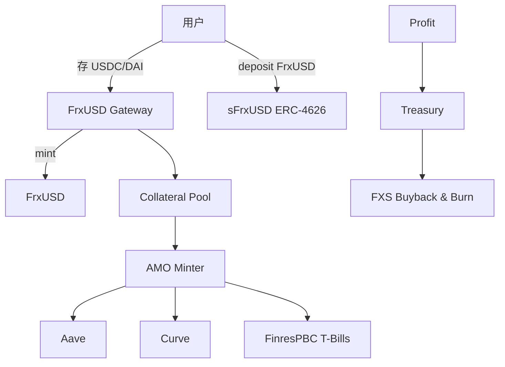

# Frax（FRAX / frxETH / sFRAX）与 AMO 生态

> **TL;DR**：Frax Finance 由 Sam Kazemian 于 2020 年底创立，首创 **Fractional-Algorithmic** 稳定币，后演进为 **全抵押 + AMO（Algorithmic Market Operations Controller）** 架构。2023 年 FIP-188 决议将抵押比率 CR 提升至 100%，终结半算稳模型。2024 年启动 **Frax Endgame**：发行 FrxUSD（迁移自 FRAX）、frxETH/sfrxETH（LSD）、FraxBP（Curve 基础对）、Fraxlend、Fraxswap（TWAMM），加入 FXTL 积分与 FraxNet 原生 L2。2026 Q1 FRAX/FrxUSD 流通约 6–8 亿美元，frxETH TVL 约 9 亿美元。核心差异化：AMO 智能合约级主动资产管理（类似央行公开市场操作），通过 Curve/Uniswap/Aave 投放与回笼来维护锚定。

## 1. 背景与动机

2020 年 DeFi Summer 后，社区对"完全去中心化稳定币"的需求激增，但纯算稳（ESD、DSD、Basis Cash）快速崩溃，UST 虽短期繁荣但埋下崩盘风险。Sam Kazemian 提出"分数算法"思路：**部分 USDC 抵押 + 部分 FXS 治理代币算法回收**，以 CR（Collateral Ratio）为滑动参数，由套利者推动收敛。上线之初 CR = 100%，随市场信心提升逐步下降到 80%，长时间稳定 peg，成为半算稳唯一存活下来的案例。2022 UST 崩盘 + 2023 SVB 事件后，社区决议 FIP-188 重新走向 100% 抵押，完全去除算法成分。2023–2025 年 Frax 系列扩张：**frxETH/sfrxETH**（ETH LSD）、**FPI**（CPI 锚定）、**FXB**（Frax 原生债券）、**Fraxswap**（TWAMM AMM）、**Fraxlend**（独立借贷市场）、**Fraxchain/FraxNet**（原生 L2）。Endgame 计划将 Frax 定位为"完整 DeFi 生态的央行"。

## 2. 核心原理

### 2.1 形式化定义：CR 驱动的 Mint/Redeem

在半算稳时代，mint 一枚 FRAX 需要：
$$\text{Collateral}_{in} = \text{CR} \cdot \$1, \quad \text{FXS}_{burn} = (1-\text{CR}) \cdot \$1$$
redeem 相反：`(1 - CR)` 以 FXS 返还。CR 每小时按"TWAP(FRAX) - $1"调整（若高于锚定则 CR 降低，若低于则升高）。2023 后 CR 固定为 1.00。

当前（FrxUSD 时代）：
- 用户存 USDC/DAI/PYUSD → Frax `FrxUSDGateway` → mint FrxUSD（1:1）。
- 赎回 1:1。
- AMO 合约被授权使用 idle 抵押品部署收益策略（Curve LP、Aave 存款、Convex Boost、T-Bills via FinresPBC），收入归国库用于 FXS/SKY 回购与 Frax Savings（sFrxUSD）。

### 2.2 关键数据结构

1. **FraxPool**：存放抵押品的合约，记录 CR、`mint_fee`、`redeem_fee`、`global_collateral_ratio`。
2. **AMO Minter**：允许注册的 AMO 合约按规则增发/销毁 FRAX，用于 Curve 流动性撮合、Aave 市场造市。
3. **AMO 实例**：例如 `CurveAMO`（向 FRAX3CRV 池添加 FRAX 单边流动性，收取 CRV）、`LendingAMO`（向 Aave 投放 FRAX 收利息）。
4. **Fraxlend Pair**：独立借贷市场合约，每对（抵押 - 借入）隔离。
5. **frxETH/sfrxETH**：frxETH 1:1 锚定 ETH（非生息），sfrxETH 是 ERC-4626 生息包装，聚集所有 staking 收益。
6. **FXB（Frax Bond）**：零息债券，到期按 $1 赎回，贴现发行，用于 Frax 国库融资。

### 2.3 子机制拆解

1. **AMO 主引擎**：类似央行公开市场操作。治理限定 `profit(AMO) >= 0` 且 `mint_cap` 上限。典型 AMO：
   - Investor AMO（向 Aave/Compound 存款）
   - Curve AMO（维稳 FRAX3CRV）
   - Liquidity AMO（主动做市）
   - RWA AMO（Lugano 合作、FinresPBC 买 T-Bills）
2. **Fraxlend Isolated Markets**：利率曲线可选线性/Kinky/Variable V2；每对独立清算。
3. **frxETH LSD**：用户存 ETH 得 frxETH；选择质押 sfrxETH 获取收益（sfrxETH APR = 总 staking 收益 / staked frxETH 数量），不质押的 frxETH 则成为 Curve frxETH/ETH 池的流动性补贴。
4. **Fraxswap TWAMM**：时间加权 AMM，可拆分大额订单按区块均匀执行，Frax 用它回购 FXS。
5. **sFRAX / sFrxUSD**：ERC-4626 储蓄，收益来源 = RWA（T-Bills 约 5%） + AMO 利润。APR 追踪 IORB（Fed 超额准备金利率）。
6. **Frax Share (FXS)**：治理 + 价值捕获；通过回购销毁、veFXS 收益分配。
7. **FXTL / FraxNet**：2024 启动的 Frax L2 积分（FXTL）与原生 L2（FraxNet，基于 Fraxtal Rollup），gas 用 FRAX 支付，收入回流协议。

### 2.4 参数与常量

| 参数 | 值 |
| --- | --- |
| FrxUSD CR | 100% |
| sFrxUSD APY | IORB ± 0.5%（约 5%） |
| Fraxlend Max LTV | 75–90%（对不同对） |
| frxETH 发行上限 | 无硬上限（治理） |
| FXS 最大供应 | 100M |
| veFXS 最长锁定 | 4 年 |
| Fraxtal 区块时间 | 2s |

### 2.5 边界条件与失败模式

- **AMO 策略亏损**：若 AMO 在高波动市场失效（如 Curve LP 无常损失飙升），需要 FXS 发行弥补。
- **Curve 战争依赖**：Frax 大量依赖 Curve 流动性与 Convex/Frax Boost 贿赂，一旦 Curve 被攻击或 CRV 价格崩盘，维稳成本陡增（Curve 2023 Vyper 漏洞事件）。
- **RWA 法律风险**：FinresPBC 受托机构问题会影响 sFRAX 收益。
- **frxETH 双代币机制风险**：若未质押 frxETH 比例过低，sfrxETH APR 会偏高（向 LPer 支付补贴），但也可能引发行情套利失衡。
- **Fraxtal L2 安全性**：新 L2 初期 Sequencer 中心化，升级控制在治理手中。
- **稳定费率 -> IORB 依赖**：美联储降息会直接压低 sFRAX 吸引力，资金外流。

### 2.6 图示



```
Frax Dual-Token for ETH
ETH ──────┐
          ▼
      frxETH(non-yield)       ←─┐
          │                     │ Curve LP subsidy
          ▼ (stake)             │
      sfrxETH (yield-bearing) ──┘
```

## 3. 架构剖析

### 3.1 分层视图

1. **Governance**：FXS/veFXS，Snapshot 投票 + 链上执行（Gnosis Safe + Timelock）。
2. **Core Stablecoin**：FrxUSD/FRAX 合约、FraxPool、AMO Minter。
3. **AMO 模块群**：独立合约，可插拔，需治理白名单。
4. **Yield Products**：sFrxUSD、sfrxETH、FXB、Fraxlend。
5. **Liquidity Infrastructure**：Fraxswap（TWAMM）、Curve/Convex Gauge Weighting。
6. **L2 / Chain**：Fraxtal（OP Stack 变种），gas = FRAX。

### 3.2 核心模块清单

| 模块 | 职责 | 依赖 | 可替换性 |
| --- | --- | --- | --- |
| FRAX ERC-20 | 稳定币本体 | — | 低 |
| FraxPool | 抵押 + mint/redeem | Chainlink | 中 |
| AMO Minter | 受控增发/销毁 | 治理白名单 | 中 |
| Investor AMO | 外部协议投放 | Aave/Compound | 高 |
| Curve AMO | 单边 LP | Curve | 高 |
| Fraxlend | 借贷对 | Oracle | 中 |
| frxETH Minter | ETH 发行 | validator infra | 中 |
| sfrxETH Vault | 聚合 staking 收益 | beacon chain | 中 |
| Fraxswap | TWAMM AMM | — | 高 |
| FraxBond | 贴现债券 | — | 高 |

### 3.3 数据流：AMO 投放 → 利息回流 → FXS 回购

1. 治理投票批准 Curve AMO 上限 500M FRAX。
2. AMO Minter 调用 `AMOMinter.mintFraxForAMO(curveAMO, 100M)` → FRAX 注入 Curve FRAX3CRV 池单边流动性。
3. 池内手续费 + CRV 奖励通过 Convex Boost 领取。
4. 收益在 `collectProfit()` 聚合至 Treasury。
5. Treasury 调用 Fraxswap TWAMM 买入 FXS，分 24h 均匀执行，避免冲击。
6. 购得 FXS 分配给 veFXS 持有者 + 部分销毁。

### 3.4 客户端 / 参考实现

- **FraxContracts**：https://github.com/FraxFinance/frax-solidity
- **Fraxlend**：https://github.com/FraxFinance/fraxlend
- **frxETH**：https://github.com/FraxFinance/frxETH-public
- **Fraxtal**：基于 Optimism Bedrock 改造。

### 3.5 扩展接口

- ERC-4626 sFrxUSD / sfrxETH
- LayerZero OFT Adapter（跨链 FRAX）
- Fraxferry：官方跨链桥（FRAX family）
- FXS Gauge（仿 Curve gauge）

## 4. 关键代码 / 实现细节

AMO Minter 核心（`frax-solidity/contracts/Frax/AMOMinter.sol`，约第 140–200 行）：

```solidity
function mintFraxForAMO(address destination_amo, uint256 frax_amount) external onlyByOwnGov validAMO(destination_amo) {
    int256 frax_amt_i256 = int256(frax_amount);
    // 校验不超过 mint cap
    require((frax_mint_sum + frax_amt_i256) <= frax_mint_cap, "Mint cap");
    // AMO 借记
    frax_mints[destination_amo] += frax_amt_i256;
    frax_mint_sum += frax_amt_i256;
    // 实际 mint
    FRAX.pool_mint(destination_amo, frax_amount);
    syncDollarBalances();
}
```

Fraxswap TWAMM 下单片段（`fraxswap/contracts/core/FraxswapPair.sol`）：

```solidity
function longTermSwapFrom0To1(uint256 amount0In, uint256 numberOfBlockIntervals) external returns (uint256 orderId) {
    return longTermOrders.longTermSwapFrom0To1(amount0In, numberOfBlockIntervals);
}
```

## 5. 演进与版本对比

| 版本 | 时间 | 关键 |
| --- | --- | --- |
| v1 Fractional | 2020-12 | CR 100→80% |
| v2 AMO | 2021-10 | 引入 AMO |
| FPI | 2022-03 | CPI 锚定 |
| frxETH | 2022-10 | LSD |
| FIP-188 (100% CR) | 2023-02 | 终结算稳 |
| Fraxlend v2 | 2023 | 借贷扩张 |
| Fraxtal L2 | 2024-02 | 原生 L2 |
| Endgame / FrxUSD | 2024-Q3 | FRAX→FrxUSD rebrand |

## 6. 实战示例

一键存款 sFrxUSD：

```bash
# Forge 脚本调用
cast send $sFrxUSD "deposit(uint256,address)" 1000e18 $RECIPIENT \
  --rpc-url https://eth.llamarpc.com --private-key $PK
```

使用 Fraxlend 借款：

```solidity
IFraxlendPair(pair).deposit(1000e18, msg.sender); // 存入抵押
IFraxlendPair(pair).borrowAsset(500e18, 0, msg.sender); // 借 FRAX
```

## 7. 安全与已知攻击

- **UST 崩盘连锁（2022-05）**：Frax 半算稳部分受到质疑，CR 下调暂停。
- **Curve Vyper 漏洞（2023-07）**：Curve CRV/ETH、frxETH/ETH 池被攻击，Frax 紧急暂停 AMO 投放。
- **Fraxswap 初期流动性浅**：上线早期价格冲击高，通过激励 fx 迅速深挖。
- **frxETH 单 validator risk**：早期 validator 集中度高，现分散到多运营商。
- **治理攻击尝试**：Frax 多次 FIP 出现低参与率提案，通过 quorum 要求拦截。

## 8. 与同类方案对比

| 维度 | Frax | DAI/USDS | LUSD | crvUSD |
| --- | --- | --- | --- | --- |
| 抵押类型 | USDC+DAI+RWA | 多资产+RWA | ETH | 多资产 LLAMMA |
| CR | 100%（现） | ≥145% | ≥110% | 可变 |
| AMO | 有（特色） | 无 | 无 | LLAMMA 替代 |
| 原生 L2 | Fraxtal | — | — | — |
| LSD 产品 | frxETH/sfrxETH | — | — | — |

## 9. 延伸阅读

- Frax Docs: https://docs.frax.finance
- Sam Kazemian Bankless 访谈系列
- FIP-188（100% CR 决议）
- Fraxtal Whitepaper
- a16z Research "Stablecoin Taxonomy"

## 10. 术语表

| 术语 | 英文 | 释义 |
| --- | --- | --- |
| AMO | Algorithmic Market Ops Controller | 主动资产管理合约 |
| CR | Collateral Ratio | 抵押率 |
| TWAMM | Time-Weighted AMM | 按区块均匀执行订单的 AMM |
| frxETH | Frax ETH | 非生息 ETH 凭证 |
| sfrxETH | Staked frxETH | 生息 ETH 凭证 |
| veFXS | vote-escrowed FXS | 锁仓治理凭证 |
| FXTL | Frax Token Level | Fraxtal L2 积分 |

---

*Last verified: 2026-04-22*
