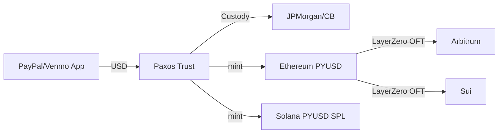

# PYUSD（Paxos / PayPal）支付场景稳定币

> **TL;DR**：PYUSD 是 PayPal 于 2023 年 8 月联合 Paxos Trust Company（纽约 NYDFS 信托牌照）推出的美元稳定币，是第一个由大型持牌支付公司发行的稳定币。2025 年由 Paxos 在 NYDFS 监管下铸造，流通约 7–10 亿美元；部署于 Ethereum、Solana、Arbitrum、Sui、Stellar 等；储备 100% 由美国国债、逆回购与现金支持，WithumSmith+Brown 月度证明。核心价值：把稳定币插入 PayPal + Venmo 4.3 亿用户基础，实现法币—加密—法币无摩擦桥接。Solana 版本引入 Token Extensions（Confidential Transfer、Transfer Hook），面向机构支付。

## 1. 背景与动机

PayPal 是最早支持加密买卖（2020 年）的大型支付公司，但受限于第三方稳定币，无法控制储备、合规与用户体验。2023 年 NYDFS 临时暂停 Paxos 发行 BUSD（SEC 质疑未注册证券）导致 Paxos 急需新业务，与 PayPal 合作推出 PYUSD。动机：(1) PayPal 需要数字美元轨道以降低跨境支付成本、进入 B2B 加密结算；(2) Paxos 拥有纽约信托特许，受银行级监管，与 PayPal 品牌捆绑形成"合规稳定币"标杆；(3) 与 Circle USDC 差异化——侧重消费者支付、集成到 Venmo/PayPal App，形成非 CEX 渠道流动性。2024–2025 年 PYUSD 快速扩张至 Solana（因低费支付生态）、Arbitrum（DeFi 集成）、Stellar（汇款）。2025 年 Paxos 获香港 SFC 稳定币发牌许可（沙盒）。

## 2. 核心原理

### 2.1 形式化定义：信托结构下的完全法币支持

PYUSD 的法律载体是 **Paxos Trust Company 的信托资产**（New York limited purpose trust），即代币持有人对信托财产拥有直接受益权。储备不变式：
$$\text{TrustAsset}_t \ge \text{PYUSD}_t^{\text{circulating}} \times 1.00$$
TrustAsset 构成：
- Cash at JPMorgan、Customers Bank 等 G-SIB
- Overnight Reverse Repurchase Agreements（T-Bills 担保）
- US Treasury Bills（剩余期限 ≤ 93 天）

与 Tether BVI 受益模型不同，NY Trust Law 明确破产隔离：若 Paxos 破产，PYUSD 持有人资产不进入破产资产池。

### 2.2 关键数据结构：NYDFS 月报披露

2025 Q4 Transparency Report 示例字段：
| 类别 | 金额 | 占比 |
| --- | --- | --- |
| US T-Bills (直接持有) | $450M | 55% |
| Overnight Reverse Repo | $280M | 34% |
| Cash at Banks | $90M | 11% |

WithumSmith+Brown 出具月度认证；NYDFS 内部有每周报送与异常触发审查。

### 2.3 子机制拆解

1. **Ethereum ERC-20（PayPal 版本）**：合约 `0x6c3ea9036406852006290770bEDFcaBa0e23A0e8`，由 Paxos 控制 mint/burn，支持 `pause`、`freeze`。
2. **Solana SPL Token Extensions 版本**：mint `2b1kV6DkPAnxd5ixfnxCpjxmKwqjjaYmCZfHsFu24GXo`，启用 `Confidential Transfer`（ZK 隐藏金额）、`Transfer Hook`（合规钩子）、`Default Account State = Frozen`。
3. **LayerZero OFT v2 跨链**：Paxos 官方采用 LayerZero OFT 标准将 PYUSD 扩展至 Arbitrum、Sui 等。
4. **PayPal/Venmo 法币入口**：美国用户可直接在 PayPal/Venmo App 以 USD 买入 PYUSD，Paxos Trust 后台 mint。
5. **Cross-border Pilot**：2024 年与 Xoom（PayPal 汇款子公司）对接墨西哥、菲律宾，使 PYUSD 作为结算层。
6. **Yield (sPYUSD 讨论)**：2025 年 PayPal 曾试点对美国 PYUSD 持有者派发 3.7% 年化 rewards，受限于 GENIUS Act 中对"支付稳定币不得支付利息"条款，调整为积分。

### 2.4 参数与常量

| 参数 | 值 |
| --- | --- |
| 小数位（ERC-20） | 6 |
| 小数位（SPL） | 6 |
| Reserve 加权到期 | < 60 天 |
| 最小电汇赎回 | $100,000 |
| Paxos Trust Capital | $200M+ |
| NYDFS Examination 频率 | 每季度 |

### 2.5 边界条件与失败模式

- **NYDFS 行政命令**：Paxos 可被要求立即停止新铸造（BUSD 先例），PYUSD 进入"赎回模式"。
- **PayPal 业务风险**：若 PayPal 停止 PYUSD 集成，流动性急剧下降（2023 上线初期 PayPal App 是 80% 流通入口）。
- **Solana 网络中断**：Solana 历史上有 ~12 次完全停机，PYUSD on-chain 活动随之中断。
- **Token Extensions 依赖**：Confidential Transfer 依赖 Solana SVM 特性，其他链移植受限。
- **冻结执行风险**：合规冻结可能与 DeFi 合约集成冲突（Uniswap LP 池内 PYUSD 被冻结将导致池失衡）。

### 2.6 图示



```
PYUSD 流通 (2026 Q1 近似)
Ethereum  ████████ 350M
Solana    ██████████████ 500M
Arbitrum  █         30M
Sui       ▌         10M
```

## 3. 架构剖析

### 3.1 分层视图

1. **Regulatory**：NYDFS BitLicense + NY Trust + NMLS、香港沙盒、新加坡 MAS。
2. **Trust & Custody**：Paxos Trust Co. 资产隔离 + 合作银行现金 + T-Bills 经纪。
3. **Issuance API**：Paxos Developer API（V3 REST），接入 PayPal、Venmo、Nuvei、MoonPay。
4. **On-chain Contracts**：Ethereum FiatToken 风格 + Solana SPL Token-2022。
5. **Payment Network**：PayPal Payouts、Xoom、Hyperwallet、Stellar Anchors。

### 3.2 核心模块清单

| 模块 | 职责 | 依赖 | 可替换性 |
| --- | --- | --- | --- |
| PYUSDImplementation.sol | ERC-20 + pause + freeze | Paxos Admin | 低 |
| SPL Mint (Token-2022) | Confidential Transfer / Hook | Solana Runtime | 低 |
| Paxos Issuance Platform | Mint/Burn 编排 | KYB/AML | 中 |
| Bank Custody | 现金/T-Bills | JPMorgan、Customers Bank | 中 |
| LayerZero OFT | 跨链 | LZ Endpoints | 中 |
| PayPal App 集成 | 前端/UX | PayPal APIs | 中 |
| Attestation Provider | 月度认证 | Withum | 高 |

### 3.3 数据流：一笔 Venmo 跨链 PYUSD 汇款

1. 用户 A 在 Venmo App 购买 1,000 USD 的 PYUSD → PayPal 调用 Paxos API `POST /mint`。
2. Paxos 在用户 Venmo 托管地址（MPC）mint ERC-20。
3. 用户 A 发起链上转账到 Solana 朋友地址 → 自动走 LayerZero OFT：Ethereum `send()` → DVN 验证 → Solana `_credit`。
4. 朋友在 Phantom 收到 Solana SPL PYUSD。
5. Phantom 调用 MoonPay/Xoom → 法币提现到银行。
6. 可观测点：Paxos Dashboard 报送 NYDFS；Etherscan/Solscan 事件；LayerZero scan 跨链状态。

### 3.4 客户端 / 参考实现

- **Ethereum**：`PYUSDImplementation.sol`（proxy 0x6c3ea...），基于 Paxos 标准法币代币合约（与 USDP、PAXG 同源）。
- **Solana**：`Token-2022` program，extensions：TransferFeeConfig (off)、ConfidentialTransferMint、TransferHook。
- **LayerZero OFT**：Paxos 官方 Adapter 合约。
- **Paxos SDK**：`@paxos/node-sdk`（REST + WebHook）。

### 3.5 扩展接口

- EIP-2612 Permit：v2 升级后支持。
- NYDFS Greenlist：审核通过的 token 才能由 NY BitLicense 实体提供服务。
- LayerZero OFT v2：原生跨链统一 supply。
- Solana Token-2022 Confidential Transfer：面向企业隐私支付。

## 4. 关键代码 / 实现细节

`PYUSDImplementation.sol`（Ethereum，proxy 升级架构；简化片段）：

```solidity
contract PYUSDImplementation is Ownable, Pausable, ERC20 {
    mapping(address => bool) public frozen;
    address public supplyController;

    modifier onlySupplyController() { require(msg.sender == supplyController); _; }

    function increaseSupply(uint256 _value) external onlySupplyController whenNotPaused {
        _mint(supplyController, _value);
        emit SupplyIncreased(supplyController, _value);
    }

    function freeze(address _addr) external onlyAssetProtectionRole {
        frozen[_addr] = true;
        emit AddressFrozen(_addr);
    }

    function _beforeTokenTransfer(address from, address to, uint256) internal override {
        require(!frozen[from] && !frozen[to], "address frozen");
    }
}
```

Solana Token-2022 初始化 Confidential Transfer 扩展（Rust SDK 示意）：

```rust
use spl_token_2022::extension::confidential_transfer::instruction::*;
initialize_mint(
    &token_program_id, &mint_pubkey, &mint_authority_pubkey,
    None, 6)?;
initialize_confidential_transfer_mint(
    &token_program_id, &mint_pubkey,
    Some(auditor_elgamal_pubkey),
    true /* auto-approve new accounts */)?;
```

## 5. 演进与版本对比

| 版本 | 时间 | 关键变化 |
| --- | --- | --- |
| PYUSD v1 Ethereum | 2023-08 | 首发 |
| Solana SPL | 2024-05 | Token Extensions |
| Arbitrum via OFT | 2025-01 | DeFi 集成 |
| Sui / Stellar | 2025 | 跨生态 |
| NY 储蓄计划停止 | 2025 | GENIUS Act 合规 |

## 6. 实战示例

```bash
# 查询 PYUSD 总流通量
cast call 0x6c3ea9036406852006290770bEDFcaBa0e23A0e8 \
  "totalSupply()(uint256)" --rpc-url https://eth.llamarpc.com
```

通过 Paxos API 铸币（需 API key）：

```bash
curl -X POST https://api.paxos.com/v3/pyusd/mint \
  -H "Authorization: Bearer $API_KEY" \
  -d '{"amount": "1000.00", "destination": "0x..."}'
```

## 7. 安全与已知攻击

- **BUSD 停发（2023-02）**：NYDFS 要求 Paxos 停止铸造 BUSD，PYUSD 为接替产品。
- **PayPal SEC 调查**：2023-11 PayPal 披露收到 SEC 传票，调查 PYUSD 合规性（后未升级为执法）。
- **Meme coin 噪声**：2024-05 Solana 上线后，部分 LP 将 PYUSD 与 meme 配对，流动性质量低。
- **Token Hook 滥用**：Solana Transfer Hook 可接合规脚本，也可被恶意 dApp 滥用需审计白名单。

## 8. 与同类方案对比

| 维度 | PYUSD | USDC | USDP | RLUSD |
| --- | --- | --- | --- | --- |
| 发行方 | Paxos + PayPal | Circle | Paxos | Ripple |
| 牌照 | NY Trust | NY BitLicense + Fed | NY Trust | NY Trust (2024) |
| 链 | ETH/SOL/ARB/SUI/XLM | 16+ | ETH | ETH/XRPL |
| 流通 | ~800M | ~62B | ~300M | ~1B |
| 主场景 | 消费者支付 | DeFi + 汇款 | 机构 | 跨境 |

## 9. 延伸阅读

- PayPal PYUSD Whitepaper: https://www.paypal.com/us/digital-wallet/pyusd
- Paxos Transparency: https://paxos.com/pyusd-transparency/
- Solana Token-2022 Docs
- NYDFS Greenlist
- GENIUS Act（S. 1582, 119th Congress）

## 10. 术语表

| 术语 | 英文 | 释义 |
| --- | --- | --- |
| NY Trust | Limited Purpose Trust | 纽约有限目的信托牌照 |
| OFT | Omnichain Fungible Token | LayerZero 跨链标准 |
| Token-2022 | SPL Token Extensions | Solana 扩展代币标准 |
| Confidential Transfer | ZK 隐私转账 | Solana 内置金额保密 |
| Supply Controller | 铸销权限角色 | Paxos 控制 |

---

*Last verified: 2026-04-22*
