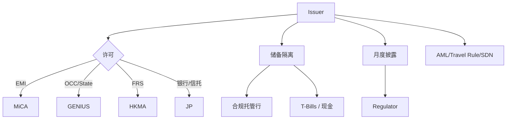

# 稳定币监管格局（MiCA / 香港 / 美国 GENIUS Act / 日本资金决済法）

> **TL;DR**：2022–2026 年是全球稳定币监管从真空转向成熟的关键窗口。欧盟 MiCA（Markets in Crypto-Assets Regulation）2024-06-30 对 EMT/ART 稳定币条款生效，要求发行人获 EMI 或信贷机构许可、全额储备、透明披露；香港《稳定币条例》2025 年 8 月实施，HKMA 颁发 FRS（法币挂钩稳定币）牌照；美国 GENIUS Act（S.1582）于 2025 通过，将"支付稳定币"（Payment Stablecoin）排除出证券与商品法，设联邦+州双轨；日本 2023 修改《资金决済法》把稳定币定义为"电子结算手段"，由银行/资金移动业者/信托公司发行。共同趋势：全额储备、破产隔离、月度披露、禁止向散户付息、反洗钱与制裁合规。

## 1. 背景与动机

2019 年 Libra（Facebook 主导）计划引发全球监管警觉；2021 年 G7 与 FSB 发布跨境稳定币报告提出"同业监管、同业风险"。2022 年 UST 崩盘与 2023 年 USDC SVB 脱锚加速立法。监管目标：(1) **金融稳定**：防止稳定币成为影子银行挤兑渠道；(2) **消费者保护**：赎回权、隔离财产、披露；(3) **货币主权**：遏制 USD 稳定币侵蚀本币；(4) **反洗钱/制裁合规**：Travel Rule、SDN 筛查；(5) **创新空间**：为金融科技提供清晰通道。

各司法辖区对稳定币类型划分有所不同：
- **EU (MiCA)**：E-Money Token (EMT) = 单一法币锚定；Asset-Referenced Token (ART) = 多资产篮子或加密篮子锚定。
- **US (GENIUS Act)**：Payment Stablecoin = 法币赎回承诺的零息代币。
- **HK (稳定币条例)**：Fiat-Referenced Stablecoin (FRS)。
- **JP (资金决済法 2 条 5 款)**：Electronic Payment Instrument (EPI)。
- **新加坡 MAS (SSR 2023)**：Single-Currency Stablecoin (SCS)。

## 2. 核心原理

### 2.1 形式化定义：储备、赎回权、许可主体

跨辖区共识的稳定币监管三要素：

1. **储备充足**：
$$\text{EligibleReserve}_t \ge \text{TokenLiability}_t$$
储备必须是高流动性资产（现金、短期国债、央行准备金），并与发行人其他资产**法律隔离**（Statutory Trust / 独立账户）。

2. **赎回权**：持有人（至少已认证客户）可在合理时间（通常 T+1 或 T+5）按面值赎回。

3. **许可主体**：必须是受监管实体——EMI（EU）、BitLicense + OCC（US）、FRS Licensee（HK）、银行/信托/资金移动业者（JP）。

### 2.2 关键数据结构：披露报告与监管报送

典型月度披露 schema：
- `issuer_name`, `license_number`, `regulator`
- `total_supply`（分链）
- `reserve_composition`：每类资产金额与 weighted_avg_maturity
- `custody_banks`：托管行列表与金额
- `attestation`：审计机构 + 证明类型（ISAE 3000）
- `redemption_statistics`：当月赎回请求数、成功率、延迟
- `blacklist_actions`：冻结地址数

监管内部另需：风险资本充足率、流动性覆盖率（LCR）、风险加权资产（RWA），类似 Basel III 银行指标。

### 2.3 子机制拆解：四大辖区逐一

1. **MiCA (EU)**：
   - EMT 发行人必须是 EMI（Electronic Money Institution）或信贷机构。
   - ART 更严格：需报 ESMA 白皮书批准。
   - 1:1 与法币单位挂钩，**全部储备为 HQLA**，30% 以上放在欧盟银行账户（分散防范单一银行风险）。
   - **利息禁止**：不得向 EMT 持有人支付利息（与 USDC Rewards/USDe 收益模型冲突）。
   - 重大影响 EMT / ART 发行量上限：每日交易笔数 > 1M 或金额 > 2 亿欧元触发限额。
   - 非欧元稳定币（USDT/USDC）需合规 Top-up：USDC 通过 Circle Mint France 获批；USDT 未申请，2024 年底被欧盟主流 CEX 下架。

2. **香港《稳定币条例》**：
   - HKMA 发放 FRS License，申请资本金门槛 2500 万港元。
   - 储备必须为 HKD 挂钩稳定币对应 HKD 资产；若发行 USD 挂钩 FRS，需对应 USD 资产。
   - **沙盒期（2024）**：JD Coinlink、渣打+Animoca+HKT、圆币科技入围。
   - 正式许可 2025-08 起；要求独立审计、月度披露、金管局实时接入储备数据。

3. **美国 GENIUS Act（S.1582，2025 通过）**：
   - **Payment Stablecoin** 定义：承诺按面值赎回、零息、非投资属性。
   - 联邦 OCC 路径（> 100 亿美元市值）+ 州 MTL 路径（< 100 亿）双轨。
   - 发行人仅限持牌银行或非银行子公司，且受 OCC/Fed/FDIC 监管。
   - 储备：100% 现金、Fed Reserve Account、T-Bills (< 93 天)、逆回购。
   - 禁止：向持有人支付利息、混用储备、借出储备资产。
   - 外国稳定币在美流通需互认安排（如 Circle 已就绪，Tether 或转移到 El Salvador/迪拜发行）。

4. **日本资金决済法（2022-06 修订，2023-06 生效）**：
   - 稳定币仅可由三类主体发行：银行、资金移动业者、信托公司。
   - 散户每次最多 100 万日元（资金移动型）。
   - **Electronic Payment Instrument Exchange Service Provider (EPISP)** 制度：CEX/钱包服务商必须获此牌照才能交易或兜售稳定币。
   - 2024-03：Progmat Coin（三菱 UFJ 信托）发行首枚银行稳定币；JPYC、USDC 通过 SBI VC 获批。

5. **新加坡 MAS SSR 2023**：SCS（Single-Currency Stablecoin）需 100% 储备、T+5 赎回、审计披露；stablecoins pegged to USD、SGD、EUR 等 G10 货币可申请。

6. **英国 FSMA 2023 + FCA**：2024 年发布稳定币 PS23/6，要求 FCA 授权、信托隔离储备、破产隔离。

### 2.4 参数与常量对比

| 辖区 | 最低资本 | 储备资产 | 赎回 SLA | 利息禁止 | 审计频率 |
| --- | --- | --- | --- | --- | --- |
| EU MiCA | €350K (EMI) | HQLA L1 | T+1 | 是 | 季度 |
| HK FRS | HKD 25M | 同币种 HQLA | T+1 | 是 | 月度 |
| US GENIUS | 视银行标准 | 现金 + 短 T-Bills + 逆回购 | T+2 | 是 | 月度 |
| JP PSA | 视主体 | 银行存款/国债/信托 | 立即 | 是 | 每月 |
| SG MAS | SGD 1M | HQLA + 同币 | T+5 | 是 | 季度 |

### 2.5 边界条件与失败模式

- **合规延迟**：MiCA 2024-06 生效，但 EBA/ESMA 二级立法仍在完善，发行人许可审批积压导致灰色期。
- **跨境互认真空**：MiCA 要求非 EU 稳定币"等效"认定，但美国 GENIUS 互认条款尚未落地。
- **利息禁止的 DeFi 冲突**：sUSDe、sDAI 等"储蓄型"产品在 EU/JP 合规边界模糊；Circle 停止对欧 Rewards 计划。
- **执法分歧**：SEC vs OCC 权限争议（Paxos BUSD 案是缩影）。
- **Stablecoin Run 的宏观影响**：FSB 担心大型稳定币挤兑会触发 T-Bills 抛售影响国债市场（2023 Circle 曾抛售 t-bills 引发短暂利率波动）。
- **隐私冲突**：MiCA 要求 CASP（Crypto-Asset Service Provider）识别所有交易对手，与 L2/自托管钱包矛盾。

### 2.6 图示



```
合规稳定币核心要件
[ Issuer License ] ─► [ 100% HQLA Reserve ] ─► [ Bankruptcy Remote ]
        │                    │                        │
        ▼                    ▼                        ▼
  KYB/资本金             每月 Attestation         赎回权保障
```

## 3. 架构剖析

### 3.1 分层视图（全球合规稳定币运营）

1. **Regulatory Authority**：EU EBA/ESMA、US OCC/Fed/FDIC、HK HKMA/SFC、JP FSA、SG MAS、UK FCA。
2. **Licensed Issuer**：银行/EMI/信托/MSO。
3. **Custodian Bank**：BNY Mellon、State Street、JPMorgan。
4. **Auditor**：Deloitte、PwC、BDO、Grant Thornton。
5. **Compliance Tooling**：Chainalysis、TRM Labs、Elliptic、Notabene（Travel Rule）。
6. **Distribution**：CASP/CEX/Wallet 持牌。

### 3.2 核心模块清单

| 模块 | 职责 | 监管点 |
| --- | --- | --- |
| License | 准入 | 各国监管机构 |
| Reserve Custody | 隔离与管理 | Basel III 银行标准 |
| Attestation | 月度证明 | ISAE 3000 |
| Redemption Portal | 赎回通道 | SLA + 记录 |
| Blacklist / Sanctions | 冻结与申报 | OFAC/UN/EU |
| Travel Rule | 链上传输发送/接收方 KYC | FATF R16 |
| Reporting API | 接入监管系统 | 各国 MEP 平台 |

### 3.3 数据流：一笔合规稳定币赎回

1. 用户（已 KYC）在 Circle Mint 提交赎回 100K USDC。
2. Circle Compliance Engine 执行 SDN/Travel Rule 筛查。
3. Circle 链上 `burn(100K USDC)` + Treasury 电汇 SWIFT 至用户账户。
4. 月末披露 Redemption Volume 纳入监管报送。
5. 异常告警：若发现相关地址被 OFAC 列入 SDN，则冻结并申报 FinCEN SAR。

### 3.4 客户端 / 参考实现

- **MiCA 官方文本**：Regulation (EU) 2023/1114
- **US GENIUS Act**：S.1582, 119th Congress
- **HK 稳定币条例**：Stablecoins Ordinance (Cap. 656)
- **FATF R15/R16**：Travel Rule 标准

### 3.5 扩展接口

- Notabene / Sumsub Travel Rule gateways
- Chainalysis KYT API
- Monerium EURe：EU EMI 合规案例
- Circle Mint France：MiCA EMT 合规案例

## 4. 关键代码 / 实现细节

合规稳定币典型 freeze 逻辑（USDC 风格，与 MiCA/GENIUS 要求吻合）：

```solidity
modifier notBlacklisted(address account) {
    require(!_blacklisted[account], "Address is blacklisted");
    _;
}

function blacklist(address account) external onlyRole(BLACKLISTER_ROLE) {
    _blacklisted[account] = true;
    emit Blacklisted(account);
    // Off-chain: 触发 Chainalysis Alert + FinCEN SAR 模板
}
```

Travel Rule 交互（off-chain IVMS101 数据结构）：

```json
{
  "originator": {"name": "John Doe", "account": "0xabc...", "jurisdiction": "HK"},
  "beneficiary": {"name": "Jane Roe", "account": "0xdef...", "jurisdiction": "US"},
  "amount": {"currency": "USDC", "value": "10000"},
  "transactionId": "0x..."
}
```

## 5. 演进与版本对比

| 时间 | 辖区 | 里程碑 |
| --- | --- | --- |
| 2019 | 全球 | Libra 警觉 |
| 2021 | FSB/BIS | 发布跨境稳定币报告 |
| 2022-06 | JP | 修订资金决済法 |
| 2023-06 | EU | MiCA 正式通过 |
| 2024-06 | EU | MiCA EMT/ART 条款生效 |
| 2024-07 | HK | 条例草案公布 |
| 2025-Q1 | US | GENIUS Act 通过 |
| 2025-08 | HK | 条例生效 |
| 2026 | 全球 | 跨境等效认定谈判 |

## 6. 实战示例

合规发行方接入监管报送的典型流程：

```bash
# 模拟 HK HKMA 月度报送接口（示意）
curl -X POST https://hkma-reporting.gov.hk/v1/frs/monthly \
  -H "X-License-Id: FRS-2025-001" \
  -d @report.json
```

查询某发行方 MiCA 白皮书状态：ESMA CASP Register。

## 7. 安全与已知攻击

- **BUSD 停发（2023-02）**：NYDFS 监管执法先例。
- **USDT MiCA 下架（2024-12）**：合规失败导致市场份额迁移。
- **Tornado Cash 制裁（2022-08）**：Circle/Tether 冻结引发审查抵抗讨论。
- **PayPal SEC 传票（2023-11）**：合规风险公开化。
- **Libra 关闭（2022-01）**：监管压力下 Meta 出售 Diem 资产。

## 8. 与同类方案对比

| 辖区 | 立法形式 | 主要监管机构 | 适用范围 |
| --- | --- | --- | --- |
| EU | MiCA 直接条例 | EBA/ESMA | 全欧盟 |
| US | GENIUS Act 联邦法 | OCC/Fed/FDIC | 联邦+州 |
| HK | 稳定币条例 | HKMA | 香港 |
| JP | 修订 PSA | FSA | 日本 |
| SG | MAS Notice | MAS | 新加坡 |
| UK | FSMA 2023 + 子立法 | FCA/BoE | 英国 |

## 9. 延伸阅读

- MiCA 正文: https://eur-lex.europa.eu/eli/reg/2023/1114
- GENIUS Act S.1582: https://www.congress.gov/bill/119th-congress/senate-bill/1582
- HKMA 稳定币发牌指引
- FATF Virtual Assets Updated Guidance 2023
- BIS "The future monetary system" Annual Report 2024
- FSB "High-level Recommendations on Global Stablecoin Arrangements" 2023

## 10. 术语表

| 术语 | 英文 | 释义 |
| --- | --- | --- |
| EMT | E-Money Token | MiCA 单一法币锚定代币 |
| ART | Asset-Referenced Token | 多资产锚定 |
| FRS | Fiat-Referenced Stablecoin | HK 法币锚定稳定币 |
| Payment Stablecoin | — | 美国 GENIUS 定义 |
| EMI | E-Money Institution | EU 电子货币机构 |
| EPISP | Electronic Payment Instrument Exchange Service Provider | JP 稳定币服务商 |
| Travel Rule | FATF R16 | 跨机构转账 KYC 传递 |
| CASP | Crypto-Asset Service Provider | MiCA 加密资产服务商 |

---

*Last verified: 2026-04-22*
