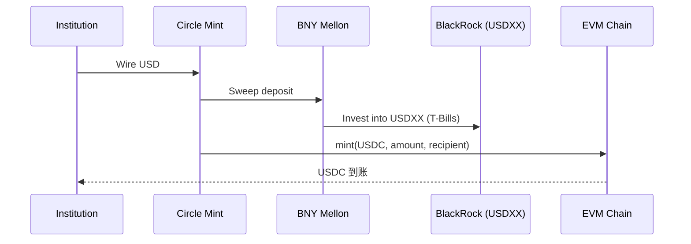

# USDC（Circle）合规型美元稳定币与 CCTP

> **TL;DR**：USDC 是 Circle Internet Financial（NYSE 上市代码 CRCL，2024 年 6 月登陆纽交所）发行的全额储备美元稳定币，2026 Q1 流通约 620 亿美元。储备构成透明：85%+ 美国国债（经 BlackRock 管理的 Circle Reserve Fund），其余为 BNY Mellon 托管现金。合约支持 EIP-2612 permit、EIP-3009 授权转账，具备可升级代理架构；发行侧通过 Circle Mint API（机构）与 CCTP（链间 burn-and-mint）原生跨链。2023 年 SVB 事件脱锚至 $0.87 后 Circle 迁移 98% 资金至国债。首个向 SEC 注册招股书（S-1）并 IPO 的稳定币发行方，合规标杆。

## 1. 背景与动机

2018 年 Circle 与 Coinbase 共同创立 Centre Consortium 推出 USDC，定位为"受美国州级货币转账牌照 + 联邦合规监管"的 USDT 替代品。核心动机：(1) 机构客户需要有清晰银行关系、定期审计、法律确定性的稳定币；(2) 美国金融科技公司希望以稳定币作为"数字美元"进入支付、汇款、B2B 结算市场；(3) 差异化 USDT——强调"每月审计证明 + 100% 流动性资产"。2023 年硅谷银行倒闭期间 USDC 脱锚事件是转折点：Circle 的 33 亿美元（约 8.2% 储备）被困在 SVB，引发连锁赎回，价格跌至 $0.87。联邦存款保险公司（FDIC）担保整体存款后 USDC 恢复。此后 Circle 将储备大部分转移到 BlackRock 管理的 Circle Reserve Fund（USDXX），持有隔夜逆回购与超短期 T-Bills。2024 年 6 月 Circle 登陆 NYSE，2025 年美国 GENIUS Act 确立"支付稳定币"监管框架后进一步巩固。

## 2. 核心原理

### 2.1 形式化定义：全额储备与 HQLA 约束

USDC 承诺：
$$\text{Reserve}_t = \alpha \cdot \text{CircleReserveFund}_t + \beta \cdot \text{CashDeposit}_t,\quad \alpha + \beta \ge 1.00$$
$$\text{Reserve}_t \ge \sum_{i \in \text{chains}} \text{totalSupply}_i$$

其中：
- Circle Reserve Fund (USDXX)：BlackRock 管理，仅持有美国国债、隔夜逆回购、现金；受 SEC 2a-7 规则约束（Rule 2a-7，Government Money Market Fund）。
- Cash Deposit：BNY Mellon + 多家 G-SIB 银行的活期/分级账户，按 FDIC 保险限额分散。
- HQLA（High-Quality Liquid Assets）：Basel III 认定的 Level 1 流动性资产，USDC 明确承诺全部储备落在 L1。

### 2.2 关键数据结构：Transparency 报告与链上统计

每月 Deloitte 出具 ISAE 3000 Type 2 attestation。披露字段：
- `circulating_supply` 按链分布（Ethereum、Solana、Base、Arbitrum、Polygon、Optimism、Avalanche、NEAR、Flow、Hedera、TRON、XLM、ALGO、Stellar、Sui、Aptos 等）。
- `reserve.circleReserveFund`：USDXX 份额对应的市值。
- `reserve.bankDeposits`：各合规银行分行分布。
- `reserve.weighted_avg_maturity_days`：储备加权平均到期日（< 60 天为目标）。

典型 2026 Q1 状态（公开披露口径）：
| 项目 | 金额 | 占比 |
| --- | --- | --- |
| Circle Reserve Fund | ~$53B | 85% |
| Cash at BNY Mellon 等 | ~$9B | 14% |
| 其他 | ~$0.5B | 1% |

### 2.3 子机制拆解

1. **FiatToken 合约（EIP-2612 + EIP-3009 + Blacklist）**：UUPS 可升级代理；由 `masterMinter` 授予受控铸币者额度，`Blacklister` 角色管理黑名单。
2. **Circle Mint（机构门户）**：通过 Wire（Fedwire/SWIFT）/ACH/SEN/SPEI 等通道铸赎，KYB 审核通过即可；T+0 电汇到账。
3. **Circle Programmable Wallets**：面向开发者的托管钱包 SaaS。
4. **CCTP V1/V2（跨链原生桥）**：`TokenMessenger.depositForBurn()` → 跨链消息签名 → 目标链 `receiveMessage()` mint。V2 引入 Fast Transfer（80% 前置流动性）。
5. **USDC on-ramp/off-ramp 网络**：Circle Payments Network、Bridge.xyz（2024 收购）、与 Nubank/MercadoLibre 等集成。
6. **Compliance Engine**：SDN 筛查、Travel Rule（FATF）、自动风险打分，冻结决策走内部法律流程。

### 2.4 参数与常量

| 参数 | 值 |
| --- | --- |
| 小数位 | 6 |
| 总储备加权平均到期 | < 60 天 |
| 储备超额 | 通常 <1%（严格 1:1） |
| EIP-2612 Permit | 支持 (v2+) |
| EIP-3009 Auth | 支持 (v2+) |
| CCTP V1 延迟 | ~15 分钟（L1）～30 分钟（Optimistic Rollup） |
| CCTP V2 Fast Transfer | ~30 秒 |

### 2.5 边界条件与失败模式

- **银行违约（SVB 先例）**：若托管银行倒闭，需依赖 FDIC 保险上限（$250K/账户），大额储备面临折价风险；Circle 已将 98% 转 T-Bills 降敞口。
- **USDXX 份额赎回延迟**：BlackRock 货币市场基金赎回需 T+0 结算，极端市场可能被暂停（Breaking the Buck 风险）。
- **CCTP Messenger 失败**：Circle 的 Iris Attestation Service 单点故障可阻塞跨链 mint；V2 引入多签冗余。
- **OFAC 冻结争议**：2022 年 Tornado Cash 制裁，Circle 冻结 75K+ USDC，引发"是否真正不可抗性抵抗"争论。
- **Coinbase 集中持有**：Coinbase 曾持有相当比例 USDC，若下架会引发流动性断崖（已在 2023 年通过分散做市商与 Circle Mint 缓解）。

### 2.6 图示



```
CCTP V2 跨链 USDC burn-and-mint
Source Chain                                 Dest Chain
┌──────────────┐     Attestation Service     ┌──────────────┐
│ TokenMessenger│ ───────(signed msg)──────► │ TokenMessenger│
│  burn(100)    │                            │   mint(100)   │
└──────────────┘                             └──────────────┘
```

## 3. 架构剖析

### 3.1 分层视图

1. **Banking & Custody**：BNY Mellon（主托管），BlackRock（Reserve Fund 管理人）。
2. **Issuance Service**：Circle Mint 机构 API + 合约 `mint()/burn()` 权限。
3. **On-chain Token Contracts**：16+ 链原生部署 + CCTP 统一跨链。
4. **Developer Platform**：Programmable Wallets、Payments API、Compliance Engine。
5. **Compliance & Regulatory**：纽约 BitLicense（2015）、各州 MTL、MiCA EMT（EU 子公司 Circle Mint France 已获批）、日本资金决済法、香港发牌申请。

### 3.2 核心模块清单

| 模块 | 职责 | 依赖 | 可替换性 |
| --- | --- | --- | --- |
| FiatTokenV2_2 | ERC-20 + 合规特性 | EVM、代理 | 低 |
| TokenMessenger (CCTP) | 跨链 burn-and-mint | MessageTransmitter | 低 |
| MessageTransmitter | 消息签名/验证 | Circle Attester Quorum | 中 |
| Circle Mint API | 机构铸赎 | Wire/ACH 通道 | 中 |
| Reserve Manager | 储备配置 | BlackRock 基金 | 中 |
| Programmable Wallets | SaaS 钱包 | MPC、HSM | 高 |
| Bridge.xyz | Fiat orchestration | Banking 合作 | 中 |
| Analytics Dashboard | 公开透明页 | 链上索引 | 高 |

### 3.3 数据流：CCTP V2 Fast Transfer 全流程

1. 用户在 Base 调用 `TokenMessengerV2.depositForBurn(100e6, 3 /*Arbitrum domain*/, mintRecipient, USDC_BASE)`。
2. Base 合约触发 `DepositForBurn` 事件，USDC 被 burn。
3. Circle Attestation Service（多签 Quorum）监听事件，签名生成 attestation（~5 秒）。
4. Fast Transfer 允许做市商在目标链预先 mint（流动性池），赚取 0.01–0.05% 费率。
5. 最终性确认后（Base optimistic 7 天，但 Soft Finality 数分钟），结算到做市商。
6. 可观测性：Circle Developer Console 追踪 `nonce + sourceDomain` 唯一标识。

### 3.4 客户端 / 参考实现

- **stablecoin-evm**：https://github.com/circlefin/stablecoin-evm（Solidity 0.6.12，OpenZeppelin 基础）。
- **evm-cctp-contracts**：https://github.com/circlefin/evm-cctp-contracts
- **solana-cctp-contracts**：Solana 程序 ID `CCTPmbSD7gX1bxKPAmg77w8oFzNFpaQiQUWD43TKaecd`。
- **Circle SDK**：TypeScript/Go/Python 开发者套件。

### 3.5 扩展接口

- EIP-2612 Permit：离线签名授权。
- EIP-3009 TransferWithAuthorization：meta-tx 友好。
- EIP-5267 EIP-712 Domain：签名兼容。
- CCTP V2 Hooks：可在目标链自动触发下游合约（如"一次签名把 USDC 从 Base 转到 Arbitrum 并存入 Aave"）。

## 4. 关键代码 / 实现细节

`FiatTokenV2_2.sol` 关键片段（https://github.com/circlefin/stablecoin-evm 约 180–260 行）：

```solidity
function transferWithAuthorization(
    address from, address to, uint256 value,
    uint256 validAfter, uint256 validBefore, bytes32 nonce,
    uint8 v, bytes32 r, bytes32 s
) external whenNotPaused notBlacklisted(from) notBlacklisted(to) {
    _transferWithAuthorization(
        from, to, value, validAfter, validBefore, nonce, v, r, s
    );
}

// UUPS 可升级：proxy 指向 implementation
function _authorizeUpgrade(address newImpl) internal override onlyOwner {}
```

CCTP V2 `TokenMessengerV2.depositForBurn`（`evm-cctp-contracts/src/v2/TokenMessengerV2.sol`）：

```solidity
function depositForBurn(
    uint256 amount, uint32 destinationDomain,
    bytes32 mintRecipient, address burnToken
) external returns (uint64 nonce) {
    IMintBurnToken(burnToken).burn(msg.sender, amount);
    nonce = messageTransmitter.sendMessage(
        destinationDomain, remoteTokenMessengers[destinationDomain],
        abi.encode(burnToken, mintRecipient, amount, msg.sender)
    );
    emit DepositForBurn(nonce, burnToken, amount, msg.sender, mintRecipient, destinationDomain);
}
```

## 5. 演进与版本对比

| 版本 | 时间 | 关键变化 |
| --- | --- | --- |
| FiatTokenV1 | 2018 | Centre 初版 |
| FiatTokenV2 | 2020 | 加入 EIP-3009 |
| V2.1 | 2021 | Permit + 黑名单优化 |
| V2.2 | 2023 | SVB 后加强 pause 粒度 |
| CCTP V1 | 2023-04 | 原生跨链 |
| CCTP V2 | 2024 | Fast Transfer + Hooks |
| Circle IPO | 2024-06 | NYSE 上市，CRCL |
| MiCA EMT | 2024-06 | EU 合规 |

## 6. 实战示例

```ts
// 使用 viem 调用 CCTP depositForBurn
import { createWalletClient, http, parseUnits } from 'viem'
import { base } from 'viem/chains'

const client = createWalletClient({ chain: base, transport: http() })
await client.writeContract({
  address: TOKEN_MESSENGER_BASE,
  abi: cctpAbi,
  functionName: 'depositForBurn',
  args: [
    parseUnits('100', 6),
    3, // Arbitrum domain
    pad(arbitrumRecipient, { size: 32 }),
    USDC_BASE,
  ],
})
```

## 7. 安全与已知攻击

- **SVB 脱锚（2023-03）**：33B 被困，USDC 跌至 $0.87，后回 peg。
- **Tornado Cash 冻结（2022-08）**：45 地址、75K+ USDC 冻结。
- **Multichain 故障（2023-07）**：BridgedUSDC 在 Fantom/Kava 脱锚。
- **Axie Ronin Bridge（2022-03）**：6 亿美元窃取中含约 25.5M USDC。
- **Harmony Horizon（2022-06）**：100M USDC 受影响。

## 8. 与同类方案对比

| 维度 | USDC | USDT | PYUSD | USDe |
| --- | --- | --- | --- | --- |
| 储备 | 85% T-Bills + 15% 现金 | 复杂（T-Bills/BTC/金/贷款） | 100% 现金+ T-Bills | 合成 Delta |
| 跨链 | CCTP 原生 | USDT0/第三方 | LayerZero OFT | 单链（Ethereum） |
| 审计 | Deloitte attestation | BDO attestation | WithumSmith+Brown | 链上 PoR |
| 监管 | BitLicense、MiCA | 无 MiCA | NYDFS | 无银行许可 |
| 黑名单 | 有 | 有 | 有 | 无 |

## 9. 延伸阅读

- Circle Transparency: https://www.circle.com/en/transparency
- Circle S-1: https://www.sec.gov/Archives/edgar/data/1876042/...
- CCTP V2 Docs: https://developers.circle.com/stablecoins/docs/cctp-getting-started
- Coinbase Blog "USDC Risk Framework"
- a16z "Stablecoins: The Key to the Future of Money"
- BIS Working Paper: "Stablecoins and safe asset prices"

## 10. 术语表

| 术语 | 英文 | 释义 |
| --- | --- | --- |
| CCTP | Cross-Chain Transfer Protocol | Circle 官方跨链 burn-and-mint |
| HQLA | High-Quality Liquid Assets | Basel III L1 资产 |
| Iris | Attestation Service | CCTP 签名服务 |
| USDXX | Circle Reserve Fund | BlackRock 托管的 T-Bills MMF |
| BitLicense | NYDFS 1.0 | 纽约州虚拟货币业务许可 |
| EMT | E-Money Token | MiCA 下电子货币代币 |

---

*Last verified: 2026-04-22*
