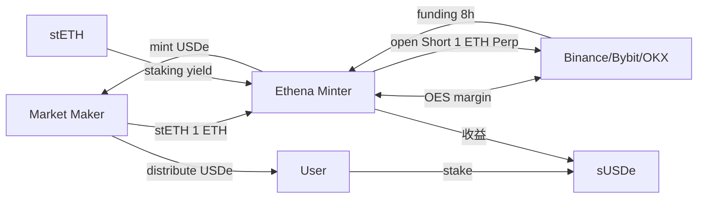

# USDe / sUSDe（Ethena）：Delta 中性合成美元

> **TL;DR**：Ethena Labs（Guy Young 创立，2024-02 主网）通过 Delta 中性头寸铸造合成美元 USDe：抵押品（stETH、LST、BTC）多头 + 在中心化永续合约开等额空头，净风险敞口 ≈ 0。2026 Q1 USDe 流通约 55–60 亿美元，sUSDe 年化收益率 10–25%，收益来源 = LST 收益 + 永续资金费率。核心风险：CEX 对手方（Binance/Bybit/OKX/Deribit）信用风险、资金费率长期翻负、脱钩爆仓。引入"保险基金 (Reserve Fund)"与"Cooldown 7 天"机制缓冲。2024 年与 BlackRock 合作推出 USDtb（T-Bills 支撑），2025 扩展至 Telegram 生态 USDe iFi 与 Converge（Ethena 原生 L2）。

## 1. 背景与动机

2022 UST 崩盘后，"去中心化美元"的方向一度被唾弃；但 Arthur Hayes 在 2023-03 发文 *"Dust on Crust"* 重提 2018 年 Maker 早期思路：用 ETH 永续合约对冲 stETH 现货，形成 Delta 中性组合。Guy Young 实施并创立 Ethena Labs，解决以下痛点：(1) 法币抵押稳定币（USDT/USDC）受中心化银行与监管约束、利息归发行方；(2) 加密超额抵押（DAI）资本效率低（CR ≥ 145%）；(3) 算稳因反身性崩溃。Delta 中性模型的优势：资本效率 ~100%、收益可观、完全链下可验证（PoR + 多 CEX 对账）。挑战：依赖 CEX 做空流动性、资金费率非永续正值、CEX 破产（FTX 阴影）。2024-04 Binance Launchpool + ENA 空投引爆市场，2025 通过 Converge（自研 RWA/机构 L2）扩展合规接口。

## 2. 核心原理

### 2.1 形式化定义：Delta 中性组合与 PnL

Ethena 的合成美元铸造方程：
$$\text{USDe}_{mint} = Q_{\text{LST}} \cdot P_{\text{LST}}$$
与此同时协议在 CEX 开等额空头：
$$\text{Short Size} = Q_{\text{LST}} \cdot P_{\text{LST}} \quad \Rightarrow \quad \Delta_{total} = Q_{\text{LST}} - \text{Short Size}/P \approx 0$$
总 PnL：
$$\text{PnL} = \underbrace{Q_{\text{LST}} \cdot r_{\text{staking}}}_{\text{LST yield}} + \underbrace{\text{NotionalShort} \cdot f_{\text{funding}}}_{\text{Funding}} - \text{基差风险}$$
当 $f_{funding} > 0$（牛市常态），收益 = LST 收益 + 正 funding；当 $f_{funding} < 0$ 且持续，需用保险基金（Reserve Fund）补贴。

### 2.2 关键数据结构：Minting 合约与对冲引擎

1. **`Minting.sol`**：EIP-712 签名流程。Market Maker（白名单）提交 Order，内含 `collateral_asset`, `collateral_amount`, `usde_amount`, `nonce`, `expiry`。Off-chain Ethena Backend 在 CEX 开等额空头后签名放行。
2. **Custody**：抵押品（stETH/mETH/sETH/BTC）存入 Copper/Ceffu/Fireblocks 等 **Off-Exchange Settlement (OES)** 托管，CEX 仅看到保证金余额但无法划转，降低交易所作恶风险。
3. **StakingRewardsDistributor**：协议收入入 Pool；sUSDe 是 ERC-4626 金库，用户存入后份额按 `chi` 增值。
4. **Reserve Fund**：保险基金，最低目标为 USDe 流通的 1%。
5. **Cooldown Silo**：赎回需经过 7 天 cooldown（应对极端资金费率环境）。
6. **USDtb**：2024 Q4 推出，100% T-Bills（BUIDL + 现金），用作 Reserve Fund 主要资产形式；自身可流通。

### 2.3 子机制拆解

1. **Mint（仅白名单 MM）**：Wintermute、GSR、Galaxy 等做市商执行。Ethena Off-chain Engine 同步下单对冲。
2. **Redeem（白名单 MM）**：MM 存回 USDe 换 LST，Ethena 平仓 Short。
3. **Sanctioned List & Geo-blocking**：US、EU 受限；通过 KYC 入口区分用户。
4. **sUSDe Staking**：用户存 USDe → sUSDe ERC-4626，7 天 cooldown 解锁。
5. **Funding Rate 收集**：每 8h 收取 Binance Perp USDT-M 资金，实时入账。
6. **Conversion to USDtb**：熊市（funding 长期负）时，将 Reserve Fund 增配 USDtb（T-Bills）；收益下限为 T-Bills 利率。
7. **Ethereal / Converge L2**：2025 推出 Ethereal Perp DEX（Hyperliquid 风格），USDe 为基础保证金；Converge 是 Ethena 联合 Securitize 推出的机构 L2（BlackRock BUIDL 原生）。

### 2.4 参数与常量

| 参数 | 值 |
| --- | --- |
| Cooldown 周期 | 7 天 |
| Reserve Fund 目标 | ≥ 1% USDe 流通 |
| MM 白名单 | Wintermute/GSR/DRW/Jane Street 等 |
| OES 托管商 | Copper Clearloop, Ceffu, Fireblocks |
| 历史年化 sUSDe APY | 10–60%（平均 ~18%） |
| USDe 抵押 LST 比例 | stETH 40% / mETH 15% / BTC 30% / 现金 15% |

### 2.5 边界条件与失败模式

- **资金费率长期负值**：熊市 + 低波动市场下，永续资金费率可能连续数周为负，协议需支付利息。2024-08 市场熊市期间 sUSDe APR 降至 4% 但未破 peg。
- **CEX 对手方风险**：虽使用 OES，仍需 CEX 保持偿付能力。FTX 2022 引发警觉，Ethena 分散到多家 CEX 并使用 Copper 减小敞口。
- **清算 Cascade**：若极端行情下 CEX 强平 Ethena short 仓位（因价格剧烈单边），资产净值短期受损。
- **Basis 风险**：LST（stETH）与 ETH 现货可能脱钩（2022-06 stETH/ETH 跌至 0.94），对冲不完美。
- **Oracle 操纵**：USDe 本身 mint 1:1 无 oracle，但 sUSDe 赎回与 DeFi 集成依赖 Chainlink、风险延续。
- **监管风险**：SEC 可能将 USDe/sUSDe 认定为证券（利息派发特征），Ethena 已在 BVI 注册但仍面临美法院风险。

### 2.6 图示



```
Delta = 0 构成
 Spot Long   Perp Short    Net
 +1 ETH  +   -1 ETH   =   0
 (stETH yield 3%) + (funding 8%) = 11% APR
```

## 3. 架构剖析

### 3.1 分层视图

1. **User Layer**：USDe、sUSDe ERC-20 合约，DeFi 集成（Pendle、Morpho、Aave e-mode）。
2. **Market Maker Layer**：白名单，持有 USDe 做市权。
3. **Off-chain Hedging Engine**：实时监控头寸，在 CEX 间再平衡。
4. **Custody Layer**：Copper Clearloop、Ceffu Mirror、Fireblocks OES。
5. **CEX Perpetual Layer**：Binance、Bybit、OKX、Deribit、Bitget。
6. **Reserve & Risk**：Reserve Fund 合约 + USDtb（BUIDL 底层）。
7. **Chain / L2**：Ethereum 主部署，通过 LayerZero OFT 至 Arbitrum、Blast 等；Converge L2 规划中。

### 3.2 核心模块清单

| 模块 | 职责 | 依赖 | 可替换性 |
| --- | --- | --- | --- |
| USDe ERC-20 | 稳定币 | — | 低 |
| sUSDe ERC-4626 | 收益包装 | USDe | 低 |
| Minting.sol | EIP-712 mint/redeem | MM 签名 | 中 |
| Staking Rewards | 收益分配 | 收入流 | 中 |
| Hedging Engine | 对冲下单 | CEX API | 低（核心竞争力） |
| OES Custody Adapter | 保证金隔离 | Copper/Ceffu | 中 |
| Reserve Fund | 保险 | USDtb/BUIDL | 中 |
| LayerZero OFT | 跨链 | LZ endpoints | 高 |

### 3.3 数据流：一次 Mint + 对冲 + Staking 路径

1. Wintermute 提交 EIP-712 Order：`collateral=stETH, amount=1000, usde=3000000`。
2. Ethena Backend：(a) 校验 Order；(b) 在 Binance 开 BNX-M 永续 ETH 空头 1000 contracts；(c) 在 Bybit 分散一部分；(d) 签名放行。
3. `Minting.sol.mint(order, signature)` → 接收 stETH 转入 Copper，Ethena mint 3M USDe 给 MM。
4. 用户 LP 把 USDe 从做市商买入，存入 sUSDe → mint sUSDe 份额。
5. 每 8 小时：Funding 入账；每日：stETH 收益入账；扣除对冲损失后 `chi` 上升。
6. 7 天后用户赎回：`sUSDe.cooldownShares(amount)` → Silo → `unstake()` 取回 USDe。

### 3.4 客户端 / 参考实现

- **ethena-contracts**：https://github.com/ethena-labs/ethena
- **sUSDe**：ERC-4626（https://etherscan.io/address/0x9D39A5DE30e57443BfF2A8307A4256c8797A3497）
- **Transparency Dashboard**：app.ethena.fi/dashboards

### 3.5 扩展接口

- LayerZero OFT（USDe 跨链）
- Pendle PT/YT：sUSDe 固定收益分拆
- Morpho / Aave：USDe/sUSDe 借贷市场
- Telegram Bot（USDe iFi）：Telegram 原生 mini-app
- Converge L2（机构）

## 4. 关键代码 / 实现细节

`Minting.sol` 核心（https://github.com/ethena-labs/ethena/blob/main/contracts/Minting.sol 约 180–260 行）：

```solidity
struct Order {
    OrderType order_type; // MINT / REDEEM
    uint64 expiry;
    uint128 nonce;
    address benefactor;
    address beneficiary;
    address collateral_asset;
    uint128 collateral_amount;
    uint128 usde_amount;
}

function mint(Order calldata order, Route calldata route, Signature calldata signature)
    external nonReentrant onlyRole(MINTER_ROLE) belowMaxMintPerBlock(order.usde_amount)
{
    require(order.order_type == OrderType.MINT);
    _verifyOrder(order, signature);                // EIP-712 签名验证
    _deduplicateOrder(order.benefactor, order.nonce);
    _transferCollateral(order.collateral_asset, order.benefactor, address(this), route, order.collateral_amount);
    usde.mint(order.beneficiary, order.usde_amount);
    emit Mint(...);
}
```

sUSDe Cooldown 片段（`StakedUSDeV2.sol`）：

```solidity
function cooldownShares(uint256 shares) external returns (uint256 assets) {
    assets = previewRedeem(shares);
    UserCooldown storage uc = cooldowns[msg.sender];
    uc.cooldownEnd = uint104(block.timestamp) + cooldownDuration;
    uc.underlyingAmount += uint152(assets);
    _withdraw(msg.sender, address(silo), msg.sender, assets, shares);
}

function unstake(address receiver) external {
    UserCooldown storage uc = cooldowns[msg.sender];
    require(block.timestamp >= uc.cooldownEnd, "cooldown");
    silo.withdraw(receiver, uc.underlyingAmount);
    delete cooldowns[msg.sender];
}
```

## 5. 演进与版本对比

| 版本 | 时间 | 关键 |
| --- | --- | --- |
| v1 主网 | 2024-02 | stETH 抵押 |
| BTC 纳入 | 2024-04 | 扩大对冲池 |
| USDtb | 2024-12 | BUIDL 底层稳定币 |
| Telegram iFi | 2025-Q1 | 零售分发 |
| Converge L2 | 2025-Q4 | 机构 L2 |
| 多抵押 v2 | 2025 | mETH/sBNB/LBTC |

## 6. 实战示例

存款 sUSDe：

```solidity
IERC20(USDe).approve(sUSDe, 1000e18);
IERC4626(sUSDe).deposit(1000e18, msg.sender);
```

Cooldown + Unstake：

```solidity
IStakedUSDeV2(sUSDe).cooldownShares(shares);
// 等待 7 天后
IStakedUSDeV2(sUSDe).unstake(msg.sender);
```

## 7. 安全与已知攻击

- **FTX 先例恐慌（2022-11）**：成为 Ethena 设计 OES 的直接原因。
- **stETH Depeg（2022-06）**：Luna 崩盘期间 stETH 跌至 0.94 ETH，对冲组合短期亏损。
- **Binance API 中断**：2024-04 Binance 短暂 API 宕机，对冲再平衡延迟，Ethena 暂停 mint。
- **sUSDe APR 下滑**：2024-Q3 熊市 funding 趋零，APR 跌到 3–5% 但未破 peg，Reserve Fund 动用约 $2M。
- **Oracle 依赖**：Morpho USDe 市场曾因 Chainlink 价格偏差引发清算串联。

## 8. 与同类方案对比

| 维度 | USDe | DAI/USDS | USDT | BUIDL |
| --- | --- | --- | --- | --- |
| 抵押 | LST + Perp Short | 多资产 + RWA | 储备 | T-Bills |
| 资本效率 | 100% | 145%+ | 100% | 100% |
| 收益 | 10–25% | DSR 7% | 无 | ~4.5% |
| 对手方 | CEX + OES | 无 | 银行 | BNY Mellon |
| 监管 | BVI | 完全链上 | BVI | US RIA |

## 9. 延伸阅读

- Ethena Litepaper: https://ethena.fi/docs
- Arthur Hayes "Dust on Crust"
- Messari "Ethena Q3 2024 Report"
- Paradigm "The Synthetic Dollar Trilemma"
- Binance Research "USDe Risk Framework"
- Cobie Podcast: Guy Young interview

## 10. 术语表

| 术语 | 英文 | 释义 |
| --- | --- | --- |
| Delta 中性 | Delta-neutral | 组合对价格不敏感 |
| Basis 风险 | Basis Risk | 现货与衍生品价差 |
| Funding Rate | — | 永续合约多空利息 |
| OES | Off-Exchange Settlement | 场外结算托管 |
| Cooldown | — | 解押等待期 |
| Reserve Fund | — | 保险基金 |

---

*Last verified: 2026-04-22*
