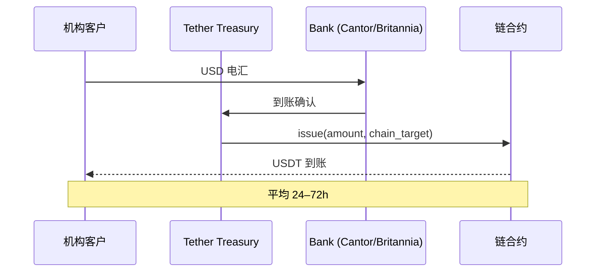

# USDT（Tether）多链美元稳定币

> **TL;DR**：USDT 是全球流通量最大的美元稳定币，2026 Q1 约 1480 亿美元，部署于 16+ 条公链。Tether Holdings（BVI 注册）通过 Tether Treasury 提供 1:1 铸赎，储备以美国国债（超 60%）、现金、BTC、黄金、担保贷款等构成，按季度披露 BDO 证明。Tron（约 620 亿）与 Ethereum（约 720 亿）为主战场，Tron 承载大部分零售支付与 P2P 汇款。曾因储备透明度、商业票据占比受 CFTC/NYAG 罚款；2023 年后策略转向 T-Bills 并实施地址冻结合规；EU MiCA 合规受阻，USDT 在欧盟主流 CEX 被 delist。

## 1. 背景与动机

2014 年 Brock Pierce、Craig Sellars、Reeve Collins 在比特币生态中推出 Realcoin，基于 Bitcoin Omni Layer。同年更名为 Tether，引入 "1 USDT = 1 USD" 的法币抵押模型，填补了早期交易所无法托管 USD 的空缺：Bitfinex（与 Tether 共享高管团队）首先集成 USDT，解决了无法与美国传统银行稳定合作的痛点。2017–2018 年 USDT 从单链（Omni）扩展到 Ethereum ERC-20、Tron TRC-20；2019 年迁移至 Tron 后手续费骤降（< $0.01），使其成为拉美、东南亚、非洲的 P2P 汇款与黑灰产"美元"。截至 2026 Q1，USDT 链上转账量超过 Visa 单日流水（按笔数口径），是加密体系的水电煤。

其存在的动机：(1) 加密交易所需要统一的美元计价对手方；(2) 新兴市场（阿根廷、土耳其、尼日利亚、缅甸）居民对抗本币贬值、资本管制；(3) 对冲基金与做市商需要高流动性抵押品；(4) Web3 应用（游戏、支付、RWA）的基础结算单位。

## 2. 核心原理

### 2.1 形式化定义：多链一致性与储备充足性

USDT 作为多链代币，在每条链上由一个独立的 ERC-20/TRC-20/SPL 合约发行。全局不变式：
$$\sum_{i \in \text{chains}} \text{totalSupply}_i \le \text{ReserveUSD}$$
每月 Transparency 报告披露：
- Total Tokens Issued（各链分布）
- Total Assets（现金、现金等价物、MMF、T-Bills、逆回购、BTC、金、担保贷款等）
- Excess Reserve（超额，2025 Q4 约 70 亿美元）

Mint/Redeem 形式化：机构客户 $c$ 向 Tether Treasury 电汇 USD → 24–72h 内在指定链上 mint 等额 USDT；反向同理。散户无直接赎回权，需通过 CEX（Binance/Bitfinex/OKX/Bybit）或 OTC。最小电汇 10 万美元，赎回费 0.1%（封顶 1000 USD）。

### 2.2 关键数据结构：Transparency Report 与 Reserve Breakdown

2025 Q4 示例（假设数值，与官方 Q4 2025 披露口径接近）：

| 类别 | 金额 (USD) | 占比 |
| --- | --- | --- |
| US Treasury Bills (直接持有) | ~85B | 58% |
| Overnight Reverse Repo | ~14B | 9.5% |
| Money Market Funds | ~6B | 4% |
| Cash & Bank Deposits | ~8B | 5.5% |
| Secured Loans | ~8B | 5.4% |
| Bitcoin | ~7B | 4.7% |
| Gold | ~5B | 3.4% |
| Other Investments | ~14B | 9.5% |

BTC 头寸作为自营仓位，Tether 自 2023 起每季度用净利润的 15% 买入 BTC。Secured Loans 是风险点，2024 年 Tether 承诺逐步清零，但仍保留 80 亿级规模。

### 2.3 子机制拆解

1. **Omni Layer（历史遗留）**：USDT 最初发行载体，基于 Bitcoin OP_RETURN，2023 年后 Tether 停止对 Omni 新铸造。
2. **ERC-20（Ethereum）**：流通约 720 亿，合约 `0xdAC17F958D2ee523a2206206994597C13D831ec7`，无 `permit` 支持、无小数位 6。
3. **TRC-20（Tron）**：流通约 620 亿，合约 `TR7NHqjeKQxGTCi8q8ZY4pL8otSzgjLj6t`，手续费最低，成为零售与非法币汇款主力。
4. **SPL（Solana）/BEP-20/Polygon/Arbitrum/Avalanche C-Chain**：次级流通，主要由 CEX 桥接维持。
5. **Chain Swap**：Tether 提供官方跨链转换（通过 Bitfinex/OKX 机构窗口），避免第三方桥风险。
6. **Blacklist**：EVM 上通过 `addBlackList(address)` 冻结，Tron 上通过 `pausedOfAddress` 类似机制；至 2026 Q1 EVM 侧冻结 1400+ 地址，合计超 20 亿美元。
7. **Treasury & Authorized Minter**：合约的 `owner` 可向任意地址铸造，实际由 Tether Treasury 多签控制。

### 2.4 参数与常量

| 参数 | 值 | 备注 |
| --- | --- | --- |
| 小数位 | 6 | ERC-20/TRC-20/SPL 一致 |
| 最小电汇 | $100,000 | 机构开户后 |
| 赎回费 | 0.1% (cap $1000) | 官方 |
| 审计周期 | 季度 | BDO Italia |
| 储备超额目标 | ≥ 总流通的 2% | 2023 以后保持 3–5% |

### 2.5 边界条件与失败模式

- **挤兑压力测试**：2022 年 5 月（UST 崩盘后）单周赎回 100 亿美元，Tether 通过抛售 T-Bills + 商业票据应对未脱锚；2022 年 6 月 7 亿美元超大额赎回再次测试。
- **储备资产估值风险**：2021 年前曾持有 300 亿+ 商业票据（中国地产敞口疑云），CFTC 调查后 2022 清零。
- **制裁合规**：USDT 遵守 OFAC SDN List，冻结时无司法复审通道；曾协助执法冻结 Tornado Cash、Lazarus、人口贩运相关地址。
- **监管黑天鹅**：MiCA（2024-06-30 生效）要求非 EU 稳定币获 EMT 许可，Tether 未申请，被 Kraken、Coinbase EU、Bitstamp EU 下架欧元区交易对。
- **Tron 网络风险**：Tron 去中心化程度低、节点少，若 SR（Super Representative）集体被要求回滚，USDT Tron 版本面临审查风险。

### 2.6 图示



```
USDT 链分布 (2026 Q1 近似)
Tron      ████████████████████████  620B (42%)
Ethereum  ███████████████████████   720B (48%)
Solana    ███                        50B  (3%)
Avalanche █                          20B  (1%)
Others    ██                         70B  (6%)
```

## 3. 架构剖析

### 3.1 分层视图

1. **Banking Layer**：Cantor Fitzgerald、Britannia Bank & Trust、Capital Union Bank 作为托管与 T-Bills 经纪。
2. **Treasury Operations**：多签冷钱包 + 合约 `issue()/redeem()` 权限；风控团队监控赎回压力。
3. **Chain Contracts**：每条链独立部署，保留 `pause`、`blacklist`、`upgrade` 多项紧急开关。
4. **Distribution Network**：与全球头部 CEX（Bitfinex、Binance、OKX、Bybit、HTX、Kraken 非 EU 域）建立直接铸赎通道。
5. **Compliance & Reporting**：BDO Italia 季度证明、与 FBI/DoJ/OFAC 配合调查的内部 SAR 通道、链上分析合作（Chainalysis Reactor、TRM Labs）。

### 3.2 核心模块清单

| 模块 | 职责 | 依赖 | 可替换性 |
| --- | --- | --- | --- |
| Tether Treasury Wallet | Master mint/redeem | 多签托管 | 低 |
| Chain-specific ERC-20/TRC-20 | 转账/授权/冻结 | EVM/TVM | 低 |
| Reserve Custodians | 储备托管 | Cantor、Britannia | 中 |
| Attestation Provider | BDO 季度证明 | 会计 | 中 |
| Blacklist Oracle | 冻结列表 | 内部合规团队 | 低 |
| Chain Swap Desk | 跨链迁移 | Bitfinex/OKX | 中 |
| Treasury Investments | T-Bills/BTC/金 | Cantor 经纪 | 中 |
| Transparency Dashboard | 公开披露页 | Web 服务 | 高 |

### 3.3 数据流：一笔 Tron USDT 汇款的端到端路径

1. **买家**：阿根廷用户在 LocalBitcoins/Binance P2P 用 ARS 购入 1000 USDT（Tron）。
2. **转账**：TRC-20 `transfer(to, amount)`，~3 秒确认，手续费 ~1–5 TRX（0.1–0.5 USD）。
3. **接收方**：委内瑞拉用户在 Binance P2P 卖出换 VES 现金。
4. **可观测性**：Tronscan 事件日志；Chainalysis 追踪；如涉及制裁地址，Tether 会在 24h 内冻结（emit `DestroyedBlackFunds`）。
5. **结算层**：若用户要求赎回 USD，需通过 Tether Treasury 机构账户 → Cantor → SWIFT。

### 3.4 客户端 / 参考实现

- **EVM 合约**：`TetherToken` (0xdAC17F958D2ee523a2206206994597C13D831ec7)，Solidity 0.4.17，非 OpenZeppelin 标准实现。
- **Tron 合约**：`TetherToken` TRC-20（`TR7NHqjeKQxGTCi8q8ZY4pL8otSzgjLj6t`），基于 TRC-20 v1.0。
- **SPL**：`Es9vMFrzaCERmJfrF4H2FYD4KCoNkY11McCe8BenwNYB` (Solana mint authority)。

### 3.5 扩展接口

- 无 EIP-2612 permit（部分链通过 USDT0/Bridge.xyz 实现）。
- 跨链由第三方：LayerZero USDT0（2025）引入原生跨链铸销，将分散 USDT 语义统一。
- USDT Gold（XAUT）、欧元稳定币（EURT）为独立产品线。

## 4. 关键代码 / 实现细节

TetherToken.sol（Ethereum L1，约第 150–210 行）：

```solidity
// TetherToken.sol :: issue() -- 仅 owner 可调
function issue(uint amount) public onlyOwner {
    require(_totalSupply + amount > _totalSupply);
    require(balances[owner] + amount > balances[owner]);
    balances[owner] += amount;
    _totalSupply += amount;
    Issue(amount);
}

// 冻结黑名单地址所持资产，销毁（不可复原）
function destroyBlackFunds(address _blackListedUser) public onlyOwner {
    require(isBlackListed[_blackListedUser]);
    uint dirtyFunds = balanceOf(_blackListedUser);
    balances[_blackListedUser] = 0;
    _totalSupply -= dirtyFunds;
    DestroyedBlackFunds(_blackListedUser, dirtyFunds);
}
```

`destroyBlackFunds` 不是冻结而是永久销毁，引发学术争议：Tether 有权单方面销毁任意用户资产。

## 5. 演进与版本对比

| 版本 | 时间 | 关键变化 | 影响 |
| --- | --- | --- | --- |
| Realcoin (Omni) | 2014 | 首发于 Bitcoin Omni | 早期实验 |
| USDT ERC-20 | 2017 | 迁移主力到 Ethereum | DeFi 基础 |
| USDT TRC-20 | 2019 | Tron 低费部署 | P2P 汇款爆发 |
| 商业票据清零 | 2022 | 储备以 T-Bills 为主 | 风险下降 |
| USDT0 (OFT) | 2025 | LayerZero 原生跨链 | 统一多链语义 |
| MiCA delist | 2024–25 | 欧盟主流 CEX 下架 | 欧元区份额让予 EURC |

## 6. 实战示例

链上查询与冻结事件过滤：

```bash
# 查询以太坊 USDT totalSupply
cast call 0xdAC17F958D2ee523a2206206994597C13D831ec7 \
  "totalSupply()(uint256)" --rpc-url https://eth.llamarpc.com

# 查询 Tether 近期冻结事件
cast logs \
  --address 0xdAC17F958D2ee523a2206206994597C13D831ec7 \
  --from-block 19500000 \
  'DestroyedBlackFunds(address,uint256)' \
  --rpc-url https://eth.llamarpc.com
```

## 7. 安全与已知攻击

- **NYAG 和解（2021-02）**：Bitfinex/Tether 支付 1850 万美元，承认曾存在储备不足期，未来需季度披露并退出纽约州。
- **CFTC 罚款（2021-10）**：4100 万美元，因 2016–2018 多次"实际储备 < 流通"。
- **Wormhole 桥被黑（2022-02）**：间接影响 Solana USDT 流动性。
- **Poloniex/HTX 脱锚（2022-05）**：UST 崩后引发赎回潮，USDT 短暂跌至 $0.95。
- **Justin Sun Tron 风险**：SEC 针对孙宇晨起诉，引发对 Tron 生态依赖的讨论。

## 8. 与同类方案对比

| 维度 | USDT | USDC | FDUSD | TUSD |
| --- | --- | --- | --- | --- |
| 发行方 | Tether (BVI) | Circle (US) | First Digital (HK) | Techteryx |
| 审计 | BDO 证明（非审计） | Deloitte | Prescient | Moore HK |
| 多链 | 16+ | 16+ | 3 | 10+ |
| T-Bills 占比 | ~58% | ~80% | ~95% | ~90% |
| 黑名单历史 | 20亿+ | ~5000万 | 少量 | 少量 |
| 监管状态 | 未申请 MiCA | 已获 EMT | HK 监管沙盒 | 争议 |

## 9. 延伸阅读

- Tether Transparency: https://tether.to/en/transparency
- CFTC Order 2021-8450（Tether）
- NYAG 2021 Settlement Agreement
- "Is Bitcoin Really Un-Tethered?" (Griffin & Shams, 2020 JFE)
- Chainalysis Crypto Crime Report 2025
- Bitfinex Blog "Risks of Stablecoin Competition"
- a16z "The Geopolitics of Stablecoins"

## 10. 术语表

| 术语 | 英文 | 释义 |
| --- | --- | --- |
| 电汇赎回 | Wire Redemption | 经 Tether Treasury 的银行通道 |
| 担保贷款 | Secured Loans | 以加密资产抵押的贷款，Tether 储备项 |
| 超额储备 | Excess Reserve | 储备总额 - 流通量 |
| SR | Super Representative | Tron 超级代表（验证节点） |
| 冻结销毁 | DestroyedBlackFunds | USDT 独有的永久销毁机制 |
| EMT | E-Money Token | MiCA 框架下的电子货币代币类别 |

---

*Last verified: 2026-04-22*
