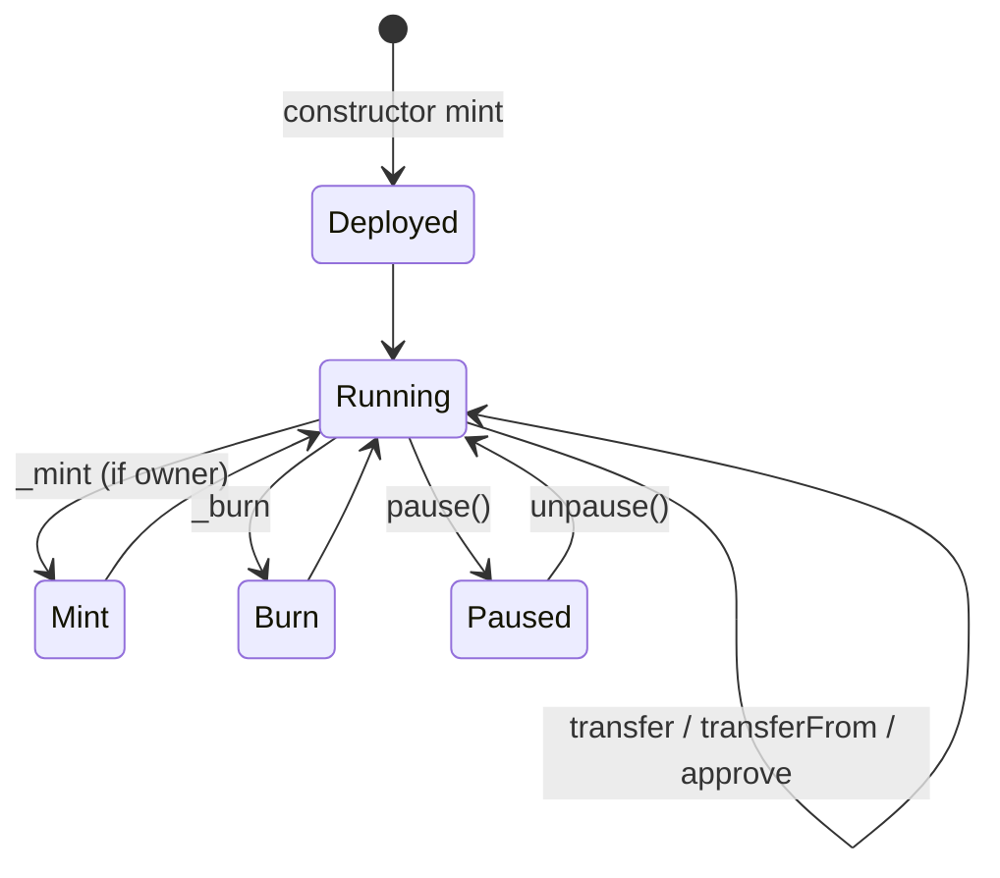
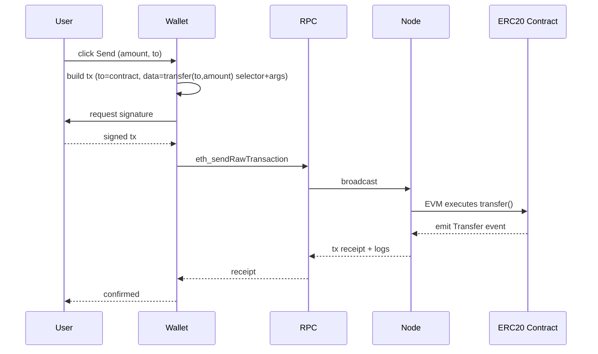

# ERC-20 同质化代币与 ICO 历史

> **TL;DR**：ERC-20 是 Ethereum 最早、最广泛采用的代币标准（EIP-20，2015-11 由 Fabian Vogelsteller 提出，2017 定稿）。它定义了同质化代币（Fungible Token）的最小接口：`totalSupply / balanceOf / transfer / transferFrom / approve / allowance` 六个方法 + `Transfer / Approval` 两个事件。ERC-20 支撑了 2017 年 ICO 狂潮（累计募资约 70 亿美元）、DeFi 流动性池、稳定币（USDT / USDC / DAI）以及几乎所有 EVM 链上的可替代资产。但它的语义缺陷（approve 竞态、transfer 到合约无法触发钩子、缺乏 Permit）催生了 ERC-223、ERC-677、ERC-777、EIP-2612（Permit）、ERC-4626 等后续改进。

## 1. 背景与动机

以太坊上线（2015-07）时并没有内置代币概念——所有资产都是通过合约实现的。2015 下半年出现多种非统一的代币实现（Augur REP、Golem、DigixDAO），交易所与钱包无法统一识别。**Fabian Vogelsteller** 于 2015-11 在 GitHub `ethereum/EIPs` Issue #20 提出标准接口草案，由 **Vitalik Buterin** 联合推进。该标准的核心目标是：

1. **可组合性**：钱包、交易所、DEX 只需实现一套对接逻辑即可支持所有 ERC-20 代币。
2. **最小接口**：仅规定行为合约（余额、转账、授权），不规定铸造 / 销毁 / 管理权限（留给实现者）。
3. **事件标准化**：`Transfer` / `Approval` 作为链上可索引信号，支撑区块浏览器与后端。

ICO（Initial Coin Offering）热潮从 2016 年开始：项目方部署一个 ERC-20 合约，向智能合约发送 ETH 即可按汇率兑换代币。2017 年达到顶峰，代表项目：EOS 募资 42 亿美元（持续一年）、Tezos 2.32 亿、Filecoin 2.57 亿。ICO 模式的优势是无地域限制、无中介、即刻流通；缺点是信息披露缺失、骗局遍地（据 SEC 与多家研究机构估计超过 80% 的 ICO 最终归零或被定性为欺诈）。2017-09 中国央行七部委联合公告禁止 ICO，2018 SEC DAO Report 将多数代币定义为证券，市场转入低潮。但 ERC-20 标准已成为基础设施，沿用至今。

## 2. 核心原理

### 2.1 形式化定义

代币合约状态 `S` 至少包含：
- `totalSupply: uint256`
- `balances: map(address → uint256)`
- `allowances: map(address × address → uint256)`

EIP-20 规定的状态转移：

```
transfer(to, v): balances[msg.sender] -= v; balances[to] += v; emit Transfer(sender, to, v)
approve(spender, v): allowances[msg.sender][spender] = v; emit Approval(sender, spender, v)
transferFrom(from, to, v):
  require(allowances[from][msg.sender] >= v)
  allowances[from][msg.sender] -= v
  balances[from] -= v; balances[to] += v
  emit Transfer(from, to, v)
```

不变式：
- `sum(balances) == totalSupply`（若无铸造 / 销毁）。
- `transferFrom` 必须消耗 allowance，除非 allowance = `type(uint256).max`（OpenZeppelin 实现的约定性优化）。

### 2.2 接口声明

```solidity
interface IERC20 {
    function totalSupply() external view returns (uint256);
    function balanceOf(address account) external view returns (uint256);
    function transfer(address to, uint256 amount) external returns (bool);
    function allowance(address owner, address spender) external view returns (uint256);
    function approve(address spender, uint256 amount) external returns (bool);
    function transferFrom(address from, address to, uint256 amount) external returns (bool);

    event Transfer(address indexed from, address indexed to, uint256 value);
    event Approval(address indexed owner, address indexed spender, uint256 value);
}
```

可选扩展（ERC-20 元数据）：`name()` / `symbol()` / `decimals()`。注意：`decimals` 只是展示约定，链上数量单位始终是 uint256 最小单位；合约本身不执行小数运算。

### 2.3 approve / transferFrom 的竞态问题

已知问题：若用户先 `approve(spender, 100)`，再想改为 `approve(spender, 50)`，在新交易上链前 spender 可以看到旧交易 mempool 信息，抢先调用 `transferFrom(100)`，然后再在新 approve 生效后再次 `transferFrom(50)`，合计花掉 150。

修复建议（来自原 EIP）：改用 `increaseAllowance` / `decreaseAllowance`（OpenZeppelin 提供）或先置零再设置。但此问题至今未从根上解决，很多钱包 UI 默认请求 infinite approval 进一步放大风险。

### 2.4 缺陷集合与修补 EIP

| 缺陷 | 后续 EIP |
| --- | --- |
| approve 竞态 | （未修）社区规范；OZ increaseAllowance |
| transfer 到合约地址无回调，合约若未实现可能资产丢失 | ERC-223（已用少）、ERC-777（带 hooks） |
| 每次授权需要签名 + gas | EIP-2612 Permit（签名授权） |
| 缺 meta-tx 支持 | EIP-2771、EIP-3009 TransferWithAuthorization |
| 不是 vault 标准 | ERC-4626 |
| 需要额外通知 | ERC-777 tokensReceived hook |

### 2.5 参数与常量

ERC-20 本身无全局参数；实现者自行决定：
- `decimals`：18（常见）、6（USDC/USDT）、8（WBTC 对齐 BTC）。
- 初始 supply：固定 / 可铸造 / 通胀模型。
- 铸造 / 销毁权限：owner / role-based / DAO。
- 是否暂停（Pausable）、是否可黑名单（USDT/USDC 有）。

### 2.6 状态机与事件流



## 3. 架构剖析

### 3.1 分层视图

```
┌───────────────────────────────────┐
│ dApp / Wallet / DEX UI            │
├───────────────────────────────────┤
│ SDK (ethers.js, viem, web3.js)    │
├───────────────────────────────────┤
│ JSON-RPC Node (Geth / Reth / ...) │
├───────────────────────────────────┤
│ ERC-20 Contract Bytecode          │
├───────────────────────────────────┤
│ EVM + State (MPT)                 │
└───────────────────────────────────┘
```

### 3.2 核心模块清单（OpenZeppelin v5.x）

| 模块 | 职责 | 依赖 | 可替换 |
| --- | --- | --- | --- |
| `ERC20.sol` | 核心接口 + 存储 | — | 可自写 |
| `ERC20Burnable` | 销毁接口 | ERC20 | ✅ |
| `ERC20Pausable` | 暂停转账 | ERC20 + Pausable | ✅ |
| `ERC20Permit` | EIP-2612 签名授权 | ERC20 + EIP-712 | ✅ |
| `ERC20Votes` | 治理 checkpoint（Compound/Gov） | ERC20 | ✅ |
| `ERC20FlashMint` | ERC-3156 闪电贷 | ERC20 | ✅ |
| `ERC20Wrapper` | 包装现有代币 | ERC20 | ✅ |
| `ERC4626` | 收益金库 | ERC20 | 见专文 |

### 3.3 数据流：一次 transfer 全链路



### 3.4 参考实现

- **OpenZeppelin Contracts**：`openzeppelin-contracts` 是事实标准，v5.x 采用 custom errors、命名空间存储。
- **Solmate**（transmissions11）：精简高 gas 优化版本，缺省 hook。
- **SolidState**：模块化 diamond 风格 ERC-20。
- **Yul 手写**：如 USDT 的原合约（早于 OZ），有 bug 但已成传奇（如 transfer 无返回值）。

### 3.5 扩展接口

- **EIP-2612 Permit**：通过签名 allowance，一笔 tx 完成 approve + transferFrom。
- **ERC-3156 Flash Loan**：标准化闪电贷接口。
- **EIP-5805 / ERC20Votes**：治理权重快照。
- **ERC-7201**：命名空间存储，用于可升级合约避免 storage collision。

## 4. 关键代码 / 实现细节

OpenZeppelin ERC20 核心片段（`openzeppelin-contracts@5.0.2`, `contracts/token/ERC20/ERC20.sol:197-245`）：

```solidity
// 路径：contracts/token/ERC20/ERC20.sol:197
function _update(address from, address to, uint256 value) internal virtual {
    if (from == address(0)) {
        // Mint: totalSupply 增加
        _totalSupply += value;
    } else {
        uint256 fromBalance = _balances[from];
        if (fromBalance < value) {
            revert ERC20InsufficientBalance(from, fromBalance, value);
        }
        unchecked {
            _balances[from] = fromBalance - value;
        }
    }
    if (to == address(0)) {
        unchecked { _totalSupply -= value; } // burn
    } else {
        unchecked { _balances[to] += value; }
    }
    emit Transfer(from, to, value);
}

// 路径：contracts/token/ERC20/ERC20.sol:272
function _spendAllowance(address owner, address spender, uint256 value) internal virtual {
    uint256 current = allowance(owner, spender);
    if (current != type(uint256).max) {
        if (current < value) revert ERC20InsufficientAllowance(spender, current, value);
        unchecked {
            _approve(owner, spender, current - value, false);
        }
    }
    // infinite allowance：不消耗 gas，也不减少额度
}
```

Permit（EIP-2612）片段（`contracts/token/ERC20/extensions/ERC20Permit.sol:40`）：

```solidity
bytes32 private constant PERMIT_TYPEHASH =
    keccak256("Permit(address owner,address spender,uint256 value,uint256 nonce,uint256 deadline)");

function permit(address owner, address spender, uint256 value, uint256 deadline,
                uint8 v, bytes32 r, bytes32 s) public virtual {
    require(block.timestamp <= deadline, "ERC20Permit: expired deadline");
    bytes32 structHash = keccak256(abi.encode(PERMIT_TYPEHASH, owner, spender, value, _useNonce(owner), deadline));
    bytes32 hash = _hashTypedDataV4(structHash); // EIP-712 domain separator
    address signer = ECDSA.recover(hash, v, r, s);
    require(signer == owner, "ERC20Permit: invalid signature");
    _approve(owner, spender, value);
}
```

## 5. 演进与版本对比

| 标准 / 提案 | 年份 | 核心变化 | 状态 |
| --- | --- | --- | --- |
| EIP-20 | 2015–2017 | 基础接口 | Final |
| ERC-223 | 2017 | 增加 `tokenFallback` hook 防丢失 | 草案（低采用） |
| ERC-677 | 2017 | `transferAndCall` （Chainlink LINK 使用） | 非官方标准 |
| ERC-777 | 2019 | tokensToSend / tokensReceived hook + 全局注册 | Final（争议，部分协议弃用） |
| EIP-2612 | 2020 | Permit 签名授权 | Final（广泛采用） |
| EIP-3009 | 2020 | TransferWithAuthorization（USDC 用） | Final |
| ERC-4626 | 2022 | Tokenized Vault | Final（见专文） |
| ERC-4337 相关 Paymaster ERC20 | 2023 | Gas 用 ERC-20 代付 | Final |

## 6. 实战示例

部署一个最简 ERC-20（Foundry）：

```solidity
// MyToken.sol
pragma solidity ^0.8.20;
import "@openzeppelin/contracts/token/ERC20/ERC20.sol";

contract MyToken is ERC20 {
    constructor(uint256 initialSupply) ERC20("MyToken", "MTK") {
        _mint(msg.sender, initialSupply);
    }
}
```

```bash
forge create MyToken.sol:MyToken \
  --constructor-args 1000000000000000000000000 \
  --rpc-url $RPC --private-key $PK
# 产出合约地址 0xABCD...

# 调用 transfer
cast send 0xABCD... "transfer(address,uint256)" 0xRecipient 100e18 \
  --rpc-url $RPC --private-key $PK

# 查询余额
cast call 0xABCD... "balanceOf(address)(uint256)" 0xRecipient --rpc-url $RPC
```

前端 (viem)：
```ts
import { erc20Abi, parseUnits } from 'viem';
const hash = await walletClient.writeContract({
  address: TOKEN, abi: erc20Abi, functionName: 'transfer',
  args: [recipient, parseUnits('1', 18)],
});
```

## 7. 安全与已知攻击

- **approve 竞态**：前文描述。缓解：UI 强制先 approve(0) 再 approve(v)；或使用 Permit（单一交易）。
- **Fake token / Phishing**：恶意合约仿冒 USDC；用户应始终通过合约地址而非 symbol 验证。
- **Fee-on-transfer 代币与 DEX 兼容**：某些代币（SafeMoon、Reflect）在 transfer 时扣手续费，导致 Uniswap v2 swap 失败。需使用 `supportingFeeOnTransferTokens` 变体。
- **回调地狱**（ERC-777）：`tokensReceived` hook 触发重入，2020 imBTC / Lendf.Me 遭受 2500 万美元重入攻击；此后多数 DeFi 协议默认不接 ERC-777。
- **Infinite approval 风险**：Uniswap v2、1inch 默认请求无限额度。一旦路由合约被攻破（如 2022 Inverse Finance 事件），用户资金直接被抽走。EIP-7702 / Permit2 是改进方向。
- **USDT 历史 bug**：早期 USDT 合约 `transfer` 不返回 bool，使用 `IERC20` 调用失败，OpenZeppelin 引入 `SafeERC20`（`safeTransfer` 用 low-level call + `returndatasize`）。
- **Approval Phishing（2024 年主要趋势）**：钱包签名 Permit 或 increaseAllowance 的钓鱼签名页面。2023-2024 此类损失已超过十亿美元。

## 8. 与同类方案对比

| 维度 | ERC-20 | ERC-223 | ERC-777 | EIP-2612 Permit | ERC-4626 Vault | ERC-1155 |
| --- | --- | --- | --- | --- | --- | --- |
| 同质化 | ✅ | ✅ | ✅ | ✅（扩展） | ✅（asset/share） | 可同可不同 |
| transfer hook | ❌ | ✅ | ✅ | ❌ | ❌ | ✅ |
| 签名授权 | ❌ | ❌ | ❌ | ✅ | ❌ | ❌ |
| 采用率 | 极高 | 低 | 低 | 高（USDC/DAI） | 高 | 高（NFT+FT） |

ERC-20 的统治力源自：先发优势、最小接口、与钱包 / 交易所的深度兼容。虽然后续标准技术上更优，但 ERC-20 仍是 CEX 上币、DEX 流动性池的默认约定。

## 9. 延伸阅读

- **规范**：EIP-20（<https://eips.ethereum.org/EIPS/eip-20>）
- **参考实现**：<https://github.com/OpenZeppelin/openzeppelin-contracts/tree/master/contracts/token/ERC20>
- **博客**：
  - Vitalik "A prehistory of the Ethereum protocol" — 早期代币背景
  - ConsenSys "Smart Contract Best Practices" — ERC-20 pitfalls
  - a16z crypto 审计报告
- **ICO 历史**：
  - Cointelegraph 年度 ICO 报告
  - SEC DAO Investigative Report（2017）
- **安全**：OpenZeppelin Defender、SlowMist `Wallet Transaction Security Guide`
- **EIPs 相关**：EIP-2612、EIP-3009、EIP-3156、EIP-5805、EIP-7201

## 10. 术语表

| 术语 | 英文 | 释义 |
| --- | --- | --- |
| 同质化代币 | Fungible Token | 所有单位完全等价的代币 |
| 授权额度 | Allowance | owner 允许 spender 转账的最大额度 |
| 小数位 | Decimals | 展示约定，不影响链上存储 |
| ICO | Initial Coin Offering | 以代币众筹募资的方式 |
| Permit | EIP-2612 Permit | 通过 EIP-712 签名完成 approve |
| SafeERC20 | SafeERC20 | OZ 库：安全调用不规范 ERC20 |
| Fee on transfer | FoT | 转账时扣手续费的代币变体 |

---

*Last verified: 2026-04-22*
