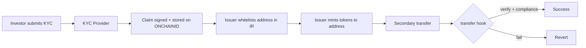

# ERC-3643 合规代币与 RWA 身份链上验证

> **TL;DR**：ERC-3643（前身 T-REX，由 Tokeny 牵头，2021 提出，2023-07 定稿）是面向 **受监管证券型代币 / RWA** 的以太坊标准。它在 ERC-20 基础上叠加 **链上身份（ONCHAINID，基于 ERC-734/735）** 与 **转账合规模块（ModularCompliance）**：每次 `transfer` 前先校验发送方 / 接收方是否持有合规"声明"（Claim），并检查当前余额变化是否违反合规规则（持有者上限、黑名单、时间锁、地域限制、最大持仓比例等）。主要应用于代币化证券、私募信贷、房地产基金、美国国债代币化（虽 BUIDL / USDY 自用不同方案）。ERC-3643 与 Polymath ERC-1400 是两大流派——前者聚焦模块化合规 + ONCHAINID，后者聚焦分区（partition）与文档。

## 1. 背景与动机

把"真实世界资产（Real World Assets, RWA）"搬上链，技术上只需要一个可转账凭证（ERC-20 或 ERC-721）。但 **合规** 是真正的护城河：
- 股票 / 基金份额 / 债券在大多数司法辖区是证券，发行与流通需 KYC、投资者合格性、持有人数上限、禁止转给制裁地址等。
- 不合规的链上转账会让发行方面临监管制裁，甚至使代币失去法律凭证效力。

早期方案（2018–2020）：
- **Polymath ERC-1400**：提出 partitioned tokens（同一代币分"A 股 / B 股"），并加入 `canTransfer(from, to, amount)` 合规钩子。
- **Harbor R-Token / Securitize DS Protocol**：类似思路，半开放生态。

问题：接口碎片、合规逻辑写死在代币内、身份凭证不可复用、跨项目难互操作。

**Tokeny Solutions**（卢森堡团队，与 Archax、ADDX、RealT 等合作）在 2020 年推出 T-REX 框架，后标准化为 ERC-3643。关键创新：
1. **ONCHAINID**：每位投资者有一个独立 Identity 合约（ERC-734），持有来自多个发行方 / KYC 服务商的 Claim（ERC-735）。一次 KYC，多处使用。
2. **ModularCompliance**：代币合约不自写合规，挂载可插拔的"合规模块"（MaxBalance、CountryRestrict、HolderLimit 等）。发行方可按需组合。
3. **链上 + 链下治理**：代币 owner / agent 可强制转账（仲裁）、冻结、销毁（处理合规事件，如用户死亡），由多签或 DAO 执行。

随着 2023–2024 年 RWA 叙事兴起（BlackRock BUIDL, Ondo USDY, Franklin Templeton BENJI, 香港 HKMA 代币化债券试点），ERC-3643 在欧盟、亚洲监管测试场景（MiCA、HK、Singapore）被多次采用。社区成立 ERC3643 Association 推进跨协议标准。

## 2. 核心原理

### 2.1 形式化定义

代币合约 `T` 状态扩展自 ERC-20，加上：
- `identityRegistry: address`（指向 IdentityRegistry 合约）
- `compliance: address`（指向 ModularCompliance 合约）
- `paused: bool`
- `frozenTokens: map(address → uint256)`（锁定余额）
- `walletFrozen: map(address → bool)`（账户冻结）

`transfer(to, amount)` 语义：
```
require(!paused)
require(!walletFrozen[msg.sender] && !walletFrozen[to])
require(balanceOf(msg.sender) - frozenTokens[msg.sender] >= amount)
require(identityRegistry.isVerified(to))       // KYC 通过
require(compliance.canTransfer(from, to, amt)) // 合规规则全部通过
// 执行 ERC-20 transfer
compliance.transferred(from, to, amount)       // 状态 hook
```

**Verified** 定义：`IdentityRegistry` 通过 `isVerified(addr)` 检查 addr 拥有的 ONCHAINID，且其 Claim 覆盖 issuer 要求的 `claimTopics`（由 `ClaimTopicsRegistry` 配置）。

### 2.2 核心合约与数据结构

ERC-3643 定义若干相互依赖的合约：

| 合约 | 职责 |
| --- | --- |
| `IToken` | 主代币合约（扩展 IERC20） |
| `IIdentityRegistry` | 维护 `address → ONCHAINID` 映射 |
| `IIdentityRegistryStorage` | 分离 storage 以支持多代币共享 |
| `IClaimTopicsRegistry` | 配置当前代币要求的 claim topics（如 KYC=7, AccreditedInvestor=10） |
| `ITrustedIssuersRegistry` | 声明哪些 claim issuer 可信 |
| `IModularCompliance` | 合规模块编排 |
| `IIdentity` (ERC-734) | 用户的身份合约（MANAGEMENT / ACTION / CLAIM keys） |
| `ClaimIssuer` | 发放 Claim 的机构（KYC 提供商） |

ERC-734 key purposes：
- `1 MANAGEMENT`：管理 key（增删 key / claim）
- `2 ACTION`：代理执行
- `3 CLAIM`：签发 claim
- `4 ENCRYPTION`：加密

ERC-735 Claim 结构：
```
Claim { topic, scheme, issuer, signature, data, uri }
```
签名 = `ECDSA(keccak256(identityAddr || topic || data))` by issuer CLAIM key。

### 2.3 子机制拆解

1. **Identity Verification**：转账前 `isVerified(addr)` → 查询用户 ONCHAINID 的所有 claim，对比 ClaimTopicsRegistry 要求，验证签名与 TrustedIssuer。
2. **Compliance Modules**：IModularCompliance 接口 `addModule(addr)` / `callModuleFunction(...)`。常见模块：
   - `MaxBalanceModule`：每地址持仓上限
   - `CountryRestrictModule`：禁止特定国家（基于 ONCHAINID 中 country claim）
   - `TimeTransfersLimitsModule`：单日 / 月转账上限
   - `SupplyLimitModule`：总发行上限
   - `ExchangeMonthlyLimits`：交易所地址月度额度
3. **Freeze / Force Transfer**：agent 角色可调用 `freezePartialTokens(holder, amount)`、`forcedTransfer(from, to, amt)`（跳过合规，用于法院指令 / 资产继承）。
4. **Recovery**：用户私钥丢失，可通过 ONCHAINID 绑定新地址，代币合约用 `recoveryAddress(lostWallet, newWallet, identity)` 迁移余额。
5. **Pause / Unpause**：紧急停摆，agent 触发。
6. **发行 / 销毁**：`mint` / `burn` 权限由 agent（发行机构）持有。

### 2.4 参数与治理

| 参数 | 类型 | 可治理 | 说明 |
| --- | --- | --- | --- |
| `claimTopics` | uint256[] | agent | KYC/accredited 等 topic id |
| `trustedIssuers` | address + topics[] | agent | KYC 服务商清单 |
| `complianceModules` | address[] | agent | 合规规则组合 |
| `maxHolders` | uint256 | module | 通常上限（如 SEC 506(c) 2000 人） |
| `lockupPeriod` | 区块 / 秒 | module | 锁定期（144A 规则 6/12 个月） |

### 2.5 失败模式

- **Verified 失效**：KYC 过期（`validFrom / validUntil`）→ 合法转入变为不合法。实现时需支持重新验证流程。
- **中心化 agent**：发行方可以强制转账、冻结、销毁——这是合规的必要权力，但若 agent key 被盗，后果严重。建议多签 + 延时。
- **合规模块升级风险**：调整 MaxBalance 可能导致原本合法的持有者变为违规，需治理协调。
- **Gas 放大**：每次 transfer 需查询多个合约 + 多 claim 验证，gas 约为 ERC-20 的 3–6 倍。
- **私钥泄露 + recovery 竞争**：recovery 流程需要 ONCHAINID MANAGEMENT key 配合；若攻击者先获得该 key，可抢注新钱包。

### 2.6 图示

```mermaid
sequenceDiagram
  participant Alice as Alice Wallet
  participant Token as ERC3643 Token
  participant IR as IdentityRegistry
  participant OC as Alice ONCHAINID
  participant TIR as TrustedIssuersRegistry
  participant MC as ModularCompliance
  Alice->>Token: transfer(Bob, 100)
  Token->>IR: isVerified(Bob)?
  IR->>OC: getClaimIdsByTopic(KYC)
  OC-->>IR: [claimId1]
  IR->>OC: getClaim(claimId1)
  OC-->>IR: {issuer, signature, data}
  IR->>TIR: isTrusted(issuer, KYC)?
  TIR-->>IR: true
  IR-->>Token: verified=true
  Token->>MC: canTransfer(Alice, Bob, 100)
  MC-->>Token: true
  Token->>Token: _transfer; call compliance.transferred()
```

```
 Token (ERC-3643)
   │
   ├── IdentityRegistry ──► IdentityRegistryStorage ──► {addr: ONCHAINID}
   │        │
   │        ├── ClaimTopicsRegistry  (required topics)
   │        └── TrustedIssuersRegistry (who can issue)
   │
   └── ModularCompliance ──► Module 1 ... Module N
```

## 3. 架构剖析

### 3.1 分层视图

```
┌───────────────────────────────────────────┐
│ Issuer Portal / Investor Portal (Tokeny)  │
├───────────────────────────────────────────┤
│ KYC/AML Service + Claim Issuer            │
├───────────────────────────────────────────┤
│ ERC-3643 Token Suite (Token / IR / MC)    │
├───────────────────────────────────────────┤
│ ONCHAINID (ERC-734/735)                   │
├───────────────────────────────────────────┤
│ Ethereum / Polygon / Avalanche / Sub-net  │
└───────────────────────────────────────────┘
```

### 3.2 核心模块清单

| 模块 | 职责 | 依赖 |
| --- | --- | --- |
| `Token.sol` | 代币主合约 | IR + MC |
| `IdentityRegistry.sol` | 身份注册 + 验证 | IRStorage + CTR + TIR |
| `IdentityRegistryStorage.sol` | 地址 → Identity 存储（可多代币共享） | — |
| `ClaimTopicsRegistry.sol` | 要求的 claim topic 清单 | — |
| `TrustedIssuersRegistry.sol` | 可信 issuer 清单 | — |
| `ModularCompliance.sol` | 合规模块编排 | modules |
| Compliance modules | 具体规则 | — |
| `AgentRole.sol` | 角色权限 | — |
| ONCHAINID `Identity.sol` | 用户身份 | — |
| `ClaimIssuer.sol` | KYC 机构 | — |

### 3.3 数据流：从 KYC 到发行到流通



### 3.4 参考实现

- **T-REX Suite**（<https://github.com/TokenySolutions/T-REX>）：Tokeny 开源实现。
- **ONCHAINID**：<https://github.com/onchain-id/solidity>
- **ERC-3643 基金会代码库**：<https://github.com/ERC-3643/ERC-3643>
- 部署链：Ethereum mainnet、Polygon、Avalanche Evergreen subnet、Polygon zkEVM、Hedera（via EVM）

### 3.5 外部接口

- **ERC-20 兼容**：所有 DEX / 钱包看到它是普通 ERC-20；但 transfer 会被合规逻辑拒绝。
- **EIP-1066 status codes**：某些实现在 revert reason 使用标准状态码（0x50 Success, 0x51 Insufficient, 0x52 Forbidden 等）。
- **ERC-165** 支持查询接口。

## 4. 关键代码 / 实现细节

T-REX Token 合约核心（`TokenySolutions/T-REX`, tag `v4.1.3`, `contracts/token/Token.sol`）：

```solidity
// 路径：contracts/token/Token.sol:215（简化）
function transfer(address _to, uint256 _amount) public override whenNotPaused returns (bool) {
    require(!_frozen[_to] && !_frozen[msg.sender], "wallet is frozen");
    require(_amount <= balanceOf(msg.sender) - _frozenTokens[msg.sender], "Insufficient Balance");
    if (_tokenIdentityRegistry.isVerified(_to) && _tokenCompliance.canTransfer(msg.sender, _to, _amount)) {
        _tokenCompliance.transferred(msg.sender, _to, _amount);
        _transfer(msg.sender, _to, _amount);
        return true;
    }
    revert("Transfer not possible");
}

// 路径：contracts/token/Token.sol:412
function forcedTransfer(address _from, address _to, uint256 _amount)
    public onlyAgent returns (bool) {
    require(balanceOf(_from) >= _amount, "sender balance too low");
    uint256 freeBalance = balanceOf(_from) - _frozenTokens[_from];
    if (_amount > freeBalance) {
        uint256 tokensToUnfreeze = _amount - freeBalance;
        _frozenTokens[_from] -= tokensToUnfreeze;
        emit TokensUnfrozen(_from, tokensToUnfreeze);
    }
    if (_tokenIdentityRegistry.isVerified(_to)) {
        _tokenCompliance.transferred(_from, _to, _amount);
        _transfer(_from, _to, _amount);
        return true;
    }
    revert("Transfer not possible");
}
```

IdentityRegistry 验证（`contracts/registry/implementation/IdentityRegistry.sol:128`）：

```solidity
function isVerified(address _userAddress) public view override returns (bool) {
    if (address(identity(_userAddress)) == address(0)) return false;
    uint256[] memory requiredClaimTopics = _tokenTopicsRegistry.getClaimTopics();
    if (requiredClaimTopics.length == 0) return true;
    for (uint256 i = 0; i < requiredClaimTopics.length; i++) {
        bytes32[] memory claimIds = identity(_userAddress)
            .getClaimIdsByTopic(requiredClaimTopics[i]);
        if (claimIds.length == 0) return false;
        bool valid;
        for (uint256 j = 0; j < claimIds.length; j++) {
            (uint256 topic, , address issuer, bytes memory sig, bytes memory data, )
                = identity(_userAddress).getClaim(claimIds[j]);
            if (_tokenIssuersRegistry.hasClaimTopic(issuer, topic)
                && IClaimIssuer(issuer).isClaimValid(identity(_userAddress), topic, sig, data)) {
                valid = true; break;
            }
        }
        if (!valid) return false;
    }
    return true;
}
```

## 5. 演进与版本对比

| 版本 | 年份 | 变更 |
| --- | --- | --- |
| T-REX v1 | 2019 | Tokeny 初版 |
| T-REX v2 | 2020 | ONCHAINID 抽离 |
| T-REX v3 | 2021 | ModularCompliance |
| ERC-3643 草案 | 2021-07 | EIP 提交 |
| ERC-3643 Final | 2023-07 | 接口锁定 |
| T-REX v4 | 2023–2024 | Gas 优化、模块扩展 |
| ERC-3643 v2 讨论 | 2024+ | 支持多链身份、zk-KYC |

其他合规 token 标准对比：
- **ERC-1400 / 1404**：Polymath；使用 partition 划分股份 + canTransfer 钩子。
- **ERC-1410**：分区余额（多 tranche）。
- **ERC-1462**：基础监管代币接口。
- **SRC-20**（Swarm）：类证券代币。
- **ERC-7518 DyCIST**（2024）：动态合规接口。

## 6. 实战示例

ERC-3643 端到端流程的典型命令（以 T-REX Hardhat 部署脚本为参考）：

```bash
git clone https://github.com/TokenySolutions/T-REX.git
cd T-REX && npm install
# hardhat test 运行完整流程：
npx hardhat test

# 部署脚本核心步骤（伪代码）
# 1. 部署 ClaimTopicsRegistry，设置 topics = [7]（KYC）
# 2. 部署 TrustedIssuersRegistry，添加 ClaimIssuer
# 3. 部署 IdentityRegistryStorage + IdentityRegistry
# 4. 部署 ModularCompliance，添加 CountryRestrictModule
# 5. 部署 Token，绑定 IR + MC
# 6. investor 部署 ONCHAINID，ClaimIssuer 签 KYC claim
# 7. agent 调用 IR.registerIdentity(investorAddr, onchainID, countryCode)
# 8. token.mint(investor, 1000e18)
# 9. investor.transfer(other, 100e18)  // 若 other 通过 KYC → 成功
```

Solidity 模拟签 Claim（简化）：
```solidity
bytes32 dataHash = keccak256(abi.encode(identityAddr, topic, data));
bytes32 prefixed = keccak256(abi.encodePacked("\x19Ethereum Signed Message:\n32", dataHash));
bytes memory sig = issuerSign(prefixed);
identity.addClaim(topic, scheme, issuer, sig, data, uri);
```

## 7. 安全与已知攻击

- **Claim 泄露与重放**：若 KYC issuer 私钥泄露，攻击者可伪造任何地址的 KYC claim。对策：快速 revoke + TrustedIssuersRegistry 更新。
- **Agent 权力滥用**：agent 可 forcedTransfer / burn；应由发行方多签 + 审计日志。2023 年某 RWA 平台误操作冻结了本应正常的账户，引发客户诉讼。
- **合规模块升级一致性**：不同模块之间若参数冲突（maxBalance vs timeLimit），可能使合法流转变失败。建议治理前模拟。
- **Recovery 地址竞争**：lost wallet recovery 路径若未限速，可能被抢先注册新地址。
- **链下 KYC 合规但链上 claim 未刷新**：用户升级护照后 KYC 已过期，链上 claim 仍指示有效。需定期 re-KYC。
- **隐私问题**：Claim data 虽哈希但 issuer / topic 是明文，仍有隐私泄漏风险；zk-KYC 是研究方向（ZKPassport、Polygon ID）。

## 8. 与同类方案对比

| 维度 | ERC-3643 | ERC-1400/1410 | Securitize DS | Circle Compliance | zk-KYC (PolygonID/zkPass) |
| --- | --- | --- | --- | --- | --- |
| 身份载体 | ONCHAINID | 合约本身 | 私有 Identity | 链下账户 | zk proof |
| 模块化合规 | ✅ | 部分 | 私有 | 私有 | N/A |
| 开源 | ✅ | ✅ | ❌ | ❌ | ✅ |
| 链下集成 | Tokeny/Archax | Polymath | Securitize | Circle | 多 |
| 隐私 | 中（明文 topic） | 中 | 中 | 低 | 高 |
| 生态 | EU 为主 | 美国 | 美国 | 美国 | 新兴 |

RWA 发行方选择建议：
- EU / 亚洲合规导向、需要多 issuer KYC 复用：ERC-3643。
- 美国私募证券（Reg D / Reg A+）、分 tranche：ERC-1400 + Securitize。
- 全托管稳定资产：发行方自建，例如 BlackRock BUIDL 使用自建合约（非 3643）。
- 隐私优先：zk-KYC 叠加任何代币标准。

## 9. 延伸阅读

- **规范**：EIP-3643、EIP-734、EIP-735、EIP-1400
- **代码**：
  - <https://github.com/TokenySolutions/T-REX>
  - <https://github.com/onchain-id/solidity>
  - <https://github.com/ERC-3643/ERC-3643>
- **基金会**：<https://www.erc3643.org/>
- **Tokeny Docs**：<https://docs.tokeny.com/>
- **监管**：MiCA (EU)、香港 HKMA tokenization project、SGX tokenization。
- **实战文章**：
  - Chainlink RWA Playbook
  - Galaxy Research "Tokenization report 2024"
  - a16z "Crypto Regulation and Policy"

## 10. 术语表

| 术语 | 英文 | 释义 |
| --- | --- | --- |
| RWA | Real World Assets | 真实世界资产代币化 |
| ONCHAINID | ONCHAINID | 基于 ERC-734/735 的链上身份 |
| Claim | Claim | 可验证的身份声明（KYC / 居住国等） |
| Agent | Agent | 发行方操作员角色（mint/freeze） |
| 强制转账 | Forced Transfer | 合规仲裁下的代币迁移 |
| 部分冻结 | Partial Freeze | 冻结账户内部分代币 |
| 模块化合规 | Modular Compliance | 挂载可插拔规则模块 |
| Trusted Issuer | Trusted Issuer | 被接受的 Claim 签发方 |

---

*Last verified: 2026-04-22*
