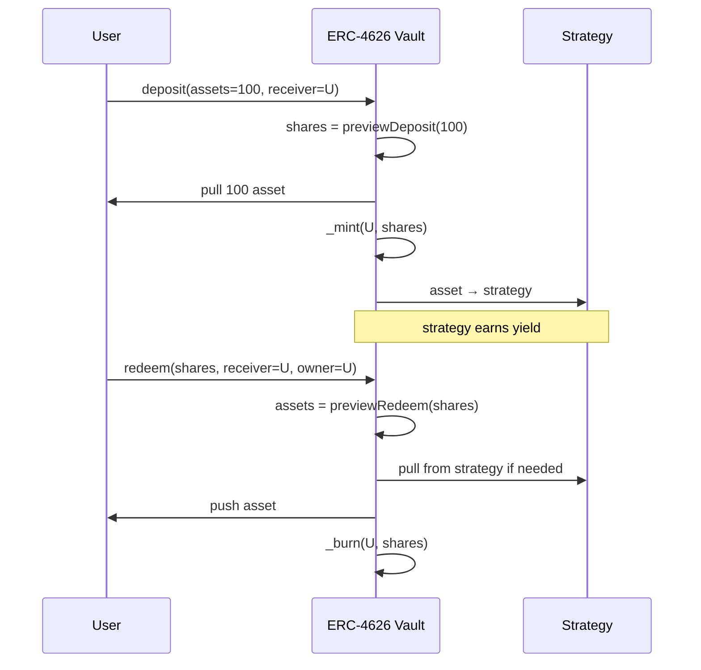

# ERC-4626 Tokenized Vault 标准

> **TL;DR**：ERC-4626（Joey Santoro / t11s / Joshua Hannan，2022-03 定稿）是 **收益聚合金库** 的统一接口——用户存入底层资产（`asset`，通常 ERC-20），获得代表所有权份额的 `share`（也是 ERC-20）；金库运营者通过策略产生收益，用户按份额赎回时获得原资产 + 收益。4626 把 deposit / withdraw / mint / redeem 四种语义与 asset ↔ share 换算标准化，并强制暴露预览函数（preview*），让下游协议（借贷、衍生品、收益聚合器）可以无差别接入任意 vault，例如 Yearn、MakerDAO sDAI、Morpho Blue、Spark、Aave v3 的 aToken（类 4626）。ERC-4626 的 "inflation attack" 经典漏洞催生了 "virtual shares"（OZ 默认）与 ERC-7540 异步 vault（RWA 适用）。

## 1. 背景与动机

2020–2021 年 "DeFi summer" 后，收益聚合器（yield aggregator）涌现：Yearn、Harvest、Convex、Rari、Beefy 等都提供"存 X 返 X 的生息凭证 yX"。每个协议自造接口——有的是 ERC-20 份额，有的是 NFT 头寸，换算方法 / 取款机制各异。集成方（Alchemix、Element、Opyn 等）需要为每个 vault 写适配器，开发成本高、审计面广。

**Joey Santoro（Fei / Tribe）** 在 2021-12 提交 EIP-4626 草案，核心主张：
1. **标准化 asset / share 双语义**：`asset = ERC-20 you deposit`，`share = ERC-4626 token you receive`。
2. **双向方法对称**：`deposit(asset, receiver) → shares` 与 `mint(shares, receiver) → asset`；`withdraw(asset, receiver, owner) → shares` 与 `redeem(shares, receiver, owner) → asset`。四个方法覆盖 "指定输入" 或 "指定输出"。
3. **preview* 函数**：纯视图的换算预览（`previewDeposit / previewMint / previewWithdraw / previewRedeem`），便于前端与聚合器计算。
4. **max* 函数**：受限于金库状态的最大可存 / 取额。
5. **share 本身是 ERC-20**：自带 transfer / approve，可在 DEX 流通。

2022 年 6 月 EIP-4626 进入 Final，OpenZeppelin、solmate 提供参考实现。Yearn v3、MakerDAO sDAI（Spark 存款）、Morpho Blue、Euler v2 等均原生实现；Aave aToken 语义类似但有细微差异（利率在 balanceOf 隐含复利）。

2024 年 **ERC-7540**（Async ERC-4626）扩展了 4626 用于流动性延迟（RWA 基金、LST withdrawal queue）的场景，通过 `requestDeposit` / `requestRedeem` + claim 两阶段异步执行。**ERC-7535**（Native ETH Vault）扩展到以 ETH 作 asset。

## 2. 核心原理

### 2.1 形式化定义

设 vault 的内部资产总量为 `totalAssets()`，总份额为 `totalSupply()`。share/asset 换算：
```
assets → shares:  shares = assets * totalSupply / totalAssets   (ceil or floor per function)
shares → assets:  assets = shares * totalAssets / totalSupply
```

若 `totalSupply == 0`（初次存款），通常 `shares = assets`（OZ 加虚拟偏移 `_decimalsOffset`）。

EIP-4626 规定的 4 个转换函数（只读）：
- `convertToShares(assets) → shares`：理想情况下的换算
- `convertToAssets(shares) → assets`

为处理舍入与费用，定义 4 个 preview：
- `previewDeposit(assets)`：给定 assets 预期得到的 shares（向下）
- `previewMint(shares)`：给定想铸造的 shares 需要多少 assets（向上）
- `previewWithdraw(assets)`：取出 assets 需要销毁多少 shares（向上）
- `previewRedeem(shares)`：销毁 shares 得到多少 assets（向下）

舍入方向关键：**有利于金库/其他用户**——向上舍入发送方代价、向下舍入接收方所得。

### 2.2 方法集合（必选）

```solidity
interface IERC4626 is IERC20 {
    function asset() external view returns (address);
    function totalAssets() external view returns (uint256);

    function convertToShares(uint256 assets) external view returns (uint256);
    function convertToAssets(uint256 shares) external view returns (uint256);

    function maxDeposit(address receiver) external view returns (uint256);
    function previewDeposit(uint256 assets) external view returns (uint256);
    function deposit(uint256 assets, address receiver) external returns (uint256 shares);

    function maxMint(address receiver) external view returns (uint256);
    function previewMint(uint256 shares) external view returns (uint256);
    function mint(uint256 shares, address receiver) external returns (uint256 assets);

    function maxWithdraw(address owner) external view returns (uint256);
    function previewWithdraw(uint256 assets) external view returns (uint256);
    function withdraw(uint256 assets, address receiver, address owner) external returns (uint256 shares);

    function maxRedeem(address owner) external view returns (uint256);
    function previewRedeem(uint256 shares) external view returns (uint256);
    function redeem(uint256 shares, address receiver, address owner) external returns (uint256 assets);

    event Deposit(address indexed caller, address indexed owner, uint256 assets, uint256 shares);
    event Withdraw(address indexed caller, address indexed receiver, address indexed owner, uint256 assets, uint256 shares);
}
```

### 2.3 子机制拆解

1. **Asset 持有**：vault 持有底层 asset（如 USDC、WETH），或委托给 strategy 合约持有。`totalAssets` 应包括 strategy 中的部分。
2. **Strategy 执行**：4626 本身不规定 yield 来源；常见实现是 vault 把 asset 借给 Aave / 投入 Curve / 质押给 Lido，获得收益。
3. **Exchange rate 升值**：随 strategy 获利，`totalAssets` 增大，而 `totalSupply` 不变 → 每 share 价值上升。用户 deposit 时 share 价格 ↑ 获得较少 share，redeem 时得到较多 asset。
4. **Fees**：管理费（management fee）/ 业绩费（performance fee）通常通过向 treasury 铸造新 share 或周期性 transfer asset 实现。4626 不规定费率接口。
5. **Reentrancy 保护**：由于 share 是 ERC-20 且 deposit 会先转入 asset 后铸 share，必须防重入；OZ 使用 `_update` 钩子，solmate 使用显式 Guard。
6. **Async variant (ERC-7540)**：`requestDeposit(assets, controller, owner)` 返回 requestId；资金暂存；策略完成后用户 `deposit(assets, receiver)` 兑现。

### 2.4 参数与常量

| 参数 | 类型 | 可治理 | 说明 |
| --- | --- | --- | --- |
| `_decimalsOffset` | uint8 | 实现者定 | OZ 虚拟偏移，抵御 inflation |
| `asset` | address | 构造时定 | 不可变 |
| performance fee | bps | 实现者 | 通常 0–20% |
| management fee | bps / year | 实现者 | 通常 0–2% |
| max TVL cap | uint256 | 治理 | maxDeposit 使用 |

### 2.5 边界条件与失败模式

- **Inflation / Donation attack**（2022 Rari / 2023 Sentiment）：攻击者成为第一位存款人，存入 1 wei 得到 1 share，然后直接向 vault 地址 transfer 大量 asset。此时 totalAssets >> totalSupply（=1），后续小存款人 `shares = assets * 1 / 10^N ≈ 0` 被向下舍入为 0 share——资产归于先存者。**缓解**：OZ 采用 `_decimalsOffset`（虚拟份额 10^offset）+ `_convertToShares / _convertToAssets` 中加 `+ 10**offset / 10**offset`，使首位存款攻击成本提高到 10^offset 倍；Solmate 建议部署后立即存入少量 "dead shares"。
- **Round-trip 损失**：由于 round up/down，短时间 deposit 再 redeem 可能损失 1–2 wei。
- **Strategy loss**：若底层失利（如 LP 仓位亏损），share 价格可跌破 1:1。4626 没有 "保本" 假设。
- **Max 检查不一致**：maxDeposit / maxMint 若没有 cap，返回 `type(uint256).max`；实现需保证 deposit <= maxDeposit，否则 silently 失败风险。
- **Insolvency**：`totalAssets` 读不到真实 strategy 余额会使换算错误。

### 2.6 图示



```
 Deposit flow:
   asset (ERC-20) ──► Vault ──► Strategy(s)
   shares (ERC-4626) ◄── Vault

 Redeem flow:
   shares (ERC-4626) ──► Vault ──► burn
   asset (ERC-20)    ◄── Vault ◄── Strategy
```

## 3. 架构剖析

### 3.1 分层视图

```
┌──────────────────────────────────────────────┐
│ Aggregator / Router (Yearn V3, Sommelier)    │
├──────────────────────────────────────────────┤
│ ERC-4626 Vault                               │
├──────────────────────────────────────────────┤
│ Strategy / Adapter (Aave, Curve, Lido, ...)  │
├──────────────────────────────────────────────┤
│ Underlying Protocol                          │
└──────────────────────────────────────────────┘
```

### 3.2 核心模块清单（典型 Vault 实现）

| 模块 | 职责 |
| --- | --- |
| Vault 主合约 | asset/share 账本、deposit/withdraw |
| Accountant | 费用核算 |
| Strategy Registry | 多 strategy 组合、rebalance |
| Oracle（可选） | 用于 totalAssets 定价（若资产异构） |
| Timelock / Governor | 策略升级治理 |
| Fee Collector | treasury 费用归集 |

### 3.3 数据流：一次 deposit + 策略再投资

```mermaid
sequenceDiagram
  participant U as User
  participant V as Vault
  participant Str as Strategy
  participant Aave
  U->>V: asset.approve(V, amt); V.deposit(amt, U)
  V->>V: shares = previewDeposit(amt)
  V->>V: _mint(U, shares); pull asset
  V->>Str: delegate(asset, amt)
  Str->>Aave: supply(asset, amt)
  Aave-->>Str: aToken
  Note over Str: rewards accrue
  V-->>V: totalAssets() = IAave.balanceOf(Str) + idle
```

### 3.4 参考实现

- **OpenZeppelin ERC4626**（`contracts/token/ERC20/extensions/ERC4626.sol`）：标准且稳健，含 decimals offset。
- **Solmate ERC4626**：高 gas 效率，需自行处理 inflation。
- **Yearn V3 Vault**：生产级多 strategy vault，支持 debt allocation。
- **Morpho Blue MetaMorpho**：带 allocator 角色的模块化 4626。
- **Euler v2 EVault**：多版本，包含 4626 tokenized vault 层。
- **Spark sDAI**：MakerDAO 的 DSR 4626 封装。
- **Lido wstETH / Rocket rETH**：非严格 4626 但语义类似。

### 3.5 外部接口

- ERC-20（必须）
- ERC-4626
- EIP-2612 Permit（推荐，便于 approve + deposit 单笔）
- ERC-7540（异步扩展）
- ERC-7535（Native ETH vault）

## 4. 关键代码 / 实现细节

OpenZeppelin ERC4626（`openzeppelin-contracts@5.0.2`, `contracts/token/ERC20/extensions/ERC4626.sol:165`）：

```solidity
// 路径：ERC4626.sol:165
function _convertToShares(uint256 assets, Math.Rounding rounding) internal view virtual returns (uint256) {
    return assets.mulDiv(totalSupply() + 10 ** _decimalsOffset(), totalAssets() + 1, rounding);
}

// 路径：ERC4626.sol:169
function _convertToAssets(uint256 shares, Math.Rounding rounding) internal view virtual returns (uint256) {
    return shares.mulDiv(totalAssets() + 1, totalSupply() + 10 ** _decimalsOffset(), rounding);
}

// 路径：ERC4626.sol:260
function _deposit(address caller, address receiver, uint256 assets, uint256 shares) internal virtual {
    SafeERC20.safeTransferFrom(IERC20(asset()), caller, address(this), assets);
    _mint(receiver, shares);
    emit Deposit(caller, receiver, assets, shares);
}

// 路径：ERC4626.sol:272
function _withdraw(address caller, address receiver, address owner, uint256 assets, uint256 shares) internal virtual {
    if (caller != owner) _spendAllowance(owner, caller, shares); // allowance on shares
    _burn(owner, shares);
    SafeERC20.safeTransfer(IERC20(asset()), receiver, assets);
    emit Withdraw(caller, receiver, owner, assets, shares);
}

// 虚拟偏移默认为 0
function _decimalsOffset() internal view virtual returns (uint8) { return 0; }
```

Solmate 简洁版（`solmate/src/mixins/ERC4626.sol:43`）：

```solidity
function deposit(uint256 assets, address receiver) public virtual returns (uint256 shares) {
    require((shares = previewDeposit(assets)) != 0, "ZERO_SHARES");
    asset.safeTransferFrom(msg.sender, address(this), assets);
    _mint(receiver, shares);
    emit Deposit(msg.sender, receiver, assets, shares);
    afterDeposit(assets, shares);
}
```

## 5. 演进与版本对比

| 版本 / 相关 EIP | 年份 | 变更 |
| --- | --- | --- |
| EIP-4626 Draft | 2021-12 | Santoro 初版 |
| EIP-4626 Final | 2022-06 | 接口锁定 |
| OZ 4626 v4 | 2022–2023 | 加入 _decimalsOffset（2023-01） |
| ERC-7540 | 2023 | 异步 deposit/redeem（RWA / LST） |
| ERC-7535 | 2024 | native ETH vault |
| ERC-7575 | 2024 | Multi-asset vaults（多资产金库提案） |

相关协议升级：
- Yearn v3 (2023) — 原生 4626 + multi-strategy
- Morpho Blue (2024) — MetaMorpho 以 4626 封装
- MakerDAO Endgame / sDAI (2023) — DSR 4626

## 6. 实战示例

一个最简 4626 vault，底层无策略（"金库"只代收 asset，返利为 0）：

```solidity
pragma solidity ^0.8.20;
import "@openzeppelin/contracts/token/ERC20/extensions/ERC4626.sol";

contract SimpleVault is ERC4626 {
    constructor(IERC20 _asset, string memory n, string memory s)
        ERC20(n, s) ERC4626(_asset) {}
    // 无策略，totalAssets 默认 balanceOf(address(this))
}
```

```bash
# 部署
forge create SimpleVault.sol:SimpleVault \
  --constructor-args $USDC "Vault USDC" "vUSDC" \
  --rpc-url $RPC --private-key $PK

# 存入 1000 USDC（decimals=6）
cast send $USDC "approve(address,uint256)" $VAULT 1000000000 --private-key $PK --rpc-url $RPC
cast send $VAULT "deposit(uint256,address)(uint256)" 1000000000 $ME --private-key $PK --rpc-url $RPC

# 查询 share 余额
cast call $VAULT "balanceOf(address)(uint256)" $ME --rpc-url $RPC
# → 1000000000 (1:1 初始)

# 赎回
cast send $VAULT "redeem(uint256,address,address)(uint256)" 1000000000 $ME $ME --private-key $PK --rpc-url $RPC
```

Typescript（viem）：
```ts
const shares = await publicClient.readContract({
  address: VAULT, abi, functionName: 'previewDeposit',
  args: [parseUnits('100', 6)],
});
await walletClient.writeContract({
  address: VAULT, abi, functionName: 'deposit',
  args: [parseUnits('100', 6), me],
});
```

## 7. 安全与已知攻击

- **Inflation / First depositor attack**：
  - Rari Fuse Oracle（2021）变体：首存者利用 share 与 asset 的非线性换算 steal 后续用户。
  - Sentiment Protocol（2022）与多个小 vault 案例损失数十万 USDC。
  - 修复：OZ `_decimalsOffset`（默认 0，但推荐 6 或以上）、部署时 `mint` 固定 dead shares、或要求初始存款来自 factory 的 permissioned address。
- **Preview vs real divergence**：若 totalAssets 受 oracle 影响（如 Curve LP 价格），preview 与实际执行可能有差；应采用 "pessimistic" 估值。
- **SafeERC20 fee-on-transfer**：底层若是 FoT 代币，deposit 实际收到 < assets，share 计算偏差；需覆盖 `_deposit` 用 before/after balance 差。
- **Re-entrancy 通过 transfer callback**（ERC-777 asset）：OZ 默认不在 _deposit 与外部合约交互，但自定义 afterDeposit 常触发外部；应使用 ReentrancyGuard。
- **redeem 时流动性不足**：若策略把 asset 锁定在 Aave 且暂无法赎回，redeem 会 revert。需要 withdrawal queue 或 ERC-7540 异步模式。
- **Unlimited allowance + malicious router**：用户 approve router 后，router 被攻破可抽走全部 shares。Permit / Permit2 缓解。

## 8. 与同类方案对比

| 维度 | ERC-4626 | Yearn v2 yVault（pre-4626） | Aave aToken | Compound cToken | ERC-7540 (async) |
| --- | --- | --- | --- | --- | --- |
| 接口统一 | ✅ | ❌（自家） | 类似但异 | 类似但异 | ✅（异步扩展） |
| asset/share 分离 | ✅ | 部分 | balanceOf 含利息 | exchangeRate | ✅ |
| 同步赎回 | ✅ | ✅ | ✅ | ✅ | ❌（延迟） |
| 适合 RWA | 一般（强依赖即时流动性） | — | — | — | ✅ |
| 集成成本 | 低 | 中 | 中 | 中 | 中 |

ERC-4626 的核心价值是"可组合性"——任何 DeFi 协议拿到一个 4626 vault 地址即能推算用户头寸，而无需为每家 vault 单独实现。Yearn v3、Morpho、Euler 等新架构都以 4626 为底座构筑"金库之金库"。

## 9. 延伸阅读

- **规范**：EIP-4626、EIP-7540、EIP-7535、EIP-7575
- **实现**：
  - OZ: <https://github.com/OpenZeppelin/openzeppelin-contracts/blob/master/contracts/token/ERC20/extensions/ERC4626.sol>
  - Solmate: <https://github.com/transmissions11/solmate>
  - Yearn V3: <https://github.com/yearn/yearn-vaults-v3>
  - Morpho Blue: <https://github.com/morpho-org/morpho-blue>
- **文章**：
  - fei protocol "EIP-4626: a standard for tokenized vaults"
  - Weiss/OZ "The vault inflation attack explained"（2023）
  - a16z crypto "Understanding ERC-4626"
- **课程**：Secureum A-MAZE-X、RareSkills "ERC-4626 Security"

## 10. 术语表

| 术语 | 英文 | 释义 |
| --- | --- | --- |
| 底层资产 | Underlying Asset | 用户存入金库的 ERC-20 |
| 份额 | Share | 金库发行的所有权代币 |
| 汇率 | Exchange Rate | asset : share 的比例 |
| 首存者攻击 | Inflation Attack | 利用小 totalSupply 放大舍入误差的抢劫 |
| 预览 | Preview | 不改变状态的换算查询 |
| 策略 | Strategy | 金库投资底层资产的外部合约 |
| 死份额 | Dead Shares | 初始铸造给不可移动地址以抗攻击 |
| 异步金库 | Async Vault (ERC-7540) | 支持延迟 deposit/redeem 的扩展 |

---

*Last verified: 2026-04-22*
