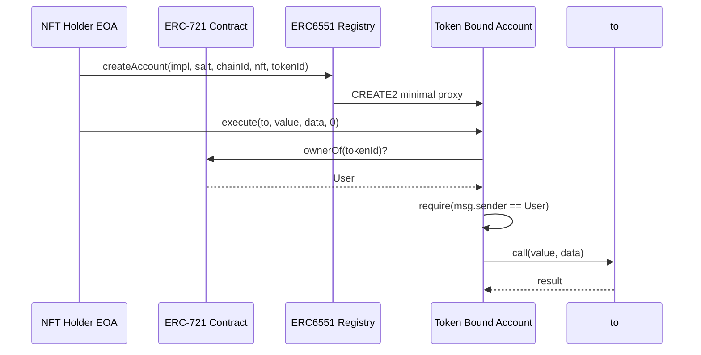
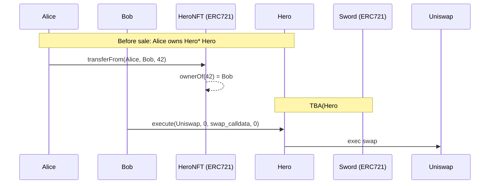

# ERC-6551 Token Bound Account（NFT as Wallet）

> **TL;DR**：ERC-6551（Jayden Windle / Benny Giang / Steve Jang / Druzy Downs，2023-02 草案、2024-02 Final）允许**每一枚 ERC-721 NFT 拥有一个独立智能合约账户**——NFT 本身成为"钱包"，可以持有其他 NFT、ERC-20、ETH，并执行任意交易。账户地址由 `chainId + tokenContract + tokenId + salt + implementation` 确定性计算（CREATE2 + ERC-1167 minimal proxy），无需预部署；只有在首次需要签名/转账时才真正部署。控制权跟随 NFT 所有权转移——持有 NFT 即控制账户。典型场景：游戏角色（NFT 装备 / 成就自己持有）、社交 NFT（Avatar 账户聚合身份）、NFT 资产打包（一个 NFT 持有一篮子资产，整体出售）、链上简历 / 学位证 / 身份。与 EIP-4337 账户抽象互补。

## 1. 背景与动机

传统 NFT 是"贫瘠"的：它本身是数据，不能主动持有其他资产。若想让一个 BAYC 拥有 Apecoin 与 Sewer Pass，必须让 NFT 所有者的 EOA 间接持有这些资产，NFT 与附属物的关联完全取决于链下约定（游戏后端、项目方服务器）。

**问题**：
1. NFT 资产打包出售困难：Bob 想把自己 "已装备剑盾的勇士 NFT" 一次性卖给 Alice，必须单独转每件装备。
2. 游戏经济体 fragmentation：角色升级、成就、技能点无法与 NFT 一起转移。
3. 社交身份碎片：Lens / Farcaster 账户与 NFT profile 是两套对象。
4. DAO 成员资格与投票权跟随 NFT 转移逻辑复杂。

**Future Primitive** 团队（Benny Giang，前 Dapper Labs CryptoKitties PM）2023 年 1 月提出 Token Bound Account（TBA）概念。核心思想：
- 每个 NFT 在 `(chainId, contract, tokenId)` 位置有一个确定性智能账户地址。
- 账户代码是 ERC-1167 最小代理 → 指向一个实现合约。
- `owner()` 返回 NFT 当前所有者，任何人都能用该 NFT 持有者签名让账户执行任意 call。
- 账户可以持有所有资产（ETH、ERC-20、ERC-721、ERC-1155），也可以被合约当普通地址调用。

2023-02 正式提交 EIP，2023-05 主网部署参考实现（Tokenbound Registry `0x000000006551c19487814612e58FE06813775758`，所有链同地址）。社区产品：Sapienz、Crypto Arcade、Boss Beauties 游戏皮肤系统、Ledger NFT、各类 identity aggregator。

## 2. 核心原理

### 2.1 形式化定义

账户地址由 Registry 使用 CREATE2 派生：
```
salt_bytes = keccak256(
    0xff, registryAddr,
    keccak256(abi.encode(implementation, chainId, tokenContract, tokenId, salt)),
    keccak256(0x3d602d80600a3d3981f3363d3d373d3d3d363d73 || implementation || 5af43d82803e903d91602b57fd5bf3)
)
addr = last20(salt_bytes)
```

其中 `0x3d...5bf3` 是 ERC-1167 minimal proxy runtime code 模板。

因此同一个 NFT + 同一个实现合约 + 同一链 = 唯一账户地址。换言之 NFT 的 TBA 是**确定性**、无状态派生的。

账户控制权：实现合约的 `isValidSigner(signer)` 返回 true 当且仅当 `signer == IERC721(tokenContract).ownerOf(tokenId)`。所有权通过 NFT 合约查询，随 NFT transfer 自动迁移。

### 2.2 Registry 接口（ERC-6551）

```solidity
interface IERC6551Registry {
    event ERC6551AccountCreated(
        address account, address indexed implementation,
        bytes32 salt, uint256 chainId, address indexed tokenContract, uint256 indexed tokenId
    );

    function createAccount(
        address implementation, bytes32 salt,
        uint256 chainId, address tokenContract, uint256 tokenId
    ) external returns (address);

    function account(
        address implementation, bytes32 salt,
        uint256 chainId, address tokenContract, uint256 tokenId
    ) external view returns (address);
}
```

Registry 使用 CREATE2 部署代理合约；`account(...)` 是纯视图，返回派生地址，不触发部署。

### 2.3 账户实现合约接口

```solidity
interface IERC6551Account {
    receive() external payable;
    function token() external view returns (uint256 chainId, address tokenContract, uint256 tokenId);
    function state() external view returns (uint256);
    function isValidSigner(address signer, bytes calldata context) external view returns (bytes4 magicValue);
}

// 推荐扩展
interface IERC6551Executable {
    function execute(address to, uint256 value, bytes calldata data, uint8 operation) external payable returns (bytes memory);
}
```

- `token()`：账户绑定的 NFT。
- `state()`：状态计数器（随每次 execute 递增），用于签名防重放。
- `isValidSigner`：返回 `0x523e3260`（magic value）表示该 signer 可操作账户。
- `execute(to, value, data, operation)`：operation 0=call, 1=delegatecall, 2=create, 3=create2。

### 2.4 子机制拆解

1. **延迟部署**：CREATE2 地址可直接接收资产，不需要先部署账户；首次 `execute` 时由 Registry 或直接 EOA 调用 Registry 完成部署。
2. **所有权传导**：所有 execute / isValidSigner 查询都读取 `IERC721.ownerOf(tokenId)`，NFT 转手即等同账户易主。
3. **嵌套与循环**：TBA_A 可以持有 NFT_B，NFT_B 也有 TBA_B；TBA_B 又持 NFT_A——形成循环。实现需检测循环防递归签名无限展开（state 包含 owner 链）。
4. **签名体系**：
   - EOA 持有者：直接 ECDSA 签名 execute。
   - 合约持有者：通过 EIP-1271 `isValidSignature`。
   - 未来可集成 EIP-4337：TBA 自身作 Smart Account。
5. **与 NFT 升级合作**：部分实现允许账户配置多个 signer（如 NFT owner + guardian），用于租赁 / 共享场景。

### 2.5 参数与常量

| 项 | 值 |
| --- | --- |
| Canonical Registry | `0x000000006551c19487814612e58FE06813775758` |
| Reference Implementation | `0x41C8f39463A868d3A88af00cd0fe7102F30E44eC` |
| Magic value `isValidSigner` | `0x523e3260` |
| Proxy runtime | ERC-1167 (55 bytes) |
| `operation` | 0=CALL, 1=DELEGATECALL, 2=CREATE, 3=CREATE2 |

### 2.6 失败模式

- **所有权环 (Ownership Cycle)**：若 NFT_A 的 TBA 持有 NFT_A 本身（直接或间接），ownerOf 会陷入循环。参考实现通过 `_rootTokenOwner` 递归检测并设上限。
- **NFT soulbound**：若绑定 NFT 变为 SBT 不可转移，账户资产被锁死。
- **NFT 被销毁**：`ownerOf` revert，账户失去签名者——资产锁死（除非实现提供 recovery）。
- **跨链不一致**：TBA 地址只在部署链上有效；同 tokenId 跨链时每条链上各有独立账户与资产。
- **Reentrancy via execute**：DELEGATECALL operation=1 允许在账户 storage 中执行任意代码，需谨慎—多数生产实现只允许 CALL 或禁用 DELEGATECALL。
- **Gas griefing**：子合约中含恶意回调使每次 execute 消耗大量 gas。

### 2.7 图示



```
  NFT_tokenId=42
       │ ownerOf
       ▼
   Alice EOA ─────► signs tx ─────► TBA(42)
                                      │
                                      ├─ holds 1 ETH
                                      ├─ holds 100 USDC
                                      ├─ holds other NFTs
                                      └─ calls Uniswap, Aave, ...
```

## 3. 架构剖析

### 3.1 分层视图

```
┌──────────────────────────────────────────────┐
│ App (game, social, marketplace)              │
├──────────────────────────────────────────────┤
│ ERC-6551 Registry (singleton per chain)      │
├──────────────────────────────────────────────┤
│ Account Implementation (v3 / custom)         │
├──────────────────────────────────────────────┤
│ ERC-1167 Proxy (deployed per tokenId)        │
├──────────────────────────────────────────────┤
│ ERC-721 NFT Contract                         │
├──────────────────────────────────────────────┤
│ EVM                                          │
└──────────────────────────────────────────────┘
```

### 3.2 核心模块清单

| 模块 | 职责 | 依赖 |
| --- | --- | --- |
| Registry | CREATE2 部署代理、计算地址 | — |
| Implementation | 核心逻辑（execute / isValidSigner / state） | IERC721, EIP-1271 |
| Proxy | ERC-1167 minimal proxy，转发调用 | Implementation |
| Guardian Module（可选） | 多签 / guardians | Implementation |
| Session keys（可选） | 临时授权 | Implementation |

### 3.3 数据流：Alice 把装备齐全的角色卖给 Bob



Alice 只需转 Hero NFT，Sword、成就 token、经验值一同归 Bob。

### 3.4 参考实现

- **erc6551/reference**：官方参考 Registry + Implementation。
- **Tokenbound SDK**：`@tokenbound/sdk`，TS 客户端。
- **Account V3**（2024-03）：添加权限扩展、EIP-1271、ERC-4337 支持。
- **链部署**：Ethereum、Polygon、Base、Optimism、Arbitrum、zkSync Era 等，Registry 地址全链一致。

### 3.5 外部接口

- ERC-165（接口检测）
- EIP-1271（合约签名验证）
- ERC-1155Receiver / ERC-721Receiver（接收资产）
- ERC-4337（可选，TBA 作 Smart Account）

## 4. 关键代码 / 实现细节

Registry 实现（`erc6551/reference@0.3.1`, `contracts/ERC6551Registry.sol`）：

```solidity
// 路径：contracts/ERC6551Registry.sol:22
function createAccount(
    address implementation, bytes32 salt,
    uint256 chainId, address tokenContract, uint256 tokenId
) external returns (address) {
    assembly {
        // Memory: salt, chainId, tokenContract, tokenId
        let data := mload(0x40)
        mstore(data, 0xff)
        mstore(add(data, 0x01), shl(96, address()))         // registry
        // ...compute create2 address...
    }
    address proxy = _computeAddress(implementation, salt, chainId, tokenContract, tokenId);
    if (proxy.code.length != 0) return proxy;  // 已部署
    // 部署 ERC-1167 minimal proxy
    assembly {
        let ptr := mload(0x40)
        mstore(ptr, 0x3d602d80600a3d3981f3363d3d373d3d3d363d73000000000000000000000000)
        mstore(add(ptr, 0x14), shl(96, implementation))
        mstore(add(ptr, 0x28), 0x5af43d82803e903d91602b57fd5bf30000000000000000000000000000000000)
        proxy := create2(0, ptr, 0x37, _saltHash(...))
    }
    emit ERC6551AccountCreated(proxy, implementation, salt, chainId, tokenContract, tokenId);
    return proxy;
}
```

Account 实现核心（`erc6551/reference/contracts/examples/simple/ERC6551Account.sol`）：

```solidity
// 路径：ERC6551Account.sol:45
function token() public view returns (uint256, address, uint256) {
    bytes memory footer = new bytes(0x60);
    assembly {
        // ERC-1167 minimal proxy 代码末尾附加的 (chainId, tokenContract, tokenId) immutable args
        extcodecopy(address(), add(footer, 0x20), 0x4d, 0x60)
    }
    return abi.decode(footer, (uint256, address, uint256));
}

// 路径：ERC6551Account.sol:68
function execute(address to, uint256 value, bytes calldata data, uint8 operation)
    external payable returns (bytes memory result) {
    require(_isValidSigner(msg.sender), "Invalid signer");
    require(operation == 0, "Only call operations are supported");
    ++state;
    bool success;
    (success, result) = to.call{value: value}(data);
    if (!success) assembly { revert(add(result, 32), mload(result)) }
}

function isValidSigner(address signer, bytes calldata) external view returns (bytes4) {
    if (_isValidSigner(signer)) return IERC6551Account.isValidSigner.selector;
    return bytes4(0);
}

function _isValidSigner(address signer) internal view returns (bool) {
    (uint256 chainId, address tokenContract, uint256 tokenId) = token();
    if (chainId != block.chainid) return false;
    return signer == IERC721(tokenContract).ownerOf(tokenId);
}
```

注意：NFT 合约的 `chainId` 存在代理 footer 的 immutable args 中，实现通过 `extcodecopy` 读取——这是 ERC-1167 的 "bytecode immutable args" 技巧（`Clones.cloneDeterministicWithImmutableArgs`）。

## 5. 演进与版本对比

| 版本 / 相关 | 年份 | 变化 |
| --- | --- | --- |
| EIP-6551 Draft | 2023-02 | Windle / Giang 提案 |
| Reference v1 | 2023-05 | Mainnet deploy |
| Account V2 | 2023-08 | Guardian 权限 |
| EIP-6551 Final | 2024-02 | 接口锁定 |
| Account V3 | 2024-03 | EIP-1271 + ERC-4337 集成 |
| Discussion | 2024–2025 | ERC-6551 + Passkey / Session keys |

相关标准：
- **ERC-5114**（Soulbound Badge）配合 TBA 做身份。
- **ERC-4337**（Account Abstraction）：TBA 可作为 AA smart account。
- **ERC-7579**：模块化 Smart Account，部分 TBA 实现采用。

## 6. 实战示例

用 Tokenbound SDK + viem 创建并操作 TBA：

```ts
import { TokenboundClient } from '@tokenbound/sdk';
import { createWalletClient, http } from 'viem';
import { mainnet } from 'viem/chains';

const client = new TokenboundClient({ chainId: 1, walletClient });

// 1. 计算账户地址（不部署）
const tba = await client.getAccount({
  tokenContract: '0xBoredApe...',
  tokenId: '42',
});

// 2. 部署（首次使用）
const { account } = await client.createAccount({
  tokenContract: '0xBoredApe...',
  tokenId: '42',
});

// 3. 转 ETH 给 TBA
await walletClient.sendTransaction({ to: account, value: parseEther('0.1') });

// 4. 从 TBA 发起 call（必须由 NFT owner 签名）
await client.executeCall({
  account,
  to: '0xUniswapRouter...',
  value: 0n,
  data: swapCalldata,
});
```

CLI（foundry cast）：
```bash
# 查询 TBA 地址
cast call $REGISTRY "account(address,bytes32,uint256,address,uint256)(address)" \
  $IMPL 0x00 1 $NFT 42 --rpc-url $RPC

# 查 owner
cast call $NFT "ownerOf(uint256)(address)" 42 --rpc-url $RPC
```

## 7. 安全与已知攻击

- **所有权瞬时变化**：NFT 在交易所挂单时，其 TBA 资产本应一并转手；攻击者可在 NFT 从 Alice 转走瞬间用 Alice EOA 签名将 TBA 资产抽走（称为 "drain before transfer"）。市场（OpenSea / Blur）开始引入"扫描 TBA 资产"的警示。
- **DELEGATECALL 风险**：若实现允许 operation=1 delegatecall，恶意代码可重写 TBA 自身 storage（含 state / implementation pointer）。参考实现禁用。
- **Cycle 造成 DoS**：循环所有权导致 ownerOf 递归栈溢出；Registry 本身不解决，需实现层检测。
- **Fake registry**：若应用信任错误 Registry 地址，可能被诱导为恶意 implementation 生成账户。应使用官方 `0x0000...758`。
- **Phishing via ownerOf**：被借用 NFT（Rental）时，实际 owner 与 "游戏内使用者" 不同，TBA 签名权仍随 owner。需 ERC-4907 租赁扩展或实现层区分 signer 角色。
- **Bridging 难题**：NFT 跨链到 L2 时，L1 TBA 资产不会自动同步；桥方案需同步 TBA state（LayerZero ONFT / Chainlink CCIP 正在探索）。

## 8. 与同类方案对比

| 维度 | ERC-6551 TBA | ERC-4337 Smart Account | Gnosis Safe / Multisig | ERC-4907 Rental |
| --- | --- | --- | --- | --- |
| 绑定对象 | 每个 NFT | 每个账户 | 多签成员 | NFT + user |
| 所有权变更 | 随 NFT transfer | owner 变更流程 | 成员管理提案 | 过期自动失效 |
| 持有资产 | ✅ | ✅ | ✅ | 仅"使用权" |
| 执行能力 | call（可扩展） | UserOp 全功能 | Safe transaction | NFT 使用权无 |
| 场景 | 游戏、身份、打包 | 日常钱包 | DAO 库房 | 游戏租借 |

TBA 的独特价值是"账户天然绑到可交易对象"，任何 NFT 交易市场立即成为"账户交易市场"。与 4337 互补而非替代：TBA 可作 4337 Smart Account，实现无 gas 签名 + NFT 绑定。

## 9. 延伸阅读

- **规范**：EIP-6551
- **代码**：
  - <https://github.com/erc6551/reference>
  - <https://github.com/tokenbound/contracts>
  - <https://github.com/tokenbound/sdk>
- **文档**：<https://docs.tokenbound.org/>
- **文章**：
  - Benny Giang "Future Primitive" Twitter threads
  - Paradigm "Token Bound Accounts Are Changing NFTs"
  - Jayden Windle blog
- **视频**：DevCon Bogotá TBA talk、EthCC TBA demos

## 10. 术语表

| 术语 | 英文 | 释义 |
| --- | --- | --- |
| 绑定账户 | Token Bound Account | 跟随 NFT 所有权的智能账户 |
| Registry | Registry | 计算并部署账户地址的单例合约 |
| Minimal Proxy | ERC-1167 | 轻量代理，节省部署 gas |
| 循环所有权 | Ownership Cycle | NFT 持有自己的 TBA 导致环 |
| State | state | 签名防重放计数器 |
| Signer | Signer | 可代账户操作的地址 |
| Implementation | Implementation | 代理背后的逻辑合约 |

---

*Last verified: 2026-04-22*
