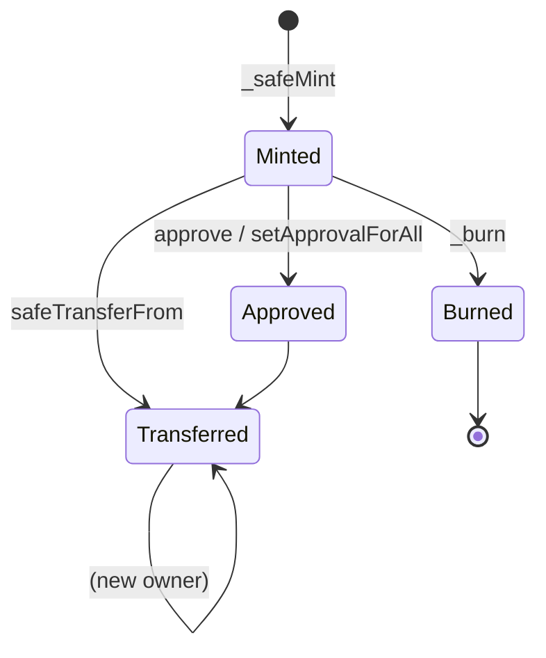
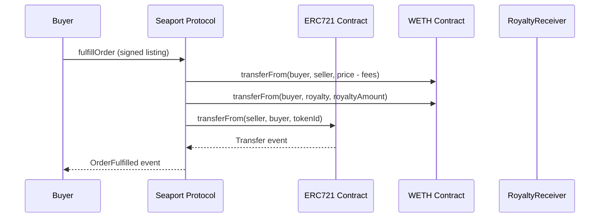

# ERC-721 与 ERC-1155（NFT 标准与 Metadata）

> **TL;DR**：ERC-721（EIP-721，William Entriken / Dieter Shirley / Jacob Evans / Nastassia Sachs，2018-01）是非同质化代币（NFT）的标准——每个 tokenId 独一无二，由单一地址拥有。ERC-1155（Witek Radomski / Andrew Cooke / Philippe Castonguay，2018-06，Enjin 推动）是 **多代币标准**，支持在同一合约中管理多种 FT / NFT，批量转账大幅降低 gas。两者都定义了 `tokenURI` / `uri` 指向链下 metadata（JSON 文件），遵循 OpenSea 事实标准（name / description / image / attributes）。CryptoKitties（2017）催生了 ERC-721；Enjin 游戏资产需求催生了 ERC-1155。此后又有 ERC-2981（版税）、ERC-4906（metadata 更新通知）、ERC-4907（租赁）、ERC-5192（灵魂绑定）、ERC-6551（TBA）等扩展。

## 1. 背景与动机

2017 年 CryptoKitties 将 NFT 概念推入大众视野——每只加密猫是独一无二的数字资产，可繁育、交易、收藏，一度占满以太坊网络 20% 带宽。团队（Dapper Labs）基于早期实验性合约（ERC-721 Draft）实现，并反向推动标准化。ERC-721 的核心动机：
1. 为**非同质化资产**提供标准接口：艺术品、域名、游戏道具、音乐版权、房产凭证等。
2. 让钱包、市场、区块浏览器能统一识别 NFT 及其元数据。
3. 定义 `ownerOf(tokenId)` 而非 `balanceOf(address)` 的所有权语义。

Enjin 2018 年在游戏场景遇到 ERC-721 的问题：一个游戏可能有几百种道具（剑 / 盾 / 药水），每种道具 N 份，部署几百个合约不现实。于是提出 ERC-1155 **多代币标准**：一个合约内用 `tokenId` 区分不同资产类型，每种 `tokenId` 可以是 FT（多份同种）或 NFT（仅 1 份）。`safeBatchTransferFrom` 支持原子批量转账，gas 效率远高于 ERC-721。

NFT 市场 2021 年爆发：CryptoPunks、Bored Ape、Art Blocks、Azuki 等项目单个售价可达数千 ETH。OpenSea、Blur、Magic Eden 成为主要市场。2022 年 Yuga Labs（BAYC）、SuperRare、Foundation、Manifold 推动艺术家原生创作。2023–2024 年 Ordinals（BTC）、Inscriptions 拓展到非 EVM 生态；Farcaster / Lens 引入社交 NFT；ERC-6551 TBA 让 NFT 成为 "能拥有其他资产的账户"。

## 2. 核心原理

### 2.1 形式化定义

**ERC-721** 状态：
- `ownerOf: tokenId → address`（tokenId 0-indexed uint256）
- `balanceOf: address → uint256`
- `tokenApprovals: tokenId → address`（单 token 授权）
- `operatorApprovals: address × address → bool`（全量授权）

状态转移（transferFrom）：
```
require(msg.sender == ownerOf(tid) || approvals[tid] == msg.sender || operatorApprovals[owner][msg.sender])
ownerOf[tid] = to; balance[from]--; balance[to]++; delete approvals[tid]
emit Transfer(from, to, tid)
```

**ERC-1155** 状态：
- `balances: tokenId × address → uint256`（多 FT / NFT 通用）
- `operatorApprovals: owner × operator → bool`（全量，无单 token 授权）

转移：`_safeTransferFrom(from, to, id, amount, data)` + `_safeBatchTransferFrom(from, to, ids[], amounts[], data)`。

两个标准共同点：
- 接收方若是合约，必须实现 `onERC721Received` / `onERC1155Received` 返回 magic value，否则 `safeTransferFrom` 回滚——防资产永久锁在不兼容合约。
- 支持 ERC-165 `supportsInterface` 供外界识别。

### 2.2 tokenURI 与 Metadata Standard

ERC-721 `tokenURI(tokenId) → string`；ERC-1155 `uri(tokenId) → string`。常见 URI 形式：
- `ipfs://Qm.../1.json`（IPFS CID）
- `ar://txid/1.json`（Arweave）
- `https://api.example.com/meta/1`
- `data:application/json;base64,...`（on-chain，如 Uniswap V3 NFT、Loot）

OpenSea metadata JSON 约定：
```json
{
  "name": "BoredApe #1",
  "description": "A collection of 10,000 Bored Apes",
  "image": "ipfs://.../1.png",
  "external_url": "https://opensea.io/assets/...",
  "attributes": [
    {"trait_type": "Background", "value": "Blue"},
    {"trait_type": "Fur", "value": "Golden"}
  ],
  "animation_url": "ipfs://.../1.mp4"
}
```

ERC-1155 `{id}` 占位符：`uri = "https://api.example.com/{id}.json"`，钱包自动替换为 tokenId 十六进制 64 位对齐值。

### 2.3 子机制：铸造、销毁、版税、更新

1. **Mint/Burn**：ERC-721 `_safeMint(to, id)` / `_burn(id)`；ERC-1155 `_mint(to, id, amount, data)` / `_burnBatch`。
2. **Approval**：ERC-721 双层（单 token + 全量）；ERC-1155 只有全量 `setApprovalForAll`。
3. **Royalty (ERC-2981)**：`royaltyInfo(tokenId, salePrice) → (receiver, amount)`；链下市场（OpenSea）自愿遵守；2022 年 Blur / LooksRare 0 版税战争使得可执行版税（onchain enforcement）成为研究热点。
4. **Metadata Update Event (ERC-4906)**：`event MetadataUpdate(uint256 _tokenId)` / `BatchMetadataUpdate`，通知索引器刷新缓存。
5. **可租赁 (ERC-4907)**：为 ERC-721 增加 `userOf` 与过期时间。
6. **灵魂绑定 (SBT, ERC-5192)**：不可转移的 NFT 用于身份、证书。

### 2.4 参数与常量

| 项 | 说明 |
| --- | --- |
| tokenId | uint256，无上限 |
| MAX_SUPPLY | 实现者定义（非标准字段） |
| interfaceId (ERC-721) | `0x80ac58cd` |
| interfaceId (ERC-721Metadata) | `0x5b5e139f` |
| interfaceId (ERC-1155) | `0xd9b67a26` |
| Magic value (onERC721Received) | `bytes4(keccak256("onERC721Received(address,address,uint256,bytes)")) = 0x150b7a02` |
| Magic value (onERC1155Received) | `0xf23a6e61` |

### 2.5 边界条件与失败模式

- **转至未实现接收接口的合约**：若使用 `transferFrom`（不是 `safe*`），资产会永久锁住；OpenZeppelin 已将 `transferFrom` 标记为"仅在你清楚知道接收方时使用"。
- **metadata 中心化**：大多数 NFT 的 image 指向 HTTPS，项目方若关闭服务器，图像即消失。去中心化存储（IPFS pin / Arweave / Filecoin）是标准做法。
- **Royalty enforcement**：依赖市场自愿；OperatorFilter（OpenSea, 2022）、Seaport + royalty registry 等尝试，但 Blur 证明了"价格战 > 版税"的市场力量。
- **Reentrancy via onERC*Received**：Meebits 曾因在 mint 内调用 `_safeMint` 触发外部合约被利用 (2021-05)，价值数千 ETH。修复：CEI 顺序 + ReentrancyGuard。
- **整数溢出 on mint**：若 `_tokenIds` 计数器使用 uint16 或 unchecked++，可能 revert / 重复。

### 2.6 图示



```
ERC-721               ERC-1155
┌────────┐           ┌──────────────────────────┐
│ tokenId│──1:1──►owner │ (id, owner) → balance │
└────────┘           │  batch transfer supported │
                     └──────────────────────────┘
```

## 3. 架构剖析

### 3.1 分层视图

```
┌──────────────────────────────────────────────┐
│ Marketplace / Wallet / Explorer UI           │
├──────────────────────────────────────────────┤
│ Metadata CDN / IPFS Gateway / Arweave        │
├──────────────────────────────────────────────┤
│ Indexer (Reservoir, Alchemy NFT API, Graph)  │
├──────────────────────────────────────────────┤
│ ERC-721 / ERC-1155 Contract                  │
├──────────────────────────────────────────────┤
│ EVM State (MPT)                              │
└──────────────────────────────────────────────┘
```

### 3.2 核心模块清单（OZ）

| 模块 | 职责 | 依赖 |
| --- | --- | --- |
| `ERC721.sol` | 核心存储 + transfer | ERC165, Context |
| `ERC721Enumerable` | totalSupply / tokenByIndex（昂贵） | ERC721 |
| `ERC721URIStorage` | 单 token URI 覆盖 | ERC721 |
| `ERC721Royalty` | 集成 ERC-2981 | ERC721, ERC2981 |
| `ERC721Pausable` | 暂停转账 | ERC721, Pausable |
| `ERC721Votes` | 治理票数 | ERC721 |
| `ERC1155.sol` | 核心存储 + batch | ERC165 |
| `ERC1155Supply` | 单 id totalSupply | ERC1155 |
| `ERC1155URIStorage` | 单 id URI 覆盖 | ERC1155 |

Enumerable 扩展在大量 mint 场景 gas 成本高（每次 transfer 需维护 `_allTokens` 数组），Azuki 的 **ERC721A**（惰性索引）是常用优化方案。

### 3.3 数据流：一次 NFT 购买



### 3.4 参考实现

- **OpenZeppelin**：标准实现。
- **ERC721A**（Chiru Labs / Azuki）：batch mint 优化，8888 个 mint 节约 ~60% gas。
- **solmate** `ERC721.sol`：精简版。
- **SeaDrop**（OpenSea 官方）：面向 mint 风车的模板。
- **Manifold / Thirdweb**：低代码 NFT 部署。

### 3.5 外部接口

- **ERC-165**：`supportsInterface(bytes4) → bool`
- **Marketplace API**：OpenSea（Seaport）、Blur（Blur.io API）、Reservoir（聚合）。
- **索引**：Alchemy NFT API、Moralis、The Graph Subgraph。

## 4. 关键代码 / 实现细节

OpenZeppelin ERC-721 核心（`openzeppelin-contracts@5.0.2`, `contracts/token/ERC721/ERC721.sol:186-256`）：

```solidity
// 路径：contracts/token/ERC721/ERC721.sol:186
function transferFrom(address from, address to, uint256 tokenId) public virtual {
    if (to == address(0)) revert ERC721InvalidReceiver(address(0));
    address previousOwner = _update(to, tokenId, _msgSender());
    if (previousOwner != from) revert ERC721IncorrectOwner(from, tokenId, previousOwner);
}

// 路径：contracts/token/ERC721/ERC721.sol:242
function _update(address to, uint256 tokenId, address auth) internal virtual returns (address) {
    address from = _ownerOf(tokenId);
    if (auth != address(0)) _checkAuthorized(from, auth, tokenId);
    if (from != address(0)) {
        _approve(address(0), tokenId, address(0), false); // 清除 token approval
        unchecked { _balances[from] -= 1; }
    }
    if (to != address(0)) unchecked { _balances[to] += 1; }
    _owners[tokenId] = to;
    emit Transfer(from, to, tokenId);
    return from;
}

// 路径：contracts/token/ERC721/ERC721.sol:315
function _checkOnERC721Received(address from, address to, uint256 tokenId, bytes memory data) private {
    if (to.code.length > 0) {
        try IERC721Receiver(to).onERC721Received(_msgSender(), from, tokenId, data) returns (bytes4 ret) {
            if (ret != IERC721Receiver.onERC721Received.selector)
                revert ERC721InvalidReceiver(to);
        } catch (bytes memory reason) {
            // 触发 revert 或 magic value 不匹配
            if (reason.length == 0) revert ERC721InvalidReceiver(to);
            assembly { revert(add(32, reason), mload(reason)) }
        }
    }
}
```

ERC-1155 核心（`contracts/token/ERC1155/ERC1155.sol:170`）：

```solidity
function _update(address from, address to, uint256[] memory ids, uint256[] memory values) internal virtual {
    if (ids.length != values.length) revert ERC1155InvalidArrayLength(ids.length, values.length);
    address operator = _msgSender();
    for (uint256 i = 0; i < ids.length; i++) {
        uint256 id = ids[i]; uint256 value = values[i];
        if (from != address(0)) {
            uint256 fromBalance = _balances[id][from];
            if (fromBalance < value) revert ERC1155InsufficientBalance(from, fromBalance, value, id);
            unchecked { _balances[id][from] = fromBalance - value; }
        }
        if (to != address(0)) unchecked { _balances[id][to] += value; }
    }
    if (ids.length == 1) emit TransferSingle(operator, from, to, ids[0], values[0]);
    else emit TransferBatch(operator, from, to, ids, values);
}
```

## 5. 演进与版本对比

| 标准 | 年份 | 核心内容 |
| --- | --- | --- |
| ERC-721 | 2018-01 (Draft) / 2018-06 (Final) | NFT 基础 |
| ERC-1155 | 2018-06 / 2019-06 Final | 多代币 |
| ERC-2981 | 2020 | Royalty 标准接口 |
| ERC-4907 | 2022 | NFT 租赁 |
| ERC-4906 | 2022 | MetadataUpdate 事件 |
| ERC-5192 | 2022 | 灵魂绑定（SBT locked flag） |
| ERC-6551 | 2023 | Token Bound Account（见专文） |
| ERC-7007 | 2023 | AI-generated NFT with zk verify |

相关：EIP-2309（批量 Transfer 事件）、ERC-5006（ERC-1155 租赁）。

## 6. 实战示例

部署 ERC-721 + 版税（Foundry）：

```solidity
pragma solidity ^0.8.20;
import "@openzeppelin/contracts/token/ERC721/ERC721.sol";
import "@openzeppelin/contracts/token/common/ERC2981.sol";
import "@openzeppelin/contracts/access/Ownable.sol";

contract MyNFT is ERC721, ERC2981, Ownable {
    uint256 public nextId;
    string private _base;
    constructor(string memory base) ERC721("MyNFT", "MNFT") Ownable(msg.sender) {
        _base = base;
        _setDefaultRoyalty(msg.sender, 500); // 5%
    }
    function mint(address to) external onlyOwner returns (uint256) {
        uint256 id = nextId++;
        _safeMint(to, id);
        return id;
    }
    function _baseURI() internal view override returns (string memory) { return _base; }
    function supportsInterface(bytes4 iid) public view override(ERC721, ERC2981) returns (bool) {
        return super.supportsInterface(iid);
    }
}
```

```bash
forge create MyNFT.sol:MyNFT --constructor-args "ipfs://Qmxxxx/" \
  --rpc-url $RPC --private-key $PK

cast send $NFT "mint(address)(uint256)" $RECIPIENT --rpc-url $RPC --private-key $PK

cast call $NFT "tokenURI(uint256)(string)" 0 --rpc-url $RPC
# → ipfs://Qmxxxx/0
```

Metadata JSON 示例：
```json
{"name":"MyNFT #0","description":"First","image":"ipfs://Qmxxxx/0.png","attributes":[{"trait_type":"Rarity","value":"Legendary"}]}
```

## 7. 安全与已知攻击

- **Meebits mint 重入**（2021, Larva Labs）：`_safeMint` 调用接收方合约导致重入，被利用套取稀有 tokenId。
- **AkuDreams mint bug**（2022）：退款逻辑错误导致 ~3400 万美元锁在合约。
- **OpenSea operator filter 绕过**（2022–2023）：Blur、Sudoswap 直接忽略 royalty；市场博弈问题。
- **签名钓鱼**（2022+）：用户签署 `setApprovalForAll` 钓鱼签名；Opensea 2022-02 事件 254 NFT 被盗。
- **IPFS pin 丢失**：大量 2021 项目将 metadata 只 pin 在 Pinata 免费额度，后续失效导致图像空白。
- **Chain reorg / double mint**：少量早期合约未考虑 reorg，存在同 tokenId 双重 mint。
- **不正确 `tokenURI` 可升级**：若合约允许 owner 修改 baseURI 但未限制，项目方可事后 rug-pull 图像。

## 8. 与同类方案对比

| 维度 | ERC-721 | ERC-1155 | Solana Metaplex | Sui Move Object |
| --- | --- | --- | --- | --- |
| 单合约多资产 | ❌ | ✅ | ✅（collection） | ✅（任意对象） |
| 批量转账 | ❌（需循环） | ✅ safeBatchTransferFrom | ✅ | ✅ |
| 单 token 授权 | ✅ | ❌（仅全量） | 原生账户授权 | 移动语义 |
| Mint 成本 | 中高 | 低 | 低 | 低 |
| 元数据 | tokenURI | uri(id) | on-chain Metadata account | 对象字段 |
| 版税 | ERC-2981 | ERC-2981 | Metaplex | 自定义 |

选型建议：
- 单款艺术品 / PFP：ERC-721（+ ERC721A 优化）。
- 游戏道具 / 多种类 batch：ERC-1155。
- 需要将 NFT 当钱包：+ ERC-6551。
- 跨链 NFT：ERC-721 + LayerZero ONFT / Axelar。

## 9. 延伸阅读

- **规范**：EIP-721、EIP-1155、EIP-2981、EIP-4906、EIP-4907、EIP-5192
- **实现**：OZ Contracts、ERC721A（<https://github.com/chiru-labs/ERC721A>）
- **Metadata**：OpenSea Metadata Standards、Rarible
- **历史**：
  - Laura Shin《The Cryptopians》
  - "A prehistory of NFTs" — Nadav Hollander
- **市场**：Seaport docs、Blur docs、Reservoir API
- **视频**：Chain Reaction NFT 专题、Bankless NFT primer

## 10. 术语表

| 术语 | 英文 | 释义 |
| --- | --- | --- |
| 非同质化代币 | Non-Fungible Token | 每枚独一无二的链上资产 |
| 元数据 | Metadata | 描述 NFT 属性的 JSON 文件 |
| 版税 | Royalty | 二次销售分成，由 ERC-2981 定义 |
| 全量授权 | setApprovalForAll | 授权某地址管理所有 NFT |
| 灵魂绑定 | Soulbound Token (SBT) | 不可转移的 NFT |
| 批量转账 | safeBatchTransferFrom | ERC-1155 一次转多 id |
| 接收回调 | onERC721Received | safeTransferFrom 的接收方验证 |
| 代币绑定账户 | Token Bound Account (TBA) | 每个 NFT 拥有独立钱包 |

---

*Last verified: 2026-04-22*
