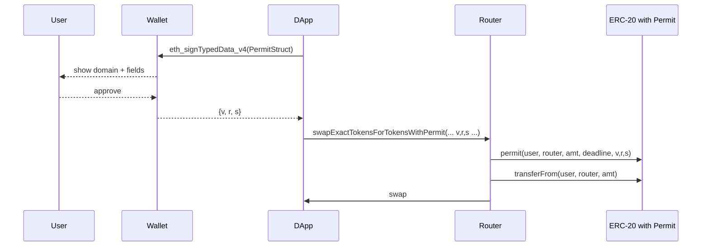

# 其他 ERC 标准（777 / 2612 Permit / 4907 Rental / 5805 Votes / 712 TypedData）

> **TL;DR**：除了 ERC-20 / 721 / 1155 / 4626 / 6551 / 3643 等核心标准外，还有一批 "基础设施级" 的 ERC 支撑现代 DApp 架构：EIP-712（结构化签名，2017）是所有链下签名的基石；ERC-777（2017）为 ERC-20 带来接收 hooks（但因重入风险淡出）；EIP-2612 Permit（2020）借助 712 签名实现无 gas 授权，USDC / DAI / Uniswap V2 LP 等广泛采用；ERC-4907（2022）为 NFT 引入 "user" 角色支持租赁；ERC-5805（2022）统一 Votes / Checkpoint 接口，为治理代币（COMP / UNI / AAVE）立标准。这些标准各自解决特定问题，多数是"点对点"补丁，但组合起来构成现代 EVM DApp 的语义骨架。

## 1. 背景与动机

ERC-20 / 721 / 1155 是代币"资产层"的主线。但仅有资产是不够的——用户还需要签名授权（而不是每次都花 gas）、NFT 需要区分 "所有权 vs 使用权"（租赁）、治理代币需要统一 checkpoint 查询、合约间需要标准化结构化数据签名。

这些需求催生了一批正交或增补标准：

- **EIP-712（2017-09，Remco Bloemen）**：定义人类可读的结构化数据签名，替代 `eth_sign` 的裸哈希签名。Metamask 早期 `signTypedData` 是最常见实现。
- **ERC-777（2017-11，Jacques Dafflon 等）**：对 ERC-20 的包装，加入 `tokensToSend` / `tokensReceived` hook，通过 ERC-1820 全局注册表查找接收方。
- **EIP-2612（2020-04，Martin Lundfall）**：Permit 签名授权，原为 MakerDAO DAI 设计，后由 Uniswap V2 / V3、USDC 采纳，成为 ERC-20 事实扩展。
- **ERC-4907（2022-04，Double Protocol）**：NFT 租赁标准，区分 `owner` 与 `user`，过期自动失效。
- **ERC-5805（2022-10，OpenZeppelin）**：Delegation + Checkpointing 统一接口，服务 Governor 合约。
- 相关补丁：**ERC-3009** TransferWithAuthorization（USDC 使用）、**ERC-2771** MetaTx、**ERC-3156** Flash Loan、**ERC-7201** Namespaced Storage、**ERC-5267** EIP-712 domain 自省。

## 2. 核心原理

### 2.1 EIP-712：结构化签名

动机：`eth_sign(addr, data)` 对任意 32 字节哈希签名，用户看不出语义，易被钓鱼。EIP-712 规范"类型化"签名：

```
encode(m) = 0x19 || 0x01 || domainSeparator || hashStruct(m)
domainSeparator = hashStruct(EIP712Domain{name, version, chainId, verifyingContract, salt})
hashStruct(m) = keccak256(typeHash || encode(v1) || encode(v2) || ...)
typeHash = keccak256("Permit(address owner,...)")
```

好处：
- 钱包可展示字段（Metamask 显示 "Permit: owner=0x..., value=100 USDC, spender=..."）。
- `chainId` 绑定防跨链重放。
- `verifyingContract` 防跨合约重放。
- 结构嵌套天然支持复杂签名（Seaport 订单 / Gasless tx）。

### 2.2 ERC-777

扩展 ERC-20，主要新增：
- `send(to, amount, data)` 替代 `transfer`；
- hooks：若发送方实现 `ERC777TokensSender.tokensToSend`、接收方实现 `ERC777TokensRecipient.tokensReceived`，转账时自动调用；
- Operators：类似 1155 `setApprovalForAll`；
- 小数固定为 18；
- 通过 **ERC-1820 Pseudo-introspection Registry** 查询接收者地址的 hook 合约。

问题：`tokensReceived` 触发时外部合约可重入 token 合约。**2020-04 Lendf.Me 被盗 2500 万美元**：攻击者在 imBTC（ERC-777）的 tokensReceived 里重入 Lendf.Me 放大借款。从此主流 DeFi 禁用或白名单 ERC-777。

### 2.3 EIP-2612 Permit

ERC-20 扩展：增加 `permit(owner, spender, value, deadline, v, r, s)`。结构化签名：

```solidity
bytes32 PERMIT_TYPEHASH = keccak256(
  "Permit(address owner,address spender,uint256 value,uint256 nonce,uint256 deadline)");
```

Permit 语义：任何人（通常是 relayer 或 spender 自己）带上 owner 签名调用 `permit(...)`，若签名有效且未过期，合约将 `allowance[owner][spender] = value`。随后同笔交易 `transferFrom` 即可 - 一笔 tx 取代 "approve + transferFrom" 两笔。

核心字段：
- `nonce`：每次 permit 递增，防重放。
- `deadline`：时间戳上限，防签名长期有效。
- domainSeparator：含 chainId，防跨链。

局限：
- 每个代币要单独实现（不是所有 ERC-20 都有 Permit；USDT 没有 Permit）。
- USDC / USDT 的 EIP-2612 domainSeparator 包含 `version` 可能变化（USDC v2.2），前端要动态读取。
- **Uniswap Permit2**（2022）解决"非 Permit 代币"问题：一个中心化 allowance 合约，用户一次 approve permit2，然后对任意代币用 signature 授权第三方。

### 2.4 ERC-4907 NFT Rental

扩展 ERC-721：
```solidity
function setUser(uint256 tokenId, address user, uint64 expires) external;
function userOf(uint256 tokenId) external view returns (address);
function userExpires(uint256 tokenId) external view returns (uint256);
event UpdateUser(uint256 indexed tokenId, address indexed user, uint64 expires);
```

语义：`ownerOf` 仍指向真正所有者，`userOf` 返回当前使用者（若未过期）。游戏/元宇宙应用据此决定谁可使用角色、土地等。`transferFrom` 时自动清空 user（回到 owner = user 默认）。

使用场景：Double Protocol、IQ Protocol、reNFT、游戏公会（Yield Guild）。

扩展 ERC-5006 把 4907 思路套到 ERC-1155。

### 2.5 ERC-5805 Votes & Checkpoints

治理代币需要"某高度某地址的投票权"。早期 Compound COMP 自行实现 `getPriorVotes(account, blockNumber)`。2022 年 OpenZeppelin 抽离为标准：

```solidity
interface IERC5805 is IERC6372 {
    function getVotes(address account) external view returns (uint256);
    function getPastVotes(address account, uint256 timepoint) external view returns (uint256);
    function getPastTotalSupply(uint256 timepoint) external view returns (uint256);
    function delegates(address account) external view returns (address);
    function delegate(address delegatee) external;
    function delegateBySig(...) external; // EIP-712
}

interface IERC6372 {
    function clock() external view returns (uint48);
    function CLOCK_MODE() external view returns (string); // "mode=blocknumber&from=default" or "mode=timestamp"
}
```

Checkpoints 存储：每次 transfer / delegation 记录 `(timepoint, balance)`，投票时二分查找。OZ `ERC20Votes` 提供实现。Governor 合约使用 `getPastVotes` 确保提案期间票数固定。

EIP-6372 提供时间维度抽象（区块高度 vs 时间戳），许多 L2 因区块时间不确定性选择 timestamp。

### 2.6 参数、常量与边界

| 标准 | 关键参数 |
| --- | --- |
| EIP-712 | domainSeparator = `keccak256(EIP712Domain...)` |
| ERC-777 | hash `tokensSenderHash = keccak256("ERC777TokensSender")` |
| EIP-2612 | PERMIT_TYPEHASH, nonces, deadline |
| ERC-4907 | max user = type(uint64).max |
| ERC-5805 | clock mode: blocknumber or timestamp |

失败模式举例：
- Permit 过期/错误 nonce：revert；前端需先读链上 nonce。
- ERC-4907 user 未清理：transfer 到新 owner 后，短暂窗口 old user 可继续使用；合约应在 `_beforeTokenTransfer` 中清空。
- ERC-777 hook 消耗 gas 大：用户遇到意外 out-of-gas。
- EIP-712 domain 错用：同个合约多链部署时 chainId 错，签名在 L1 可能被 L2 合约重用 → 资产损失。

## 3. 架构剖析

### 3.1 分层视图

```
┌──────────────────────────────────────────────┐
│ App / Wallet / Relayer                       │
├──────────────────────────────────────────────┤
│ Signature Utilities (EIP-712, Permit, 2771)  │
├──────────────────────────────────────────────┤
│ Token Logic (ERC-20 / 777 / 4907 / 5805)     │
├──────────────────────────────────────────────┤
│ Registry / Hooks (ERC-1820)                  │
├──────────────────────────────────────────────┤
│ EVM                                          │
└──────────────────────────────────────────────┘
```

### 3.2 核心模块清单

| 模块 | 职责 | 典型出处 |
| --- | --- | --- |
| EIP712.sol | domainSeparator + _hashTypedDataV4 | OZ `utils/cryptography/EIP712.sol` |
| ERC20Permit | permit + nonces | OZ `token/ERC20/extensions/ERC20Permit.sol` |
| ERC20Votes | delegate + checkpoints | OZ `token/ERC20/extensions/ERC20Votes.sol` |
| ERC777 | hook + operators | OZ 已标弃用 |
| ERC4907 | user + expires | DoubleLabs 参考实现 |
| ERC1820Registry | pseudo-introspection | 单例 `0x1820a4b...` |
| Permit2 | 中心化 approval | Uniswap Permit2 |

### 3.3 数据流：Permit 从签名到转账



### 3.4 参考实现

- OpenZeppelin contracts（主线）
- Uniswap Permit2（<https://github.com/Uniswap/permit2>）
- Solmate `ERC20.sol`（自带 Permit）
- Double Protocol（ERC-4907 reference）

### 3.5 外部接口

- `eth_signTypedData_v4`（JSON-RPC）
- Metamask / Rabby / Rainbow 钱包 UI
- EIP-1271（合约签名）
- EIP-5267（domain 自省）

## 4. 关键代码 / 实现细节

### 4.1 EIP-712 domain（OZ, `utils/cryptography/EIP712.sol`）

```solidity
// 路径：openzeppelin-contracts@5.0.2/contracts/utils/cryptography/EIP712.sol:79
function _buildDomainSeparator() private view returns (bytes32) {
    return keccak256(
        abi.encode(TYPE_HASH, _hashedName, _hashedVersion, block.chainid, address(this))
    );
}

function _hashTypedDataV4(bytes32 structHash) internal view returns (bytes32) {
    return MessageHashUtils.toTypedDataHash(_domainSeparatorV4(), structHash);
}
```

### 4.2 ERC20Permit（`token/ERC20/extensions/ERC20Permit.sol:45`）

```solidity
function permit(address owner, address spender, uint256 value, uint256 deadline,
                uint8 v, bytes32 r, bytes32 s) public virtual {
    if (block.timestamp > deadline) revert ERC2612ExpiredSignature(deadline);
    bytes32 structHash = keccak256(abi.encode(PERMIT_TYPEHASH, owner, spender, value,
        _useNonce(owner), deadline));
    bytes32 hash = _hashTypedDataV4(structHash);
    address signer = ECDSA.recover(hash, v, r, s);
    if (signer != owner) revert ERC2612InvalidSigner(signer, owner);
    _approve(owner, spender, value);
}
```

### 4.3 ERC20Votes checkpoints（`token/ERC20/extensions/ERC20Votes.sol:70`，简化）

```solidity
function _update(address from, address to, uint256 value) internal virtual override {
    super._update(from, to, value);
    if (from == address(0)) _push(_totalCheckpoints, _add, SafeCast.toUint208(value));
    if (to == address(0)) _push(_totalCheckpoints, _subtract, SafeCast.toUint208(value));
    _transferVotingUnits(from, to, value); // 移动 delegate 的投票权重
}

function getPastVotes(address account, uint256 timepoint) public view returns (uint256) {
    require(timepoint < clock(), "timepoint in future");
    return _checkpointsLookup(_delegateCheckpoints[account], timepoint);
}
```

### 4.4 ERC-4907（reference `ERC4907.sol`）

```solidity
struct UserInfo { address user; uint64 expires; }
mapping(uint256 => UserInfo) internal _users;

function setUser(uint256 tokenId, address user, uint64 expires) public virtual {
    require(_isAuthorized(_ownerOf(tokenId), _msgSender(), tokenId), "ERC4907: not authorized");
    _users[tokenId] = UserInfo(user, expires);
    emit UpdateUser(tokenId, user, expires);
}

function userOf(uint256 tokenId) public view returns (address) {
    UserInfo memory info = _users[tokenId];
    if (block.timestamp >= info.expires) return address(0);
    return info.user;
}

function _beforeTokenTransfer(address from, address to, uint256 tokenId) internal virtual {
    super._beforeTokenTransfer(from, to, tokenId);
    if (from != to && _users[tokenId].user != address(0)) {
        delete _users[tokenId];
        emit UpdateUser(tokenId, address(0), 0);
    }
}
```

## 5. 演进与版本对比

| 标准 | 时间 | 状态 | 备注 |
| --- | --- | --- | --- |
| EIP-712 | 2017-09 → Final 2022 | Final | 所有签名基石 |
| ERC-777 | 2017-11 → Final 2019-11 | Final | 生态式微 |
| EIP-2612 | 2020-04 → Final 2022 | Final | USDC/DAI/UNI 采纳 |
| ERC-3009 | 2020-09 | Final | USDC TransferWithAuth |
| ERC-4907 | 2022-04 | Final | NFT 租赁 |
| EIP-5805 / 6372 | 2022-10 | Final | 治理统一接口 |
| ERC-2771 | 2020 | Final | MetaTx |
| ERC-3156 | 2020 | Final | Flash Loan |
| ERC-7201 | 2023 | Final | namespaced storage（可升级） |
| ERC-5267 | 2022 | Final | EIP-712 domain 自省 |
| Permit2 | 2022（非 ERC） | 生产 | Uniswap 推动 |

## 6. 实战示例

### 6.1 Permit 前端签名（viem）

```ts
const { name, version, verifyingContract, chainId } = usdcDomain;
const signature = await walletClient.signTypedData({
  domain: { name, version, chainId, verifyingContract },
  types: {
    Permit: [
      { name: 'owner', type: 'address' },
      { name: 'spender', type: 'address' },
      { name: 'value', type: 'uint256' },
      { name: 'nonce', type: 'uint256' },
      { name: 'deadline', type: 'uint256' },
    ],
  },
  primaryType: 'Permit',
  message: { owner, spender, value, nonce, deadline },
});
// split signature
const { r, s, v } = hexToSignature(signature);
// 合约调用
await walletClient.writeContract({
  address: usdc, abi: usdcAbi, functionName: 'permit',
  args: [owner, spender, value, deadline, v, r, s],
});
```

### 6.2 NFT 租赁（ERC-4907）

```solidity
contract RentalNFT is ERC4907 {
    mapping(uint256 => uint256) public dailyPrice;
    function rent(uint256 tokenId, uint64 days_) external payable {
        require(userOf(tokenId) == address(0), "already rented");
        require(msg.value >= dailyPrice[tokenId] * days_, "insufficient");
        setUser(tokenId, msg.sender, uint64(block.timestamp + days_ * 1 days));
        payable(ownerOf(tokenId)).transfer(msg.value);
    }
}
```

### 6.3 治理快照（ERC20Votes）

```solidity
contract MyDAO is Governor, GovernorVotes, GovernorCountingSimple {
    constructor(IVotes token) Governor("MyDAO") GovernorVotes(token) {}
    function votingPeriod() public pure override returns (uint256) { return 45818; /* ~1 week blocks */ }
    function quorum(uint256 blockNumber) public view override returns (uint256) {
        return (token.getPastTotalSupply(blockNumber) * 4) / 100;
    }
}
```

## 7. 安全与已知攻击

- **EIP-712 domain 错误**：2020 年多起事件——合约部署后 chainId 被硬编码，分叉后 / 跨链部署签名被重放（Poly Network 有类似模式）。修复：domainSeparator 动态取 `block.chainid`，必要时使用 ERC-5267 自省。
- **Permit 钓鱼（2022–2024 主要钱包损失来源）**：钓鱼网站诱导用户签 Permit / DAI 签名 / Seaport 订单；签名在链下不消耗 gas，无 Metamask 交易拦截。对策：钱包显示结构化字段 + 校验 spender 白名单、浏览器插件（ScamSniffer、Pocket Universe）。
- **ERC-777 重入**：Lendf.Me（2020 imBTC，2500 万美元）、Uniswap V1 / Bancor / SushiSwap 部分流动性池。对策：检查接收 token 是否 777；采用 reentrancy guard；避免用 777 资产。
- **Infinite Permit2 授权**：Uniswap Permit2 集中 allowance，若 Permit2 合约本身或 router 被攻破，所有授权用户资产暴露。已成为 2023–2024 社区关注点。
- **ERC-4907 未清理 user**：若 transfer 未 hook 清空，新 owner 的 NFT 可能仍被 old user "入侵" 使用权系统。
- **Votes Delegation 闪贷攻击**：有些治理代币允许闪电贷借取代币 delegate 后发起提案（Beanstalk 2022, 1.8 亿美元）。修复：Governor.castVote 时用 `getPastVotes(snapshot)` 而非当前余额；本标准已强制。

## 8. 与同类方案对比

| 问题 | 方案 A | 方案 B | 方案 C |
| --- | --- | --- | --- |
| 无 gas 授权 | EIP-2612 Permit | ERC-3009 (USDC) | Permit2 |
| 签名结构化 | EIP-712 | EIP-1271（合约签名） | EIP-6492（未部署合约签名） |
| NFT 租赁 | ERC-4907 | ERC-5006 | 托管式（将 NFT 转给中介合约） |
| 治理快照 | ERC-5805 + Governor | 链下投票（Snapshot） | 自建 checkpoint |
| Token receive hook | ERC-777 | ERC-223 | ERC-1155 safeTransfer |
| MetaTx | ERC-2771 | GSN | Permit（局部） |
| Flash Loan | ERC-3156 | Aave/dYdX 自家 | — |

## 9. 延伸阅读

- **EIP 规范**：EIP-712 / 777 / 2612 / 3009 / 4907 / 5805 / 6372 / 1271 / 6492
- **OpenZeppelin Docs**：<https://docs.openzeppelin.com/contracts/5.x/>
- **Uniswap Permit2**：<https://github.com/Uniswap/permit2>、Paradigm blog "Permit2"
- **签名钓鱼**：
  - SlowMist "Wallet Transaction Security Guide"
  - ScamSniffer 年度报告
- **治理研究**：
  - Aave / Compound Governor 文档
  - Tally docs
  - a16z crypto "Governance tokens"
- **视频**：Hari Mehta "Deep dive into EIP-712"、Smart Contract Programmer YouTube

## 10. 术语表

| 术语 | 英文 | 释义 |
| --- | --- | --- |
| 结构化签名 | Typed Data Signing | EIP-712 定义的可读签名格式 |
| 域分隔符 | Domain Separator | 绑定链/合约防重放的哈希 |
| Permit | Permit | ERC-2612 签名授权 |
| 元交易 | MetaTx | 第三方代发的交易 |
| Checkpoint | Checkpoint | 历史快照的数据结构 |
| 委托 | Delegate | 把票权转给他人 |
| 用户 (NFT) | user | ERC-4907 租用者 |
| 接收 Hook | tokensReceived | ERC-777 接收回调 |

---

*Last verified: 2026-04-22*
