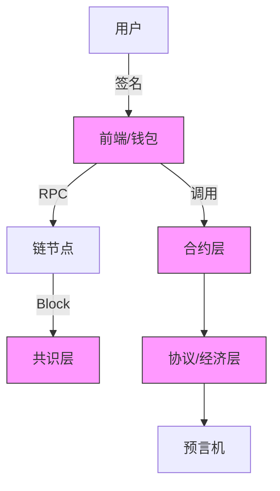

# Web3 安全总览（Four-Layer Attack Surface & Incident Timeline）

> **TL;DR**：Web3 安全是一个 **纵深防御（defense-in-depth）** 问题。攻击面至少分四层——**Chain / Consensus**（51%、长程、Nothing-at-Stake、Grinding）、**Smart Contract**（重入、溢出、访问控制、价格预言机操纵）、**Protocol / Economic**（清算、治理攻击、MEV、RFQ 信任）、**User / Frontend**（钓鱼、钱包权限 drain、Permit 签名欺骗）。自 2016 年 The DAO 起，Web3 累计被盗资金超 **$150 亿美元**（DefiLlama 2026-04 口径），高峰期在 2021–2022（单年 >$35 亿）。本章作为 `05-security/` 模块的导航页，定义四层攻击面、给出 **事件年表**（2016–2026）、列出 **损失热点**（桥 ≈ 40%、DeFi ≈ 35%、CEX 热钱包 ≈ 15%、其他 ≈ 10%），并索引本模块其余 9 篇深度文。

---

## 1. 背景与动机

区块链的 "code is law" 理念赋予系统 **不可变 + 不可回滚** 的特性，这是区块链的优点，也是最大的安全负担——**bug 被写上链后无法简单热修复**，而任何一个整数溢出或错误的 owner 检查都可能被攻击者在一笔交易内抽走数亿美元。

Web3 安全演进可分为四个阶段：

1. **P2PKH 时代（2013–2016）**：以交易所热钱包被盗为主（Mt.Gox 2014 损失 85 万 BTC）。攻击面局限在 **私钥管理**。
2. **智能合约时代（2016–2020）**：The DAO（2016-06，6,000 万美元，导致 ETH/ETC 硬分叉）、Parity Multisig（2017，30 万 ETH 冻结）。攻击面扩展到 **合约代码**。
3. **DeFi + Bridge 时代（2020–2023）**：bZx（2020）、Harvest（2020）、Poly Network（2021，$6.1 亿）、Ronin（2022，$6.25 亿）、Nomad（2022，$1.9 亿）、Wormhole（2022，$3.25 亿）。攻击面扩展到 **经济层 + 跨链信任假设**。
4. **多层深水时代（2024–2026）**：LST/LRT 重抵押组合风险、跨链消息桥中间层、账户抽象权限滥用、MEV searcher 与 solver 信任模型、前端依赖链注入（Ledger 2023 前端供应链攻击，$600k）。

## 2. 核心原理

> 安全类总览以 **方法论结构 + 工具矩阵 + 工作流拓扑** 替代"算法+参数"，篇幅仍保证 1500 字以上。

### 2.1 四层攻击面形式化定义

记系统状态为 `S`，状态转移函数为 `δ: S × Tx → S`。安全属性可形式化为：

- **安全性（Safety）**：`∀ 执行路径 π, ¬ reach(bad_state)`；
- **活性（Liveness）**：`∀ valid Tx, eventually included`;
- **经济完整性（Economic Soundness）**：`∀ t, Σ collateral(t) ≥ Σ debt(t) · LT`。

当一个 **攻击者策略 A** 存在，使上述任一不变式在 **合理资源预算** 下被打破，即视为漏洞。四层的形式化划分：

| 层级 | 不变式示例 | 攻击者能力假设 | 失败后果 |
| --- | --- | --- | --- |
| Chain / Consensus | `canonical chain = heaviest PoW / justified chain` | 算力 / 质押 ≥ 阈值（33%、50%、67%） | 双花、回滚终局性 |
| Smart Contract | 账本总量守恒 / ACL 不变式 | 普通用户（任意 Tx） | 单合约资金被盗 |
| Protocol / Economic | 清算可及性、预言机真实性 | 普通用户 + 市场操纵资本 | 协议资不抵债 |
| User / Frontend | 签名意图真实性 | 网页/DNS/钱包扩展层 | 单用户被 drain |

### 2.2 攻击者资本与成本模型

**威胁建模**需回答三问：

1. **Capability**：攻击者最多能控制多少算力/质押/资金？例如 Ronin 多签阈值 5/9，攻击者只需控制 5 个；Poly Network 攻击者能伪造 keeper 签名。
2. **Cost**：实施攻击的最小经济成本（租用算力、flash loan 手续费、gas、审计识别时间）。
3. **Payoff**：成功后可提取的价值上限。当 `Payoff > Cost + Risk_Premium` 时攻击是理性的。

**Cost-Payoff 比**是评估协议安全性的关键指标。例如 PoW 链的 51% 租赁算力成本（见 crypto51.app）应远低于一天块奖励 + 可能的 Reorg 利润。

### 2.3 信任假设分解

子机制层层拆解信任假设：

- **共识信任**：Byzantine 容错阈值（如 Tendermint ≥ 2/3 honest）；
- **多签信任**：`t-of-n` 阈值签名，Ronin 5/9 就是典型脆弱点；
- **预言机信任**：依赖 Chainlink/Pyth/TWAP；如果预言机被单点控制，协议经济不变式失效；
- **桥信任**：可分为 Native Verification（Cosmos IBC）、External Verification（多签/委员会）、Local Verification（Atomic Swap、HTLC）。External Verification 是历史上被黑最集中的一类；
- **升级信任**：代理合约的 admin key 必须是时间锁 + 多签；Parity multisig 即因 admin 函数未加 `initialized` 保护被"自杀"。

### 2.4 事件年表参数化

关键参数：

- **损失金额**（按事件发生时市价）；
- **攻击窗口**（从首次异常到被止血的时间）；
- **止血手段**（硬分叉 / 白帽退款 / CEX 冻结 / 无止血）；
- **根因类别**（代码 / 配置 / 运营 / 经济设计）。

### 2.5 边界条件与失败模式

- **合约可升级性**与 **去中心化** 相互冲突：可升级保留修复能力但引入 admin key 风险；immutable 合约不可修复。
- **时间锁（timelock）** 是关键缓冲，行业通用 24–48h；太短无法响应，太长影响用户体验。
- **Circuit Breaker / Pause**：停摆能力防止漏损扩大，但可能被滥用冻结正常用户资金。

### 2.6 图示



ASCII 四层模型：

```
+------------------- User / Frontend ------------------+
| Phishing | Permit Scam | Wallet Drainer | DNS Hijack |
+------------ Protocol / Economic ---------------------+
| Oracle Manip | Flash Loan | Governance | MEV | RFQ   |
+------------ Smart Contract --------------------------+
| Reentrancy | Access Control | Arithmetic | Signature |
+------------ Chain / Consensus -----------------------+
| 51% | Long-range | Nothing-at-Stake | Grinding       |
+------------------------------------------------------+
```

## 3. 方法论结构 / 工具矩阵 / 工作流拓扑

### 3.1 方法论分层视图

从 **预防 → 检测 → 响应 → 复盘** 四阶段，每阶段对应工具链：

| 阶段 | 目标 | 典型工具 / 方法 | 子模块链接 |
| --- | --- | --- | --- |
| Prevention | 减少漏洞引入 | SMT 检查、静态分析、形式化验证、Code Review | `static-tools.md` `formal-verification.md` |
| Detection | 上线前/运行时发现异常 | Fuzzing、Invariant Testing、监控 | `fuzzing-tools.md` |
| Assurance | 第三方专家审计 | Code4rena、Trail of Bits、OpenZeppelin | `audit-methodology.md` |
| Response | 事件发生时止血 | Pause、Upgrade、白帽谈判、交易所冻结 | `security-best-practices.md` |
| Postmortem | 复盘学习 | PIR 报告、链上取证 | `bridge-hack-postmortems.md` `defi-exploit-postmortems.md` |

### 3.2 核心工具矩阵

| 工具类别 | 代表产品 | 适用阶段 | 文件索引 |
| --- | --- | --- | --- |
| Static Analyzer | Slither / Mythril / Aderyn / Wake | Prevention | `static-tools.md` |
| Fuzzer | Echidna / Medusa / Foundry fuzz | Detection | `fuzzing-tools.md` |
| Formal Verifier | Certora / Halmos / K Framework | Prevention | `formal-verification.md` |
| Audit Contest | Code4rena / Cantina / Sherlock | Assurance | `audit-methodology.md` |
| Monitoring | Forta / Tenderly Alerts / Hypernative | Detection（runtime） | `security-best-practices.md` |
| Incident Response | OpenZeppelin Defender / SEAL 911 | Response | `security-best-practices.md` |

### 3.3 数据流：从漏洞到事件

追踪一条端到端：

1. **开发者提交 PR** → CI（Slither + Foundry test）；
2. **合并主干** → 专业审计（Trail of Bits / OZ）；
3. **测试网部署** → 公开审计竞赛（Code4rena）；
4. **主网部署** → 监控（Forta）+ Bug Bounty（Immunefi）；
5. **攻击发生** → SEAL 911 应急 / 项目方 Pause → PIR 发布；
6. **资金追踪** → Chainalysis / Arkham → 交易所冻结。

### 3.4 实现多样性

审计与工具生态从不依赖单点：

- 形式化验证 ≥ 4 家（Certora、Halmos、Runtime Verification、KEVM）；
- 审计方 ≥ 20 家（OpenZeppelin、ConsenSys Diligence、Trail of Bits、Spearbit、Zellic、Cantina 等）；
- 审计竞赛平台 ≥ 3（Code4rena、Sherlock、CodeHawks）。

### 3.5 对外接口

- **Immunefi JSON API**：bug bounty 计划列表与 severity 分级；
- **Forta Alerts Webhook**：runtime 监控推送；
- **SEAL 911 Discord**：白帽/项目方应急联络。

## 4. 关键代码 / 典型事件速查

```solidity
// The DAO 重入漏洞（简化）—— 见 CVE-2016-1000007 / Ethereum Classic 硬分叉历史
function withdraw() public {
    uint256 bal = balances[msg.sender];
    (bool ok,) = msg.sender.call{value: bal}(""); // 外部调用先于状态更新
    require(ok);
    balances[msg.sender] = 0; // 在被重入时此行尚未执行
}
```

## 5. 事件年表（2016–2026）

| 年 | 事件 | 损失 | 类别 |
| --- | --- | --- | --- |
| 2016 | The DAO | $60M | 合约 / 重入 |
| 2017 | Parity Multisig Freeze | 513k ETH 冻结 | 合约 / 初始化 |
| 2018 | Bancor | $23.5M | 合约 |
| 2020 | bZx（多次） | $55M | 经济 / 闪贷 |
| 2020 | Harvest | $33.8M | 经济 / 预言机 |
| 2021 | Poly Network | $611M | 桥 / 签名 |
| 2021 | Compound Prop 62 | $80M | 合约 / 治理 |
| 2022 | Ronin | $625M | 桥 / 多签 |
| 2022 | Wormhole | $325M | 桥 / 签名验证 |
| 2022 | Nomad | $190M | 桥 / 初始化 |
| 2022 | Beanstalk | $182M | 治理 / 闪贷 |
| 2022 | BadgerDAO | $120M | 前端 / API key |
| 2022 | Harmony Horizon | $100M | 桥 / 多签 |
| 2022 | Mango Markets | $117M | 经济 / 预言机操纵 |
| 2023 | Euler | $197M（后退还） | 合约 / donateToReserves |
| 2023 | Multichain | ~$125M | 桥 / 运营 |
| 2023 | Curve vyper | $70M | 编译器 / 重入锁 |
| 2023 | Ledger Connect Kit | $600k | 前端供应链 |
| 2024 | DMM Bitcoin | $305M | 运营 / 私钥 |
| 2024 | WazirX | $230M | 多签 / Blind Signing |
| 2025 | Radiant | $50M | 桥 / 多签 |
| 2025 | Bybit | $1.46B | 多签 / UI 欺骗 |

## 6. 实战导航

按角色选择阅读路径：

- **协议开发者**：`security-best-practices.md` → `formal-verification.md` → `fuzzing-tools.md`
- **审计师**：`audit-methodology.md` → `static-tools.md` → `fuzzing-tools.md`
- **风险分析师**：`bridge-hack-postmortems.md` + `defi-exploit-postmortems.md`
- **用户**：阅读 `02-wallet/` + 本章 §1 四阶段

## 7. 安全与已知攻击

本模块整体即为"安全"，但元层面的风险是：**过度信任审计**——一次审计不保证无漏洞。统计上 Code4rena 审计合约中仍有 ~30% 在审计后发现新漏洞（见 a16z 2023 报告）。解决方案：多重审计 + 形式化 + 长期 bug bounty + 监控。

## 8. 与同类整合对比

| 维度 | 本知识库 | rekt.news | DefiLlama/hacks |
| --- | --- | --- | --- |
| 深度 | 结构化分析 + 方法论 | 事件叙事 | 数据聚合 |
| 覆盖 | 预防+检测+响应 | 多为响应/复盘 | 主要损失表 |
| 工具 | 有工具矩阵 | 无 | 无 |

## 9. 延伸阅读

- **Rekt News**：<https://rekt.news>
- **DefiLlama Hacks**：<https://defillama.com/hacks>
- **DeFiHackLabs**：<https://github.com/SunWeb3Sec/DeFiHackLabs>
- **SEAL 911**：<https://securityalliance.org/>
- **a16z Crypto Security**：<https://a16zcrypto.com/posts/article/security-in-web3/>
- **Trail of Bits Blog**：<https://blog.trailofbits.com/category/blockchain/>

## 10. 术语表

| 术语 | 英文 | 释义 |
| --- | --- | --- |
| 攻击面 | Attack Surface | 系统中所有可被外部影响的入口集合 |
| 威胁建模 | Threat Modeling | 识别资产、威胁、脆弱点的结构化过程 |
| 白帽 | White Hat | 合法安全研究者 |
| 事后报告 | Post-mortem / PIR | Post-Incident Review |
| 应急联络 | SEAL 911 | 行业共享应急通道 |

---

*Last verified: 2026-04-22*
