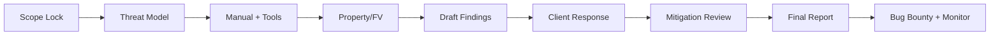

# 智能合约审计方法论（Workflow / Reporting / Severity / Re-audit）

> **TL;DR**：一次专业审计的产出不是"一份 PDF"，而是 **一个结构化的风险证据链**。行业主流方法论包括：Trail of Bits 的 **threat model + property-based** 双轨、OpenZeppelin 的 **阅读 → 笔记 → 建模 → 报告** 四阶、ConsenSys Diligence 的 **Scope+Assumption+Finding+Recommendation** 四段式。竞赛式审计平台（Code4rena / Sherlock / Cantina / CodeHawks）把单家审计变为 **多审计师并行**，用 Judge + Escalation 仲裁机制提高发现率。Severity 分级主流是 **Immunefi Severity Standard v2.3**：Critical / High / Medium / Low / Informational，依据"资金损失路径 + 可达性 + 影响范围"。一份合格审计报告要包含：Scope、Assumption、Architecture Overview、Findings（编号 + 严重度 + PoC + 复现 + 修复建议）、Gas Opt、Informational、Acknowledgements，并支持 **re-audit**（修复后复审）闭环。

---

## 1. 背景与动机

合约一旦上链几乎无法修补，因此"上线前审计"是行业默认保险。但审计并非万能——Code4rena 数据显示审计过的合约仍有 ~30% 在后续被发现新漏洞（a16z 2023）。其根本原因是：

- 合约逻辑组合爆炸（DeFi 协议相互嵌套）；
- 时间/预算限制（一次审计通常 1–4 周）；
- 经济层漏洞难以用代码层检查发现；
- 人类专家有认知盲区。

因此，现代审计方法论强调：**多轮审计 + 竞赛 + 形式化 + Bug Bounty + 监控**的组合防御。

## 2. 核心原理

### 2.1 方法论：威胁建模为起点

经典 TrailOfBits 流程《Blockchain Security Audits》（2022）：

1. **Scope 定义**：Lock commit hash，写入 README；
2. **Threat Model**：列举 assets、actors、trust assumptions（谁可以升级？谁持有 admin key？预言机信任？）；
3. **Attack Tree**：把"资金被盗"拆分为若干子目标（如 bypass access control、overflow、oracle manip）；
4. **Specification**：用自然语言或 Certora/Halmos spec 写出不变式；
5. **Manual Review**：逐行阅读 + 笔记；
6. **Automated Tools**：Slither / Aderyn / Semgrep 扫一遍做 baseline；
7. **Property Testing**：Foundry invariant / Echidna；
8. **Formal Verification**（必要时）：Certora / Halmos；
9. **Reporting**：按 Severity 编号；
10. **Re-audit**：修复后再做一轮。

### 2.2 Severity 评级：Immunefi v2.3 矩阵

Immunefi 的分级参考 **Impact × Likelihood**：

| Severity | 示例 |
| --- | --- |
| Critical | Direct loss of funds / permanent freezing of funds |
| High | Theft of yield / temporary freezing / governance takeover |
| Medium | Griefing / minor fund loss (< $10k) / significant oracle drift |
| Low | Gas waste / UX issue |
| Informational | Naming / style / best practice |

Sherlock、Code4rena 使用类似矩阵但有微调（如 Sherlock 引入 "medium → high 升级" 规则）。

### 2.3 审计竞赛 vs 单家审计

| 维度 | 传统单家 | 竞赛式 |
| --- | --- | --- |
| 并行审计师数 | 2–3 | 50–300 |
| 时间 | 1–4 周 | 1–2 周 |
| 价格 | $50k–$500k | 奖池制 |
| 发现率 | 取决于团队 | 多视角提高 coverage |
| 沟通 | 直接 | 通过平台 |
| 复审 | 含 | 常含 mitigation review |

Code4rena 的 **Judge + Escalation** 机制由首席 Judge 裁决重复报告；Sherlock 采用 **Watson 等级** 激励长期贡献者。

### 2.4 报告结构标准

ConsenSys / OZ / ToB 通用结构：

```
1. Executive Summary
2. Scope (commit hash, files, LoC)
3. System Overview (架构图)
4. Findings
   - ID (e.g., TOB-UNI-001)
   - Severity
   - Status (Reported / Acknowledged / Fixed)
   - Description
   - Example / PoC
   - Recommendation
   - References
5. Gas Optimizations
6. Informational / Style
7. Appendix A: Tools Used
8. Appendix B: Threat Model
```

### 2.5 参数与常量

- **Scope 冻结** 通常要求 commit hash 固定、LoC < 2000 / 审计师周；
- **竞赛奖池**：Code4rena 典型 $50k–$1M，高峰 >$3M；
- **Mitigation Review 时限**：通常 2–4 周内提交；
- **公开披露**：多数平台要求修复上线后 + cooldown（14–30 天）。

### 2.6 边界条件与失败模式

- **审计师认知盲区**：偏静态合约代码、忽略经济层；
- **报告"发给却不改"**：项目方忽略 Medium 以下；
- **多家审计仍被黑**：Ronin 有 Verichains；Euler 有 6 次审计仍被黑 $197M（见 `defi-exploit-postmortems.md`）；
- **Judge 偏差**：重复报告归并标准不一。

### 2.7 图示



## 3. 方法论结构 / 工具矩阵 / 工作流拓扑

### 3.1 方法论分层

| 层 | 工具/技术 |
| --- | --- |
| L1 编译器警告 | solc warnings, vyper warnings |
| L2 静态 | Slither, Aderyn, Semgrep |
| L3 符号执行 | Mythril, Manticore, hevm |
| L4 Fuzz | Foundry invariant, Echidna, Medusa |
| L5 Formal | Certora, Halmos, K-EVM |
| L6 Manual | Senior auditor review |
| L7 Economic Modeling | Gauntlet, Chaos Labs |

### 3.2 审计主体矩阵

| 平台 | 模式 | 代表客户 |
| --- | --- | --- |
| Trail of Bits | 顾问 | Compound, MakerDAO |
| OpenZeppelin | 顾问 | Ethereum Foundation, Aave |
| ConsenSys Diligence | 顾问 | MetaMask, Infura |
| Spearbit / Cantina | 顾问 + 竞赛 | Lido, Uniswap |
| Code4rena | 竞赛 | Aave, Uniswap, many |
| Sherlock | 竞赛 + 保险 | Teller, Perennial |
| CodeHawks | 竞赛 | Cyfrin 生态 |
| Zellic | 顾问 | Jito, multiple L1 |

### 3.3 工作流拓扑

```
Project → Pre-audit self review → Tools baseline → Send to auditor(s) → Interim findings → Fix → Re-audit → Public report → Bug Bounty (Immunefi) → Runtime Monitor
```

### 3.4 实现多样性 / 参考

- 公开报告：<https://github.com/trailofbits/publications>；<https://blog.openzeppelin.com/category/audits>
- 竞赛历史：<https://code4rena.com/reports>；<https://audits.sherlock.xyz/contests>
- 自审 checklist：Secureum（<https://secureum.xyz/>）、Solodit。

### 3.5 对外接口

- Solodit 聚合：<https://solodit.xyz> 按关键词检索历史发现；
- Code4rena 报告 JSON；
- Immunefi 程序 API。

## 4. 关键代码 / 模板

```markdown
## [H-01] Missing slippage check in `swap()`

**Severity**: High  
**Status**: Reported  
**File**: src/Router.sol:L124-L140

### Description
The function `swap()` accepts `amountIn` but does not validate `amountOutMin`, 
allowing sandwich attacks in multi-hop paths.

### PoC
```solidity
// Foundry test demonstrating 10% slippage extraction
function testSandwich() public { ... }
```

### Recommendation
Add `require(amountOut >= amountOutMin, "SLIPPAGE")`.
Reference: Uniswap V2 Router `swapExactTokensForTokens`.
```

## 5. 演进与版本对比

| 阶段 | 年份 | 代表 |
| --- | --- | --- |
| 单家手工 | 2016–2019 | ToB, OZ |
| 自动化兴起 | 2019–2021 | Slither, MythX |
| 竞赛模式 | 2021+ | Code4rena 2021-Q1 launch |
| 形式化落地 | 2022+ | Certora for Aave/Compound |
| AI-assisted | 2024+ | AI 辅助但非主力 |

## 6. 实战示例

发起 Code4rena 竞赛最小模板：

```yaml
# code4rena.yaml
contest_name: MyProtocol v1.0
pool: $100,000
duration: 7 days
scope:
  - src/Vault.sol
  - src/Router.sol
commit: 0xabc123...
```

提交 OpenZeppelin 审计通常流程：scope call → KO → weekly sync → draft report → mitigation → final。

## 7. 安全与已知攻击（本主题即安全）

Meta 风险：**审计本身的假阴性**。Euler 6 审计后被黑；Ronin 的 Verichains 审计未覆盖运营侧。解决：多层防御 + Bug Bounty + 长期监控。

## 8. 与同类方案对比

| 维度 | 竞赛 | 单家 | 形式化 |
| --- | --- | --- | --- |
| 成本 | 中 | 高 | 高 |
| 覆盖 | 广 | 深 | 最深（限量） |
| 速度 | 快 | 中 | 慢 |

## 9. 延伸阅读

- ToB Blog：<https://blog.trailofbits.com/category/blockchain/>
- OZ Audit Reports：<https://blog.openzeppelin.com/security-audits>
- Solodit：<https://solodit.xyz>
- Secureum：<https://secureum.xyz>
- Patrick Collins：*Smart Contract Auditors Handbook*（YouTube）

## 10. 术语表

| 术语 | 英文 | 释义 |
| --- | --- | --- |
| 范围冻结 | Scope freeze | commit hash 固定 |
| 复审 | Re-audit / Mitigation review | 修复后检查 |
| PoC | Proof of Concept | 可复现测试 |
| 升级 | Escalation | 裁决争议 |
| 判官 | Judge | 竞赛裁决者 |

---

*Last verified: 2026-04-22*
