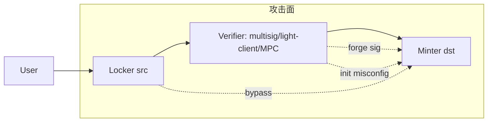

# 跨链桥被黑复盘（Ronin / Nomad / Wormhole / Harmony / Multichain / Poly）

> 📁 **完整时间线档案**：每起事件的独立深度复盘见 [`08-security-incidents/`](../08-security-incidents/_index.md)——本文是跨事件模式综述，08 是时间线完整档案。

> **TL;DR**：跨链桥是 Web3 损失 **最集中** 的单一品类，2021-2023 累计被盗超 **$25 亿**。六大经典案例：(1) **Poly Network 2021-08（$611M）**——EthCrossChainManager 权限配置错误导致 keeper 被任意替换；(2) **Ronin 2022-03（$625M）**——9 多签中 5 个被社工 + 后门 API 控；(3) **Wormhole 2022-02（$325M）**——Solana 端 `verify_signatures` 未校验 `load_instruction_at` 的账户真伪；(4) **Nomad 2022-08（$190M）**——`initialize` 误把 `acceptableRoot[0]` 置为 `0x00`，任何消息都能 prove；(5) **Harmony Horizon 2022-06（$100M）**——2-of-5 多签被钓鱼拿走两把私钥；(6) **Multichain 2023-07（~$125M）**——CEO 被中国警方拘留后运营中心化密钥失控。共性：**外部验证（External Verification）桥的信任假设脆弱**、**多签阈值过低**、**初始化与升级攻面**、**运营 key 管理**。

---

## 1. 背景与动机

跨链桥的价值命题是在不同链间搬运资产/消息。但不同链共识是隔离的，桥必须引入"中间层"做 **消息真实性证明**。按 Arjun Bhuptani 2021 的分类：

- **Natively Verified**：依赖两端共识直接验证（IBC、LayerZero ULN v2 with DVN committees）；
- **Externally Verified**：多签/委员会签发消息（Poly、Ronin、Multichain、Nomad 的 Updater）；
- **Locally Verified**：仅交互双方验证（Atomic Swap、Connext Amarok）。

**External Verification** 桥历史上被黑占比最高（>80%）。

## 2. 核心原理（复盘方法论）

> §2 按"复盘方法论 + 形式化 + 参数 + 边界"深入展开。

### 2.1 桥攻击面形式化

桥可抽象为三元组 `(Locker, Verifier, Minter)`：
- Locker：源链锁定资产合约；
- Verifier：证明机制（多签 / Light Client / ZK proof）；
- Minter：目标链铸造 wrapped 资产。

攻击面：
- **Verifier 伪造**：伪造签名/Merkle proof；
- **Locker 绕过**：无需锁定就 trigger mint；
- **Minter 权限**：直接调 `mint` 跳过 Verifier；
- **运营侧**：多签私钥、热钱包；
- **初始化**：未加锁的 `initialize`。

### 2.2 Poly Network 复盘（$611M，2021-08-10）

根因：`EthCrossChainManager.verifyHeaderAndExecuteTx` 里 `keepers` 可通过 `_executeCrossChainTx(… toContract = EthCrossChainData, method = putCurEpochConPubKeyBytes)` 被任意替换。攻击者构造一条"跨链消息"把 keepers 改成自己的地址，再签发 withdraw。

修复：对 admin 级别的 toContract/method 建立白名单拦截；明确分离"业务调用"与"治理调用"。

### 2.3 Wormhole 复盘（$325M，2022-02-02）

Solana 端 `verify_signatures` 接受 `sysvars` 账户作为 `sol_secp256k1_verify` 的指令 reference；但未校验提供的账户是不是真正的系统 sysvar。攻击者伪造 Secp256k1 verify 程序 ID，绕过签名检查后调用 `completeTransferWithPayload`。

修复：用 `solana_program::sysvar::instructions::ID` 硬匹配；`load_instruction_at_checked` 代替不安全版本。

### 2.4 Ronin 复盘（$625M，2022-03-23）

Sky Mavis Axie 九多签中 4 把由团队持有，1 把由 Axie DAO 委托。**2021-11 一个性能问题解决方案让 DAO 签名自动 approve 任何来自 Sky Mavis 的 RPC 请求**。工程师通过 LinkedIn 假面试把恶意 PDF 发给 Sky Mavis 员工 → 拿 Sky Mavis 4 key → 结合 DAO auto-approve → 共 5 key → 提款 173,600 ETH + 25.5M USDC。

修复：阈值提高至 8/9；移除 auto-approve；硬件钱包 + 多工厂隔离。

### 2.5 Nomad 复盘（$190M，2022-08-01）

升级过程中 `initialize` 调用里 `acceptableRoot[0]` 被设成 `bytes32(0)`。后续 `process()` 验证 `acceptableRoot[messageRoot]` 只要非零即通过——当 `messageRoot = 0` 时查询 `acceptableRoot[0]`（而此值被错误置为 `true`/非零），即任意消息都能被证明。攻击演化成"复制粘贴黑客"——任何人只需复制第一笔攻击 tx 改个地址就能薅。

修复：`acceptableRoot[0]` 显式禁用；`process()` 增加非零检查。

### 2.6 Harmony Horizon（$100M，2022-06-24）

2-of-5 多签，Lazarus Group（朝鲜）通过钓鱼获得两把 key。根因：**阈值过低 + 运营密钥隔离不足**。

### 2.7 Multichain（~$125M，2023-07）

中心化 MPC 架构，CEO 赵均被捕后剩余团队无法 rotate key；资金被其本人或其他内部人转出。根因：**MPC 流程未 decentralize，运营单点**。

### 2.8 参数与边界

| 事件 | 损失 | 类别 | 阈值/参数 |
| --- | --- | --- | --- |
| Poly | $611M | 权限 | keepers 可被跨链消息改 |
| Wormhole | $325M | 签名验证 | sysvar 校验 |
| Ronin | $625M | 多签 | 5/9（含 auto-approve） |
| Nomad | $190M | 初始化 | `acceptableRoot[0]=0x00` |
| Harmony | $100M | 多签 | 2/5 过低 |
| Multichain | ~$125M | 运营 | MPC 中心化 |

### 2.9 图示



## 3. 方法论结构 / 工具矩阵 / 工作流拓扑

### 3.1 桥分类与风险矩阵

| 类型 | 代表 | 主要风险 | 历史损失 |
| --- | --- | --- | --- |
| Externally Verified multisig | Ronin, Harmony | 私钥泄露 | 极高 |
| Externally Verified MPC | Multichain, FBTC | 运营 | 高 |
| Externally Verified Committee | Wormhole (Guardian) | 签名伪造 | 高 |
| Optimistic | Nomad, Across | 初始化 / Updater | 中 |
| Light-client / Natively | IBC, Near Rainbow | 实现 bug | 低（已知最低） |
| ZK | zkBridge, Polyhedra | 电路 bug | 中 |

### 3.2 工具矩阵

| 工具 | 目的 |
| --- | --- |
| L2Beat Bridges | 风险评级 (<https://l2beat.com/bridges>) |
| DeFiLlama Hacks | 事件数据 |
| Chainalysis Alerts | 链上追踪 |
| Forta Bots | 运行时告警 |
| SEAL 911 | 应急联络 |

### 3.3 事件响应数据流

```
异常 Tx → 监控 Bot → 内部 P1 告警 → Pause（如支持） → 公共披露 → 法务/CEX 冻结 → Postmortem → 审计复核
```

### 3.4 实现多样性（主动防御）

- 桥应组合：Native light-client + External committee + ZK proof 三轨冗余；
- 2023 后新生代桥（Across v3、Hyperlane ISM）引入 modular security。

### 3.5 对外接口

- **L2Beat API / Bridges JSON**：机读 bridge 风险指标，每日刷新；
- **Wormhole Guardian VAA WebSocket**：Wormhole 监听层可订阅守护者签名流，用于第三方监控；
- **Hyperlane ISM JSON**：模块化安全模型（Interchain Security Module）配置查询；
- **Chainlink CCIP Explorer API**：跨链消息状态查询；
- **LayerZero Scan**：各端点 DVN 配置与链接信息；
- **IBC relayer metrics（Prometheus）**：Cosmos 系 light-client 中继器指标。

### 3.6 纵深防御的组合范式

历史教训催生了 2023+ 新一代桥的"多签 + zk proof + optimistic fraud window"三轨并行范式。典型如 Hyperlane 的 ISM 支持 StackedISM，可同时要求多签委员会、zk-SNARK verifier、Optimistic fraud proof 三套独立通过才算有效消息。这种冗余把"单点失败"降级为"多点同时失败"，把历史桥损失概率分布显著压低。另一个代表是 Across v3，采用 Optimistic 传输 + UMA Oracle 挑战 + Relayer 本地验证，并与 SEAL 911 监控机构集成，把 Detection-to-Pause 时间缩短到 <30 秒。对开发者而言，即便只是桥的使用方，也应以 "至少两个独立验证通道可否对账" 作为集成前审核的 checklist，不可只接一条桥做单点依赖。

## 4. 关键代码 / 实现细节

Nomad 的致命 bug（简化）：

```solidity
// Nomad Replica.sol (commit pre-hack)
function initialize(...) public initializer {
    // acceptableRoot[0] 被置 true/non-zero
    _setConfirmation(committedRoot, block.timestamp);
}

function prove(bytes32 _leaf, bytes32[32] memory _proof, uint256 _index) public {
    bytes32 root = merkleRoot(_leaf, _proof, _index);
    require(acceptableRoot[root] != 0, "!proof"); // 但 root=0x00 也满足
    ...
}
```

Wormhole 修复（Solana 端）：

```rust
// https://github.com/wormhole-foundation/wormhole/commit/...
use solana_program::sysvar::instructions::ID as INSTRUCTIONS_ID;
require!(ctx.accounts.instructions.key == &INSTRUCTIONS_ID, InvalidAccount);
```

## 5. 演进与版本对比

| 阶段 | 防御重心 |
| --- | --- |
| 2020–2021 | 功能 first，安全次之 |
| 2022 | 多签 + pause |
| 2023 | Monitoring + Forta bots |
| 2024+ | Modular ISM, zk proofs, decentralized MPC |

## 6. 实战示例

查询 Nomad 地址涉事资金：

```bash
# 用 chainlens / etherscan labels 过滤
```

## 7. 安全与已知攻击（本文即）

## 8. 与同类方案对比

见 §3.1 矩阵。

## 9. 延伸阅读

- Rekt news 汇总：<https://rekt.news/leaderboard/>
- Arjun Bhuptani 分类原文：<https://blog.connext.network/the-interoperability-trilemma-586f01e94bd1>
- Vitalik *Trustless bridges*：<https://twitter.com/VitalikButerin/status/1479501366192132099>
- L2Beat Bridges：<https://l2beat.com/bridges>

## 10. 术语表

| 术语 | 英文 | 释义 |
| --- | --- | --- |
| External Verification | EV | 外部委员会签名 |
| Native Verification | NV | 两端共识直接验 |
| Light Client Bridge | LCB | 轻客户端桥 |
| VAA | Verified Action Approval | Wormhole Guardian 签名 |
| Updater | Updater | Nomad 提交根的角色 |

---

*Last verified: 2026-04-22*
