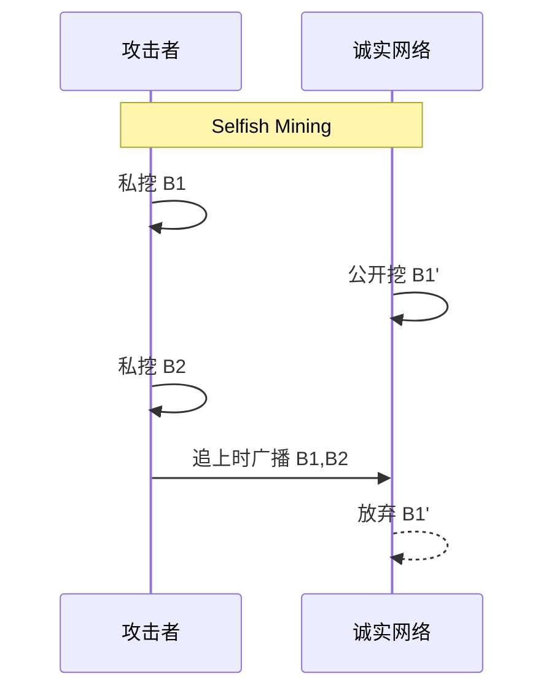

# 链共识安全（51% / Long-range / Nothing-at-Stake / Grinding / Selfish Mining）

> **TL;DR**：共识层是区块链的 **地基**。本文系统整理五类经典共识攻击：(1) **51% / Majority Attack**：攻击者控制多数算力/质押，能双花、审查；(2) **Long-range Attack**：PoS 特有，攻击者用历史私钥构造"平行链"在远古分叉；(3) **Nothing-at-Stake**：PoS 验证人同时在多条分叉上签名；(4) **Grinding**：攻击者操纵伪随机数偏置出块权；(5) **Selfish Mining**：隐藏区块抢夺奖励。防御工具箱包括：PoW 中的 Checkpoint、Ghost/Heaviest-chain 规则，PoS 中的 Slashing、Weak Subjectivity、Finality Gadget、VDF/VRF 抗 Grinding。真实案例：ETC 多次 51%（2019/2020，百万美元级损失）、Verge 2018 时间戳攻击、Feather Fork、Monacoin 等。截至 2026-04，主流 L1（BTC/ETH）算力/质押 TVL 足够大，直接 51% 攻击成本超 $10 亿/小时，但小币种与 PoA 侧链仍在风险区。

---

## 1. 背景与动机

Satoshi 在 2008 白皮书里用一句话总结共识安全：*"As long as honest nodes collectively control more CPU power than any cooperating group of attacker nodes, they'll generate the longest chain."* —— 这是典型的 **Honest Majority Assumption**。但"honest majority"并非唯一；实际系统还需处理：

- **历史重写**（long-range）：PoS 没有外部物理成本，历史重写门槛极低；
- **理性但不诚实**（selfish mining）：矿工为了增加收益会选择非默认策略；
- **经济攻击与共识攻击叠加**：攻击 DEX/桥 + 回滚链 = 双重获利。

因此 "Consensus Security" 并非只看 fault tolerance 理论值，还要看 **经济成本 + 社会层恢复** 的组合。

## 2. 核心原理

### 2.1 形式化定义：共识属性

共识协议需满足：

- **Common Prefix (CP)**：任意诚实节点视图的链 `C_1, C_2`，存在一个 `k` 使得 `C_1[:-k] = C_2[:-k]`；
- **Chain Quality (CQ)**：任意长度为 `l` 的窗口内诚实区块占比 ≥ `μ`；
- **Chain Growth (CG)**：诚实节点的链每 `T` 时间至少增长 `τ·T`。

Garay/Kiayias/Leonardos《Bitcoin Backbone Protocol》（ePrint 2014/765）证明 Bitcoin 在 `f < 0.5` 时满足上述三条。

### 2.2 51% / Majority Attack

**定义**：攻击者控制 ≥ 50% 算力（PoW）或 ≥ 1/3/2/3 质押（BFT PoS），能做以下事：

1. **双花（Double Spend）**：向 CEX 充值后，回滚链替换成转回自己；
2. **审查（Censorship）**：拒绝打包特定地址；
3. **自私出块**：永远获得 100% 块奖励。

攻击成本估算（PoW 租算力模型）：

```
Cost_attack = NiceHash_price × hashrate × duration
```

以 BTC 为例（2026-04 全网 ~700 EH/s，NiceHash 不足以租到 50%），实际直接 51% 不可行；但对 ETC（~200 TH/s）历史上 NiceHash 可行。

### 2.3 Long-range Attack（长程攻击）

**仅发生在 PoS**，攻击流程：

1. 攻击者积累若干早期验证人私钥（可能因验证人已退出、把钥匙"卖"给市场）；
2. 从远古（比如 2 年前）某个区块开始，用这些私钥构造平行链；
3. 新节点如果没有任何可信参考，无法判断哪条链是"正版"。

**防御**：

- **Weak Subjectivity (WS)**：新节点必须从可信源获得一个近期 checkpoint（Ethereum 白皮书提出）；
- **Long-range Finality**：Ethereum 通过 Casper FFG 的 **justified/finalized** 区块，回滚已 finalized 区块需销毁至少 1/3 质押；
- **Bonded/Unbonded 期**：Cosmos 有 21 天 unbonding period 让恶意行为可被 slash。

### 2.4 Nothing-at-Stake（NaS）

**描述**：早期朴素 PoS 中，验证人在分叉时签名 **两条链** 的成本为 0，最优策略是双签 → 永远无法收敛。

**防御**：

- **Slashing**：在双签证据被提交时 slash 一部分质押（ETH: `MIN_SLASHING_PENALTY_QUOTIENT = 32`，约 1/32 质押被销毁；极端情况下 `correlation_penalty` 可扩大到全部）；
- **Accountable Safety**：BFT 协议（Tendermint、HotStuff）在双签时能定位责任人。

### 2.5 Grinding Attack

**定义**：PoS 验证人通过 **偏置随机源**（比如 VRF 的 input）来反复"试算"以获得未来出块权。

**防御**：

- **VRF**（Algorand）：验证人私钥 → 唯一输出，无法自我选择；
- **RANDAO + VDF**（Ethereum）：用 VDF 强制延迟揭示，使得偏置成本 ≫ 收益；
- **Commit-Reveal**：Cardano Ouroboros Praos 的 coin flipping。

### 2.6 Selfish Mining / Block Withholding

Eyal & Sirer（2013）证明：在 PoW 下，只要攻击者 **≥ 25% 算力且网络传播优势 > 50%**，隐藏区块策略的收益率高于诚实挖矿。

**策略**：

1. 私挖一个块；
2. 等诚实链追平时再广播，强制诚实链浪费算力；
3. 获得比公平份额更高的奖励比例。

**防御**：

- **Uniform Tie-breaking**：节点随机选一条（打破"先到先得"）；
- **GHOST / Heaviest-chain 规则**（如 Ethereum pre-merge 的 uncle rewards）；
- **共识级 FFG Finality**：一旦 finalize 则私挖作废。

### 2.7 参数表

| 协议 | 容错阈值 | Finality | 经济惩罚 |
| --- | --- | --- | --- |
| Bitcoin | 50% 算力 | Probabilistic（6 conf ≈ 1h） | 无（只丢块奖励） |
| Ethereum PoS | 1/3 slashing safety, 1/3 liveness | 2 epochs ≈ 12.8min | Min 1/32 质押；Max 100% |
| Tendermint (Cosmos) | 1/3 | Instant | 5% 双签 |
| Algorand | 1/3 | Instant | 无显式 slash（经济抗性靠 VRF） |
| Solana TowerBFT | 1/3 | Instant after lockout | 100% if double-vote |

### 2.8 边界条件

- **低参与率**：当验证人在线比例低于阈值（ETH ≤ 2/3），finality 停摆，链继续但不 finalize；
- **长时间不出块**（Inactivity Leak）：ETH 会缓慢 burn 非活跃验证人质押以恢复超级多数；
- **网络分区**：分区两侧都可能各自继续出块，合并时需 re-org；
- **时钟漂移**：Verge 2018 攻击利用节点接受过去时间戳的宽容度（2 小时）挖出大量低难度块。

### 2.9 图示



```
+-----------+        +-----------+
|  Attacker |--51%-->| Canonical |
+-----------+        +-----------+
     |                      ^
     | Long-range fork      | Finality (FFG)
     v                      |
+-----------+        +-----------+
|  Ghost    |        | Checkpoint|
+-----------+        +-----------+
```

## 3. 方法论结构 / 工具矩阵 / 工作流拓扑

### 3.1 防御分层

| 层 | 责任 | 示例 |
| --- | --- | --- |
| Cryptographic | 签名、VRF、VDF | BLS aggregate, VDF chain |
| Incentive | 奖励/惩罚 | Slashing, Proposer Reward |
| Protocol | 分叉规则 | GHOST, LMD-GHOST, Casper FFG |
| Social | Weak Subjectivity, UASF | ETH WS checkpoints, BTC UASF 2017 |
| Monitoring | 观测异常 | beaconcha.in, forkmon.ethstaker.cc |

### 3.2 工具矩阵

| 工具 | 目的 | 链接 |
| --- | --- | --- |
| crypto51.app | PoW 租算力成本估算 | <https://crypto51.app> |
| beaconcha.in | ETH 验证人行为监控 | <https://beaconcha.in> |
| forkmon | ETH 分叉监控 | <https://forkmon.ethstaker.cc> |
| blockchain.com/explorer | reorg 历史 | 链上 |
| mempool.space | BTC reorg + 费用监控 | <https://mempool.space> |

### 3.3 事件到响应数据流

```
Reorg 监控 → 超阈值告警（≥ 6 block） → 交易所延长确认 → 冻结充值 → 社区讨论 → 协议层 response
```

### 3.4 实现多样性

- Ethereum 共识客户端（Prysm / Lighthouse / Teku / Nimbus / Lodestar）多样性防止 bug 单点；
- Bitcoin Core 与 btcd、bcoin 多客户端共识；
- Cosmos SDK 各链独立实现 ABCI，共识层依赖 CometBFT。

### 3.5 对外接口

- **Beacon API**（标准 v2.5+）：validator、state、reorg 事件 SSE；任何人可拉取实时分叉信号；
- **Eth JSON-RPC**：`eth_getBlockByNumber`、`eth_getProof` 用于外部校验；
- **Tendermint RPC**：`/block`、`/validators`、`/evidence`（双签证据）；
- **Cosmos SDK gRPC**：`cosmos.slashing.v1beta1` 模块接口；
- **Solana RPC**：`getClusterNodes`、`getSlotLeaders` 用于 leader schedule 审计；
- **Forkmon / Beaconcha.in webhook**：分叉、miss、slash 实时 push；
- **beacon-attack simulator**（ethpandaops）：压力测试场景重放。

### 3.6 响应剧本（Response Playbook）

当检测到共识异常（reorg ≥ 3 block、stale head、justified epoch 回退），通常做法：交易所把充值确认数从 12 拉到 64+ 并暂停提现；验证人运营方联合 client team 在 Discord 开应急频道；若确认为攻击则社会层召集"硬分叉 or 放弃币种"投票（ETC 2019 和 Verge 2018 都选择社区共识 + 交易所联合冻结）。硬分叉是最后手段，代价极高（ETH/ETC 分裂即例），因此现代 PoS 倾向于靠 **slashing + inactivity leak** 自动修复而非人工分叉。此外，验证人方需定期演练：断网演习、私钥轮换、client 多样性切换，以避免真正紧急时手忙脚乱。

## 4. 关键代码 / 实现细节

```go
// Ethereum Consensus - Slashing 判定（prysm/beacon-chain/core/blocks/attester_slashing.go 简化）
// Commit: v5.1.x
func VerifyAttesterSlashing(beacon *state.BeaconState, s *ethpb.AttesterSlashing) error {
    att1, att2 := s.Attestation_1, s.Attestation_2
    // Rule 1: double vote (same target epoch, different root)
    // Rule 2: surround vote (att1 surrounds att2 in source/target epochs)
    if !isSlashableAttestationData(att1.Data, att2.Data) {
        return errors.New("not slashable")
    }
    // 验证两条 attestation 的 BLS 聚合签名
    if err := verifyIndexedAttestation(beacon, att1); err != nil { return err }
    if err := verifyIndexedAttestation(beacon, att2); err != nil { return err }
    // Slash 交集中的验证人
    return slashValidators(beacon, intersect(att1.AttestingIndices, att2.AttestingIndices))
}
```

参考：<https://github.com/prysmaticlabs/prysm/blob/develop/beacon-chain/core/blocks/attester_slashing.go>

## 5. 演进与版本对比

| 机制 | 2013 朴素 PoS | 2018 Casper FFG | 2022 Merge Gasper | 2024 SSF 研究 |
| --- | --- | --- | --- | --- |
| 最终性 | 无 | Epoch 级 | Epoch 级 LMD + FFG | Single Slot Finality |
| Slash | 无 | 有 | 有 + Inactivity Leak | 更强 |

## 6. 实战示例

估算对 ETC 的 1 小时 51% 成本：

```
hashrate = 200 TH/s  (2026-04 ~估)
nicehash_rate ≈ $0.03 per TH/h
cost_1h = 200 × 0.03 × 60 / 60 ≈ $6 per TH/h × 200 = $1200 × ... 
// 参考 crypto51.app 实时计算
```

对 Prysm 节点启用 slashing 保护：

```
prysm.sh validator --slasher ... --wallet-dir=... --slashing-protection-export ...
```

## 7. 安全与已知攻击

- **ETC 51% 2019-01**：回滚 ~100 block，$1.1M；2020-07/08 再次发生多次；
- **Verge XVG 2018-04**：时间戳 + 算法多样性漏洞，被挖 35M XVG；
- **Monacoin 2018**：小币种 selfish mining；
- **Bitcoin Gold 2018/2020**：双花 $72k / $70k；
- **Ethereum Classic 2022 Testnet**：Reorg 7000 blocks（主网未受影响）。

## 8. 与同类方案对比

| 维度 | PoW | PoS | DAG（Hashgraph/IOTA） |
| --- | --- | --- | --- |
| Long-range 抗性 | 强（需算力） | 弱（需 WS） | 中 |
| 51% 成本 | 外部算力市场 | 质押买入 | 视实现 |
| Slashing | 无 | 有 | 弱 |
| Finality | 概率 | 确定性 | 概率/确定性 |

## 9. 延伸阅读

- Vitalik: *Proof of Stake: How I Learned to Love Weak Subjectivity*（2014）<https://blog.ethereum.org/2014/11/25/proof-stake-learned-love-weak-subjectivity>
- Eyal & Sirer《Majority is not Enough》<https://arxiv.org/abs/1311.0243>
- Garay/Kiayias/Leonardos《The Bitcoin Backbone Protocol》<https://eprint.iacr.org/2014/765>
- Ethresearch: Long-range 讨论帖 <https://ethresear.ch/c/casper/>
- Vitalik: *Why Proof of Stake*（2020）

## 10. 术语表

| 术语 | 英文 | 释义 |
| --- | --- | --- |
| 51% 攻击 | Majority Attack | 控制多数算力/质押以回滚/审查 |
| 长程攻击 | Long-range Attack | PoS 用历史私钥构造平行链 |
| 无利害关系 | Nothing-at-Stake | PoS 双签成本为 0 的攻击 |
| 偏置攻击 | Grinding | 通过试错操纵伪随机 |
| 自私挖矿 | Selfish Mining | 隐藏区块以获超额收益 |
| 弱主观性 | Weak Subjectivity | PoS 新节点需可信 checkpoint |

---

*Last verified: 2026-04-22*
