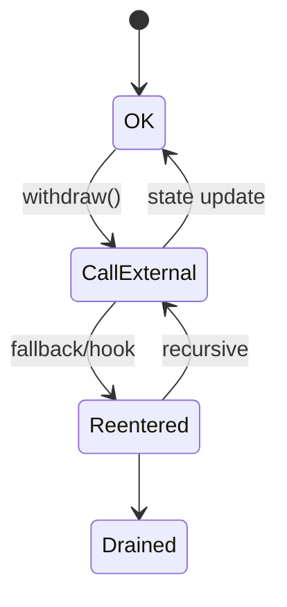

# 智能合约漏洞全景（Reentrancy / Overflow / AC / Signature Replay / DoS / Wallet Poisoning）

> **TL;DR**：Solidity/Vyper 合约的漏洞可分八大类：(1) **Reentrancy**（单/跨函数/只读重入，The DAO 原罪）；(2) **Arithmetic Over/Underflow**（0.8 前普遍，0.8+ 默认 checked）；(3) **Access Control**（`tx.origin`、缺失 `onlyOwner`、Initializable 未上锁）；(4) **Signature/Hash 相关**（Replay、Malleability、EIP-712 字段缺失）；(5) **Oracle / Price Manipulation**（Spot TWAP 操纵、闪贷放大）；(6) **DoS / Gas**（无界循环、push pattern、gas grief）；(7) **Delegatecall / Proxy**（storage collision、selfdestruct 炸 implementation）；(8) **前端 / 钱包钓鱼**（`eth_sign`、`Permit2` 无限额、Address Poisoning）。本文以 SWC Registry + DeFiHackLabs 实战复盘为骨架，给出每类漏洞的形式化特征、典型 CVE/Audit report 链接、修复 pattern（CEI、ReentrancyGuard、PullPayment、SafeCast、EIP-712 nonce、Permit2 限额、timelock）。

---

## 1. 背景与动机

智能合约代码即资金：一行 `call{value:bal}("")` 错置就能被 drain 6000 万美元（The DAO 2016）。与 Web2 不同，合约发布后默认不可变 → 漏洞一旦被利用多为永久损失。历代漏洞演化：

- 2016–2018：语言层漏洞（整数溢出、tx.origin、短地址攻击）；
- 2019–2021：经济层漏洞（闪贷 + 预言机操纵、治理攻击）；
- 2022–2024：跨合约调用复杂度（只读重入、跨合约状态组合、delegate/hook 钩子注入）；
- 2025–2026：账户抽象（EIP-7702）带来的签名权限滥用、Permit2 批量钓鱼。

SWC Registry（Smart Contract Weakness Classification）是行业通用分类，共 136 条（SWC-100–SWC-136），本文按实战高频 Top 8 展开。

## 2. 核心原理

### 2.1 形式化：状态机视角

合约可视为状态机 `(Σ, Σ_0, δ)`：

- `Σ`：状态空间（storage slots + balance 映射）；
- `δ: Σ × Input → Σ`：函数调用状态转移。

漏洞 = 存在输入序列 `s_1, …, s_n` 使不变式 `I(Σ)` 被破坏。典型不变式：

- **总量守恒**：`Σ balances = totalSupply`；
- **ACL 不变式**：只有 owner 能改变关键字段；
- **清算可及**：`∀ unhealthy position, ∃ 有利可图的清算`。

### 2.2 Reentrancy（SWC-107）

**模式**：外部调用（`call` / `transfer` / hook 如 `onERC777Received`、`onERC721Received`、`_beforeTokenTransfer`）先于状态更新。

子类：
- **Single-function**：经典 `withdraw`；
- **Cross-function**：攻击 `A` 后重入 `B`，B 共享状态；
- **Cross-contract**：不同合约共享账本（如 Lendf.Me × imBTC 2020-04 损失 $25M）；
- **Read-only Reentrancy**：只读 `getPrice` 被另一个尚未完成状态更新的合约调用，返回错误值（Curve + LP 2022 出现）。

**修复 Pattern**：CEI（Checks-Effects-Interactions），OpenZeppelin `ReentrancyGuard` （`nonReentrant` 修饰器，0x1/0x2 slot 锁）。

### 2.3 Arithmetic Over/Underflow（SWC-101）

Solidity 0.8 起默认 checked arithmetic，但 `unchecked {}`、`assembly`、下溢到 `uint` 仍是常见问题。BEC Token 2018 溢出（`amount = cnt * _value`）被攻击者铸出 `2^256-1` 个。

**修复**：SafeMath（pre-0.8）、Solidity 0.8+、`SafeCast`（向下截断需显式）、Solady/OZ 的 `FixedPointMath`。

### 2.4 Access Control（SWC-105 / 115 / 124）

典型错误：
- **`tx.origin` 做权限判断**：被钓鱼合约用 `call` 转发时同样通过；
- **`initializer` 未加锁**：Parity Multisig 2017-11 悲剧，`initWallet()` 可被任意人调用 `kill()` → 513k ETH 冻结；
- **默认 public setter**：Rubixi、HashBank；
- **公开 `selfdestruct`**：Parity #2；
- **缺失 role 检查**：OZ AccessControl、Ownable2Step 推荐 pattern。

### 2.5 签名相关（SWC-121 / 122）

- **Signature Replay**：缺 nonce、chainId；EIP-712 domain separator 未绑定；
- **ecrecover Malleability**：ECDSA `(r, s, v)` 中 `s` 可翻转，`s' = n - s` 也有效；OZ ECDSA lib 强制 `s <= n/2`；
- **EIP-2612 Permit 钓鱼**：用户签 permit 后被任意 spender 调用；DEX 聚合器多次被此 drain；
- **EIP-7702 (2025)**：EOA 临时成为合约，若签错 delegation 目标，整个账户被控。

### 2.6 Oracle / Price Manipulation

使用 DEX spot price（如 Uniswap V2 `getReserves()`）作为抵押定价，被闪贷单块内推高/砸低：

- Harvest 2020：Curve pool 操纵，$33.8M；
- Cheese Bank 2020：$3.3M；
- Warp Finance 2020：$7.7M；
- bZx 2020：多次闪贷。

**修复**：Chainlink oracle、Uniswap V3 TWAP（≥ 30 min）、Multi-oracle median。

### 2.7 DoS / Gas

- **无界循环**：`for (i=0; i<arr.length; i++)` 随数据膨胀 gas → 超上限；
- **Push payment 模式**：若收款地址是 revert 合约，整个批次失败（GovernMental 2016）；
- **Grief**：攻击者塞大量空数据让交易消耗对手 gas。

**修复**：Pull payment、分页处理、gas stipend（`call.gas(2300)`）。

### 2.8 Delegatecall / Proxy（SWC-112 / 127）

- **Storage collision**：Impl 与 Proxy 共享 storage slot 但布局错位；
- **Function clash**：Impl selector 与 Proxy admin 函数冲突（OZ Transparent Proxy 的 admin 路由 pattern 解决此问题）；
- **Selfdestruct 炸 implementation**：Parity Multisig #2 2017-11；
- **Uninitialized logic contract**：Wormhole、Optimism 早期发现类似问题。

### 2.9 钱包 / 前端 / 钓鱼

- **Address Poisoning**：向用户地址 prefix/suffix 匹配的地址发 0 值 Tx，用户从历史粘贴错地址；
- **Drainer Kit**：Pink/Inferno drainer 已工业化；
- **Permit2 无限批量授权**：Uniswap Permit2 减少 approve 次数，但签一次即可被 drain；
- **Blind Signing**：硬件钱包展示 hex，用户看不懂（Bybit 2025 $1.46B 损失）。

### 2.10 参数与边界

- `address(this).balance` ≠ 内部账本，可被强制 send（selfdestruct pre-Cancun、coinbase reward）；
- `block.timestamp` 矿工可微调（±15s）；
- `blockhash` 只可查询最近 256 块；
- EIP-3155 traces 用于事后分析。

### 2.11 图示



## 3. 方法论结构 / 工具矩阵 / 工作流拓扑

### 3.1 漏洞分类体系

| 类 | 示例 | 检测手段 |
| --- | --- | --- |
| 语言层 | 溢出、tx.origin | Slither、Solc warning |
| 状态层 | 重入、未初始化 | Slither reentrancy、ReentrancyGuard |
| 权限层 | owner 缺失、init race | 手工审阅 + OZ AccessControl |
| 密码学层 | sig replay、malleable | EIP-712 静态分析 |
| 经济层 | 闪贷 + oracle | Echidna、Manticore、经济建模 |
| 前端层 | Drainer、Permit2 | 钱包 warning、Wallet Guard |

### 3.2 工具矩阵

| 工具 | 类型 | 适用 |
| --- | --- | --- |
| Slither | Static | 重入/ACL/shadowing |
| Mythril | Symbolic | 深路径 |
| Echidna / Medusa | Fuzz | 不变式 |
| Certora / Halmos | Formal | 高保证 |
| Tenderly / Foundry trace | Debug | 事后分析 |
| Forta | Runtime | 异常行为 |

### 3.3 工作流拓扑

```
代码提交 → Pre-commit hook (forge fmt, slither) → PR CI → Internal review → Audit → Bug Bounty → Runtime Monitor → Incident Response
```

### 3.4 实现多样性

OpenZeppelin、Solady、Solmate 提供多种 ReentrancyGuard / ERC20 实现；防御 pattern 并非单一供应。

### 3.5 对外接口

- **SWC Registry JSON**：机读分类，可用于自建检测器基线；
- **Code4rena Findings JSON**：历史漏洞样例集合，供 ML 训练和回归测试；
- **Solodit 聚合搜索**：汇总 ToB/OZ/Spearbit/C4/Sherlock 全部 finding 的关键词检索；
- **Immunefi Severity Scale（v2.3）**：业界通用分级；
- **Forta Bot SDK**：将检测逻辑转化为 runtime 监控；
- **Tenderly API**：Tx trace + simulation，用于 PoC。

### 3.6 组织化防御 pattern

一个协议的漏洞面远超出合约代码本身。真正健壮的团队会把"安全"拆到多个岗位：合约工程师负责 CEI、Guard、Spec；安全工程师维护 fuzz/FV 套件与 CI；运营方维护多签、Timelock、Pause；前端团队做 CSP/SRI/域名监控；社区方向维护 Bug Bounty 与白帽关系。这种 **多角色冗余** 是单纯"做审计"所不能替代的，也是 2024+ 机构资金进入后对协议的基本要求。OpenZeppelin Defender v2、Safe{Core} Protocol、Forta、Hypernative 这几个组件的组合正在形成事实标准栈，任何 TVL > $50M 的协议建议都应部署。

## 4. 关键代码 / 漏洞样例

```solidity
// Reentrancy - The DAO 模式
// 参考：https://github.com/SunWeb3Sec/DeFiHackLabs/tree/main/past/2016 TheDAO
contract Vulnerable {
    mapping(address=>uint) public balances;
    function withdraw() external {
        uint bal = balances[msg.sender];
        (bool ok,) = msg.sender.call{value: bal}("");
        require(ok);
        balances[msg.sender] = 0;  // 太晚！
    }
}

// 修复：CEI + ReentrancyGuard
import "@openzeppelin/contracts/utils/ReentrancyGuard.sol";
contract Fixed is ReentrancyGuard {
    function withdraw() external nonReentrant {
        uint bal = balances[msg.sender];
        balances[msg.sender] = 0;   // Effects first
        (bool ok,) = msg.sender.call{value: bal}("");
        require(ok);
    }
}
```

参考仓库：
- OZ ReentrancyGuard: <https://github.com/OpenZeppelin/openzeppelin-contracts/blob/master/contracts/utils/ReentrancyGuard.sol>
- Solady ReentrancyGuard: <https://github.com/Vectorized/solady/blob/main/src/utils/ReentrancyGuard.sol>

## 5. 演进与版本对比

| Solidity 版本 | 默认行为 |
| --- | --- |
| < 0.5 | `call`/`send` 默认 2300 gas；`assert` 消耗全部 gas |
| 0.6 | `constructor` 关键字；`receive`/`fallback` 拆分 |
| 0.8 | Checked arithmetic 默认开启 |
| 0.8.19+ | `push0` 支持 Paris+ |
| 0.8.24+ | Cancun-aware，`transient storage (tstore/tload)` |

## 6. 实战示例

用 Foundry 复现 The DAO：

```bash
forge test --match-test testDAO -vvvv
```

参考 DeFiHackLabs 的 `src/test/2016-06-18/TheDAO.t.sol`。

## 7. 安全与已知攻击

详见 `defi-exploit-postmortems.md`。典型 CVE/事件：
- SWC-107 Reentrancy：TheDAO / Lendf.Me / Cream / SURGEBNB
- SWC-101 Overflow：BEC Token 2018、SmartMesh 2018
- SWC-105 Unprotected SelfDestruct：Parity Multisig 2017-11
- SWC-112 Delegatecall：Parity #1 2017-07 ($30M)
- SWC-114 Tx Order / Front-running：多数 DEX
- SWC-121 Missing nonce：older meta-tx

## 8. 与同类方案对比

| 框架 | 覆盖 | 优势 |
| --- | --- | --- |
| SWC Registry | 136 类 | 业界标准 |
| DASP Top 10 | 10 类 | 简洁 |
| ConsenSys Best Practices | 指南式 | 实战化 |
| OWASP SC Top 10 (2023) | 10 类 | Web2-style 分类 |

## 9. 延伸阅读

- ConsenSys Smart Contract Best Practices：<https://consensys.github.io/smart-contract-best-practices/>
- Sigma Prime 系列：<https://blog.sigmaprime.io/solidity-security.html>
- Secureum Bootcamp Material：<https://github.com/x676f64/secureum-mind_map>
- Solidity Security Considerations：<https://docs.soliditylang.org/en/latest/security-considerations.html>
- DeFiHackLabs：<https://github.com/SunWeb3Sec/DeFiHackLabs>

## 10. 术语表

| 术语 | 英文 | 释义 |
| --- | --- | --- |
| 重入 | Reentrancy | 外部调用返回前重新进入合约 |
| CEI | Checks-Effects-Interactions | 修复模式 |
| 预言机操纵 | Oracle Manipulation | 偏置价格数据 |
| 签名重放 | Signature Replay | 相同签名重复使用 |
| 地址污染 | Address Poisoning | 伪装相似地址引用户转账 |
| Blind Signing | Blind Signing | 硬件钱包仅显示 hex |

---

*Last verified: 2026-04-22*
