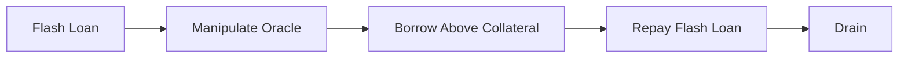

# DeFi 被黑复盘（Euler / Cream / bZx / Beanstalk / Mango / BadgerDAO）

> 📁 **完整时间线档案**：每起事件的独立深度复盘见 [`08-security-incidents/`](../08-security-incidents/_index.md)——本文是跨事件模式综述，08 是时间线完整档案。

> **TL;DR**：2020-2023 年 DeFi 生态累计被盗 $50 亿+，本文精选六大典型案例展开 **根因 / 攻击步骤 / 链上痕迹 / 修复** 四维复盘：(1) **Euler 2023-03（$197M，后全额归还）**——`donateToReserves` 与 `liquidate` 不同健康因子计算导致自我清算套利；(2) **Cream 2021-10（$130M）**——yUSDVault 预言机把 LP token 价格推高后超额借出；(3) **bZx 系列 2020–2021（$55M+）**——闪贷 + Uniswap spot oracle 经典范式；(4) **Beanstalk 2022-04（$182M）**——无 timelock 的治理直接通过恶意 proposal；(5) **Mango Markets 2022-10（$117M）**——期货永续 oracle 被推高自借自抵；(6) **BadgerDAO 2021-12（$120M）**——Cloudflare 被钓鱼后前端注入恶意 approve。共同主题：**经济层（闪贷、预言机、健康因子、治理）远比代码层危险**，但补救手段已成熟（Chainlink + TWAP、timelock 48h+、Pausable、内生 liquidation protection）。

---

## 1. 背景与动机

DeFi 把金融业务全部搬上链，但传统金融里银行、清算所、监管是多层防御；DeFi 只有代码 + 经济激励。攻击者的套利空间在于：

- 同一资产多协议间套价；
- 闪贷 0 资本放大杠杆；
- 预言机报价滞后/可操纵；
- 治理代币快速集权；
- 前端 DNS / 供应链漏洞。

## 2. 核心原理（复盘方法论）

### 2.1 复盘结构化模板

每个事件按：**时间线 → 资金流 → 根因 → 智能合约层面问题 → 经济/运营层面问题 → 修复 → 行业启示**。

### 2.2 Euler（$197M，2023-03-13）

根因：`EToken.donateToReserves(amount)` 把用户余额转入 `reserveBalance`，但 **未同步更新该用户的 debt health**。攻击者：

1. 存入 30M DAI，获得 eDAI；
2. mint 自身，借 200M dDAI；
3. 用 `donateToReserves` 把 eDAI 捐给协议 → 用户 collateral = 0，但 debt = 200M；
4. `liquidate` 被另一账户调用，清算 discount 的 eToken 流向攻击账户；
5. 重复上述，总窃取 ETH 9.1k + DAI 36M + USDC 34M + wBTC 850。

合约层：流动性健康因子计算在两条路径上不一致。Euler 团队后期与攻击者谈判，攻击者 **全额归还**（可能因身份暴露、IP 追踪）。

修复：审计公司 Spearbit 协助；Euler V2 重构为 Vault Kit 模块化架构。

### 2.3 Cream Finance（$130M，2021-10-27）

根因：使用 `yUSD` Vault 的 LP token 作抵押，`yUSD.pricePerShare()` 可被攻击者通过直接捐赠 `USD` 到 Vault 拉高。攻击：

1. Maker 闪贷 500M DAI；
2. Mint 524M yUSD；
3. Direct send USD 让 pricePerShare 暴涨 ~2x；
4. 将 yUSD 存为抵押 → 借出 $130M；
5. 归还闪贷。

修复：抵押资产白名单中移除 rebase/pps-可操纵型 token。

### 2.4 bZx 系列（$55M+）

2020-02-15、2020-02-18 连续两次；2021-11-05 再一次。模式：闪贷 → 推高 sUSD/Kyber spot → iToken 持有者被稀释/攻击者超额借出。奠定了"闪贷 + 预言机操纵"的攻击模板。

### 2.5 Beanstalk（$182M，2022-04-17）

根因：协议治理用 `Stalk` 投票，且 **提案通过后立即执行无 timelock**。攻击：

1. Aave 闪贷 1B USDC + 0.35B DAI；
2. Curve 存入 3CRV、BEAN3CRV LP，换成 Stalk；
3. 投票通过恶意 proposal `Emergency Commit`；
4. Proposal 逻辑：转全部协议资产到攻击者；
5. 归还闪贷；净赚 $182M。

修复：治理必须 timelock（行业共识 24–72h）；敏感函数加人类可检查窗口。

### 2.6 Mango Markets（$117M，2022-10-11）

根因：Mango Perp 价格来自 Pyth 但通道窄。Avraham Eisenberg 用 ~$5M USDC 初始：

1. 开 MNGO 多仓（自己 vs 自己）；
2. 拉高现货 MNGO 价格（Pyth 跟随）；
3. Perp 账面盈利爆增；
4. 以此借出 $117M USDC/BTC/SOL 等。

此案还引发法律争议——他公开声称"highly-profitable trading strategy"，但被 DOJ 起诉并被判有罪（2024-04）。

修复：oracle 多源；limit 借款与 perp PnL 挂钩系数。

### 2.7 BadgerDAO（$120M，2021-12-02）

**前端供应链攻击**：攻击者社工拿到 Cloudflare API 账号，注入 JS 给 badger.com 页面，诱导用户 approve 恶意 spender。非合约漏洞。

修复：前端 Subresource Integrity、CI/CD isolation、Cloudflare 2FA、bug bounty。

### 2.8 参数与边界总览

| 事件 | 时间 | 损失 | 根因类别 | 恢复 |
| --- | --- | --- | --- | --- |
| bZx | 2020-02/2020-09 | $55M+ | 预言机 + 闪贷 | 部分恢复 |
| Harvest | 2020-10 | $33.8M | 预言机 | 无 |
| Cream V2 | 2021-10 | $130M | 抵押价可操纵 | 无 |
| BadgerDAO | 2021-12 | $120M | 前端 | 部分追回 |
| Beanstalk | 2022-04 | $182M | 治理 | 无 |
| Mango | 2022-10 | $117M | 预言机 | 部分法律追讨 |
| Euler | 2023-03 | $197M | 代码 | 全额归还 |

### 2.9 图示



## 3. 方法论结构 / 工具矩阵 / 工作流拓扑

### 3.1 事件复盘方法

| 阶段 | 输出 |
| --- | --- |
| Forensic Tx trace | Tenderly / Phalcon replay |
| Root cause analysis | 技术博客 |
| Fund tracing | Chainalysis / Arkham |
| Negotiation | 白帽渠道 / SEAL 911 |
| Public disclosure | PIR |
| Legal | FBI / 各地司法 |

### 3.2 工具矩阵

| 工具 | 用途 |
| --- | --- |
| Tenderly | Tx simulation / replay |
| Phalcon (BlockSec) | 交易分解 |
| DeFiHackLabs | Foundry PoC 合集 |
| Arkham | 地址 entity 标注 |
| Forta | 监控 |
| OZ Defender | 自动 pause |

### 3.3 工作流

```
Detect (Forta / RPC anomaly) → Classify (经济/代码/前端) → Pause → Notify CEX → Chain analysis → Negotiate → Postmortem → Fix
```

### 3.4 实现多样性（防御）

- 多 oracle 冗余；
- 多审计；
- 前端多 CDN / SRI hash；
- 治理分层（proposal threshold + timelock + guardian veto）。

### 3.5 接口

- **rekt news** 全文 API；
- **DefiLlama /api/hacks**：结构化损失数据；
- **DeFiHackLabs PoC 仓库**：每起事件提供 `forge test` 可复现脚本；
- **SlowMist hacked.slowmist.io** JSON 列表；
- **Chainalysis Reactor / Arkham**：资金追踪 API；
- **Phalcon transaction explorer**（BlockSec）：攻击交易步步分解；
- **Tenderly forks**：基于历史区块回放攻击场景。

### 3.6 攻击范式演化对复盘的启示

把这六大事件排成时间线可以看出一个明显规律：**单点漏洞驱动的事件逐年减少，多层联动事件逐年增多**。2020 的 bZx 是"闪贷 + spot oracle"二元组合；2022 的 Beanstalk 已经是"闪贷 + 治理 + emergency commit"三元组合；2023 的 Euler 是"健康因子 + 捐赠 + 清算"的逻辑一致性组合。这迫使防御方也必须转向多层：光做代码审计不足，必须要有 **经济模型审计 + 治理流程审计 + oracle 可靠性审计 + 前端运营审计** 的并行。Gauntlet、Chaos Labs、Block Analitica 这几家开始提供"经济审计服务"，补齐了传统代码审计留下的盲区。真实复盘的价值不在于重提故事，而在于提炼出下一个攻击范式的征兆——当某种防御开始普及（比如 timelock），攻击者就会把注意力转向它尚未覆盖的缝隙（比如 oracle / blind signing / multisig UI 欺骗）。

## 4. 关键代码 / 漏洞样例

Euler 关键（简化）：

```solidity
// eVault 捐赠 - 未调整 userHealth
function donateToReserves(uint256 subAccountId, uint amount) external {
    Assets memory assets = loadAssets(subAccountId);
    assets.balance -= amount;
    reserveBalance += amount;
    // 缺失：checkLiquidity(subAccount);
}
```

Beanstalk 提案（简化）：

```solidity
function emergencyCommit(uint proposalId) external {
    // 无 delay，当场执行 calldata
    (bool ok,) = target.call(data);
    require(ok);
}
```

DeFiHackLabs 有每起事件的可复现 PoC：

```bash
git clone https://github.com/SunWeb3Sec/DeFiHackLabs
cd DeFiHackLabs
forge test --match-contract EulerExp -vvvv
```

## 5. 演进与版本对比

| 年 | 被黑主模式 |
| --- | --- |
| 2020 | 闪贷 + spot oracle |
| 2021 | Cross-contract reentrancy |
| 2022 | 桥 + 治理 + 预言机 |
| 2023 | 编译器 bug（Curve vyper）+ 逻辑不一致（Euler） |
| 2024 | 交易所运营 / 硬件钱包 blind signing |
| 2025 | 多签 UI 欺骗（Bybit） |

## 6. 实战示例

用 Foundry 复现 Euler：

```bash
cd DeFiHackLabs/src/test/2023-03-13-EulerFinance
forge test -vvvv
```

## 7. 安全与已知攻击

本文即。

## 8. 与同类方案对比

行业复盘生态：rekt news（叙事）/ DeFiHackLabs（PoC）/ SlowMist blog / BlockSec。本文整合以结构化呈现。

## 9. 延伸阅读

- Rekt news 全部 post-mortem：<https://rekt.news>
- DeFiHackLabs：<https://github.com/SunWeb3Sec/DeFiHackLabs>
- SlowMist Hacked：<https://hacked.slowmist.io>
- Euler 官方复盘：<https://blog.euler.finance/carpe-diem-euler-finance-post-mortem-de97c09e8a59>

## 10. 术语表

| 术语 | 英文 | 释义 |
| --- | --- | --- |
| 闪贷 | Flash Loan | 单 Tx 无抵押借款 |
| 预言机 | Oracle | 链下价格 |
| 健康因子 | Health Factor | 抵押/借款比 |
| 治理攻击 | Governance Attack | 恶意提案被通过 |
| PIR | Post-Incident Review | 事后报告 |

---

*Last verified: 2026-04-22*
