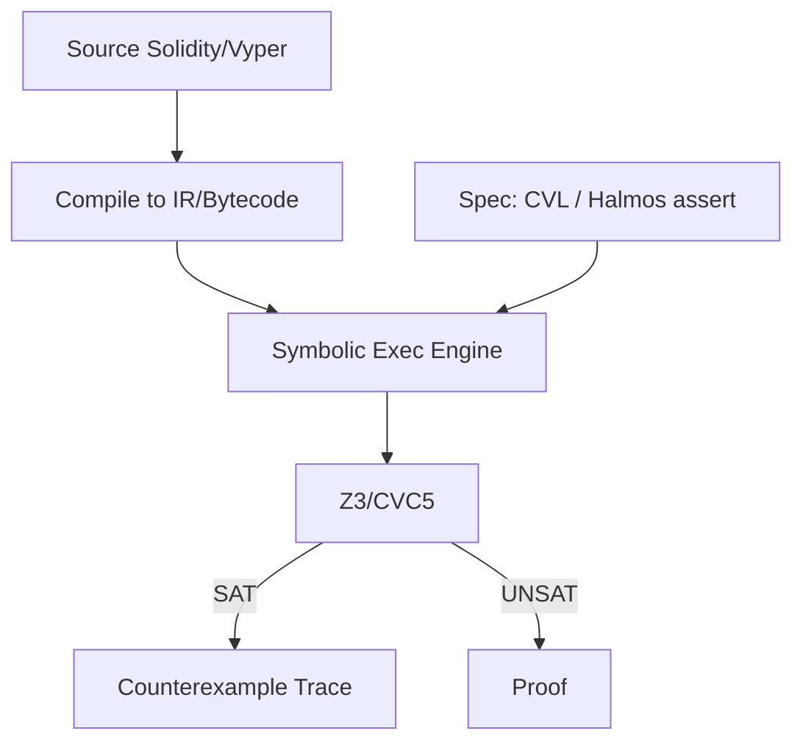

# 形式化验证（Certora / Halmos / K Framework / SMTChecker）

> **TL;DR**：形式化验证（FV）是对合约 **所有可能输入** 做数学证明的方法，相比 unit test 和 fuzz 更强。Web3 主流 FV 工具四类：(1) **Certora Prover**：商业化，用 **CVL（Certora Verification Language）** 写 rule/invariant，背后是 SMT + symbolic execution；Aave/Compound/MakerDAO/Lido 均在用；(2) **Halmos**（a16z crypto 开源）：直接把 **Foundry test** 翻译成符号路径探索，零学习成本；(3) **K Framework / KEVM / Kontrol**（Runtime Verification）：把 EVM 规范化为 K 语言，可证明字节码级性质；(4) **SMTChecker**（Solidity 内置）：编译器级轻量 SMT，可断言简单不变式。FV 的关键是 **写对 Spec**——规范本身错误时证明也是错的。本文给出四工具的形式化基础、CVL/Halmos/K 示例、典型限制（路径爆炸、循环 unroll、存储建模）以及经典案例（Compound cToken、Uniswap V3 TickMath、MakerDAO 清算）。

---

## 1. 背景与动机

Web2 软件崩溃可回滚；链上合约崩溃等于资金永久损失。FV 把这些风险转化为数学问题：如果 `I(Σ)` 是不变式，证明 `∀ Σ, ∀ input, I(δ(Σ, input))` 恒成立。2020 年 Certora 为 Compound cToken 证明 `totalSupply = Σ balances` 一类核心不变式；2023 年 a16z crypto 开源 Halmos，把 FV 入口降到了 Foundry 熟手可用的程度。

FV 在 Web3 已成为 **高 TVL 蓝筹的标配**：Aave V3、Compound V3、Lido、MakerDAO、Balancer V3 都含 Certora specs。

## 2. 核心原理

### 2.1 形式化基础

**Hoare 逻辑**：`{P} C {Q}` 表示若执行 `C` 前状态满足 `P`，执行后满足 `Q`。合约 FV 是对每个 public function 生成 `{Pre} fn {Post}` 并用 SMT 求解器证伪反例。

**Symbolic Execution**：用符号变量替代具体值，枚举所有可执行路径；遇到循环用 `unroll_N` 或 loop invariant 抽象。

**SMT Solvers**：背后使用 Z3、CVC5、Yices2 等 theory-capable solver。EVM storage 用 **Array theory**、整数用 **BitVector**（为精确）或 Integer（为效率）。

### 2.2 Certora Prover + CVL

Rule 示例：

```cvl
// totalSupply 守恒
invariant sumOfBalances()
    sum(balanceOf) == totalSupply()

rule transferPreservesSum(address a, address b, uint amt) {
    env e;
    mathint sumBefore = sum(balanceOf);
    transfer(e, a, b, amt);
    mathint sumAfter = sum(balanceOf);
    assert sumBefore == sumAfter;
}
```

Certora 通过 `certoraRun` CLI 上传合约 + spec 到云端（或自托管），返回 violation trace。支持 hooks 钩住 storage 读写、ghost variables 追踪辅助量。

### 2.3 Halmos（a16z crypto）

Halmos 理念：**把 Foundry fuzz test 用符号执行跑一遍**。测试函数签名用 `check_` 前缀：

```solidity
// Halmos test
function check_transfer_sum(uint amt) public {
    uint before = token.totalSupply();
    token.transfer(bob, amt);
    assert(token.totalSupply() == before);
}
```

运行：

```bash
pip install halmos
halmos --match-test check_
```

Halmos 是 Foundry test 的 drop-in 扩展，适合增量采用。底层使用 Z3。

### 2.4 K Framework / KEVM / Kontrol

K 把 **EVM 字节码语义** 形式化为 K 规则，可对 **二进制** 做证明。Runtime Verification 基于此开发了 **Kontrol**（2023+），把 Foundry test 编译到 KEVM 做符号证明。适合 **对字节码级优化** 有高要求的场景（如 Vyper / Huff / inline asm）。

### 2.5 Solidity SMTChecker

内置，编译时加 `--model-checker-engine chc` 或 `bmc` 即可。适合简单不变式（无越界、除零、overflow）。局限：不支持复杂循环、跨合约调用。

### 2.6 参数与限制

| 参数 | Certora | Halmos | KEVM |
| --- | --- | --- | --- |
| Loop unroll | rule 内配置 | `--loop N` | 需定义 invariant |
| Timeout | 默认 300s/rule | 默认 300s | 较大 |
| 可扩展性 | 企业级 | 增量/开发者 | 重型 |
| 费用 | 付费 | 开源 | 开源 |

### 2.7 边界条件与失败模式

- **Spec 错误**：验证了错的性质（"正确地证明一件不重要的事"）；
- **路径爆炸**：高复杂度函数超时；
- **存储抽象不够精细**：导致误报；
- **外部调用**：Certora 支持 `DISPATCHER`，Halmos 需 mock；
- **编译器语义滞后**：Cancun 的 tstore/tload 在工具里需时间跟进。

### 2.8 图示



## 3. 方法论结构 / 工具矩阵 / 工作流拓扑

### 3.1 分层

| 层 | 代表 | 适用 |
| --- | --- | --- |
| 编译器 | SMTChecker | 简单断言 |
| 测试工具 | Halmos, Kontrol | Foundry 用户 |
| 高保证 | Certora | 蓝筹协议 |
| 字节码 | KEVM | 最严格 |

### 3.2 工具矩阵

| 工具 | 输入 | Spec 语言 | 后端 |
| --- | --- | --- | --- |
| Certora | Sol/Yul | CVL | SMT |
| Halmos | Sol (forge) | Sol assert | Z3 |
| Kontrol | Sol (forge) | K | KEVM |
| hevm | Sol/Yul | dapp syms | SMT |
| Manticore | bytecode | Python scripts | SMT |
| SMTChecker | Sol | require/assert | Z3/Eldarica |

### 3.3 端到端工作流

```
写 unit test → 引入 Halmos check → 起草不变式 CVL → Certora CI → 合规 → 监控 
```

### 3.4 实现多样性

- 4 家商业/开源 FV 商，互相校验降低单点错误；
- 开源 `runtimeverification/evm-semantics` 可与商业 Certora 互补。

### 3.5 接口

- **Certora CLI + CI**（GitHub Action）：`certoraRun` 触发云验证；
- **Halmos CLI**，与 forge 共用 out artifacts；`halmos --match-test check_`；
- **KEVM CLI + Docker**：本地运行 K 框架；
- **hevm**（DappHub 后继）：可独立运行 symbolic 证明；
- **Manticore**：Trail of Bits 通用 symbolic 引擎；
- **Z3 / CVC5 / Bitwuzla**：可作为后端 SMT solver。

### 3.6 引入 FV 的组织化路线图

对真实团队而言，从 0 走到 FV 覆盖是渐进过程。推荐路线：第 1 个月把 Foundry fuzz 跑起来（`forge test -vv` + invariant runs=10k）；第 2 个月引入 Echidna 做 property 测试，挑 1–2 个核心模块写 invariant；第 3 个月安装 Halmos，对同批 invariant 做 symbolic 检查，找出 fuzz 未覆盖的路径；第 6 个月开始写 Certora CVL 规则，优先核心货币功能（transfer 守恒、accounting 一致性）。对 Aave/Compound 级别的协议，Certora 团队会派 engagement manager 常驻 4–8 周协助规范化。引入成本：工具与服务费每年约 $50k–$500k，但对 TVL 超过 $100M 的协议来说 ROI 极高——一次避免漏洞即覆盖多年费用。此外，FV 的产出（CVL 规则集、Halmos check 函数）是协议团队最重要的"活规范"资产，新功能迭代时直接跑 spec 即可知是否违反既有不变式，显著降低 regression 风险。

## 4. 关键代码 / 实现细节

Certora 真实示例（Compound V3）：

```cvl
// https://github.com/compound-finance/comet/tree/main/spec
rule integrityOfSupply(address asset, uint amount, address account) {
    env e;
    uint balBefore = balanceOf(e, account);
    supply(e, asset, amount);
    uint balAfter = balanceOf(e, account);
    assert balAfter >= balBefore;
}
```

Halmos 示例 (from a16z crypto blog)：

```solidity
function check_isolatedWithdraw(address user, uint256 amt) public {
    vm.assume(token.balanceOf(user) >= amt);
    uint before = token.balanceOf(address(this));
    vm.prank(user); token.withdraw(amt);
    assert(token.balanceOf(address(this)) == before - amt);
}
```

## 5. 演进与版本对比

| 年 | 里程碑 |
| --- | --- |
| 2018 | KEVM first release |
| 2019 | Certora 开始服务客户 |
| 2020 | Compound cToken Certora spec 上线 |
| 2022 | MakerDAO Endgame Certora 密集使用 |
| 2023 | a16z crypto 开源 Halmos |
| 2024 | Runtime Verification 推 Kontrol beta |
| 2025 | Aave V4 公开 CVL spec |

## 6. 实战示例

用 Halmos 验证 ERC20 transfer 守恒：

```bash
forge install a16z/halmos-cheatcodes
halmos --function check_transfer_sum --solver-timeout-branching 200
```

## 7. 安全与已知攻击

FV 的局限：
- **2022 Compound Prop 62**：审计 + FV 都做了，但 Prop 62 上线前未针对 new market 跑全量 rule；
- **2023 Euler**：FV 未覆盖 `donateToReserves` 与清算交互；
- **Spec 偏差**：Formal 证明"错误属性"的风险大于开发时估计。

## 8. 与同类方案对比

| 维度 | Fuzz | Formal |
| --- | --- | --- |
| 保证 | 概率 | 全量 |
| 成本 | 低 | 高 |
| 反例 | 具体 | 具体 trace |
| 可扩展 | 高 | 有限 |

## 9. 延伸阅读

- Certora Docs：<https://docs.certora.com>
- a16z Halmos 博客：<https://a16zcrypto.com/posts/article/symbolic-testing-with-halmos/>
- K Framework：<https://kframework.org>
- Runtime Verification Blog：<https://runtimeverification.com/blog>

## 10. 术语表

| 术语 | 英文 | 释义 |
| --- | --- | --- |
| 不变式 | Invariant | 任意状态恒成立的性质 |
| 规范 | Spec | 形式化描述的性质 |
| SMT | SMT | Satisfiability Modulo Theories |
| 反例 | Counterexample | 违反规范的输入路径 |
| 符号执行 | Symbolic Execution | 用符号变量枚举路径 |

---

*Last verified: 2026-04-22*
