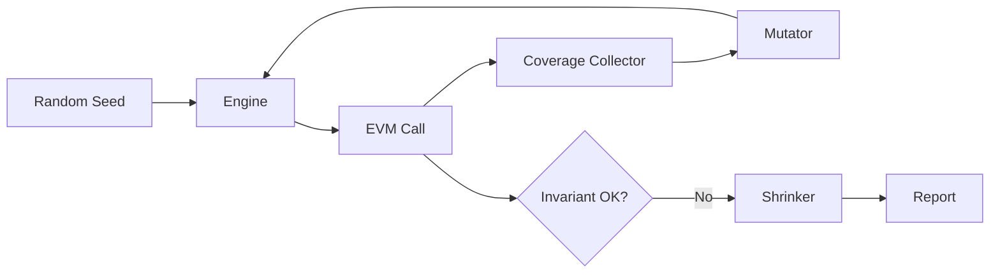

# 模糊测试与不变式测试（Echidna / Medusa / Foundry invariant）

> **TL;DR**：Fuzzing 以 **随机输入 + 覆盖引导** 发现 unit test 无法预设的边缘 case；结合 **invariant testing** 可定义"全局不变式"并在万级序列中搜索反例。Web3 主流三件套：(1) **Echidna**（Trail of Bits, Haskell）——性能 king，支持 AFL-style coverage guidance、shrinking、assertion/property mode；(2) **Medusa**（ToB 后继, Go）——Echidna 的 Go 重写 + go-ethereum 后端，支持 parallel worker 与 JSON corpus；(3) **Foundry invariant**（Solidity）——原生 forge 命令，handler-based 建模，社区最大。Fuzz 的核心是 **Handler 设计 + Invariant 定义 + Coverage**。本文拆解 property/assertion/invariant 三种模式、handler + ghost variable pattern、Actor-based fuzzing、如何从 unit test 进阶到 1B 次 run 的 campaign、以及 Uniswap V4 / Morpho / Aave 的真实 invariant spec。

---

## 1. 背景与动机

Unit test 只能覆盖作者想到的 case；合约漏洞常藏于意料之外的交互。Fuzzing 把测试工作量从"写 case"转为"写不变式"：定义"什么永远为真"，让引擎自动穷举。典型收益：

- Morpho Blue 用 Echidna 发现 Dutch auction 边界 bug（2023-Q4 audit report 披露）；
- Uniswap V4 用 Foundry invariant 与 Certora 双轨验证；
- Aave V3 用 Echidna + Certora 组合验证 eMode；

Trail of Bits 的 *Building Secure Contracts* 系列是事实教程（<https://secure-contracts.com/>）。

## 2. 核心原理

### 2.1 形式化：Property / Assertion / Invariant

- **Property-based**：`∀ inputs, P(output)` 成立（如 `sum_of_balances == totalSupply`）；
- **Assertion mode**：合约内 `assert(...)` 被 Fuzz 触发则失败；
- **Invariant**：多步交互后全局性质仍成立，Fuzz 会生成 **随机交易序列** 执行。

### 2.2 Coverage-guided Fuzzing

Echidna/Medusa 使用 **EVM trace coverage** 作为反馈：
- 每次 Tx 记录哪些 PC 被命中；
- 若新覆盖 → 保留到 corpus；
- 变异 corpus 继续探索。

### 2.3 Shrinking

找到反例后缩小到最小复现序列（Echidna 默认开启，减少 80% 噪音）。

### 2.4 Handler Pattern（Foundry）

Foundry invariant 需要 **Handler 合约** 限制随机性：

```solidity
contract VaultHandler {
    Vault public vault;
    address[] public actors = [alice, bob, carol];

    function deposit(uint256 actorSeed, uint256 amt) external {
        address actor = actors[actorSeed % actors.length];
        amt = bound(amt, 0, 1e24);
        vm.prank(actor); vault.deposit(amt);
        ghost_totalDeposited += amt;
    }
}
```

然后在 test 里：

```solidity
function invariant_totalAssetsGeDeposits() public {
    assertGe(vault.totalAssets(), handler.ghost_totalDeposited());
}
```

### 2.5 Actor-based + Multi-handler

多 handler 协作模拟真实用户群（借贷、偿还、清算）。Morpho、Euler 使用此 pattern。

### 2.6 参数与常量

| 工具 | Runs | Seed | Parallelism |
| --- | --- | --- | --- |
| Foundry fuzz | `runs=256`（默认）可调 | via flag | single |
| Foundry invariant | `runs=256, depth=500` | via flag | single per test |
| Echidna | `testLimit=50000`（默认） | `seed=N` | 1 worker；`--workers N` with campaign mode |
| Medusa | `testLimit=unlimited` | config | multi |

### 2.7 边界与失败模式

- **Handler 太宽松**：引擎无法命中实质状态；
- **Handler 太限制**：漏掉攻击路径；
- **Gas 耗尽**：单 Tx 复杂时 fuzz 速度骤降；
- **Oracle 难以 fuzz**：需 mock；
- **Ghost 变量 drift**：invariant 本身错，证明假阳/假阴；
- **Non-determinism**：blockhash、block.timestamp 需控制。

### 2.8 图示



## 3. 方法论结构 / 工具矩阵 / 工作流拓扑

### 3.1 测试层次

| 层 | 工具 | 目的 |
| --- | --- | --- |
| Unit | forge test | 单函数 |
| Fuzz | forge fuzz | 单函数随机输入 |
| Invariant | forge invariant / Echidna / Medusa | 多步全局 |
| Formal | Certora / Halmos | 全路径 |

### 3.2 工具矩阵

| 工具 | 语言 | 速度 | 主要场景 |
| --- | --- | --- | --- |
| Echidna | Haskell | 10k–100k tx/s | 高 throughput campaign |
| Medusa | Go | 类 Echidna，多核 | 大规模 parallel |
| Foundry fuzz | Rust | 中 | 开发者友好 |
| Foundry invariant | Rust | 中 | handler-based |
| Woke/Wake fuzz | Python | 慢 | Python 集成 |
| hevm symbolic | Haskell | 极慢但精确 | 符号扩展 |

### 3.3 工作流

```
写业务合约 → 写 unit test → 抽象 invariants → 写 Handler(s) → 
forge invariant 小跑 → Echidna/Medusa 大跑（CI nightly 数小时） → 
覆盖率报告 → 补 handler → 再跑
```

### 3.4 实现多样性

Echidna + Medusa + Foundry 是三种独立实现，多轨可交叉验证。

### 3.5 对外接口

- **Corpus JSON/TOML（Medusa）**：可在 CI 之间共享种子，加速长期 campaign；
- **Foundry coverage** `forge coverage --report lcov`：可合并到 CodeCov；
- **Echidna event log**：`--corpus-dir corpus/` 支持外部 re-use；
- **Perimeter Protocol fuzzing harness 模板**：<https://github.com/perimetersec/fuzzing-tutorials>；
- **Chimera**（Recon）：把 Foundry 测试套件一键迁移到 Echidna/Medusa；
- **fuzz-utils / hevm**：旁路工具。

### 3.6 从 unit test 到 1B-run campaign 的组织路径

真实团队引入 fuzzing 的渐进路线：第 1 步，所有新合约强制 `forge test --fuzz-runs 10000` 作为 PR 门禁；第 2 步，挑出核心模块（如 Vault.sol、Oracle.sol）建立 Handler，启动 Foundry invariant，每次 PR 跑 depth 500 runs；第 3 步，把 invariants 迁移到 Echidna 每晚 nightly 跑 1 小时；第 4 步，主网部署前做 24 小时大型 campaign（Echidna workers=8 或 Medusa 多核），覆盖率要求 ≥ 90% 业务路径；第 5 步，上线后把 corpus 持续维护——发现新 bug 或新功能时都 extend handlers。Morpho 和 Euler V2 公开了他们的 fuzz suite，可作模板参考。Fuzz 的最大价值不在于"发现多少 bug"，而在于 **把测试思维从用例驱动转向不变式驱动**——一旦团队习惯于先写 invariant、再写实现，代码质量会系统性提升。此外，fuzz 与 formal verification 有天然协同：fuzz 找到反例快，FV 做完整证明慢；二者联用时 FV 可把 fuzz 证不出来的边界状态穷举完。

## 4. 关键代码 / 实现细节

Echidna config:

```yaml
# echidna.yaml
testMode: assertion
testLimit: 500000
corpusDir: corpus
coverage: true
workers: 4
```

Foundry invariant test:

```solidity
// https://github.com/foundry-rs/forge-std 示例
contract VaultInvariants is Test {
    VaultHandler handler;
    function setUp() public {
        handler = new VaultHandler(new Vault());
        targetContract(address(handler));
    }
    // 总资产 >= 用户总存款 - 已提取
    function invariant_solvency() public view {
        assertGe(handler.vault().totalAssets(),
                 handler.ghost_totalDeposited() - handler.ghost_totalWithdrawn());
    }
}
```

## 5. 演进与版本对比

| 年 | 工具 |
| --- | --- |
| 2019 | Echidna 1.0 |
| 2020 | Echidna 2.0 assertion/property mode |
| 2022 | Foundry invariant 进入 stable |
| 2023 | Medusa beta |
| 2024 | Echidna + Medusa 互通 corpus |
| 2025 | Morpho Blue 公开 invariant suite 成为最佳实践 |

## 6. 实战示例

快速起 Echidna：

```bash
docker run -v $(pwd):/src ghcr.io/crytic/echidna:latest echidna /src/contracts/Vault.sol --test-mode assertion
```

快速起 Medusa：

```bash
medusa fuzz --config medusa.json --timeout 3600
```

## 7. 安全与已知攻击

Fuzz 的局限：
- **发现靠运气**：若未覆盖路径永远无感；
- **Handler 误设**：bounded 不当屏蔽真实漏洞；
- **状态爆炸**：DeFi 多合约组合 depth 过大时运行极慢。

真实案例：Morpho 用 Echidna 发现 `LiquidationIncentive` bonus 边界（audit report #PR-0038）。

## 8. 与同类方案对比

| 维度 | Fuzz | FV | 手工审计 |
| --- | --- | --- | --- |
| 自动 | 高 | 中 | 低 |
| 保证 | 概率 | 全量 | 看人 |
| 维护 | Handler 需更新 | Spec 需更新 | — |

## 9. 延伸阅读

- Trail of Bits *Building Secure Contracts*：<https://secure-contracts.com/>
- *Perimeter Protocol* tutorials：<https://github.com/perimetersec/fuzzing-tutorials>
- Morpho Blue invariant tests：<https://github.com/morpho-org/morpho-blue/tree/main/test/forge/invariant>
- Echidna book：<https://github.com/crytic/echidna/blob/master/docs/README.md>

## 10. 术语表

| 术语 | 英文 | 释义 |
| --- | --- | --- |
| 不变式 | Invariant | 交互后恒成立 |
| Handler | Handler | 限制调用空间的封装 |
| Corpus | Corpus | 有价值的输入集 |
| Shrink | Shrink | 缩小反例 |
| Property | Property | `∀ input` 断言 |

---

*Last verified: 2026-04-22*
