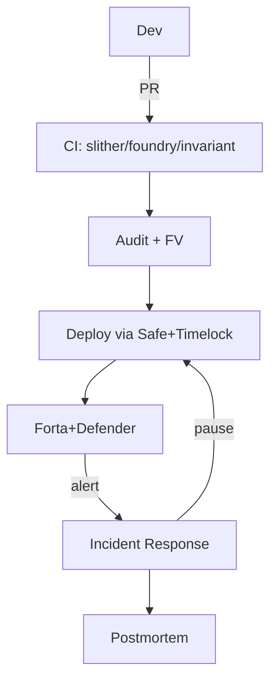

# 安全最佳实践（CEI / Guard / Invariant / Upgrade / Monitoring / Incident Response）

> **TL;DR**：本文把"不要被黑"拆成可执行的 7 层清单：(1) **编码守则**：CEI、Pull over Push、SafeCast、`nonReentrant`、`_disableInitializers()`、EIP-712 域分离；(2) **权限最小化**：Ownable2Step + TimelockController + AccessControl；(3) **升级策略**：UUPS vs Transparent vs Beacon、storage gap、`__gap` 保留槽；(4) **不变式驱动开发**：写 test 前先写 invariants（Foundry invariant + Echidna 双轨）；(5) **监控**：Forta bots + Tenderly Alerts + Hypernative + Chainalysis；(6) **应急响应**：Pause、Guardian、War-room SOP、SEAL 911 + Immunefi 白帽谈判；(7) **治理与运营**：multisig（Safe）+ HSM + 分工 + SOC2。全文以 OpenZeppelin Defender v2 + Safe + Forta 为参考实现，覆盖从 `forge init` 到主网运营的完整生命周期。

---

## 1. 背景与动机

每起 DeFi 被黑事件的"事后修复"几乎都能归到本文列出的 7 层里。若开发团队在上线前按此清单实施，可将 70% 以上已知类型的漏洞消除（a16z 2023 估算）。

## 2. 核心原理

### 2.1 编码守则（Coding Standards）

**CEI（Checks-Effects-Interactions）**：先校验、后更新状态、最后外部调用。OZ `ReentrancyGuard` 作为兜底。

```solidity
function withdraw(uint256 amt) external nonReentrant {
    require(bal[msg.sender] >= amt, "no funds"); // Check
    bal[msg.sender] -= amt;                       // Effect
    (bool ok,) = msg.sender.call{value: amt}(""); // Interaction
    require(ok);
}
```

**Pull over Push**：避免批量 Push 支付中单点 revert 卡住全部；采用 `claim()` 由接收方发起。

**SafeCast**：`uint256 → uint128` 用 `SafeCast.toUint128`。

**EIP-712**：所有链下签名 payload 用 `_hashTypedDataV4`，绑定 `chainId + verifyingContract`，避免跨链重放。

**Initializer 封装**：对 OZ Upgradeable 合约，构造函数中调用 `_disableInitializers()`，防止 implementation 被任意 init（Wormhole 2022-02 之前同问题）。

### 2.2 权限最小化

- **EOA 不做 admin**：用 Safe 多签；
- **Role-based**（OZ `AccessControl`）：`MINTER_ROLE`、`PAUSER_ROLE` 分离；
- **Ownable2Step**：两步交接，防止 typo；
- **Timelock**：敏感函数用 `TimelockController`（OZ 标准），行业推荐 >= 24h；
- **Guardian**：紧急 pause 单签可 veto，但撤销仍需 timelock。

### 2.3 升级策略

三种主流 proxy pattern：

| Pattern | admin 存储 | 优 | 劣 |
| --- | --- | --- | --- |
| Transparent | admin 在 proxy slot | 简单 | gas 略高 |
| UUPS | upgrade 在 implementation | gas 低 | impl 误删 `upgradeTo` 就砖 |
| Beacon | 多合约共享 | 集群管理 | 单点 beacon 风险 |

**Storage gap**：`uint256[50] __gap;` 在 base contract 尾部保留槽，后续升级扩字段不撞布局。

**Selfdestruct 风险**：Parity Multisig #2。implementation 必须 `_disableInitializers()`。

### 2.4 不变式驱动开发（IDD）

写业务前先写 invariants：

```
- totalSupply == sum(balanceOf)
- totalCollateralUSD >= totalDebtUSD * LT
- queueLength monotonically nondecreasing
- 在任何时刻 pause=true 时 mint/withdraw 均 revert
```

用 Foundry invariant + Echidna 双轨，每次 CI 跑 ≥ 10k runs。

### 2.5 监控

运行时信号：
- TVL 异常波动；
- Oracle 价格偏离 ≥ 2%；
- Function 调用频率尖峰；
- Role 变更事件；
- 新 contract 部署。

工具：
- **Forta**（<https://forta.org>）：Bot + SDK，订阅主网事件，触发 webhook；
- **Tenderly Alerts**：RPC + 规则；
- **OpenZeppelin Defender v2**：Sentinel（监控）+ Autotask（动作）+ Multisig relay；
- **Hypernative / Chaos Labs**：商业化风控；
- **Chainalysis KYT**：与 CEX 对接冻结。

### 2.6 应急响应（Incident Response）

SOP（借鉴 SEAL 911 + OpenZeppelin 推荐）：

1. **Detect**：监控告警 / 白帽报告 / 社媒发现；
2. **Triage**：P1/P2/P3 分级；确认规模；
3. **Contain**：Pause、暂停 oracle updater、撤销 approve；
4. **Communicate**：Twitter + Discord 公告，避免恐慌；
5. **Negotiate**：SEAL 911 Discord 联络（<https://securityalliance.org>），提出 10% 白帽奖金；
6. **Forensic**：Tenderly trace + Chainalysis；
7. **Recover**：通过 governance 赎偿用户 / 用 treasury；
8. **Postmortem**：72h 内发布 PIR；6 个月内 retro。

### 2.7 治理与运营

- **多签**：Safe（原 Gnosis Safe）5/7、7/9；分布多地多硬件；
- **HSM / MPC**：Fireblocks / Copper / Anchorage 托管关键签名；
- **SOC2**：面向机构客户的运营合规；
- **Bug Bounty**：Immunefi 上至少 Critical 10% TVL cap（常 2M–10M）。

### 2.8 参数 / 阈值

| 项 | 推荐值 |
| --- | --- |
| Timelock | ≥ 24h（DeFi 蓝筹 48h） |
| 多签阈值 | ≥ 5/7 |
| Oracle freshness | ≤ 1h |
| Pause 可撤销 | 48h 自动恢复 |
| Bug bounty Critical | ≥ 10% TVL，cap $2M+ |
| Audit 覆盖 | 至少 2 家 |

### 2.9 边界条件

- **Timelock 太短**：攻击者抢先；**太长**：真实漏洞修复延迟；
- **Pause 滥用**：admin 可冻结资产；
- **Monitoring 误报**：搞疲劳；
- **多签 UI 欺骗**：签名者 blind sign（Bybit 2025）。

### 2.10 图示



## 3. 方法论结构 / 工具矩阵 / 工作流拓扑

### 3.1 生命周期分层

| 阶段 | 责任 | 工具 |
| --- | --- | --- |
| Design | Threat model | Attack tree, Certora spec |
| Code | CEI/RG/AC | OZ, Solady |
| Test | Fuzz+Invariant | Foundry, Echidna |
| Audit | 外审 | ToB, OZ, C4 |
| Deploy | Safe+Timelock | Safe, OZ Defender |
| Monitor | Bot | Forta, Tenderly |
| Respond | SOP | SEAL 911, Defender Autotask |

### 3.2 工具矩阵

| 需求 | 工具 |
| --- | --- |
| 多签 | Safe |
| Timelock | OZ TimelockController |
| 监控 | Forta, Tenderly, Hypernative |
| Pause | OZ Pausable, Guardian |
| 升级 | UUPS / Transparent + OZ Upgrades |
| Bug Bounty | Immunefi, HackenProof |
| Incident | SEAL 911, OZ Defender |

### 3.3 工作流拓扑

```
feature branch --PR--> CI(slither+fuzz) --review--> main 
   --audit--> mitigation --> re-audit --> main 
   --Safe propose--> timelock --> execute 
   --Forta bot watch-->  (alert) --> pause --> SEAL 911 --> fix
```

### 3.4 实现多样性

OZ / Solady / Solmate 三套 base contracts；Safe / Squads / Gnosis 多种多签；Forta / Tenderly / Defender 多监控。

### 3.5 对外接口

- **Safe Transaction Service REST**：多签历史、pending tx、owner 列表；
- **Forta bot manifest**：声明式触发条件；
- **Defender v2 GraphQL**：Sentinel/Autotask/Relayer 统一 API；
- **Immunefi program JSON**：bug bounty 计划机读；
- **SEAL 911 Discord webhook**：紧急联络；
- **Tenderly Alerts API**：自定义规则；
- **Chainalysis KYT webhook**：洗钱行为标识。

### 3.6 运营成熟度模型（Maturity Model）

借鉴 SOC-CMM 思想，协议安全运营可按五级评估：L1（Ad-hoc）：仅合约审计，无监控；L2（Defined）：Timelock + 多签 + Bug Bounty；L3（Managed）：Forta/Tenderly 24x7 监控 + Pause 能力 + SOP 文档；L4（Measured）：每季度 incident drill + KPI（MTTD/MTTR/假阳率）+ 第三方定期复审；L5（Optimizing）：主动红队、持续 FV、经济建模、与 CEX 多国合规对接。目前行业蓝筹（Aave、Lido、Uniswap）在 L4 附近；中小协议多在 L2。投资人、CEX 上币委员会、机构客户已开始以运营成熟度作为尽调维度。团队在 Day 1 就把 L3 能力跑起来，比上线后再补更便宜——尤其是 Pause 与 Guardian 的设计，牵涉合约字段必须初始化时就留好位。此外，监控不要只看自家合约，还应订阅 **依赖协议**（Chainlink oracle、Uniswap pool、抵押 token）的异常事件，避免上游风险传染。

## 4. 关键代码 / 实现细节

OpenZeppelin UUPS 合约模板：

```solidity
// https://docs.openzeppelin.com/contracts/5.x/upgradeable
import "@openzeppelin/contracts-upgradeable/proxy/utils/UUPSUpgradeable.sol";
import "@openzeppelin/contracts-upgradeable/access/AccessControlUpgradeable.sol";

contract VaultV1 is UUPSUpgradeable, AccessControlUpgradeable {
    bytes32 public constant UPGRADER_ROLE = keccak256("UPGRADER_ROLE");

    /// @custom:oz-upgrades-unsafe-allow constructor
    constructor() { _disableInitializers(); }

    function initialize(address admin) public initializer {
        __AccessControl_init();
        _grantRole(DEFAULT_ADMIN_ROLE, admin);
        _grantRole(UPGRADER_ROLE, admin);
    }
    function _authorizeUpgrade(address) internal override onlyRole(UPGRADER_ROLE) {}

    uint256[50] private __gap;
}
```

Forta bot（JS）骨架：

```ts
// https://docs.forta.network/en/latest/
import { HandleTransaction, TransactionEvent, Finding, FindingSeverity, FindingType } from 'forta-agent';
export const handleTransaction: HandleTransaction = async (txEvent: TransactionEvent) => {
  const findings: Finding[] = [];
  if (txEvent.to?.toLowerCase() === VAULT && txEvent.transaction.value.gt(1e20)) {
    findings.push(Finding.fromObject({
      name: 'Large withdraw', severity: FindingSeverity.High, type: FindingType.Suspicious, ...
    }));
  }
  return findings;
};
```

## 5. 演进与版本对比

| 年 | 最佳实践 |
| --- | --- |
| 2017 | Consensys Best Practices v1 |
| 2019 | Trail of Bits Secureum course |
| 2021 | OpenZeppelin Defender v1 |
| 2023 | SEAL 911 + Immunefi v2.3 |
| 2025 | Defender v2 + EIP-7702 aware |

## 6. 实战示例

10 分钟起一个"安全合规"项目骨架：

```bash
forge init my-protocol
cd my-protocol
forge install OpenZeppelin/openzeppelin-contracts
forge install foundry-rs/forge-std
# 配置 CI: slither, echidna, invariants
# 使用 Safe 多签部署
# 注册 Immunefi program
# 部署 Forta monitor bot
```

## 7. 安全与已知攻击

本文即。已见反例：项目不用 timelock（Beanstalk）、不用 multisig（Ronin auto-approve）、前端无 SRI（BadgerDAO）。

## 8. 与同类方案对比

| 方案 | 覆盖 |
| --- | --- |
| 本文 | 编码+运营+响应全链路 |
| ConsenSys BP | 以编码为主 |
| Secureum | 以教育为主 |
| SEAL 911 | 以响应为主 |

## 9. 延伸阅读

- ConsenSys Best Practices：<https://consensys.github.io/smart-contract-best-practices/>
- ToB *Building Secure Contracts*：<https://secure-contracts.com>
- OpenZeppelin Defender Docs：<https://docs.openzeppelin.com/defender/v2/>
- SEAL 911：<https://securityalliance.org/>
- Immunefi Severity Scale v2.3：<https://immunefi.com/severity-standard/>

## 10. 术语表

| 术语 | 英文 | 释义 |
| --- | --- | --- |
| CEI | Checks-Effects-Interactions | 三段式编码 |
| RG | ReentrancyGuard | 重入锁 |
| Timelock | Timelock | 延迟执行 |
| IR | Incident Response | 应急响应 |
| PIR | Post-Incident Review | 事后复盘 |
| SOC2 | SOC2 | 运营合规 |

---

*Last verified: 2026-04-22*
