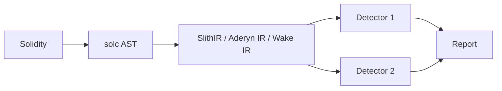

# 静态分析工具（Slither / Mythril / Aderyn / Wake）

> **TL;DR**：静态分析（Static Analysis, SA）在不执行合约的情况下从源码/字节码发现漏洞，是 CI 门禁第一道防线。主流四件套：(1) **Slither**（Trail of Bits, Python）——基于 SlithIR 中间表示，90+ detector，业界事实标准，速度秒级，支持 `--print` 打印继承/调用图/storage 布局；(2) **Mythril**（ConsenSys, Python）——Symbolic execution + taint analysis，覆盖 SWC Top，适合深路径但耗时；(3) **Aderyn**（Cyfrin, Rust）——Rust 实现的新生代 linter，速度快、可自定义检测器、输出 Markdown 报告，生态正在追赶；(4) **Wake**（Ackee, Python）——集静态 + fuzz + test runner 的 all-in-one，VSCode 插件深度集成。老牌但减速的 **Mythx / Securify / SmartCheck** 已逐步被上述取代。本文详述各工具架构（IR 选择、检测器分类）、CI 集成（GitHub Action、pre-commit）、误报与应对。

---

## 1. 背景与动机

人类审计师阅读速度 ~500 LoC/day，而现代 DeFi 协议动辄 10k+ LoC。静态分析把常见 pattern（重入、未初始化、shadowing、危险 API）抽象为可机读规则，秒级扫描 + 可重复 → 适合每次 PR 跑。它不是 silver bullet：误报率存在，且对经济层/跨合约语义能力弱。

静态分析在 Web3 的黄金十年：
- 2018 Slither 发布；
- 2019 MythX（Mythril 商业化）服务 ConsenSys Diligence；
- 2023+ 新生代 Rust 工具（Aderyn、Caracal for Cairo、Woke/Wake）。

## 2. 核心原理

### 2.1 静态分析的形式化

给定源码 `P`，定义其 **控制流图（CFG）** `G = (V, E)` 与 **数据流方程** `out(n) = f_n(in(n))`，检测器 `D` 是对 `G + data-flow facts` 的 pattern match。

### 2.2 Slither 架构

**SlithIR**：Trail of Bits 把 Solidity AST 降到 SSA-form IR，每条指令最多一次赋值。在 IR 上检测器如 `reentrancy-eth` 逻辑：

1. 搜集所有调用外部 `call`/`send`/`transfer` 指令；
2. 检查此调用后是否存在对 storage 的 SSTORE；
3. 若存在且未被 `nonReentrant` 修饰器保护 → 报 High。

支持 90+ detector（截至 v0.10.x），分为 High/Medium/Low/Informational。

### 2.3 Mythril 架构

**Symbolic execution + SMT**：用 Z3 explore EVM 字节码路径，模拟 `CALL` / `SSTORE` 等副作用，对每个路径生成 **约束集**，检查 SWC 类违例（如 `tx.origin`、`reentrancy`、`assert violation`）。劣势：路径爆炸；优势：能挖更深的 bug。

### 2.4 Aderyn（Cyfrin）

**Rust AST 遍历**：基于 `solc_parser`，把 AST 转入自家 IR `WorkspaceContext`，detector 以 `struct impl` 形式注册。开箱即用检测器 40+ 覆盖高频 pattern（unused state var、missing events、centralization risk）。输出 Markdown 报告，默认写到 `report.md`。

### 2.5 Wake（Ackee Blockchain）

**All-in-one**：检测器 + fuzz（基于 Wake.testing）+ Solidity LSP。在 VSCode Ackee 插件下提供实时 hover hints。其 `wake detect` 子命令覆盖 Slither 常见检测 + 一些原创（如 storage gap proxy、dangerous unicode）。

### 2.6 参数与常量

| 工具 | 运行时长（10k LoC） | 语言 | 后端 |
| --- | --- | --- | --- |
| Slither | 3–30s | Python 3.10+ | AST/SlithIR |
| Mythril | 5–30min | Python 3.10+ | EVM symbolic |
| Aderyn | 1–10s | Rust | AST |
| Wake | 10–120s | Python 3.10+ | AST + IR |

### 2.7 边界条件与失败模式

- **跨合约语义**：静态工具对跨合约 state 变化能力弱；
- **编译器升级滞后**：Cancun/Prague 新 opcode 检测器需要跟进；
- **误报**：Slither 的 `reentrancy-benign` 多是 informational；
- **漏报**：只能检测已编码 pattern，新 bug 类不会被发现；
- **Yul / inline asm**：部分检测器对 assembly 不透明。

### 2.8 图示



## 3. 方法论结构 / 工具矩阵 / 工作流拓扑

### 3.1 分层

| 层 | 角色 |
| --- | --- |
| Linter 层 | forge fmt + solhint |
| AST 静态 | Slither / Aderyn / Wake |
| 符号执行 | Mythril / hevm |
| Runtime | Forta |

### 3.2 工具矩阵

| 工具 | 开源 | CI 集成 | 特色 |
| --- | --- | --- | --- |
| Slither | ✓ | GA + pre-commit | detector 最多 |
| Mythril | ✓ | GA | symbolic 最强 |
| Aderyn | ✓ | GA | Rust 极速 |
| Wake | ✓ | CLI | LSP + fuzz |
| Semgrep Sol | ✓ | GA | 自定义 pattern |
| 4naly3er | ✓ | CLI | 由 Code4rena warden 写的 gas opt focus |

### 3.3 CI 工作流

```
Push → GitHub Action runs:
  - forge build && forge test
  - slither . --config .slither.json
  - aderyn . --scope src/
  - (optional) mythril analyze target/**.sol
  - upload report artifact
```

### 3.4 实现多样性

Python（Slither/Mythril/Wake）+ Rust（Aderyn）+ Semgrep = 三种独立实现，互相补充。

### 3.5 对外接口

- **SARIF 输出**（Slither 支持 `--sarif`）可上传 GitHub Code Scanning；
- **JSON 输出**给自动化 triage 与 ticket 自动开 issue；
- **`slither-check-upgradeability`**：专用 proxy 检查器，校验 Transparent/UUPS storage layout；
- **`slither-read-storage`**：从 on-chain 地址读取 storage layout；
- **Semgrep Solidity pack**：自定义 pattern（YAML-style），便于团队内部规则积累；
- **Aderyn JSON + Markdown**：报告格式可嵌入 PR comment；
- **4naly3er**：额外 gas opt 建议可附加到审计报告。

### 3.6 把静态分析做好的组织化 pattern

静态工具最常见的失败不是"没装工具"而是"警告太多被忽略"。推荐做法：第 1，把规则集 **分层**——High 错误阻塞 PR，Medium 需二人 review，Low/Informational 仅入日志；第 2，维护 **白名单**：`.slither.json`/`.aderynrc` 里明确标记已知不适用的检查项并附原因；第 3，新 PR 只报告新增问题，不报历史遗留（`--compare-to main` 模式），避免 noise；第 4，每 6 个月跑一次"全量扫描 + 人工复审"，借此发现之前被忽略但如今变得重要的 pattern；第 5，和 fuzz/FV 结合：静态工具找面、fuzz/FV 找深。此外，内部团队应该 **贡献回开源**——在自己合约里发现工具漏报时把案例写成 detector 回馈 Slither/Aderyn 上游，长期提升行业基线。

## 4. 关键代码 / 实现细节

GitHub Action 模板：

```yaml
# .github/workflows/security.yml
name: security
on: [pull_request]
jobs:
  slither:
    runs-on: ubuntu-latest
    steps:
      - uses: actions/checkout@v4
      - uses: crytic/slither-action@v0.4.0
        with:
          target: '.'
          slither-args: '--exclude-informational --sarif slither.sarif'
      - uses: github/codeql-action/upload-sarif@v3
        with: { sarif_file: slither.sarif }
  aderyn:
    runs-on: ubuntu-latest
    steps:
      - uses: actions/checkout@v4
      - uses: Cyfrin/aderyn-action@v0.4.0
```

参考仓库：
- `crytic/slither`: <https://github.com/crytic/slither>
- `Cyfrin/aderyn`: <https://github.com/Cyfrin/aderyn>

## 5. 演进与版本对比

| 年份 | 里程碑 |
| --- | --- |
| 2018 | Slither 0.1 |
| 2019 | Mythril integrated into MythX |
| 2022 | Slither 0.9 with new upgradeability checks |
| 2023 | Aderyn 0.1 launch |
| 2024 | Wake 4.x 全面重构 |
| 2025 | Slither 0.11 Cancun/Prague detector |

## 6. 实战示例

安装 + 跑 Slither：

```bash
pip install slither-analyzer
slither . --exclude-informational --exclude-low
# 输出: 2 High, 3 Medium, 5 Informational
```

## 7. 安全与已知攻击

静态分析本身也可能被"绕过"：
- **不透明 assembly**：检测器忽略 → 漏报；
- **虚假 `nonReentrant`**：自己实现的 modifier 不被识别 → Slither 可能漏报；
- **版本漂移**：solc 新版本特性未支持 → 编译失败或跳过文件。

## 8. 与同类方案对比

| 工具 | 优 | 劣 |
| --- | --- | --- |
| Slither | 成熟，高覆盖 | Python 慢于 Rust |
| Mythril | Symbolic 强 | 慢，误报 |
| Aderyn | 极速，Rust | 检测器少 |
| Wake | 集成度高 | 生态小 |

## 9. 延伸阅读

- Trail of Bits Slither 博客合集：<https://blog.trailofbits.com/category/slither/>
- *Not So Smart Contracts*：<https://github.com/crytic/not-so-smart-contracts>
- Aderyn 文档：<https://cyfrin.gitbook.io/aderyn>
- Wake 文档：<https://ackee.xyz/wake/docs>

## 10. 术语表

| 术语 | 英文 | 释义 |
| --- | --- | --- |
| 静态分析 | Static Analysis | 不执行下扫描 |
| 中间表示 | IR | 代码标准化形式 |
| 检测器 | Detector | 针对 pattern 的规则 |
| SARIF | SARIF | 标准静态分析报告格式 |

---

*Last verified: 2026-04-22*
