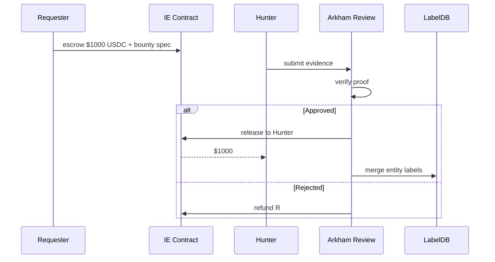

# Arkham 情报平台与 Intel Exchange

> **TL;DR**：Arkham Intelligence 2020 年由 Miguel Morel 创立，2023 年 ARKM 代币上线后迅速崛起，定位"de-anonymizing the blockchain"（给区块链去匿名化）。与 Nansen 的"标签库 + 仪表盘"不同，Arkham 更强调**实体解析图（Entity Resolution Graph）**：将地址聚类为"Persons/Companies/Funds/Exchanges"等实体，并在 **Visualizer**（交互式图谱）中展示资金流。**Intel Exchange** 是其创新卖点：用户可提交实体识别 Bounty（"确认 A 地址属于 B 实体得 1000 USDC"），由社区举证、DAO 式仲裁，最终标签入库。Arkham 还提供 Alerts、Wallet Analytics、Oracle（为 DeFi 提供 entity flag）。争议点：2023 年推出时的 referral 机制被质疑邀请用户互相爆料；Tornado Cash 制裁后其"reveal mixer users"功能引发隐私讨论。

## 1. 背景与动机

Nansen 占据高端机构交易员市场，但留下缝隙：

1. **长尾实体识别慢**：Nansen 的标签由内部团队维护，无法规模化。
2. **可视化弱**：传统表格型仪表板难以展示复杂资金流。
3. **数据民主化**：如果标签本身可以被"众包赏金"，那谁都能参与 intel 经济。
4. **Bounty 激励**：链上侦探（on-chain sleuths）如 ZachXBT、hildobby 活跃，但无变现渠道。

Arkham 抓住这些痛点：**Entity Graph + Visualizer + Bounty**。2023 年 TGE 融 $12M（OKX Ventures / Palm Tree），ARKM 代币作 Intel Exchange 结算与治理。

## 2. 核心原理

### 2.1 Entity Resolution

Entity 是 Arkham 的一级概念：`Entity = (id, name, type, associated_addresses[])`。类型包括 CEX / DEX / Fund / Individual / Protocol / MEV Bot / Sanctioned。地址聚类使用：

- **Heuristic 1**：Common input ownership（UTXO 链）。
- **Heuristic 2**：EVM 上"change address"（approve → swap → receive）模式。
- **Heuristic 3**：Cross-chain bridge attribution（同 entity 两链地址）。
- **Heuristic 4**：ML 模型 on behavioral features（gas pattern、timing、counterparty overlap）。
- **Heuristic 5**：Intel Exchange 人工情报。

### 2.2 Intel Exchange 机制

1. **Requester** 发布 Bounty："Identify owner of 0xabc..."，托管 X USDC/ARKM 到合约。
2. **Hunter** 提交证据（Twitter 披露 + on-chain forensic path）。
3. **Reviewer**（初期由 Arkham 团队，后拟 DAO）审核。
4. 通过即 Hunter 拿赏金，标签入库公开；否则退款。

形式化：Bounty 是 `B = (addr_target, reward, deadline, proof_spec)`。Proof 通常含：
- forensic trace（地址 X 5 跳到已公开地址 Y）；
- 链下证据（Twitter post, KYC leak, interview）。

### 2.3 Visualizer

交互式图谱，节点是 Entity/Address，边是 Transfer。用户可：
- 过滤金额/时间/token；
- 点击展开 counterparty；
- 导出 PNG/CSV。

适合调查类新闻、律师取证、reward hunt。

### 2.4 Oracle & API

Arkham Oracle 对集成方提供 entity flag 查询，如 DEX 可前置拒绝 Sanctioned 地址。API 允许：
- `/intelligence/address/{addr}` 获取标签；
- `/transfers?from_entity=...&to_entity=...`；
- `/top_flows`。

### 2.5 ARKM 代币

- **Intel Exchange 结算**：Bounty 可用 USDC 或 ARKM。
- **Platform Access**：高级功能 + 独享 alert 需持有 ARKM。
- **Governance**：对 bounty 仲裁流程投票。
- **Burn**：部分平台费 burn ARKM。

### 2.6 覆盖链

Ethereum、Arbitrum、Optimism、Base、Polygon、Avalanche、BSC、Bitcoin、Solana、Tron、Linea、zkSync、Sui、Aptos 等 20+。

### 2.7 参数

| 参数 | 值 |
| --- | --- |
| 订阅档 | Free / Alpha ($99/月) / Ultra ($1999/月) |
| Intel Exchange 最小 Bounty | 10 USDC |
| 审核窗口 | 7 天 |
| API rate | 按档 |

### 2.8 失败模式

- **错误情报**：Hunter 链下证据伪造，早期 2-3 起错标事件。
- **隐私反弹**：把个人地址公开化挑战金融隐私权（EU 数据保护 GDPR 对抗）。
- **代币波动**：ARKM 价跌使 Bounty 经济失效。
- **法律风险**：某些标签可能构成名誉侵权。

### 2.9 Alert 系统

Alert 绑定 Entity 或 Address 条件：

- **Balance Threshold**：balance ±X USD/token。
- **Transfer Event**：entity 转出/转入 > amount 到/从 tag category。
- **Swap on DEX**：从某地址在 DEX 上卖出某 token > amount。
- **New Counterparty**：遇到未知新对手方。

Alert 推 Email/Telegram/Mobile Push。比 Nansen 更注重实时性（<30s 发送）。

### 2.10 Wallet Analytics & Portfolio

Arkham Profile 类似 Nansen Wallet Profiler：资产、PnL、DeFi 仓位、NFT 持仓。免费用户可看部分；Alpha+ 可以看完整 entity graph 联想。

### 2.11 Dossier 文件

Arkham 引入"Dossier"——把多 entity/address 组合到案件文件（类似 Reactor 的 case），侦探与研究员协同时可 @mention、评论、版本控制。适合做长期调查。

### 2.12 流程图



## 3. 架构剖析

### 3.1 分层

```
L1  Ingest        同步 + 解码 20+ 链
L2  Label Graph   Neo4j / 自研 graph DB
L3  Resolver      heuristics + ML
L4  Platform      Visualizer / Dashboard
L5  Exchange      Bounty / Reviewer / 治理
```

### 3.2 模块清单

| 模块 | 职责 |
| --- | --- |
| Chain Ingest | 同步 raw blocks/logs |
| Decode Layer | ABI 解码事件 |
| Entity Resolver | 聚类 + 标签合并 |
| Graph Store | Entity/Address/Edge |
| Visualizer | D3/Cytoscape frontend |
| Intel Exchange | 合约 + UI |
| Oracle API | 合规集成 |

### 3.3 查询 Journey

用户输入地址 → Resolver lookup entity → 返回 entity card (labels/holdings/flows) → Visualizer 拉取 counterparty 展开。

### 3.4 参考实现

闭源 SaaS；Intel Exchange 合约部署在以太坊 mainnet，可区块浏览器验证。

### 3.5 接口

- Web Platform、API、Oracle、Intel Exchange、Alerts（Telegram/Email）、Mobile App。

### 3.6 Intel Exchange 合约

Intel Exchange 运行在 Ethereum L1，部署于 `arkm.com/exchange`（合约地址公开）。合约负责托管 Bounty USDC/ARKM、记录提交 hash、执行仲裁结果。当前仲裁仍由 Arkham 团队主导（半中心化），roadmap 提到引入 DAO 投票。

### 3.7 Mobile App

iOS/Android 客户端允许地址搜索、portfolio 跟踪、接收 alert。比起 Nansen 的 web-first，Arkham 更重移动端 push，迎合 KOL / 交易员即时需求。

### 3.8 集成生态

- **DeFi 协议**：通过 Oracle API 在前端拒绝 OFAC 地址。
- **Block Explorers**：Etherscan 等偶有引用 Arkham 标签。
- **Twitter bots**：@whale_alert 类账号借 API 播报大额转账。

## 4. 关键代码 / 实现细节

API 示例——文档：`https://docs.arkhamintelligence.com/`：

```bash
curl -X GET "https://api.arkhamintelligence.com/intelligence/address/0xd8dA6BF26964aF9D7eEd9e03E53415D37aA96045/all" \
  -H "API-KEY: ${ARKM_KEY}"
```

返回：

```json
{
  "address": "0xd8da...",
  "entity": {"id": "vitalik-buterin","name":"Vitalik Buterin","type":"individual"},
  "labels": ["Ethereum Founder","Large Donor"],
  "portfolio_usd": 525000000,
  "top_counterparties": [
    {"entity_id":"coinbase","flow_usd":120000000}
  ]
}
```

Intel Exchange bounty 生命周期（伪代码）：

```solidity
// 概念示意，非官方代码
contract IntelExchange {
  struct Bounty { address target; uint256 reward; address requester; uint256 deadline; Status s; }
  mapping(bytes32 => Bounty) bounties;
  function post(bytes32 id, address target, uint256 deadline) payable { ... }
  function submit(bytes32 id, bytes calldata evidenceHash) { ... }
  function resolve(bytes32 id, address winner, bool success) onlyReviewer { ... }
}
```

## 5. 演进与版本对比

| 版本 | 时间 | 关键变化 |
| --- | --- | --- |
| Alpha | 2020 | Entity Graph 雏形 |
| Visualizer | 2022 | 图谱可交互 |
| Intel Exchange | 2023 Q3 | Bounty 上线 |
| ARKM TGE | 2023 Q3 | CEX 上币 |
| Oracle & API | 2024 | 面向协议 |
| Mobile | 2024 | iOS/Android |
| AI Search | 2025 | 自然语言查询 |

## 6. 实战示例

发 Bounty：

1. 登录 platform.arkhamintelligence.com。
2. 进 Intel Exchange，新 Bounty。
3. 设定 target 地址、描述、reward 500 USDC、deadline 14 天。
4. 用 ARKM gas 签名 approve + deposit。
5. 等 Hunter 提交证据。

查询资金流向：

```python
import requests
r = requests.get(
  'https://api.arkhamintelligence.com/transfers?base=0xabc&flow=in&min_usd=100000',
  headers={'API-KEY':KEY}
)
```

## 7. 安全与已知问题

- **数据误判**：曾把普通用户聚类到 CEX 主钱包，误导交易员。申诉渠道为 Intel Exchange。
- **法律风险**：Doxx 个人可能违反隐私法。Arkham 声明"仅公开公开数据"。
- **Tornado Cash 争议**：2023 年 Tornado mixer pre-image attack 展示引发隐私社区抗议。
- **ARKM 币价风险**：Bounty 标的币值下跌使激励失衡。
- **API 被滥用**：做 DoX 批量查询的风险；Arkham 限流 + IP 审计。

## 8. 与同类方案对比

| 维度 | Arkham | Nansen | Chainalysis | Etherscan | OXT (Bitcoin) |
| --- | --- | --- | --- | --- | --- |
| 定位 | 情报 + Bounty | 交易员情报 | 合规/执法 | 浏览器 | BTC 调查 |
| Entity Graph | 强 | 中 | 非公开 | 弱 | 强（UTXO） |
| Bounty 机制 | 有（Intel Exchange） | 无 | 无 | 无 | 无 |
| 代币 | ARKM | 无 | 无 | 无 | 无 |
| 覆盖 | 20+ 链 | 15+ 链 | 主链 | EVM | 仅 BTC |

## 9. 延伸阅读

- https://www.arkhamintelligence.com/
- 文档：https://docs.arkhamintelligence.com/
- Intel Exchange：https://platform.arkhamintelligence.com/exchange
- a16z "On-chain Intelligence Review"
- Chainalysis Crypto Crime Report 2024

## 10. 术语表

| 术语 | 英文 | 释义 |
| --- | --- | --- |
| Entity | Entity | 实体（人/公司/协议） |
| Visualizer | Visualizer | 图谱工具 |
| Intel Exchange | Intel Exchange | 情报悬赏市场 |
| Bounty | Bounty | 赏金 |
| ARKM | ARKM | Arkham 代币 |
| Oracle | Oracle | 面向协议的情报 API |

---

*Last verified: 2026-04-22*
