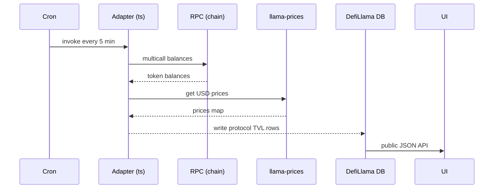

# DefiLlama TVL 方法论与开源适配器

> **TL;DR**：DefiLlama 是 Web3 最权威的 TVL（Total Value Locked）聚合器，2020 年由匿名创始者 0xngmi 发起，奉行"免费 + 开源 + 中立"三原则。核心资产是社区维护的 **DefiLlama-Adapters**（5000+ TS/JS 适配器，每 DeFi 协议一个函数返回 balance tokens），TVL 由链上合约直接调用 + 价格源合成。除 TVL 外扩展出 **Stablecoins、Yield（APY 聚合）、Bridges、DEX Volume、NFT、Liquidations、Raises（融资）、Hacks** 等子产品。API 完全免费（无 key），被各大研究机构、Twitter KOL、Dune 查询广泛引用。其中立地位来自**不接项目 PR 付费、不发 token、拒绝广告**——运营完全由 DAO 捐赠与 llamafeed 辅助收入覆盖。

## 1. 背景与动机

2020 年 DeFi Summer，"TVL"成为核心叙事，但各项目自报 TVL 常有水分（双计、算上非流动性代币、用假价格）。CoinGecko、CMC 偏 token 价格；需要独立、方法公开、可审计的 TVL 来源。

DefiLlama 的方法论：**TVL = Σ token_balance(contract) × price(token, timestamp)**，关键是：

1. 直接调用协议合约（`totalAssets()`、`balanceOf`、lending reserves）读取 token amount；
2. 使用独立价格源（Coingecko API、Uniswap TWAP）；
3. 排除协议自身代币（防自己抬）；
4. 每 5 – 15 分钟刷新；
5. 适配器代码公开，任何人可 PR。

这种"开源定义"模式让 DefiLlama 成为行业准绳。Vitalik 2021 年推文、a16z 研究、IMF 报告都引用其数据。

## 2. 核心原理

### 2.1 TVL 形式化

对于协议 `P`，部署在链集合 `C = {c₁, …, cₙ}`：

```
TVL(P, t) = Σ_{c ∈ C} Σ_{a ∈ Assets(P,c)} balance(P, a, c, t) × price(a, t)
```

其中：
- `Assets(P,c)` = 协议在链 c 上的"锁定代币集合"（用户存入 + 协议作 counterparty 持有）；
- `balance` 通过 `eth_call` 或 RPC 读取；
- `price` 来自 `llama-prices` 聚合源。

关键不变式：TVL 不含协议原生 token（防止 self-reference bubble），如 AAVE 不计 stkAAVE。DefiLlama 提供 `excludeLiquidStaking`、`excludeBorrows` 等视图切换。

### 2.2 Adapter 结构

适配器是 npm 包 `@defillama/sdk` 的使用者，每协议一个 `index.js`：

```js
const sdk = require("@defillama/sdk");
const { sumTokens2 } = require("../helper/unwrapLPs");
async function ethTvl(api) {
  const pools = ["0xabc...", "0xdef..."];
  return sumTokens2({ api, owners: pools, tokens: [ADDRESSES.ethereum.USDC, ADDRESSES.ethereum.DAI] });
}
module.exports = {
  methodology: "Counts USDC/DAI locked in the vaults",
  ethereum: { tvl: ethTvl },
  arbitrum: { tvl: arbTvl },
};
```

核心辅助函数：
- `sumTokens2`：给一组 owner/token 返回 USD；
- `sumSingleBalance`：单 token；
- `unwrapLPs`：把 LP token 展开为 underlying；
- `api.call / api.multiCall`：批量 RPC。

### 2.3 Yield 与 APY

DefiLlama Yield 子产品聚合：pool address + APY (base + reward) + TVL + IL risk + exposure。Adapter 类似 TVL 但额外返回 `apyBase / apyReward / underlyingTokens`。

### 2.4 Stablecoin 方法

单独产品跟踪 USDT/USDC/DAI/FRAX/USDe 等的**circulating supply per chain**，方法是读 `totalSupply()` - bridge locked - treasury held。计算 peg deviation、chain distribution、reserves composition。

### 2.5 Bridges / DEX Volume / Raises / Hacks

- **Bridges**：跨链桥 TVL + 日流量。
- **DEX Volume**：24h volume/fees，直接从 protocol subgraph 或合约事件聚合。
- **Raises**：投融资数据库（手动 + Crunchbase-like）。
- **Hacks**：被盗事件数据库，含 hack amount、root cause、recovered。

### 2.6 参数

| 参数 | 值 |
| --- | --- |
| 刷新频率 | 5-15 min TVL、1h Yield、1d Raises |
| 覆盖协议 | 3000+ |
| 覆盖链 | 300+ |
| API rate | 免费，但建议 <20 req/s |
| 适配器仓库 license | MIT |

### 2.7 失败模式

- **价格源错误**：新 token 无价格则 TVL = 0，容易错报。
- **双计**：协议 A 存入协议 B，未配置 exclude，会两边计。
- **适配器 Bug**：社区 PR 未充分审查偶致 TVL 跳变。
- **链 RPC 不稳**：某链 RPC 宕机时 TVL 暂停更新。

### 2.8 LlamaSwap 与扩展产品

DefiLlama 孵化出多项无广告/无抽成的扩展产品：

- **LlamaSwap**：DEX aggregator meta-aggregator，聚合 1inch/0x/Paraswap/CoW 等，取最优路径，**不抽佣**。
- **LlamaNodes**：公共 RPC（Ankr 赞助）。
- **LlamaFees**：聚合协议收入 / 用户支付费用。
- **LlamaAirdrops**：空投资格检查器。
- **LlamaBots**：Telegram bot 推送大额事件。

### 2.9 价格源（llama-prices）

内部聚合管线：

1. 优先 CoinGecko API；
2. 次选 Chainlink / Uniswap TWAP；
3. 新 token 用 DEX pool 最深流动性池即时计算；
4. 稳定币 peg 独立处理（避免 depeg 价格影响 TVL 突降）。

价格以 key `chain:address:timestamp_bucket` 缓存 5 分钟。

### 2.10 TVL 计算流程



## 3. 架构剖析

### 3.1 分层

```
L1  Adapter Runtime      Node.js + @defillama/sdk
L2  RPC Abstraction      自建 RPC pool + Ankr/Alchemy
L3  Price Engine         llama-prices
L4  Storage              PostgreSQL + Parquet history
L5  API & Website        Next.js + REST / GraphQL / CSV
```

### 3.2 模块清单

| 模块 | 路径 | 说明 |
| --- | --- | --- |
| @defillama/sdk | `DefiLlama/sdk` | Adapter 工具 |
| DefiLlama-Adapters | 仓库 | 5000+ 协议 |
| llama-prices | 内部 | 价格聚合 |
| api.llama.fi | 微服务 | REST API |
| coins.llama.fi | 微服务 | 价格 API |
| yields.llama.fi | 微服务 | Yield 数据 |
| stablecoins.llama.fi | 微服务 | 稳定币监控 |

### 3.3 数据 Journey

某协议新接入：

1. Dev fork `DefiLlama-Adapters`，在 `projects/<name>/index.js` 写 adapter。
2. 本地 `node test.js projects/<name>` 验证输出接近自报 TVL（差异 <5%）。
3. PR 提交，maintainer review（检查双计、price source、methodology comment）。
4. Merge 后 Cron 自动部署，5 min 后 TVL 显示。

### 3.4 参考实现

完全开源：
- `github.com/DefiLlama/DefiLlama-Adapters`（Adapters）
- `github.com/DefiLlama/defillama-server`（后端 Lambda）
- `github.com/DefiLlama/defillama-app`（前端 Next.js）

### 3.5 接口

- **Public API**：`https://api.llama.fi/protocols`、`/protocol/{slug}`、`/tvl/{slug}`、`/chains`。
- **Coins API**：`https://coins.llama.fi/prices/current/ethereum:0xabc`。
- **Yields**：`https://yields.llama.fi/pools`。
- **Export**：CSV/JSON。

## 4. 关键代码 / 实现细节

Adapter 完整示例——仓库 `DefiLlama/DefiLlama-Adapters`，文件 `projects/uniswap-v3/index.js`：

```js
const { getUniV3LogAdapter } = require('../helper/uniswapV3')
module.exports = {
  methodology: "Sums up TVL of each Uniswap V3 pool",
  timetravel: true,
  ethereum: { tvl: getUniV3LogAdapter({ factory: '0x1F98431c8aD98523631AE4a59f267346ea31F984' }) },
  arbitrum: { tvl: getUniV3LogAdapter({ factory: '0x1F98431c8aD98523631AE4a59f267346ea31F984' }) },
}
```

API 调用（Python）——文档：`https://defillama.com/docs/api`：

```python
import requests
r = requests.get('https://api.llama.fi/protocol/aave').json()
print(r['tvl'])  # 历史 TVL 时序
```

获取当前价格：

```bash
curl https://coins.llama.fi/prices/current/ethereum:0xa0b86991c6218b36c1d19d4a2e9eb0ce3606eb48
```

## 5. 演进与版本对比

| 版本 | 时间 | 关键变化 |
| --- | --- | --- |
| v1 | 2020 | TVL 单品 |
| Yield | 2021 | APY 聚合 |
| Stablecoins | 2022 | 稳定币监控 |
| Raises | 2022 | 融资数据库 |
| Pro API | 2024 | 付费 SLA 版本 |
| LlamaFeed | 2024 | 新闻流 |
| LlamaSwap | 2023 | DEX 聚合器（不抽成） |

## 6. 实战示例

查询某协议 30 天 TVL 变化：

```bash
curl https://api.llama.fi/protocol/gmx | jq '.tvl[-30:]'
```

生成 AAVE vs Compound TVL 折线（Python）：

```python
import requests, pandas as pd
def tvl(slug):
    d = requests.get(f'https://api.llama.fi/protocol/{slug}').json()
    return pd.DataFrame(d['tvl'])
pd.merge(tvl('aave'), tvl('compound'), on='date', suffixes=('_aave','_comp')).plot()
```

## 7. 安全与已知问题

- **适配器漏洞**：社区 PR 可能引入价格 manipulation（如读取 low-liq pool price），maintainer 需审查。
- **TVL 被滥用**：市场常用 "TVL 排行"做投资决策，但不同协议 TVL 质量不同（衍生品 TVL ≠ DEX TVL）。
- **价格源失效**：某 token 在 CoinGecko 缺失即 TVL 为 0，被误读为"协议跑路"。
- **API 被滥用**：高频爬虫，DefiLlama 有被动限流。
- **中立性挑战**：若未来接受项目方赞助，需保持独立性。

## 8. 与同类方案对比

| 维度 | DefiLlama | TokenTerminal | Dune TVL spell | Nansen TVL | L2Beat |
| --- | --- | --- | --- | --- | --- |
| 开源 | 完全 | 部分 | 半开 | 否 | 完全 |
| 免费 | 是 | 付费 | 免费 | 付费 | 是 |
| 方法论 | 公开 | 部分 | SQL可见 | 内部 | 详细 |
| 覆盖 | 最广 | 中 | 广 | 中 | 仅 L2 |
| 扩展产品 | 多 | 财务指标 | SQL 灵活 | 标签/intel | L2 专精 |

## 9. 延伸阅读

- 官方：https://defillama.com/
- 文档：https://docs.llama.fi/
- GitHub Adapters：https://github.com/DefiLlama/DefiLlama-Adapters
- API：https://defillama.com/docs/api
- 0xngmi Twitter 长文：TVL 方法论
- Methodology 对比：L2Beat 与 DefiLlama 差异

## 10. 术语表

| 术语 | 英文 | 释义 |
| --- | --- | --- |
| TVL | Total Value Locked | 锁定总价值 |
| Adapter | Adapter | 每协议的 TVL 计算脚本 |
| Methodology | Methodology | 口径说明 |
| Yield | Yield | APY 产品 |
| Stablecoins | Stablecoins | 稳定币子产品 |
| Raises | Raises | 融资数据库 |

---

*Last verified: 2026-04-22*
