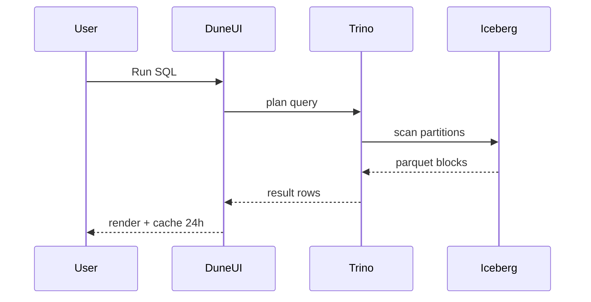

# Dune Analytics SQL 数据分析平台

> **TL;DR**：Dune 是 Web3 领域最流行的 SQL 数据分析平台（2018 年奥斯陆起步，2022 年 Series B 估值 $1B），让分析师用 PostgreSQL 方言或 Trino（DuneSQL）查询去规范化后的链上数据。核心资产是社区维护的 **Spellbook**（dbt 模型仓库，定义了从原始 `ethereum.transactions` 到业务层 `dex.trades`、`nft.trades`、`lending.protocols` 的抽象），以及 100+ 万条公开 Query 与 Dashboard。2023 年底从 PostgreSQL 后端迁移至 DuneSQL（基于 Trino + Iceberg），TB 级查询提速 10 – 100x。Dune 定位"SQL-first、dashboard-first"，适合分析师、研究员、KOL；对生产应用（DApp 前端）因免费额度有限、无强 SLA 而不合适——这种场景通常组合 Dune API + 自建缓存。

## 1. 背景与动机

链上数据是最纯粹的"公共数据集"——任何人可同步。然而把 raw RPC 数据转成可分析表格（小时级 OHLC、DEX 聚合交易量、NFT 地板价），需要：解码事件、反范式化、join 元数据（token symbol/decimals）、价格富化、跨链并表。这是典型的数仓 ETL 工作，超出普通开发者能力。

Dune 创始人 Mats Olsen、Fredrik Haga 在 2018 年推出后，采用"共享工作空间"模式：任何人可写 SQL 公开查询，别人可 Fork 修改。配合 Twitter 分享文化，形成"链上版 Kaggle + Tableau"的生态。2021 年 Uniswap/Aave/Curve 等协议官方 Dashboard 常年在 Dune 上，奠定行业标准。

2022 年面临性能瓶颈：PostgreSQL 单机扫 100M 行 join 慢到分钟级，且团队难以横向扩展。决定重构为基于 **Trino + Iceberg** 的数据湖架构，代号 DuneSQL。2023 年 Q4 GA。

Spellbook 作为开源 dbt 项目在 GitHub 开放（Apache-2.0），社区贡献 Spell 审核后合并，所有用户共享。这种"开源指标字典"显著降低了分析 barriers。

## 2. 核心原理

### 2.1 数据建模层级

```
Raw              ethereum.transactions / logs / traces / blocks / creation_traces
Decoded          ethereum.decoded_calls / decoded_logs   (按 ABI 解码)
Contracts        <project>.<contract>_evt_<event> / _call_<fn> （自动生成）
Spells           dex.trades, nft.trades, lending.*, erc20.* （社区策划）
Datasets         price.usd, tokens.erc20, labels.* （标签/价格）
Queries/Dashboard 分析师查询与可视化
```

不变式：Raw 层只追加，永不修改；Decoded 层仅解码不聚合；Spell 层做 UNION ALL 各协议口径统一。

### 2.2 DuneSQL（Trino + Iceberg）

DuneSQL 使用 Trino 作为查询引擎，Apache Iceberg 作为表格式，对象存储（S3）为底层。关键能力：

- **Varbinary 原生类型**：`0x...` 地址与 hash 以 `varbinary` 存储，比 text 快。
- **Partition / Clustering**：按 `block_time` 和 `block_number` 分区，扫描剪枝。
- **Materialized Views**：Spellbook 输出写入 materialized，小时级刷新。
- **UDF**：`from_hex`, `to_hex`, `bytearray_to_uint256`, `to_base_unit`（分位精度转换）。

Query 计量：按数据扫描量（bytes）计费，即"cost = bytes_scanned × rate"。

### 2.3 Spellbook（dbt）

Spellbook 是 Dune 的 dbt 项目：`https://github.com/duneanalytics/spellbook`。结构：

```
models/
  dex/
    trades/
      ethereum/uniswap_v3_ethereum_base_trades.sql
      ...
      dex_trades.sql              # UNION ALL 所有 DEX × Chain
  nft/trades/...
  lending/...
  tokens/...
  prices/...
```

每个 Spell 是 SQL 文件 + YAML schema test。审核通过并 merge 后，Dune 调度器跑 dbt。

### 2.4 核心 Spells 示例

- **`dex.trades`**：所有 DEX 的 swap 事件统一到 `(block_time, token_bought, token_sold, amount_usd, project, version, blockchain)`。
- **`nft.trades`**：OpenSea、Blur、LooksRare 等市场的 NFT 交易。
- **`erc20.transfers`**：解码后的 ERC20 Transfer。
- **`prices.usd`**：CoinGecko + CoinPaprika 聚合价格，小时精度。
- **`tokens.erc20`**：symbol/decimals/name 元数据。

### 2.5 Query 生命周期

1. 用户写 SQL → 点 Run。
2. Trino 解析 + planner 估算扫描量。
3. 调度到 Worker 集群（Iceberg scan）。
4. 结果缓存 24h（同 SQL hash）。
5. 可视化 → Dashboard。

### 2.6 API

Dune API（Executions API）允许：

- `POST /api/v1/query/{id}/execute` 触发查询。
- `GET /api/v1/execution/{execution_id}/status` 轮询。
- `GET /api/v1/execution/{execution_id}/results` 获取 JSON/CSV。

还提供 Preset Endpoints（快速通道）、Custom Endpoints（API as dashboard layer）。

### 2.7 参数

| 参数 | 值 |
| --- | --- |
| 付费档位 | Free / Plus ($390/mo) / Premium ($7500/mo) |
| Free 并发 query | 3 |
| DuneSQL medium engine | 10 credits |
| DuneSQL large | 20 credits |
| Execution timeout | 30 min |
| 结果行数上限 | 16k 行 API（免费） |

### 2.8 失败模式

- **超时**：未剪枝全表扫（无 `block_time` 过滤）导致超 30 min 报错。
- **费用黑洞**：团队工作空间被滥用扫 TB 数据触发 credit exhaustion。
- **Spell 滞后**：新协议上线到 Spell 合并可能 1-2 周。
- **数据不一致**：Spell 小时级刷新，与 head 有滞后（非实时）。

### 2.9 Materialized Views 与增量刷新

Spell 分两类：**Incremental** 与 **Full Refresh**。

- **Incremental Spell**：声明 `unique_key` + `time_field`，每次 dbt run 只插入高于前次水位的新行；适合事件流（`dex.trades`）。
- **Full Refresh**：全表重建，适合低频元数据（`tokens.erc20`）。

每日 00:00 UTC 全量重跑关键 Spell 以校准；小时级跑增量。Spell 输出写入 Iceberg，并生成 Trino materialized view 加速查询。

### 2.10 权限与 Workspace

- **Personal Workspace**：个人查询默认 public。
- **Team Workspace**（Plus+）：团队共享查询，可设 private。
- **Visualization**：Line/Bar/Area/Counter/Pivot Table/Scatter 常规 BI 组件。Parameter 支持下拉/日期框，可驱动 WHERE 子句。
- **Alert**：查询 schedule + webhook/email，用于被动监控（如"池子 USD_Volume 突降 >50%"）。

### 2.11 流程图



## 3. 架构剖析

### 3.1 分层

```
Ingestion    Node Provider → Raw Parquet → Iceberg tables
Decode       ABI auto-decode → decoded_logs
Spell (dbt)  community-maintained transformations
Query        Trino / DuneSQL
Frontend     Dashboard / Visualization / API
```

### 3.2 模块清单

| 模块 | 职责 |
| --- | --- |
| Ingest Pipeline | 从 RPC/Firehose 到 Iceberg |
| Decoder Service | 监控新合约 + ABI 自动解码 |
| dbt Runner | 调度 Spellbook 运行 |
| Trino Cluster | 查询计算 |
| API Gateway | Executions API / Auth |
| Dashboard UI | 可视化、Cron、Alert |

### 3.3 查询 Journey

用户 SQL `SELECT block_time, amount_usd FROM dex.trades WHERE project='uniswap'` →
1) Trino planner 判定 dex.trades 是 materialized view；
2) 按 `project='uniswap'` 下推分区剪枝；
3) 扫 Parquet，返回 shuffled rows；
4) 结果 1GB 左右，push 到 UI。

### 3.4 参考实现

Spellbook 开源（Apache 2.0），但查询引擎、UI、Iceberg 管理为闭源 SaaS。Dune 1.0 PostgreSQL 后端源码未开放。

### 3.5 接口

- Web UI、dbt-style contribution、REST API、Python SDK (`dune-client`)、CSV/JSON/Parquet 导出。

### 3.6 参考实现

- Spellbook：`github.com/duneanalytics/spellbook`（Apache 2.0，5000+ 模型）。
- dune-client（Python）：`github.com/duneanalytics/dune-client-py`（开源）。
- 后端与 Trino 集群闭源。

### 3.7 集成生态

- **Grafana**：通过 Dune Grafana Plugin 接 Dashboard。
- **Snowflake Sharing**（Plus+）：直接把 Dune 表共享到客户 Snowflake 账号（Data Share）。
- **Zapier / Webhook**：Alerts 触发 Slack / Telegram。
- **Notebook**：Dune Tables 可通过 SDK 读入 Pandas / Jupyter。

### 3.8 数据 Journey：新协议接入

某协议 X 新上线，希望 Dune 可见：

1. 把合约 ABI 提交到 Dune Studio → 自动解码到 `<protocol>.<contract>_evt_*`。
2. 社区贡献者 fork Spellbook，写 `dex/trades/ethereum/x_ethereum_base_trades.sql`。
3. PR 通过 CI（dbt test），合并后 Spell 自动并入 `dex.trades`。
4. 用户可立即 `SELECT ... WHERE project='x'`。

以上流程通常 1 – 3 周，比闭源 BI 工具（需厂商内部实现）快数倍。

## 4. 关键代码 / 实现细节

经典查询——Uniswap v3 24h 交易量，文档：`https://docs.dune.com/data-catalog/curated/evm/DEX/trades/dex-trades`：

```sql
SELECT
  date_trunc('hour', block_time) AS hour,
  SUM(amount_usd) AS volume_usd
FROM dex.trades
WHERE blockchain = 'ethereum'
  AND project = 'uniswap'
  AND version = '3'
  AND block_time > NOW() - INTERVAL '1' DAY
GROUP BY 1
ORDER BY 1
```

Python API 客户端（`dune-client`，PyPI）：

```python
from dune_client.client import DuneClient
from dune_client.query import QueryBase
dune = DuneClient(api_key="YOUR_KEY")
result = dune.run_query(QueryBase(query_id=123456))
for row in result.result.rows:
    print(row)
```

Spell 定义片段（Spellbook `models/dex/trades/ethereum/uniswap_v3/uniswap_v3_ethereum_base_trades.sql`）：

```sql
SELECT
  'uniswap' AS project,
  '3' AS version,
  'ethereum' AS blockchain,
  t.evt_block_time AS block_time,
  t.amount0, t.amount1, t.sqrtPriceX96,
  t.evt_tx_hash AS tx_hash,
  t.contract_address AS project_contract_address
FROM {{ source('uniswap_v3_ethereum','Pair_evt_Swap') }} t
```

## 5. 演进与版本对比

| 版本 | 时间 | 关键变化 |
| --- | --- | --- |
| Dune v1 | 2018 | PostgreSQL 后端 |
| Spellbook dbt | 2022 | 迁移到 dbt 仓库 |
| DuneSQL | 2023 | Trino + Iceberg |
| API v2 | 2024 | Preset/Custom Endpoints |
| AI Query Assist | 2025 | Text-to-SQL GPT 助手（Wand） |

## 6. 实战示例

统计 USDC 某地址 7 天净流入：

```sql
WITH t AS (
  SELECT block_time, "from", "to", value / 1e6 AS amount
  FROM erc20_ethereum.evt_Transfer
  WHERE contract_address = 0xa0b86991c6218b36c1d19d4a2e9eb0ce3606eb48
    AND block_time > NOW() - INTERVAL '7' DAY
    AND (lower("from") = 0xabc... OR lower("to") = 0xabc...)
)
SELECT SUM(CASE WHEN "to" = 0xabc... THEN amount ELSE -amount END) AS net_in
FROM t
```

## 7. 安全与已知问题

- **公开 SQL 泄露**：免费空间下查询与结果默认公开，可能暴露客户名单（如"白名单地址"）。Private 需 Plus 档。
- **credit 爆炸**：未加 block_time 过滤的扫全表查询数万 credit。
- **Spell 错误**：社区 PR 质量不均，偶现双计、漏计，被 KOL 引用后传播。
- **API Key 泄露**：需环境变量 + 后端代理。
- **数据延迟**：Spell 一小时级刷新，不是实时，不能支撑交易决策。

## 8. 与同类方案对比

| 维度 | Dune | Flipside | Footprint | Nansen Query | Chainbase |
| --- | --- | --- | --- | --- | --- |
| 查询语言 | Trino SQL | Snowflake SQL | SQL/NoCode | SQL | SQL |
| 免费额度 | 有限 credit | 慷慨 | 中等 | 付费 | 中 |
| Spell/Model | Spellbook | Velocity（似） | 内置 | 标签加持 | 索引 API |
| 实时 | 小时级 | 近实时 | 小时级 | 分钟级 | 秒级 |
| 社区 | 最大 | 中 | 小 | 小 | 小 |
| 适用 | 分析 + Dashboard | 分析师 + 奖励 | BI | 地址 intel | 开发者 API |

## 9. 延伸阅读

- 官方文档：https://docs.dune.com/
- Spellbook GitHub：https://github.com/duneanalytics/spellbook
- Dune Blog: DuneSQL migration（2023）
- 经典书：Messari/Delphi 研究报告常用 Dune 数据源
- Dune Wand（AI）：https://dune.com/wand

## 10. 术语表

| 术语 | 英文 | 释义 |
| --- | --- | --- |
| Spell | Spell | dbt 模型 |
| Spellbook | Spellbook | 官方 Spell 仓库 |
| DuneSQL | DuneSQL | Trino + Iceberg 查询引擎 |
| Dashboard | Dashboard | 可视化面板 |
| Credit | Credit | 计费单位 |
| Query ID | Query ID | Dune 查询编号 |

---

*Last verified: 2026-04-22*
