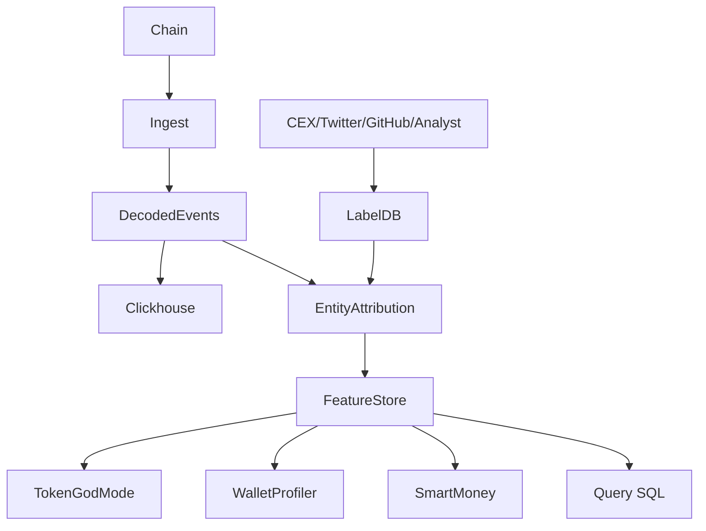

# Nansen 链上情报平台

> **TL;DR**：Nansen 是 Web3 领域最知名的链上情报（On-chain Intelligence）产品，2020 年由 Alex Svanevik 等人创立于新加坡。核心价值是把原始地址转化为"带标签的实体"——通过算法 + 手工策划，将 3 亿 + 以太坊地址归类为"Binance Hot Wallet""OpenSea User""Smart Money Fund""Scam Contract"等约 10 万个标签。在此之上构建 **Wallet Profiler**、**Token God Mode**、**Smart Money Dashboard**、**Alpha Feed**、**Nansen Query**（SQL）。Smart Money 是品牌标签：通过历史收益率 / 持仓质量 / 专业交易模式识别出"聪明钱"地址，其持仓变化被高度关注。2024-2025 年随链上量化与交易机器人普及，Nansen 推出 Nansen 2（AI 聊天、API、自动化 alert）、Nansen Portfolio（个人资产跟踪）、Nansen Pro（机构订阅 $1800-$10000/季）。数据延迟已可做到近实时（<30s），覆盖 EVM + Solana + Bitcoin。

## 1. 背景与动机

链上地址本身是 40 位十六进制，缺乏语义。Etherscan 的 label 功能（2017 起）零星，但无系统化。机构资管、做市商、以及 VC 希望回答："这笔 $10M USDC 是 Coinbase 出来，去了哪？"——这需要建立"地址 → 实体 → 行为"的知识图谱。

Nansen 的洞察：**大部分价值信息集中在 <1% 的活跃地址**（"head"），把这些地址标签化可解锁 80% 的叙事价值。其创始团队来自 D5 Capital、Coinbase Analytics，带着 compliance 背景，天然熟悉地址聚类与 heuristics。

2021 Sushi/Uniswap 喂养了 Smart Money 神话：Nansen 公开"Smart Money 正在买入 SHIB"等 tweet 促销，形成 data-driven narrative trading 文化。至 2025，Nansen 已覆盖 15+ 链，是交易员（retail + fund）、研究员、记者的必备工具。

## 2. 核心原理

### 2.1 地址标签体系

Nansen 标签分三类：

- **Entity Labels**：该地址属于哪个组织（Binance 14, Coinbase Prime, Jump Trading, a16z, Multicoin）。
- **Behavior Labels**：该地址的行为特征（Flash Loan User、NFT Whale、MEV Bot、Sandwich Attacker）。
- **Quality Labels**：Smart Money、Smart NFT Trader、Early Adopter。

标签来源：

1. **官方公开来源**：CEX 公开 hot/cold wallet 地址、协议 Multisig 官方。
2. **聚类启发式**：Common Input（UTXO 风格，BTC）、Change Address、Approved Contract。在 EVM 上主要依靠交互历史 + ENS + 公开转账 pattern。
3. **链下 OSINT**：团队 Twitter、博客、GitHub 披露。
4. **历史事件**：某地址收到 0.3 ETH Tornado → Phishing → Mixer 流入 → 被打"Stolen Funds"。
5. **专有模型**：Smart Money 通过 PnL、holding period、strategy fingerprint 聚类。

### 2.2 Smart Money 算法（公开原则）

Nansen 未公开完整模型，但 blog 披露要素：

- **PnL**：至少 1 年正收益，USD 计量。
- **Activity**：一定交易频次（避免 HODLer 混入）。
- **Asset Quality**：持仓中至少 N% 是 top 200 token 或早期 alpha。
- **Pattern**：非盲盒 copy trade，不是纯 airdrop farming。

Smart Money 动态更新（每周），基于 rolling-window 评分。

### 2.3 Token God Mode

针对单个 ERC-20：展示持有者变化、Smart Money 占比、DEX/CEX 净流、清算风险、Top Buyers/Sellers、Exchanges flow。数据结构类似：

```
token_metrics = {
  top_holders: [(addr, label, balance, pct_supply)],
  smart_money_flow_24h: {net: usd, buyers: N, sellers: M},
  exchange_flow: {cex_in: usd, cex_out: usd},
  holders_distribution: {whales_pct, retail_pct, diamond_hand_pct},
  dex_metrics: {volume, liquidity_change, impermanent_loss}
}
```

### 2.4 Wallet Profiler

输入任意地址，输出：

- Portfolio (tokens / NFTs / DeFi positions)
- PnL Over Time
- Protocol Interactions
- Counterparties graph
- 风险评分（涉及 Tornado、Stolen funds 来源打分）

### 2.5 数据管道

```
Chain → Ingest → Decoded Events → Entity Attribution → Feature Store → Query API / Dashboard
                                    ↑
                              Label DB (10万+ labels)
```

Nansen 自建 Archive + Firehose 管道，基础数据 <30s 到位，Smart Money 计算 15 分钟-1 小时刷新。

### 2.6 覆盖链

Ethereum、Arbitrum、Optimism、Base、Polygon、Avalanche、BSC、Linea、Blast、Solana、Ronin、Fantom、zkSync、Starknet、Bitcoin（2024 新）、Ton（Beta）。

### 2.7 参数

| 参数 | 值 |
| --- | --- |
| Standard | $150/月 |
| VIP/Alpha | $1800+/年 |
| Enterprise | custom |
| 标签数量 | 10万+ 实体，300万+ 地址标注 |
| 数据延迟 | 30s-1min |
| API rate | 按订阅档 |

### 2.8 失败模式

- **标签错误**：聚类错把普通用户归类为 Binance。
- **Smart Money 失效**：Bull 市有效，熊市跟单 Smart Money 亦亏。
- **隐私问题**：普通用户被打标签可能不愿被追踪。
- **数据偏差**：Solana 链上较晚整合，标签覆盖度低。

### 2.9 Alert 与自动化

Nansen Alerts 支持规则引擎：

- **Balance Change**：某地址 / entity token balance 变化 >X%。
- **Smart Money Net Flow**：对某 token 过去 1h Smart Money 净买入 > N USD。
- **Approval Risk**：用户钱包授权新合约且该合约涉嫌恶意。
- **NFT Floor Break**：地板价突破阈值。

Alert 通过 Telegram / Discord / Email / Webhook 交付。Pro 用户可写 Query-to-Alert（基于 Nansen Query SQL）。

### 2.10 Nansen Query（SQL Workspace）

Nansen Query 让 Pro 用户写类 Trino SQL 访问 Nansen 所有表（`labels.*`, `dex.*`, `nft.*`）。相比 Dune，主要优势是**预 join 了 Nansen 专有标签**（如 Smart Money 表）。SQL dialect 与 Trino 兼容，支持 CTE、窗口函数、array/map。

### 2.11 Nansen 2（AI Copilot）

2024 年推出的自然语言接口："What whales bought $PEPE today?" → 自动生成 SQL 执行 → 返回表格+图表。底层使用 GPT-4 + retrieval 内部 schema + 标签库。对新手友好但精确度有待验证，适合 exploration 而非 production。

### 2.12 架构图



## 3. 架构剖析

### 3.1 分层

```
Layer 1  Data Lake          Parquet on S3 + Iceberg
Layer 2  Label Service      Graph DB (Neo4j/自研) + Redis
Layer 3  Compute            dbt + Spark + Flink (real-time)
Layer 4  API / Dashboard    React + GraphQL + REST
```

### 3.2 模块清单

| 模块 | 职责 | 说明 |
| --- | --- | --- |
| Archive Ingest | 同步链数据 | Firehose + Archive |
| ABI Registry | 解码合约事件 | ~50k ABI |
| Label Engine | 地址聚类 + 标注 | ML + rule |
| Smart Money Calc | PnL 建模 | 每日 job |
| Query Layer | SQL 查询（Nansen Query） | Trino |
| Alert System | 规则触发 → 邮件/Telegram/Webhook | |

### 3.3 数据生命周期

某新 token 上架 → Nansen Ingest 检测交易对 → 自动解码 ERC-20 Transfer → 关联已知标签 → Token God Mode 自动出现 → 交易员看到 Smart Money 流入 Alert → Twitter 传播。

### 3.4 参考实现

Nansen 全部闭源，但发布大量研究报告 + 开放部分 API。

### 3.5 接口

- **Web UI**：Nansen.ai 主站
- **Nansen Query**：SQL 工作空间
- **API**（Enterprise）：REST/GraphQL
- **Nansen 2**：AI 助手
- **Alert Channels**：Telegram、Discord、Webhook

### 3.6 参考实现

Nansen 全栈闭源。但数据模型与标签字典会通过 blog、白皮书局部公开，研究社区（Delphi、Messari）参考其分类。

### 3.7 地理与合规

Nansen 注册于新加坡，对用户 KYC 相对宽松（Alpha 档位仅需邮箱），Pro/Enterprise 档需 SOC 2 / GDPR 合规承诺。欧盟用户数据删除请求需 30 天内响应。Nansen 不对个人数据做商用出售，但"公开标签"本身免责条款明确。

### 3.8 Portfolio（C 端）

Nansen Portfolio 是独立产品：连接钱包后展示多链资产 + PnL + airdrop 资格，竞品 Zapper、DeBank。集成 Nansen Smart Money 标签让用户看到"你的地址是 Smart Money 吗？"这种差异化体验。

## 4. 关键代码 / 实现细节

Nansen API 示例——文档：`https://docs.nansen.ai/`：

```bash
curl -X GET "https://api.nansen.ai/api/v1/wallet/0xd8dA6BF26964aF9D7eEd9e03E53415D37aA96045/balance" \
  -H "API-KEY: ${NANSEN_KEY}"
```

返回示例：

```json
{
  "address": "0xd8da...",
  "labels": ["Vitalik Buterin","Smart Money","Ethereum Founder"],
  "total_usd": 525000000,
  "tokens": [{"symbol":"ETH","balance":236000,"usd":780000000}],
  "last_active": "2026-04-20T12:00:00Z"
}
```

Nansen Query (类 SQL)：

```sql
SELECT wallet, SUM(volume_usd) AS buy_usd
FROM dex.trades
WHERE blockchain = 'ethereum'
  AND token_bought_address = 0xabc...
  AND wallet IN (SELECT address FROM labels.smart_money)
  AND block_time > NOW() - INTERVAL '24 hours'
GROUP BY wallet
ORDER BY buy_usd DESC
LIMIT 20
```

## 5. 演进与版本对比

| 版本 | 时间 | 关键变化 |
| --- | --- | --- |
| Nansen 1.0 | 2020 | Wallet Profiler + Token God Mode |
| Smart Alerts | 2021 | 实时告警 |
| Nansen Portfolio | 2022 | 个人资产 |
| Nansen Query | 2023 | SQL 接入 |
| Nansen 2 | 2024 | AI copilot |
| Pro/Institution Tier | 2025 | 合规数据、SSO |

## 6. 实战示例

追踪 Vitalik 转账：

1. 登录 nansen.ai，搜索 `vitalik.eth`。
2. Wallet Profiler → Transactions → 过滤 TokenOut > $1M。
3. 设置 Alert "if balance change > 10 ETH"。
4. 接到 Telegram 提示即可触发策略。

API 自动化追踪某合约持有者分布：

```python
import requests
r = requests.get(
  'https://api.nansen.ai/api/v1/token/ethereum/0xabc.../top-holders',
  headers={'API-KEY':KEY}
)
print(r.json()['holders'][:10])
```

## 7. 安全与已知问题

- **误标签危害**：某用户被错标"Sanctioned"，影响 DeFi 访问（许多协议接 Nansen）。可申请纠正。
- **隐私担忧**：标签开放访问对隐私敏感用户不友好。
- **Smart Money 反向操作**：部分 whale 察觉被跟踪后故意做假订单，Smart Money 数据被污染。
- **API 额度**：Enterprise tier 昂贵，中小团队需权衡。
- **标签滞后**：新 entity 上链到被标签化可能数周。

## 8. 与同类方案对比

| 维度 | Nansen | Arkham | Dune | Chainalysis | Etherscan Labels |
| --- | --- | --- | --- | --- | --- |
| 标签数 | 10万+ | 20万+ | 有限（Spell） | 企业级 | 手工少量 |
| 用户群 | 交易员/研究 | 情报/Bounty | 分析师 | 合规/执法 | 开发者 |
| Smart Money | 独家 | 类似功能 | 无 | 无 | 无 |
| 定价 | $150/月起 | 订阅/OTC | Credit | 企业 | 免费 |
| API | 有 | 有 | 有 | 有 | 有限 |
| 覆盖链 | 15+ | 20+ | 30+ | BTC/ETH/主链 | EVM 主 |

## 9. 延伸阅读

- 官方：https://www.nansen.ai/
- 文档：https://docs.nansen.ai/
- 研究：https://www.nansen.ai/research
- 经典文章：Nansen "What is Smart Money?" 2021
- 对比：Messari "On-chain intelligence landscape"

## 10. 术语表

| 术语 | 英文 | 释义 |
| --- | --- | --- |
| Smart Money | Smart Money | 历史表现优异的聪明钱地址 |
| Token God Mode | Token God Mode | 单 token 全景面板 |
| Wallet Profiler | Wallet Profiler | 钱包分析 |
| Label | Label | 地址标注 |
| Alert | Alert | 规则触发提醒 |
| Entity | Entity | 实体（CEX/Fund/Person） |

---

*Last verified: 2026-04-22*
