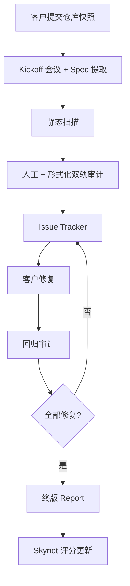

# CertiK 审计、Skynet 与渗透测试

> **TL;DR**：CertiK 是 2018 年由耶鲁/哥大两位教授创立的美籍 Web3 安全公司，业务三条主线：**Smart Contract Audit**（人工 + 形式化验证混合审计）、**Skynet**（链上实时风险监控与评分门户）、**Penetration Testing / KYC / Bug Bounty** 等增值服务。CertiK 以发表审计报告数量最多、客户覆盖面最广著称（累计数千个项目、300B+ 美元资产），同时也因"被审项目出事"与 Skynet 评分方法论争议承受质疑。其技术底座包括内部验证工具 CertiK Virtual Machine (CVM) 与 DeepSEA 形式化框架，逐步融合 LLM 辅助审计。

## 1. 背景与动机

2018 年耶鲁大学教授 Ronghui Gu（顾荣辉）与哥伦比亚大学教授 Shao Zhong（邵中）联合创立 CertiK，以两人在操作系统形式化验证（CertiKOS，SOSP 2016 Best Paper）的学术工作为起点，将形式化方法应用于智能合约审计。彼时行业主流审计以 ConsenSys Diligence、Trail of Bits、OpenZeppelin、SlowMist 等为主，大多数依赖静态分析 + 人工读代码；CertiK 的差异化叙事是"像 NASA 验证航天器一样验证智能合约"。

早期产品为 CertiK Chain（POSA 公链）与 DeepSEA（验证 DSL），但市场从 2020 年 DeFi Summer 后迅速转向"大规模审计服务"。CertiK 借助庞大销售团队和快速交付能力，抢占了 BNB Chain、Polygon 等新兴生态的大量中小项目。2021–2022 年完成多轮融资（Tiger Global、SoftBank、Coatue 等），估值达 20 亿美元。2023 年后核心产品线收敛为：

- **Security Assessments**：智能合约审计、Layer 1 / Cross-chain 审计、零知识证明电路审计；
- **Skynet**：链上实时监控 + 项目透明度评分；
- **KYC**：团队 KYC 验证（Doxxing-as-a-Service）；
- **Penetration Testing**：Web2 + Web3 渗透测试、社会工程学；
- **Bug Bounty**：通过 CertiK 平台统一管理漏洞赏金。

## 2. 核心原理

### 2.1 混合审计方法论

CertiK 审计流程形式化地拆成 5 个阶段：

1. **Spec 提取**：从项目文档、NatSpec 注释、经济机制白皮书中提取安全属性，形式化为 invariants 与不变式集合 $\Phi = \{\phi_1, \phi_2, \dots, \phi_n\}$。
2. **静态分析**：运行 Slither、Semgrep、CertiK 自研插件做第一轮扫描，过滤已知模式（reentrancy、tx.origin、delegatecall hazard、uninitialized storage）。
3. **人工审计**：资深审计员按线程分工（economic logic / access control / oracle / gas / upgradability）；双审制（两名独立审计员 + 一名 Lead）。
4. **形式化验证（可选）**：对关键函数（核心 invariant 相关）用 Certora Prover、Halmos、CertiK 自研工具证明满足 $\Phi$。典型验证目标：
   - 总供应量守恒：$\sum_i \text{balanceOf}(i) = \text{totalSupply}$；
   - 借贷协议的偿付能力：$\sum_i \text{collateral}_i \cdot p_i \geq \sum_i \text{debt}_i$；
   - 访问控制：`onlyOwner` 修饰的函数不可被非 owner 调用。
5. **Fuzz 测试**：使用 Echidna / Foundry invariant / CertiK Fuzz 做 property-based testing，覆盖边界值。

### 2.2 Skynet 评分算法

Skynet 是 CertiK 的"链上项目体检"系统，对每个被审计或被收录的项目给出 0–100 分的 **Security Score**，底层由 6 个子维度构成：

1. **Code Security**：审计发现、漏洞类别、未修复问题数；
2. **Fundamental Health**：代币分布、锁仓比例、开发活跃度（commits / open PR）；
3. **Operational Resilience**：合约升级机制、timelock、多签；
4. **Community**：Twitter/Discord 活跃度（含机器人过滤）；
5. **Market Stability**：价格波动、流动性池深度；
6. **Governance**：治理活跃度、治理攻击风险。

形式化：
$$
S = w_1 C + w_2 F + w_3 O + w_4 M + w_5 G + w_6 K
$$
权重 $w_i$ 不对外公布，随版本调整。评分每日更新，供用户与交易所上币团队参考。

### 2.3 形式化验证工具链（DeepSEA）

DeepSEA 是 CertiK 早期开源的 DSL，语义上类似 Coq + FStar 的一个工业化封装，目的是允许开发者用接近 Solidity 的语法编写代码，同时自动生成 Coq 证明。核心语义建立在 "Layer-based Refinement Calculus" 上（源自 CertiKOS 论文）。在当前业务中，DeepSEA 主要用于内部验证底层库（ERC-20、简单 AMM 等），对客户合约更多使用 Certora 或 Halmos。

### 2.4 子机制拆解

1. **Issue Tracker**：审计期间使用的 GitLab-like 系统，发现的 issue 分为 Critical / Major / Medium / Minor / Informational，五级严重度；
2. **PoC 验证**：所有 Critical / Major 必须配备 PoC 或测试复现；
3. **Remediation 循环**：客户修复 → 审计员回归 → 状态 Acknowledged / Resolved / Partially Resolved / Unresolved；
4. **公开报告**：PDF + IPFS CID，部分客户选择闭源；
5. **Skynet 同步**：审计完成后，issue 数、严重度与 Code Security 子分挂钩。

### 2.5 参数与常量

- **审计周期**：通常 2–6 周，视代码规模；
- **代码量计费**：按 SLOC（source lines of code）报价；
- **回归次数**：典型合同约定 2 次免费回归，超出付费；
- **Skynet 刷新频率**：24h；
- **Bug Bounty 奖励区间**：$100 – $5M，分级由项目方出资。

### 2.6 边界条件与失败模式

- **Spec 漏项**：若开发方未披露某类业务规则（如管理员可升级），审计不会主动假设；
- **经济模型盲区**：审计员关注代码路径，但博弈论攻击（如 oracle manipulation）需额外专题；
- **升级后未复审**：客户在审计报告发布后修改合约而未再审计；
- **Skynet 数据滞后**：当价格急跌或黑客事件发生瞬间，评分未必即时反应。



## 3. 架构剖析

### 3.1 分层视图

1. **Intake 层**：销售 / PM / Scoping，负责合同签订与代码冻结；
2. **Assessment 层**：审计员 + 工具链 + Issue Tracker；
3. **Verification 层**：Certora / Halmos / Fuzz 集群；
4. **Skynet 数据层**：链上事件订阅（Infura / Ankr / 自建节点）+ 社交数据爬虫；
5. **Portal 层**：skynet.certik.com 前端 + 审计报告 PDF 托管（IPFS + S3）。

### 3.2 核心模块清单

| 模块 | 职责 | 依赖 | 可替换性 |
| --- | --- | --- | --- |
| Audit Platform | 审计流程管理 | GitLab + Issue Tracker | 通用能力，可自建 |
| CertiK Fuzz | 定制化 fuzzer | Foundry invariant 风格 | 可用 Echidna 替代 |
| Skynet Monitor | 事件流监控 | Kafka + Spark | 类似 Forta 架构 |
| KYC Module | 团队身份验证 | 第三方 KYC 提供商（Jumio 等）| 可替换 |
| Bug Bounty Portal | 奖金托管 + 披露流程 | 与 Immunefi 竞争 | 可并存 |
| Penetration Testing | Web2 + Web3 红队 | 内部安全团队 | 通用能力 |

### 3.3 数据流

一个项目接入 Skynet 监控的生命周期：

1. 客户在 CertiK 平台注册项目，配置合约地址、社交账号、官网；
2. 数据层订阅链上事件（`ownershipTransferred`、`upgrade`、大额转账）；
3. 社交爬虫抓取 Twitter/Discord 活跃度、粉丝变化；
4. 评分引擎每日重算六维子分；
5. Portal 展示评分、历史趋势、Alerts；
6. 订阅用户收到 Telegram / Email 告警。

### 3.4 客户端 / 参考实现

CertiK 很多核心工具闭源，但早期 CertiK Chain、DeepSEA 在 GitHub 保留。内部 fuzz 工具基于 Foundry 改造；前端使用 Next.js。

### 3.5 外部接口

- **Skynet Public API**：部分项目评分可通过 REST 查询，供钱包（如 Trust Wallet）集成；
- **Webhook Alerts**：发现异常链上活动时推送；
- **报告公开**：审计报告 PDF 存 IPFS，示例 URL 为 `https://skynet.certik.com/projects/<name>`。

## 4. 关键代码 / 实现细节

CertiK 公开的代码较少。以下展示一个 CertiK 审计常见推荐修复（来自 CertiK blog）——对重入攻击的 CEI 模式：

```solidity
// 修复前（从真实审计 issue 改写）
function withdraw(uint256 amount) external {
    require(balances[msg.sender] >= amount, "insufficient");
    (bool ok, ) = msg.sender.call{value: amount}("");
    require(ok, "transfer failed");
    balances[msg.sender] -= amount; // 状态更新晚于外部调用
}

// 修复后（CEI: Checks-Effects-Interactions）
function withdraw(uint256 amount) external nonReentrant {
    require(balances[msg.sender] >= amount, "insufficient");
    balances[msg.sender] -= amount; // Effects 先于 Interactions
    (bool ok, ) = msg.sender.call{value: amount}("");
    require(ok, "transfer failed");
}
```

CertiK 在报告中会附带 PoC（Foundry test）：

```solidity
// test/ReentrancyPoC.t.sol (简化)
contract Attacker {
    Vault v;
    constructor(Vault _v) { v = _v; }
    receive() external payable {
        if (address(v).balance >= 1 ether) v.withdraw(1 ether);
    }
    function pwn() external payable {
        v.deposit{value: 1 ether}();
        v.withdraw(1 ether);
    }
}
```

## 5. 演进与版本对比

| 版本 | 时间 | 关键变化 | 影响 |
| --- | --- | --- | --- |
| CertiK Chain | 2019 | 自研公链与 DeepSEA | 未能获得生态，后退出 |
| Audit-as-a-Service | 2020 | 专注审计服务 | 收入爆炸式增长 |
| Skynet v1 | 2021 | 项目透明度评分 | 扩大品牌曝光 |
| Skynet v2 | 2022–2023 | 六维评分 + 实时告警 | 被部分交易所采用 |
| LLM 辅助审计 | 2024 | 内部流程引入 LLM 做初审 | 提升效率，但仍以人工为主 |
| Bug Bounty 平台 | 2023+ | 与 Immunefi 竞争 | 部分客户选择 CertiK 托管 |

## 6. 实战示例

项目方接入流程：

```bash
# 1. 提交仓库
git tag v1.0-audit
git push origin v1.0-audit

# 2. 合同签订 + 代码冻结
# 3. CertiK 返回 issue tracker 链接
# 4. 修复后打 v1.0-audit-fix tag
# 5. 终版报告发布

# Skynet 订阅（示例：非官方 API，展示用）
curl https://api.skynet.certik.com/v1/projects/<slug>/score
```

Skynet 前端用户视角：访问 `skynet.certik.com/projects/<项目>` 可以看到 Security Score、Code Security 子分、历史修复记录。

## 7. 安全与已知攻击

CertiK 被审项目中曾出现多起高损失事件：

- **Poly Network**（2021，6.1 亿美元跨链桥被盗）：部分代码曾经 CertiK 审计。事后黑客归还，CertiK 发表复盘博客指出漏洞与审计时未覆盖的升级逻辑有关；
- **SuperVerse / EasyFi / Merlin DEX** 等中小项目出现漏洞；
- **Skynet 评分争议**：2022 年 Terra/Luna 事件前，部分与 Terra 生态相关项目 Skynet 评分仍然偏高，被指未反映经济风险；
- **Audit ≠ Guarantee**：CertiK 在报告首页明确说明审计不构成安全保证，但营销中仍有"认证"类用语，引发社区诟病。

CertiK 也积极参与 Post-Mortem：对 Ronin、Harmony Bridge 等未被其审计的事件撰写公开分析，提升技术品牌。

## 8. 与同类方案对比

| 维度 | CertiK | OpenZeppelin | Trail of Bits | ChainSecurity | SlowMist |
| --- | --- | --- | --- | --- | --- |
| 规模 | 最大（报告数量）| 大，品牌强 | 中，偏技术深度 | 中，形式化见长 | 大，亚洲客户多 |
| 形式化 | DeepSEA + Certora 协同 | 有限 | 强（Slither/Echidna 作者）| 强（Securify）| 少 |
| 监控产品 | Skynet 完整 | Defender 近似 | 无 | 无 | MistTrack |
| 价格 | 中偏高 | 高 | 很高 | 中高 | 中 |
| 地理 | 全球，偏亚洲 + BNB | 全球 | 美国 | 欧洲 | 中国亚洲 |
| 公链审计 | Aptos / Sui / 多条 L2 | Ethereum / Polygon | 广泛 | 以太坊 | 多条链 |

## 9. 延伸阅读

- **官网**：`https://www.certik.com`
- **Skynet Portal**：`https://skynet.certik.com`
- **Docs**：`https://docs.certik.com`
- **技术博客**：`https://www.certik.com/resources/blog`
- **DeepSEA 论文**：Costanzo et al., OOPSLA 2018
- **CertiKOS**：Gu et al., SOSP 2016
- **GitHub**：`https://github.com/CertiKProject`
- **Poly Network 复盘（2021）**：CertiK 官方博客

## 10. 术语表

| 术语 | 英文 | 释义 |
| --- | --- | --- |
| CEI | Checks-Effects-Interactions | 重入防御编码范式 |
| CVM | CertiK Virtual Machine | CertiK 内部验证 VM |
| DeepSEA | DeepSEA DSL | CertiK 形式化语言 |
| SLOC | Source Lines of Code | 源码行数 |
| Skynet | CertiK Skynet | 实时项目监控平台 |
| Invariant | Invariant | 不变式/安全属性 |
| Remediation | Remediation | 修复 + 回归 |

---

*Last verified: 2026-04-22*
