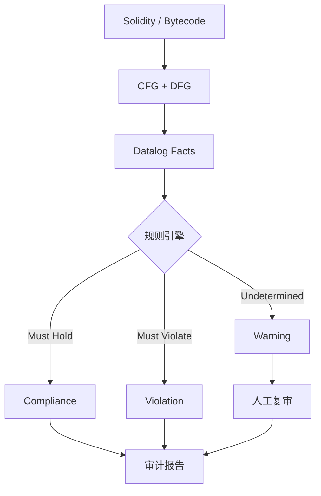

# ChainSecurity：形式化验证审计

> **TL;DR**：ChainSecurity 是 2017 年从苏黎世联邦理工学院（ETH Zürich）分拆的瑞士审计公司，创始人 Petar Tsankov、Hubert Ritzdorf、Arthur Gervais 等皆为该校 Secure, Reliable and Intelligent Systems Lab 校友。公司以"形式化验证（formal verification）驱动的审计"为差异化卖点，开源静态分析器 **Securify / Securify 2.0** 被以太坊基金会采用。客户侧重欧洲与机构化 DeFi（MakerDAO、Curve、Lido、Euler、Liquity、Compound、Ethereum Foundation、Yearn）。2021 年被 PwC 瑞士收购，成为四大会计所进入 Web3 审计的标志性事件。

## 1. 背景与动机

2018 年 ACM CCS 大会论文 "Securify: Practical Security Analysis of Smart Contracts" 发表，提出用 Datalog 推理规则在合约字节码上做漏洞判定。论文作者成立 ChainSecurity 做商业化。其理念：传统安全审计依赖人工经验，规模化瓶颈明显；形式化工具可把大量已知漏洞的"证明模板"沉淀为规则，对新合约自动判定 Must-Hold / May-Violate。

公司早期战略：

- 学术派背书（ETH Zürich 标签）赢得欧洲机构信任；
- 深度介入 MakerDAO、Curve 等"DeFi 基础设施"项目，成为"顶级 DeFi 的默认第二审计方"；
- 发表 research 博客，公开 incidents、漏洞分类。

2021 年被 PwC Switzerland 收购，获得会计师事务所的企业级销售渠道与审计背书；收购后 ChainSecurity 继续独立品牌运营，但合规、 ISO 27001、SOC 2 等受益于 PwC 体系。

## 2. 核心原理

### 2.1 Securify 形式化方法

Securify 的核心想法：把漏洞特征刻画为字节码上的"数据流 + 控制流 + 依赖"模式。流水线：

1. 对 EVM bytecode 做 SSA 转换；
2. 建立 CFG（控制流图）与 DFG（数据依赖图）；
3. 把依赖和事实转成 Datalog facts：`mayFollow(stmt1, stmt2)`、`depOn(var, sstore)` 等；
4. 给定漏洞规则：例如 Transaction Order Dependence（TOD）规则
   $$\text{violation} \iff \exists s_1, s_2: \text{sstore}(s_1) \land \text{sload}(s_2) \land \text{dep}(s_2, s_1)$$
5. 输出两类结论：
   - **Compliance**（certainly safe）
   - **Violation**（certainly unsafe）
   - 中间的 **Warning** 需要人工复核。

Securify 因此避免了纯 pattern match 的误报问题：规则同时表达"肯定满足"与"肯定违反"。

### 2.2 Securify 2.0

2.0 版重写为 Java（早期基于 Datalog + Soufflé），增加 20+ 新规则（delegatecall hazard、未校验 external call 返回、constant 函数修改状态、ERC-20 mint 无权限等）。2020 年起开源。

### 2.3 人工审计工作流

ChainSecurity 典型审计包含 3 阶段：

1. **Automated Analysis**：Securify + 其它工具（Slither）初审；
2. **Manual Review**：资深审计员 + 博士背景形式化研究员，重点关注经济模型、数学、跨合约交互；
3. **Formal Verification**（可选，高附加值）：使用 Certora、K Framework、Halmos 对关键函数写形式化 spec 并证明。

### 2.4 子机制拆解

1. **K-EVM / K Framework 支持**：部分项目用 K 框架做字节码级形式化；
2. **经济模型验证**：对 AMM / 借贷的 invariants（流动性不漏、偿付能力）用 Certora rule 证明；
3. **Fuzz + Invariant**：与 ToB 相似但侧重形式化；
4. **漏洞分类**：出具报告时使用 CSWE-like 分类；
5. **Post-Incident Research**：漏洞公开后发布研究博客（例：Curve Vyper 编译器漏洞、Euler donateToReserves）。

### 2.5 参数与边界

- **Securify 误报率**：学术评估 ~10% 低误报；
- **覆盖范围**：主要 Solidity / Vyper 合约；对 Move / Cairo 支持有限；
- **审计周期**：2–8 周，根据代码量；
- **成本**：每小时人工费高（与四大咨询接近），整体预算高于亚洲审计公司。

### 2.6 失败模式

- **Oracle 经济模型**：形式化方法对"价格被操纵"类攻击效果有限，仍依赖人工建模；
- **规则库维护**：Securify 规则库开源后社区贡献不多，部分规则对新 Solidity 语法支持滞后；
- **学术-工业 gap**：形式化 spec 编写成本高，不是所有项目都能负担；
- **升级 / 治理漏洞**：如 Compound 2021 年错误分发 COMP，属于治理流程问题，形式化难完全覆盖。



## 3. 架构剖析

### 3.1 分层视图

1. **工具层**：Securify / Securify 2 / K-EVM / Certora 集成；
2. **审计流程层**：Issue Tracker、内部仓库、双审；
3. **Research 层**：漏洞复盘、学术论文；
4. **交付层**：PDF 报告 + GitHub 审计列表页；
5. **企业合规层（PwC 侧）**：ISO 27001 / SOC 2 / GDPR 合规。

### 3.2 核心模块清单

| 模块 | 职责 | 依赖 | 可替换性 |
| --- | --- | --- | --- |
| Securify 2 | 静态分析 | Soufflé / Java | 可与 Slither 互补 |
| Certora 集成 | 形式化证明 | Certora Prover | 可替换为 Halmos |
| K-EVM | 规范 EVM 语义 | K Framework | 学术级，替代少 |
| Report Generator | 自动组装报告 | LaTeX | 可替换 |
| GitHub Page | 审计报告索引 | Jekyll | 可替换 |

### 3.3 一次典型审计流程

1. Scoping & NDA；
2. 客户提交 commit hash；
3. Automated pass：Securify + Slither + Mythril；
4. 人工审计 + Certora spec；
5. Daily sync + preliminary findings；
6. Final report（Critical / High / Medium / Low + 经济模型建议）；
7. Remediation review；
8. 公开报告（客户同意）。

### 3.4 参考实现 / 开源

- `ChainSecurity/securify`（v1，闭源停更）；
- `eth-sri/securify2`（v2，开源）；
- 部分审计报告公开 PDF。

### 3.5 扩展 / 互操作

- 与 Certora、Runtime Verification（K Framework）合作；
- 与 PwC 其它业务（税务、会计）形成 "Web3 综合服务"；
- 与 Ethereum Foundation 多次合作审计 protocol-level change（EIP-4844 / Pectra 相关组件）。

## 4. 关键代码 / 实现细节

Securify 规则示例（简化 Datalog，类似 `eth-sri/securify2` 规则）：

```datalog
// Transaction Order Dependence
isTODRisk(sload_stmt, sstore_stmt) :-
   sload(sload_stmt, var),
   sstore(sstore_stmt, var),
   mayPrecede(sstore_stmt, sload_stmt),
   externalCall(sstore_stmt).
```

Certora Spec 示例（ChainSecurity 在 Lido / Euler 审计中使用）：

```
rule preserveTotalShares(method f) {
    env e;
    uint256 sharesBefore = getTotalShares();
    calldataarg args;
    f(e, args);
    uint256 sharesAfter = getTotalShares();
    assert sharesAfter >= sharesBefore || isMintOrBurn(f),
        "Total shares must be preserved unless mint/burn";
}
```

运行：

```bash
certoraRun contracts/Vault.sol --verify Vault:spec/Vault.spec \
   --settings -assumeUnwindCond,-optimisticFallback=true
```

## 5. 演进与版本对比

| 年份 | 里程碑 | 影响 |
| --- | --- | --- |
| 2018 | Securify v1 + 公司成立 | 形式化审计兴起 |
| 2020 | Securify 2 开源 | 社区可复用 |
| 2021 | 被 PwC 收购 | 企业级背书 |
| 2022+ | Lido / Curve / MakerDAO 深度合作 | DeFi 蓝筹首选 |
| 2023+ | EIP-4844 / EigenLayer 等关键协议审计 | L1 / L2 协议层审计 |

## 6. 实战示例

ChainSecurity 对 MakerDAO Endgame 模块审计的流程（公开报告示例）：

1. 客户提交 `makerdao/endgame` commit；
2. 形式化团队先写 Certora spec，编码关键 invariants（如 DAI 偿付能力）；
3. 自动化工具扫描新增模块；
4. 人工团队与客户 daily sync；
5. 发现问题写入 report，Critical 需 48h 内反馈；
6. 修复后再审，最终 PDF 发布到 ChainSecurity 官网与 MakerDAO 论坛。

## 7. 安全与已知攻击

- **Curve 流动性池 Vyper 编译器漏洞（2023）**：部分受影响池子由 ChainSecurity 审计，但漏洞源自 Vyper 编译器的 reentrancy lock bug（版本不匹配），ChainSecurity 发表技术博客分析并推动行业审计 Vyper 依赖；
- **Euler Hack（2023）**：Euler 有过多方审计包括 ChainSecurity，问题出现在 `donateToReserves` 对账户健康度检查遗漏；事件复盘推动"Donate 类函数必须与健康度强耦合"成为行业最佳实践；
- **Compound COMP 分发事故（2021）**：治理 + 代码路径问题；
- **哲学**：形式化是"穷举所有输入"，但 spec 是人写的——spec 遗漏某条件则证明无意义。因此"spec coverage" 本身需要 peer review。

## 8. 与同类方案对比

| 维度 | ChainSecurity | Trail of Bits | OpenZeppelin | Certora（工具为主）|
| --- | --- | --- | --- | --- |
| 形式化深度 | 强（ETH 学派）| 强（Slither/Echidna）| 中 | 工具提供方 |
| 企业合规 | 强（PwC 背书）| 中 | 中 | 中 |
| 客户群 | 欧洲机构 DeFi | 美国 Top DeFi | 通用 | 供所有审计方使用 |
| 开源工具 | Securify 2 | Slither/Echidna 等 | Contracts | Certora CLI |
| 价格 | 高 | 高 | 高 | 工具订阅 |

## 9. 延伸阅读

- **官网**：`https://chainsecurity.com`
- **Research 博客**：`https://chainsecurity.com/research`
- **审计报告集**：`https://chainsecurity.com/smart-contract-audit-reports/`
- **Securify 论文**：Tsankov et al., "Securify: Practical Security Analysis of Smart Contracts", CCS 2018
- **Securify 2 源码**：`https://github.com/eth-sri/securify2`
- **Certora**：`https://www.certora.com/`
- **K-EVM**：`https://github.com/runtimeverification/evm-semantics`

## 10. 术语表

| 术语 | 英文 | 释义 |
| --- | --- | --- |
| Datalog | Datalog | 逻辑编程推理语言 |
| CFG | Control Flow Graph | 控制流图 |
| DFG | Data Flow Graph | 数据流图 |
| TOD | Transaction Order Dependence | 交易序依赖 |
| Formal Verification | Formal Verification | 形式化验证 |
| K Framework | K Framework | 形式语义执行框架 |
| Spec Coverage | Spec Coverage | 形式化规范覆盖范围 |

---

*Last verified: 2026-04-22*
