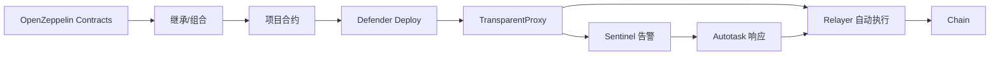

# OpenZeppelin：Contracts、Defender 与审计业务

> **TL;DR**：OpenZeppelin（OZ）是 2015 年在阿根廷成立的 Web3 基础设施与安全公司，三条业务线：① **OpenZeppelin Contracts**（Solidity 组件库，事实标准 ERC 实现，下载量占据生态 80%+）；② **Defender**（智能合约运维平台，提供 Relayer、Autotasks、Sentinel、Upgrades 等）；③ **Security Services**（审计 + Incident Response + Learn 培训）。OZ Contracts 是几乎所有合约项目的依赖，Defender 则让链上运维从 shell 脚本走向类 AWS 的 SaaS 流程。审计客户包括 Compound、Aave、Ethereum Foundation、The Graph、Celo、Tezos 等。

## 1. 背景与动机

2015 年，Manuel Araoz 与 Demian Brener 联合创立 OpenZeppelin，初始项目是 "Zeppelin Solutions" 咨询公司。2017 年开源 `zeppelin-solidity`（后更名 `openzeppelin-contracts`），以"安全、模块化、可审计"的 ERC-20 / ERC-721 / AccessControl 实现快速成为行业默认依赖。动机很直接：当时 Parity Multisig Wallet 被盗 3 次、DAO 攻击重挫以太坊，大多数合约开发者缺乏安全工程经验，反复造轮子写基础原语导致相同漏洞反复出现。一个经过审计、社区共治的"标准库"可以显著降低行业熵。

2018 年推出审计咨询业务，与 ConsenSys Diligence / Trail of Bits 形成三足鼎立的早期审计格局。2019–2020 年孵化 **Defender**：源于审计客户频繁问到"上线后如何运维、如何响应链上事件、如何升级合约"。Defender 把"Relayer（密钥管理自动化发送 tx）、Autotasks（定时任务）、Sentinel（事件告警）、Admin（多签治理）、Upgrades（代理模式 DevOps）"整合为 SaaS。2022 年完成 5,000 万美元 B 轮融资（Coatue 领投）。

## 2. 核心原理

### 2.1 Contracts 设计哲学

OZ Contracts 的设计原则可概括为：

1. **安全优先**：默认提供最安全实现，再通过组合开放灵活性；
2. **模块化**：`ERC20`、`ERC20Permit`、`ERC20Votes`、`ERC20Burnable` 按需继承；
3. **不变式显式化**：重要 invariants 出现在 NatSpec 中；
4. **升级兼容**：`openzeppelin-contracts-upgradeable` 保证 storage layout 向前兼容；
5. **最小依赖**：合约库内部不引入第三方库，易审计。

### 2.2 形式化不变式示例

以 ERC-20 合约为例，OZ 声明的关键不变式：

- **总供应守恒（无 mint/burn 时）**：$\sum_i \text{balanceOf}(i) = \text{totalSupply}$；
- **转账不创造价值**：`transfer(to, x)` 后 `balanceOf(from) + balanceOf(to)` 不变；
- **Allowance 单调更新**：只能被 owner 的 `approve`、或 `transferFrom` 内部扣减。

这些 invariants 在 OZ 的 test-suite 里以 Foundry / Hardhat 测试编码，社区 fork 后常用 Certora / Halmos 做形式化证明。

### 2.3 AccessControl 与 Role-Based 模型

OZ `AccessControl` 用 bytes32 role 标识权限，支持 `hasRole / grantRole / revokeRole`；`AccessManager`（v5.0+）进一步支持 time-locked、批量授权、delay execution。形式化：

- Role 集合 $R$，地址集合 $A$，状态 $S \subseteq A \times R$；
- `grantRole(r, a)`：需要 `hasRole(admin(r), msg.sender)`；
- `onlyRole(r)`：$f$ 只能由 $a: (a, r) \in S$ 调用。

### 2.4 Proxy / Upgradeability 模式

OZ 提供三种主要代理：

1. **TransparentUpgradeableProxy**（EIP-1967）：管理员调用会路由到 proxy admin，其他调用 delegatecall 到 implementation；
2. **UUPSProxy**（EIP-1822）：升级逻辑在 implementation 中，通过 `_authorizeUpgrade` 控制；
3. **BeaconProxy**：多个代理共享一个 beacon 指向的 implementation。

三种对应不同 trade-off：TransparentProxy 简单但 admin 每次路由额外消耗 gas；UUPS gas 更省但实现者容易写错导致合约"砖化"；Beacon 适合同类多实例场景（ERC-721 工厂、子 DAO）。

### 2.5 Defender 核心原理

Defender 把链上运维解构为：

- **Relayer**：托管 tx 发送，自带 gas 管理、重发、replay protection、EIP-1559 费用策略；
- **Autotasks**：无服务器函数（类似 AWS Lambda），按 cron 或事件触发；
- **Sentinel**：订阅链上事件或条件，触发告警 / Autotask / Webhook；
- **Admin**：多签 + timelock 的 UI；
- **Deploy & Upgrades**：一键部署 + 升级，校验 storage layout 兼容；
- **Audit**：集成 OZ 审计报告交付。

### 2.6 参数与常量

- **Relayer 签名密钥**：KMS 托管，私钥不出 HSM；
- **Autotasks 执行时限**：默认 300s；
- **Sentinel 最小轮询间隔**：60s；
- **Contracts 版本策略**：主干版本 v5（2024 后），v4 仍维护；每次 major bump 可能打破兼容。

### 2.7 边界条件与失败模式

- **升级危险**：若实现合约修改 storage 布局或新增状态变量位置错误，升级后数据错乱（历史事件：OpenZeppelin 曾因此发文警告 `__gap` 机制）；
- **UUPS 砖化**：若新 implementation 不继承 `UUPSUpgradeable`，下次升级不可执行；
- **Role 遗漏**：Owner / Admin 未移交给 timelock，单点私钥泄漏可摧毁协议；
- **Relayer 密钥**：尽管 KMS 保护，Defender 账号一旦泄漏仍可 drain gas 或发恶意 tx，需 2FA + role 分权。



## 3. 架构剖析

### 3.1 分层视图

1. **Contracts 库层**（开源、客户端本地引入）；
2. **Audit & Research 层**（服务 + 公开博客）；
3. **Defender SaaS 层**：API Gateway / Relayer Cluster / Autotask Runtime / Sentinel Engine / Admin UI；
4. **Integrations 层**：GitHub Actions、Hardhat / Foundry 插件、Wizard（Web IDE）；
5. **社区层**：论坛、Ethernaut / Damn Vulnerable DeFi 教学。

### 3.2 核心模块清单

| 模块 | 职责 | 依赖 | 可替换性 |
| --- | --- | --- | --- |
| openzeppelin-contracts | Solidity 组件 | solc | 事实标准，可替代成本高 |
| contracts-upgradeable | 升级版 | storage-gap | 同上 |
| Defender Relayer | 托管 tx | KMS + Infura | 可替换 Gelato / Pimlico 部分 |
| Defender Autotasks | Serverless | 类 Lambda | 可替换自建 |
| Defender Sentinel | 事件监控 | Forta 类似 | 可替换 Tenderly Alerts |
| Defender Admin | 多签 UI | Safe 集成 | 可用 Safe + 自建脚本 |
| Wizard | 合约脚手架 | Web | Remix 类似 |

### 3.3 一次"合约上线+运维"端到端

1. 开发者在 `Wizard` 里选择 ERC-20 + AccessControl + UUPS → 下载脚手架；
2. Foundry 本地测试 → OZ 审计；
3. Defender `Deploy` 部署到主网；
4. Admin 配置多签 + timelock；
5. Sentinel 订阅"异常大额 transfer"事件；
6. Autotask 在触发时自动调用 `pause()`；
7. 后续升级通过 Defender UI 校验 storage layout 后执行。

### 3.4 参考实现

- GitHub：`OpenZeppelin/openzeppelin-contracts`（主库）、`-upgradeable`（升级版）、`defender-client`（Node.js SDK）、`openzeppelin-test-helpers`。
- Defender 后端闭源，但 SDK 与 Webhook 协议开放。

### 3.5 扩展 / 互操作

- 与 **Safe**（Gnosis Safe）深度集成；
- 与 **Foundry / Hardhat** 官方插件 `hardhat-upgrades`；
- 与 **Tenderly** 联动：Defender Sentinel → Tenderly Alerts；
- **Certora**：OZ 自身用 Certora 证明 Contracts 库若干关键 invariant。

## 4. 关键代码 / 实现细节

ERC-20 转账主干（`openzeppelin-contracts/contracts/token/ERC20/ERC20.sol`，v5.x）：

```solidity
function _update(address from, address to, uint256 value) internal virtual {
    if (from == address(0)) {
        _totalSupply += value;           // mint
    } else {
        uint256 fromBalance = _balances[from];
        if (fromBalance < value) revert ERC20InsufficientBalance(from, fromBalance, value);
        unchecked { _balances[from] = fromBalance - value; }
    }
    if (to == address(0)) {
        unchecked { _totalSupply -= value; } // burn
    } else {
        unchecked { _balances[to] += value; }
    }
    emit Transfer(from, to, value);
}
```

UUPS 升级授权（`UUPSUpgradeable.sol`）：

```solidity
function _authorizeUpgrade(address newImplementation) internal virtual;
function upgradeToAndCall(address newImpl, bytes memory data) public payable onlyProxy {
    _authorizeUpgrade(newImpl);
    _upgradeToAndCallUUPS(newImpl, data);
}
```

Defender Relayer Node.js SDK（`defender-client`，`defender-relay-client`）：

```ts
import { Relayer } from "defender-relay-client";
const relayer = new Relayer({ apiKey, apiSecret });

const tx = await relayer.sendTransaction({
  to: "0x...",
  value: 0,
  data: "0x1234...",
  gasLimit: 200_000,
  speed: "fast", // 自动 EIP-1559
});

console.log(tx.hash);
```

Sentinel + Autotask 典型组合：事件 `Transfer(from, to, amount) where amount > 1000 ETH` → 触发 Autotask `pausePool()`。

## 5. 演进与版本对比

| 版本 | 时间 | 关键变化 |
| --- | --- | --- |
| v2.x | 2018 | ERC-20/721/1155 基础 |
| v3.x | 2020 | 模块化、CAcess 控制重构 |
| v4.x | 2021 | Solidity 0.8+, `AccessControl`, `ERC20Permit` |
| v4.8+ | 2023 | Governor、ERC-2771 meta-tx |
| v5.0 | 2024 | Solidity 0.8.20+, `AccessManager`, 移除 deprecated, gas 优化 |
| Defender 1.0 | 2020 | Relayer + Autotasks |
| Defender 2.0 | 2023 | 新 UI + Deploy 统一 |

## 6. 实战示例

最小 ERC-20 + UUPS 升级合约：

```solidity
// MyToken.sol
import "@openzeppelin/contracts-upgradeable/token/ERC20/ERC20Upgradeable.sol";
import "@openzeppelin/contracts-upgradeable/proxy/utils/UUPSUpgradeable.sol";
import "@openzeppelin/contracts-upgradeable/access/OwnableUpgradeable.sol";

contract MyToken is ERC20Upgradeable, OwnableUpgradeable, UUPSUpgradeable {
    function initialize() public initializer {
        __ERC20_init("MyToken", "MTK");
        __Ownable_init(msg.sender);
        __UUPSUpgradeable_init();
        _mint(msg.sender, 1_000_000 ether);
    }
    function _authorizeUpgrade(address) internal override onlyOwner {}
}
```

部署命令（hardhat-upgrades）：

```bash
npx hardhat run scripts/deploy.js --network mainnet
# deploy.js:
# const proxy = await upgrades.deployProxy(MyToken, [], { kind: "uups" });
```

## 7. 安全与已知攻击

- **Storage Layout 升级事故**：社区不止一次因为未使用 `__gap` 导致升级后变量错位，OZ 发文告警；
- **Transparent vs UUPS 混用**：若把 Transparent 版合约当作 UUPS 升级，导致无法再升级；
- **Initializer 攻击**：忘记 `initializer` 修饰符可能被外部调用重新初始化（CVE 类）；
- **Defender Relayer 权限**：曾有客户因为 API key 泄漏导致 tx 乱发，需强制 IP allowlist 与 role 分权；
- **ERC-2612 Permit 钓鱼**：OZ Permit 实现默认启用 EIP-712；用户被诱导签名后，攻击者可消耗 allowance（非 OZ 库的 bug，但使用者需注意）。

## 8. 与同类方案对比

| 维度 | OpenZeppelin | solmate / Solady | Safe / 4337 基建 | Thirdweb Contracts |
| --- | --- | --- | --- | --- |
| 合约库 | 最全、最安全 | Gas 极致优化但安全边界更少 | 侧重钱包 / AA | 模板化，配套 SaaS |
| 升级 | TransparentProxy / UUPS / Beacon | 无原生 | Modules | Cloned proxies |
| 运维 | Defender | 无 | 无 | Engine |
| 审计 | 有 | 无 | 有 | 有 |
| 客户 | 通用 | 偏 high-performance DeFi | 钱包 | Web2 风格团队 |

## 9. 延伸阅读

- **Contracts 文档**：`https://docs.openzeppelin.com/contracts/5.x/`
- **Defender 文档**：`https://docs.openzeppelin.com/defender/`
- **GitHub**：`https://github.com/OpenZeppelin/openzeppelin-contracts`
- **博客**：`https://blog.openzeppelin.com`
- **Ethernaut**：`https://ethernaut.openzeppelin.com/`
- **Damn Vulnerable DeFi**：`https://www.damnvulnerabledefi.xyz/`
- **OZ Forum**：`https://forum.openzeppelin.com/`

## 10. 术语表

| 术语 | 英文 | 释义 |
| --- | --- | --- |
| UUPS | Universal Upgradeable Proxy Standard | 代理内升级 |
| Beacon | Beacon Proxy | 多代理共享实现 |
| Initializer | Initializer Modifier | 代理合约初始化保护 |
| Storage Gap | `__gap` | 保留 slot 兼容未来扩展 |
| Relayer | Gas Relayer | 托管 tx 发送 |
| Autotask | Serverless function | 链下自动化 |
| Sentinel | Event Sentinel | 链上事件订阅 |

---

*Last verified: 2026-04-22*
