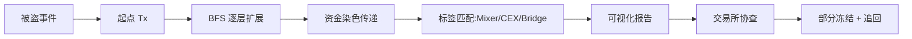

# 慢雾科技：威胁情报与 MistTrack

> **TL;DR**：SlowMist（慢雾科技）是 2018 年由余弦（Cosine）创立的中国/亚洲核心的 Web3 安全公司，业务覆盖 **Smart Contract Audit**、**Blockchain Threat Intelligence (BTI)**、**MistTrack**（反洗钱与资金追踪平台）、**SlowMist Hacked**（黑客事件公开数据库）、**Red Team Pentest** 等。慢雾以维护亚洲头部交易所安全、发布年度 "Blockchain Security Report" 与 "SlowMist Hacked" 公共事件库著称，其技术强项在链上追踪、黑客资金画像与应急响应，是多起重大黑客事件（Poly Network、KuCoin、PancakeBunny、Ronin 等）的协查方。

## 1. 背景与动机

中国互联网安全圈"余弦"于 2018 年创立慢雾科技，早期团队来源于知道创宇（Knownsec）等传统安全公司。在 2017–2018 年 ICO 泡沫与交易所被盗高峰期（Coincheck 5 亿美元、Bithumb 等），亚洲交易所急需本地化的安全服务商。慢雾以"区块链生态安全守护者"为定位切入市场，早期客户包括火币、OKEx、币安、Pundi X 等。

慢雾的产品线发展可分三阶段：

- **2018–2020**：以智能合约审计为主，兼做交易所渗透测试、Web2 安全；编制 "Cryptocurrency Security Audit Guide" 开源手册。
- **2020–2022**：DeFi Summer 后，链上追踪与反洗钱需求激增，衍生出 **MistTrack**（商业化反洗钱 / 资金追踪产品）；与此同时建立 **SlowMist Hacked** 公共数据库，收录历年黑客事件。
- **2022–至今**：构建威胁情报 **BTI** 子品牌，推出 **AML API**、**Wallet Risk Scoring**、**Address Labels** 对外开放，并深度介入链上应急响应（Incident Response）。

慢雾的文化特色：创始人余弦亲自维护 Twitter、持续发布"黑客钱包 Alert"；团队开源多种工具（如 Web3 安全备忘录、EVM 攻击路径字典等），在社区有较强技术声誉。

## 2. 核心原理

### 2.1 威胁情报建模

慢雾的 BTI（Blockchain Threat Intelligence）平台把链上威胁实体统一建模为 IOC（Indicators of Compromise），分为：

- **Address IOC**：恶意地址、黑客钱包、诈骗合约；
- **Contract IOC**：已知漏洞合约、钓鱼 dApp；
- **Domain IOC**：钓鱼域名、克隆站；
- **Signature IOC**：恶意交易模式（如 eth_sign 盲签、permit 骗局、approve drain）；
- **Actor IOC**：APT 组织（如 Lazarus）画像。

形式化：BTI 每条 IOC 记录包含 `{id, type, value, first_seen, last_seen, tags[], confidence, related_incidents[]}`。

### 2.2 资金追踪算法（MistTrack）

MistTrack 以"泵送分层（Layered Propagation）"模型追踪黑客资金：

1. **起点定位**：从被害合约或钱包起，识别首笔被盗 tx；
2. **BFS 扩展**：对所有接收方做广度优先搜索，设置最大跳数 $h_{max}$（默认 6）；
3. **金额染色（Taint Propagation）**：按比例把"脏钱"份额传递给下一跳，每一跳有衰减因子 $\lambda$（可配置 0.5–1.0）：
   $$ d_{v_j} = \sum_{v_i \to v_j} d_{v_i} \cdot \frac{a_{ij}}{\sum_k a_{ik}} $$
   其中 $d$ 为脏钱份额、$a$ 为实际转账金额；
4. **节点标签化**：结合地址标签库（交易所、桥、混币器、DEX）判断资金去向；
5. **合并聚类**：对 UTXO 链用 CIH，对账户模型使用行为聚类；
6. **可视化**：Sankey 图或节点图，辅助人工核验。

### 2.3 子机制拆解

1. **SlowMist Hacked DB**：公开的区块链被黑事件库（`hacked.slowmist.io`），每条记录含时间、项目、损失金额、攻击手法；
2. **AML / Wallet Screening API**：对外提供 REST API，返回地址风险等级（Low / Medium / High / Blackmail）；
3. **Incident Response**："黑客发生后 4 小时内响应"服务，协同交易所冻结与交易所链下沟通；
4. **Scam Sniffer 合作**：与 Scam Sniffer 浏览器插件互通钓鱼情报；
5. **Red Team**：合约 + Web2 渗透 + 社工（员工钓鱼）三合一；
6. **审计**：与 CertiK、OpenZeppelin 类似，但侧重实际攻击面与交易所对接经验。

### 2.4 参数与常量

- **MistTrack 默认跳数**：6 hops；
- **染色衰减**：可调 0.5–1.0；
- **AML API 风险等级**：Low / Medium / High / Black，对应 0–25 / 26–50 / 51–80 / 81–100 风险分；
- **Hacked DB 更新**：公开事件 24h 内入库；
- **审计周期**：平均 2–4 周。

### 2.5 边界条件与失败模式

- **跨链断点**：Wormhole / LayerZero / CCTP 等桥接的 burn-mint 必须由标签库维护映射；
- **混币器盲区**：Tornado Cash / Railgun 后基本无法精确追踪，只能给出概率分布；
- **地址污染（Dust Attack）**：对手恶意发送小额到无关用户，造成标签错误；
- **时间滞后**：黑客事件资金跑得快（分钟级），人工标注的标签更新速度有限。



## 3. 架构剖析

### 3.1 分层视图

1. **数据采集层**：自建全节点（BTC / ETH / BSC / Tron / Solana / Polygon / Arbitrum / Optimism 等）+ 第三方 RPC 冗余；
2. **ETL & 聚类层**：Spark / Flink + Neo4j 图数据库；
3. **标签与情报层**：人工标注 + 机器学习；
4. **分析与追踪层**：MistTrack 引擎 + Sankey / Graph viz；
5. **对外 API & Console**：Web 门户 + AML API + Webhook。

### 3.2 核心模块清单

| 模块 | 职责 | 依赖 | 可替换性 |
| --- | --- | --- | --- |
| Node Farm | 全节点 / RPC | 自建 + 第三方 | 可替换 |
| Label DB | 地址标签库 | 内部爬虫 + 人工 | 与 Etherscan Label 互补 |
| MistTrack Engine | 资金追踪 | Neo4j + 自研 | 独有能力 |
| AML API | 反洗钱查询 | Label DB + 聚类 | 与 Chainalysis KYT 类似 |
| Audit Platform | 审计流程 | GitLab + Issue Tracker | 通用 |
| BTI Feed | 威胁情报输出 | STIX / TAXII 协议 | 可对接 SIEM |
| Hacked DB | 公开事件库 | 人工维护 | 公益性质 |

### 3.3 数据流：一次被盗响应

1. 被害方联系慢雾应急；
2. 慢雾获取被盗地址与首笔可疑 tx；
3. MistTrack 跑 BFS + 染色，输出可疑去向（典型：CEX、Tornado、跨链桥）；
4. 团队联系相关 CEX 冻结资金；
5. 输出 "Hacked Case Report" 与建议（是否发布公告、是否联系警方）；
6. 黑客钱包进入 BTI Feed，所有订阅 VASP 自动告警。

### 3.4 参考实现 / 开源工具

慢雾 GitHub（`github.com/slowmist`）开源了多项实用工具：

- `Knowledge-Base`：Web3 安全知识库；
- `Cryptocurrency-Security-Audit-Guide`：审计手册；
- `Web3-Project-Security-Practice-Requirements`：项目安全实践；
- `SolanaSmartContractSecurityBestPractices`；
- `MetaMaskPlug-inWalletSecurityAuditing`。

### 3.5 扩展 / 互操作

- **API Key 方案**：企业客户获取 API Key 后可调用 AML、Label、Tracking 接口；
- **Webhook**：资金进入高危地址时告警；
- **Telegram Bot**：SlowMistHackedBot 等；
- **与 Chainalysis / TRM 互补**：部分交易所同时订阅 SlowMist AML + Chainalysis，用于不同链或交叉验证。

## 4. 关键代码 / 实现细节

MistTrack AML API 的查询示例（来自 `misttrack.io/aml_api`）：

```bash
curl -X GET "https://openapi.misttrack.io/v1/risk_score" \
  -H "API-KEY: $SM_KEY" \
  --data-urlencode "coin=ETH" \
  --data-urlencode "address=0x0000000000000000000000000000000000000000"
```

响应示例（简化）：

```json
{
  "success": true,
  "data": {
    "risk_score": 88,
    "risk_level": "High",
    "address_labels": ["Sanctioned", "Hacker"],
    "hacking_event": "Ronin Bridge",
    "detail_list": ["Mixer", "Stolen Coins"]
  }
}
```

慢雾开源的 Solana 程序安全 lint 规则片段（`slowmist/SolanaSmartContractSecurityBestPractices`）：

```rust
// 避免 Integer Overflow（Solana 程序常见问题）
let new_balance = account.balance
    .checked_add(amount)
    .ok_or(ErrorCode::Overflow)?;

// 避免 signer 绕过
if !ctx.accounts.user.is_signer {
    return Err(ErrorCode::NotSigner.into());
}

// PDA 校验
let (expected, _) = Pubkey::find_program_address(&[b"vault", user.key.as_ref()], ctx.program_id);
require!(expected == ctx.accounts.vault.key(), ErrorCode::InvalidPDA);
```

## 5. 演进与版本对比

| 里程碑 | 时间 | 变化 | 影响 |
| --- | --- | --- | --- |
| 慢雾成立 | 2018 | 合约审计 + 交易所渗透测试 | 立足亚洲市场 |
| Hacked DB | 2019 | 公开事件库 | 增强行业影响力 |
| MistTrack 发布 | 2020 | 资金追踪平台 | 覆盖 BTC/ETH 为主 |
| AML API | 2022 | 企业级反洗钱查询 | 与 Chainalysis KYT 形成竞品 |
| 多链扩展 | 2023 | 新增 Tron / Solana / Arbitrum 等 | 覆盖亚洲 USDT 洗钱场景 |
| AI 辅助 | 2024 | 标签标注 + 审计辅助引入 LLM | 效率提升 |

## 6. 实战示例

场景：项目方发现合约被盗 1,000 ETH。

```
1. 记录首笔异常 tx：0xabc...
2. 登录 MistTrack，输入被盗地址 → 生成追踪图
3. 查看"关键出口"：发现 800 ETH 进入 Tornado，200 ETH 进入 Binance
4. 导出 JSON 报告 → 提交给 Binance 合规邮箱（cs@binance.com）
5. 同时联系 SlowMist 应急团队（可选）协助
6. 结果：200 ETH 被 Binance 冻结，Tornado 部分暂无法追回
```

MistTrack 图上可直接点击任一节点查看标签，支持多跳路径高亮。

## 7. 安全与已知攻击

- **Poly Network（2021）**：慢雾是最早发布追踪报告的团队之一，帮助定位黑客 IP（通过 metadata 侧信道）；
- **KuCoin Hack（2020）**：协助 CEX 冻结部分 USDT；
- **Ronin / Harmony Bridge**：参与 Lazarus 组织资金画像；
- **Euler / Mango / Wintermute**：公开复盘；
- **MistTrack 的局限**：面对 Tornado / Railgun 等隐私协议时效果降低，需要时间差分析 + 出金交易所协查。

慢雾也面对竞争压力：2024 年 Chainalysis、TRM 加大中国/亚洲覆盖，慢雾在保持本地化优势的同时增强 API 产品化。

## 8. 与同类方案对比

| 维度 | SlowMist | Chainalysis | TRM Labs | PeckShield |
| --- | --- | --- | --- | --- |
| 审计 | 强 | 无 | 无 | 强 |
| 资金追踪 | MistTrack 强 | Reactor 强 | Forensics 强 | CoinHolmes |
| AML API | 有 | KYT | Wallet Screening | 有 |
| Incident Response | 强（亚洲）| 强（美）| 强（全球）| 强（亚洲）|
| 公开事件库 | SlowMist Hacked（业界最大公开库之一）| Crypto Crime Report | 年报 | 有 |
| 地理 | 中国 + 亚洲 | 美国 + 欧洲 | 美国 | 中国 + 美国 |
| 开源社区 | 活跃 | 闭源 | 闭源 | 中等 |

## 9. 延伸阅读

- **慢雾官网**：`https://www.slowmist.com/`
- **MistTrack**：`https://misttrack.io/`
- **SlowMist Hacked**：`https://hacked.slowmist.io/`
- **GitHub**：`https://github.com/slowmist`
- **余弦 Twitter**：`https://twitter.com/evilcos`
- **审计手册**：`https://github.com/slowmist/Cryptocurrency-Security-Audit-Guide`
- **年度区块链安全报告**：慢雾每年 Q1 发布

## 10. 术语表

| 术语 | 英文 | 释义 |
| --- | --- | --- |
| BTI | Blockchain Threat Intelligence | 区块链威胁情报 |
| IOC | Indicator of Compromise | 入侵指标 |
| Taint | Taint Propagation | 脏钱染色传播 |
| AML | Anti-Money Laundering | 反洗钱 |
| Mixer | Mixer / Tumbler | 混币器 |
| SIEM | Security Information and Event Management | 安全信息事件管理 |
| CIH | Common Input Heuristic | UTXO 聚类启发式 |

---

*Last verified: 2026-04-22*
