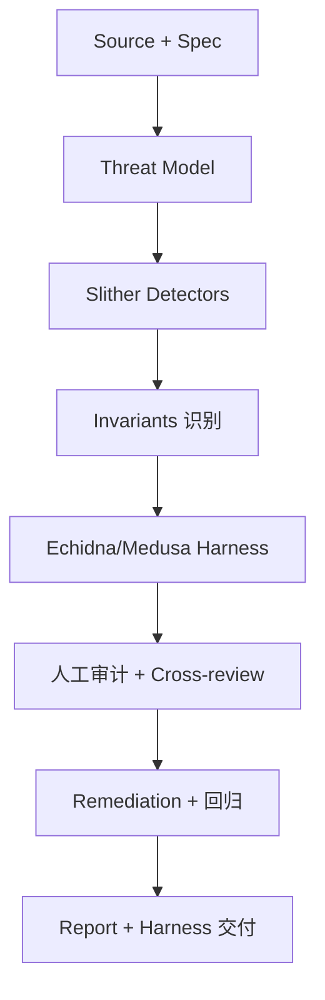

# Trail of Bits：Slither / Echidna / Medusa 作者与高端审计

> **TL;DR**：Trail of Bits（ToB）是 2012 年在美国创立的传统 Cyber Security 咨询公司，2017 年起深入区块链审计领域，至今是业内技术深度第一梯队。ToB 的独特之处在于不仅卖审计服务，更**开源了影响全行业的工具**：**Slither**（Solidity 静态分析）、**Echidna**（Haskell 编写的 property-based fuzzer）、**Medusa**（Go 版 coverage-guided fuzzer）、**Manticore**（符号执行引擎）、**crytic-compile**、**Necessist**（mutation testing），以及 secure-contracts.com 教学资源。ToB 审计客户包括 Compound、MakerDAO、Uniswap、Optimism、Aave、Polygon、Circle、dYdX、Aztec、Starkware、Chia 等顶级协议。

## 1. 背景与动机

Trail of Bits 由 Dan Guido、Alex Sotirov、Dino Dai Zovi 于 2012 年在纽约创立，原始业务是美国国防工业、金融机构的安全咨询，早期以 Binary Exploitation、OS Security、CTF 顶尖队伍著称（夺冠 DEF CON CTF）。2017 年 DAO 攻击后，创始团队意识到智能合约将是一个需要"传统安全工程思维"深度介入的领域。

与许多 Web3-native 审计公司不同，ToB 从第一天就坚持两点：

1. **开源工具为公共基础设施**：审计员内部用什么，就开源什么；
2. **Research-first**：通过长篇博客、论文与 EF 合作，推动协议安全规范化。

这导致 ToB 的审计报告被视为"教科书级"——不仅修复 bug，还能指出工程化不足（缺少 invariant tests、缺乏 chaos fuzzing、依赖不受控）。其客户往往是"已经审计过的、仍然想找到最难发现的问题"的头部协议。

## 2. 核心原理

### 2.1 审计方法论：Competition-style × Engineering

ToB 的审计流程在业内最为工程化：

1. **Threat Modeling**：基于项目 Spec，列出攻击者模型（能力边界、目标）与关键资产；
2. **Automated Analysis**：Slither + crytic-compile 跑全套 detectors；
3. **Fuzzing Harness 构建**：为核心 invariants 编写 Echidna 或 Medusa harness；
4. **Manual Review**：资深审计员按模块拆分，交叉审阅；
5. **Invariant 驱动**：所有安全属性用代码表达，在 Foundry / Echidna 中可复现；
6. **Deliverables**：报告 + 可运行的 fuzz harness（客户可长期用于 CI）。

### 2.2 Slither 原理

Slither（ToB/crytic 开源）是一个 Solidity 静态分析器。其流水线：

1. 使用 `solc --ast` 或 crytic-compile 获取 AST + ABI；
2. 转换成 **SlithIR**（Slither 自定义的 SSA IR），语义更接近三地址码；
3. 内建 80+ detectors（reentrancy、uninitialized state、shadowing、tx.origin、dangerous delegatecall、constant functions changing state 等）；
4. 提供 `printer`（调用图、数据依赖）与 `tool`（`slither-check-upgradeability`、`slither-prop` 自动生成不变式）。

### 2.3 Echidna 原理

Echidna（Haskell）是 property-based fuzzer：

1. 用户在 Solidity 合约里写 `echidna_` 前缀的布尔函数作为 invariant；
2. Echidna 会随机生成 tx 序列（constructor + 随机调用）；
3. 使用 **coverage-guided** 策略：若新 tx 覆盖到新 PC（program counter），则保留序列并变异；
4. 一旦 `echidna_*` 返回 false，报告反例序列；
5. 支持 shrinking（最小反例）、corpus、multi-ABI、assertion mode（`assert(false)`）。

形式化：Echidna 在搜索空间 $\Sigma^*$（合约调用序列）中找 $\sigma \in \Sigma^*$ 使 $\phi(\sigma) = \bot$。

### 2.4 Medusa 原理

Medusa 是 2022 年开源的 Go 版 coverage-guided fuzzer，目标是做"Echidna 的继任者"：

- 多核并行，单机 fuzz 速度约是 Echidna 的 5–10×；
- 直接用 go-ethereum 的 EVM 实现，运行时开销小；
- 支持 Foundry-style cheatcodes（`vm.prank` / `vm.warp`）；
- 内置 shrinking 与 corpus 管理；
- 与 Slither 互补。

### 2.5 Manticore 原理

Manticore 是符号执行（symbolic execution）引擎：

1. 对 EVM 字节码执行符号解释；
2. 在分支处分裂执行路径，累积路径约束；
3. 用 SMT 求解器（Z3 / Yices）尝试满足；
4. 典型用途：自动生成触发漏洞的输入、证明绝对不能达到的状态。

由于可扩展性问题（路径爆炸），近年 ToB 更多推 fuzzing，但 Manticore 在特殊场景（加密库、小模块形式化）仍有价值。

### 2.6 子机制、参数与失败模式

- **Harness 要求**：审计期间 ToB 会交付可运行 harness，客户必须持续跑（否则价值衰减）；
- **Fuzz 时长**：关键 invariants 推荐 CI 中跑 ≥ 1h，pre-release 跑 ≥ 24h；
- **Slither false positive**：某些 detectors 噪声大（如 `naming-convention`），实际使用要配置；
- **失败模式**：fuzzing 依赖 harness 质量，若 invariants 错误表达，fuzzer 给的是"看起来过了"；Manticore 对复杂 DeFi 协议难以收敛；



## 3. 架构剖析

### 3.1 分层视图（ToB 工具生态）

1. **Compile Layer**：`crytic-compile` 统一多框架（Hardhat / Foundry / Truffle / Brownie）编译产物；
2. **Analysis Layer**：`slither` 静态分析；
3. **Symbolic Layer**：`manticore` 符号执行；
4. **Fuzzing Layer**：`echidna`、`medusa`；
5. **Mutation Testing**：`necessist`、`slither-mutate`；
6. **Educational Layer**：`secure-contracts.com` + `not-so-smart-contracts` 漏洞博物馆。

### 3.2 核心模块清单

| 模块 | 职责 | 依赖 | 可替换性 |
| --- | --- | --- | --- |
| crytic-compile | 统一编译抽象 | solc / forge / hardhat | 几乎无替代（事实标准）|
| slither | 静态分析 | Python / solc | 部分功能 Semgrep / Mythril |
| echidna | Haskell fuzzer | Hevm | Medusa / Foundry invariant |
| medusa | Go fuzzer | go-ethereum | Echidna / Foundry invariant |
| manticore | 符号执行 | Z3 / Yices | 部分 hevm / KEVM |
| test-generators | 自动化 spec | Slither printers | 无直接替代 |

### 3.3 一次审计的生命周期

1. Scoping：客户提供 commit hash + docs；
2. Kickoff：threat model 文档；
3. Week 1–2：工具扫描 + 初审；
4. Week 3+：Fuzz harness 开发；
5. 发现问题写入 issue tracker；
6. 报告交付：包含 High / Medium / Low + 工程建议（CI、部署脚本、升级策略）；
7. Remediation review；
8. 客户保留 harness 作为长期回归。

### 3.4 参考实现

所有工具均在 GitHub `trailofbits/` 或 `crytic/` 下；报告存于 `trailofbits/publications`。

### 3.5 扩展 / 互操作

- **GitHub Actions**：`slither-action` 一键接入 CI；
- **Foundry 集成**：`forge-std` + `echidna` 可共用 harness；
- **VSCode Extension**：Slither 实时告警；
- **与 Certora**：结构上互补——Certora 偏"写出形式化规范然后证明"，ToB 偏"用 fuzzing + 符号执行找反例"。

## 4. 关键代码 / 实现细节

Slither 检测重入的代码片段（`trailofbits/slither/detectors/reentrancy/reentrancy_eth.py`，简化）：

```python
class ReentrancyEth(AbstractDetector):
    ARGUMENT = "reentrancy-eth"
    IMPACT = DetectorClassification.HIGH
    CONFIDENCE = DetectorClassification.MEDIUM

    def _detect(self):
        for contract in self.contracts:
            for function in contract.functions:
                if function.can_send_eth():
                    # 找到 external call 后仍有 state write 的路径
                    if self._check_reentrancy_pattern(function):
                        self.add_finding(function)
```

Echidna harness 示例（来自 `crytic/echidna/README.md`）：

```solidity
// 验证 Token 总供应守恒
contract TestToken is Token {
    uint256 initialSupply = 1_000_000 ether;
    address[] users = [address(0x1), address(0x2), address(0x3)];

    function echidna_supply_constant() public view returns (bool) {
        uint256 sum = 0;
        for (uint i = 0; i < users.length; i++) sum += balanceOf(users[i]);
        return sum == initialSupply;
    }
}
```

```bash
echidna TestToken.sol --contract TestToken --test-mode property --test-limit 50000
```

Medusa 在 Foundry 工程中运行（`crytic/medusa/docs`）：

```yaml
# medusa.json
{
  "fuzzing": {
    "workers": 8,
    "testLimit": 0,
    "timeout": 3600,
    "coverageEnabled": true,
    "targetContracts": ["TestToken"]
  }
}
```

```bash
medusa fuzz
```

## 5. 演进与版本对比

| 年份 | 里程碑 | 影响 |
| --- | --- | --- |
| 2012 | ToB 成立 | 传统安全 |
| 2017 | 进入区块链 | 审计 Augur、Compound 等 |
| 2018 | 开源 Manticore | 引入符号执行 |
| 2018 | 开源 Slither | 事实标准静态分析 |
| 2019 | 开源 Echidna | Property-based fuzz 普及 |
| 2020+ | crytic-compile / Necessist 生态 | 工具链闭环 |
| 2022 | 开源 Medusa | 性能大幅提升 |
| 2023+ | secure-contracts.com | 教学与 DevSecOps 标准 |

## 6. 实战示例

Foundry 项目集成 Slither + Echidna：

```bash
# 1. Slither in CI
slither . --filter-paths "lib/" --exclude-informational --exclude-low

# 2. Echidna harness
echidna contracts/TestMyVault.sol --contract TestMyVault \
   --config echidna.yaml --test-limit 200000

# 3. Medusa
medusa fuzz
```

预期输出：Slither 给出 High / Medium 结论；Echidna 在无 bug 时返回 `Passed: 200000 tests` 与覆盖率 ≥ 某阈值；遇到 bug 会输出最小反例序列：

```
echidna_supply_constant: FAILED with input
  deposit(10)
  exploit_via_call(...)
```

## 7. 安全与已知攻击

ToB 审计过的一些协议仍然出现过事件（审计不是保险）：
- **Euler Finance (2023)**：漏洞与 `donateToReserves` 的账户抵押率计算相关；ToB 此前未审计 Euler v1，但事后公开分析成为教学案例；
- **Compound Liquidation Bug**：协议 v2.8 升级曾有一分钟窗口期分发错误 COMP，ToB 参与了事后方法论讨论；
- **ToB 自身**：其工具 Slither 曾有 detectors 产生 false negatives，社区通过 PR 修正，说明"开源共治"的价值。

## 8. 与同类方案对比

| 维度 | Trail of Bits | OpenZeppelin | CertiK | ChainSecurity | Spearbit |
| --- | --- | --- | --- | --- | --- |
| 开源工具 | **业内第一**（Slither/Echidna/Medusa/Manticore）| 有（Contracts/Defender）| 少 | 少（Securify 偏学术）| 无 |
| 审计深度 | **极深**，偏工程+研究 | 深 | 中 | 深（形式化）| 深（众包式）|
| 费用 | 高 | 高 | 中 | 中 | 按"bid"计 |
| 报告风格 | 工程 + 可复现 harness | 工程 | 合规向 | 学术 | 众包签名 |
| 教学资源 | secure-contracts.com | 文档 + Ethernaut | Blog | Blog | Cantina |

## 9. 延伸阅读

- **ToB 官网**：`https://www.trailofbits.com`
- **博客**：`https://blog.trailofbits.com`
- **Secure Contracts**：`https://secure-contracts.com/`
- **Slither**：`https://github.com/crytic/slither`
- **Echidna**：`https://github.com/crytic/echidna`
- **Medusa**：`https://github.com/crytic/medusa`
- **Manticore**：`https://github.com/trailofbits/manticore`
- **Publications**：`https://github.com/trailofbits/publications`
- **Not So Smart Contracts**：`https://github.com/crytic/not-so-smart-contracts`

## 10. 术语表

| 术语 | 英文 | 释义 |
| --- | --- | --- |
| SlithIR | Slither IR | Slither 自定义 SSA 中间表示 |
| Property-based | Property-based testing | 基于不变式的随机测试 |
| Coverage-guided | Coverage-guided fuzzing | 以覆盖率反馈指导变异 |
| Symbolic Exec | Symbolic Execution | 符号执行 |
| Harness | Fuzz Harness | 测试宿主合约 |
| Mutation Testing | Mutation Testing | 变异测试 |
| Invariant | Invariant | 不变式 |

---

*Last verified: 2026-04-22*
